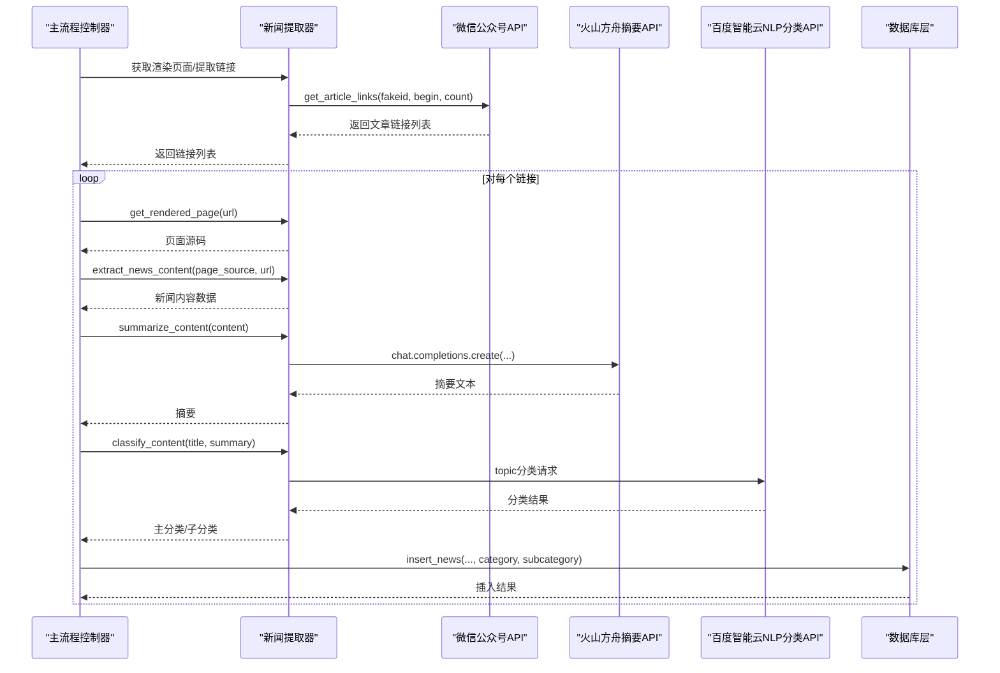
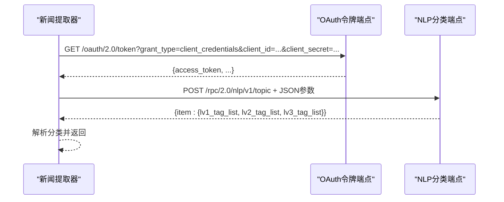
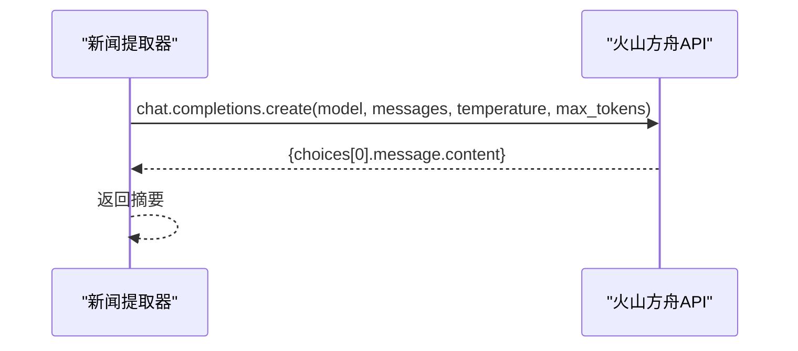
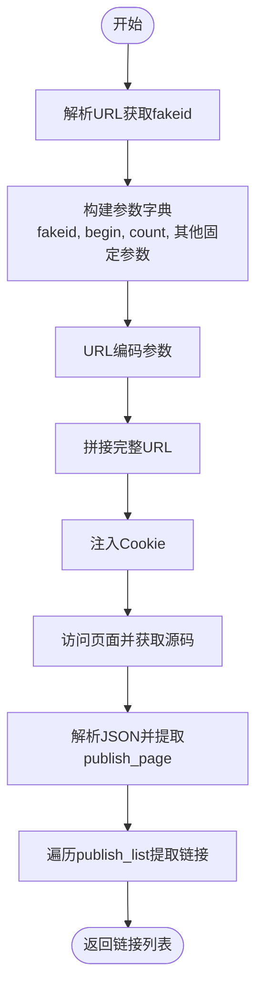
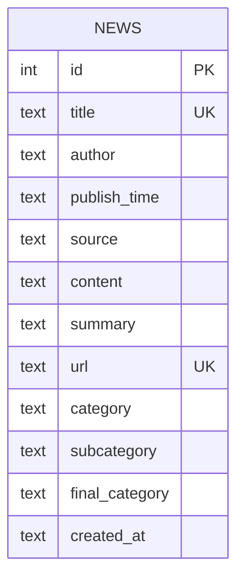
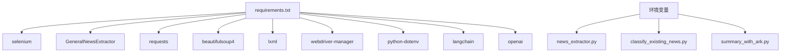

# API集成文档

<cite>
**本文档引用的文件**
- [config.py](file://config.py)
- [main.py](file://main.py)
- [news_extractor.py](file://news_extractor.py)
- [classify_existing_news.py](file://classify_existing_news.py)
- [summary_with_ark.py](file://summary_with_ark.py)
- [database.py](file://database.py)
- [logger.py](file://logger.py)
- [requirements.txt](file://requirements.txt)
- [generate_html.py](file://generate_html.py)
</cite>

## 目录
1. [简介](#简介)
2. [项目结构](#项目结构)
3. [核心组件](#核心组件)
4. [架构概览](#架构概览)
5. [详细组件分析](#详细组件分析)
6. [依赖分析](#依赖分析)
7. [性能考虑](#性能考虑)
8. [故障排除指南](#故障排除指南)
9. [结论](#结论)
10. [附录](#附录)

## 简介
本文件详细说明news-exacter系统对外部API的集成实现，包括：
- 百度智能云NLP API的新闻分类服务集成
- 火山方舟大模型API的内容摘要服务集成
- 微信公众号API的新闻获取机制

文档涵盖认证方式、请求格式、响应处理、错误码说明、配置参数、超时与重试机制、限流处理、调用示例、安全考虑、性能优化与故障恢复策略，以及版本兼容性与迁移指南。

## 项目结构
系统采用分层设计，主要模块包括：
- 配置管理：集中管理API密钥、目标站点列表、超时参数等
- 主流程控制器：调度数据抓取、内容提取、摘要生成、分类与存储
- 抽象提取器：封装网页渲染、链接提取、内容抽取、摘要与分类API调用
- 数据库层：SQLite持久化，支持唯一约束与查询优化
- 日志系统：统一日志输出与轮转

```mermaid
graph TB
Config["配置模块<br/>config.py"] --> Main["主流程控制器<br/>main.py"]
Main --> Extractor["新闻提取器<br/>news_extractor.py"]
Extractor --> WeChatAPI["微信公众号API<br/>get_article_links()"]
Extractor --> ArkAPI["火山方舟摘要API<br/>summarize_content()"]
Extractor --> BaiduNLP["百度智能云NLP分类API<br/>classify_content()"]
Main --> DB["数据库层<br/>database.py"]
Main --> Logger["日志系统<br/>logger.py"]
Main --> HTMLGen["HTML/PDF生成<br/>generate_html.py"]
```

**图表来源**
- [main.py:11-206](file://main.py#L11-L206)
- [news_extractor.py:21-887](file://news_extractor.py#L21-L887)
- [config.py:1-78](file://config.py#L1-L78)
- [database.py:5-92](file://database.py#L5-L92)
- [logger.py:1-104](file://logger.py#L1-L104)
- [generate_html.py:1-81](file://generate_html.py#L1-L81)

**章节来源**
- [main.py:11-206](file://main.py#L11-L206)
- [config.py:1-78](file://config.py#L1-L78)

## 核心组件
- 配置模块：维护新闻源列表、数据库路径、Selenium与提取超时、关键词过滤列表
- 主流程控制器：遍历新闻源，调用提取器获取链接与内容，进行关键词过滤、时间过滤、摘要生成与分类，并写入数据库
- 新闻提取器：封装Selenium渲染、BeautifulSoup解析、GNX内容抽取、火山方舟摘要API与百度智能云NLP分类API调用
- 数据库层：SQLite表结构定义、插入、查询与更新操作
- 日志系统：按类别输出日志，支持文件轮转

**章节来源**
- [config.py:1-78](file://config.py#L1-L78)
- [main.py:11-206](file://main.py#L11-L206)
- [news_extractor.py:21-887](file://news_extractor.py#L21-L887)
- [database.py:5-92](file://database.py#L5-L92)
- [logger.py:1-104](file://logger.py#L1-L104)

## 架构概览
系统通过主流程控制器协调各组件，形成“抓取-解析-摘要-分类-存储”的闭环。微信公众号API用于批量获取文章链接；火山方舟API用于生成摘要；百度智能云NLP用于主题分类；最终将结果持久化至SQLite。

**图表来源**
- [main.py:56-173](file://main.py#L56-L173)
- [news_extractor.py:77-178](file://news_extractor.py#L77-L178)
- [news_extractor.py:704-744](file://news_extractor.py#L704-L744)
- [news_extractor.py:753-887](file://news_extractor.py#L753-L887)
- [database.py:40-52](file://database.py#L40-L52)

## 详细组件分析

### 百度智能云NLP分类API集成
- 认证方式：OAuth 2.0令牌获取，使用client_credentials模式
- 请求地址：/rpc/2.0/nlp/v1/topic
- 请求头：Content-Type与Accept均为application/json; charset=utf-8
- 请求参数：
  - access_token：通过OAuth获取
  - charset：UTF-8
  - title：限制长度（代码中截断至50字符）
  - content：限制长度（代码中截断至500字符）
- 响应解析：提取lv1_tag_list为主分类，lv2/lv3_tag_list为子分类
- 错误处理：捕获error_code并回退到默认分类“其他/其他”
- 超时设置：获取token 10秒，POST请求15秒
- 重试与限流：未实现显式重试；通过sleep(1)降低请求频率

**图表来源**
- [news_extractor.py:768-826](file://news_extractor.py#L768-L826)
- [news_extractor.py:833-882](file://news_extractor.py#L833-L882)

**章节来源**
- [news_extractor.py:753-887](file://news_extractor.py#L753-L887)
- [classify_existing_news.py:92-168](file://classify_existing_news.py#L92-L168)

### 火山方舟大模型API摘要服务集成
- 认证方式：OpenAI兼容客户端，使用API Key与自定义base_url
- 请求地址：/api/v3/chat/completions
- 模型：doubao-seed-2-0-pro-260215
- 请求参数：
  - temperature：0.2（稳定）
  - max_tokens：300（摘要长度上限）
  - messages：system提示词 + 用户输入（文章正文）
- 响应解析：取choices[0].message.content
- 超时设置：默认OpenAI客户端超时，代码中未显式设置
- 重试与限流：未实现显式重试；通过sleep(1)降低请求频率

**图表来源**
- [news_extractor.py:704-744](file://news_extractor.py#L704-L744)
- [summary_with_ark.py:43-58](file://summary_with_ark.py#L43-L58)

**章节来源**
- [news_extractor.py:704-744](file://news_extractor.py#L704-L744)
- [summary_with_ark.py:1-60](file://summary_with_ark.py#L1-L60)

### 微信公众号API新闻获取机制
- 目标端点：/cgi-bin/appmsgpublish
- 参数构造：
  - fakeid：从URL中解析
  - begin/count：分页参数
  - 其他固定参数来自环境变量wechat_querystring
- Cookie注入：从环境变量wechat_cookie解析并注入
- 响应解析：从返回的publish_page中提取publish_list，解析每项的title/link/update_time
- 返回值：文章链接列表

**图表来源**
- [news_extractor.py:77-178](file://news_extractor.py#L77-L178)

**章节来源**
- [news_extractor.py:77-178](file://news_extractor.py#L77-L178)

### 数据库集成与存储
- 表结构：包含标题唯一索引与URL唯一索引，支持分类与最终分类字段
- 插入策略：INSERT OR IGNORE，避免重复
- 查询策略：按发布时间倒序，过滤final_category非“待审”记录

**图表来源**
- [database.py:20-38](file://database.py#L20-L38)

**章节来源**
- [database.py:20-92](file://database.py#L20-L92)

## 依赖分析
- 外部库依赖：selenium、GeneralNewsExtractor、requests、beautifulsoup4、lxml、webdriver-manager、python-dotenv、langchain、openai
- 环境变量依赖：WENXIN_API_KEY、WENXIN_SECRET_KEY、ARK_API_KEY、wechat_cookie、wechat_querystring

**图表来源**
- [requirements.txt:1-9](file://requirements.txt#L1-L9)
- [news_extractor.py:27-39](file://news_extractor.py#L27-L39)
- [classify_existing_news.py:239-252](file://classify_existing_news.py#L239-L252)
- [summary_with_ark.py:11-19](file://summary_with_ark.py#L11-L19)

**章节来源**
- [requirements.txt:1-9](file://requirements.txt#L1-L9)

## 性能考虑
- 浏览器渲染性能：Selenium无头模式与反检测参数减少被识别风险；针对特定站点增加等待时间
- API调用节流：主流程中使用time.sleep(1)降低请求频率
- 内容截断：百度NLP分类API对title/content进行截断，减少请求体积
- 缓存机制：链接缓存避免重复处理，提升整体吞吐
- 数据库写入：唯一约束避免重复写入，减少冲突

**章节来源**
- [news_extractor.py:43-76](file://news_extractor.py#L43-L76)
- [news_extractor.py:180-206](file://news_extractor.py#L180-L206)
- [main.py:172-173](file://main.py#L172-L173)
- [news_extractor.py:807-810](file://news_extractor.py#L807-L810)

## 故障排除指南
- 百度NLP分类API错误：
  - 现象：返回error_code或error_msg
  - 处理：捕获异常并回退到默认分类“其他/其他”
  - 建议：检查API密钥、网络连通性与请求参数长度
- 火山方舟摘要API错误：
  - 现象：OpenAI客户端异常或响应为空
  - 处理：返回原文或空字符串
  - 建议：检查API Key、模型ID与网络连通性
- 微信公众号API错误：
  - 现象：Cookie失效、参数缺失或页面结构变化
  - 处理：重新注入Cookie、检查wechat_querystring与fakeid
  - 建议：定期更新Cookie与参数
- 数据库写入失败：
  - 现象：唯一约束冲突
  - 处理：INSERT OR IGNORE自动忽略重复
  - 建议：检查标题与URL唯一性

**章节来源**
- [news_extractor.py:833-887](file://news_extractor.py#L833-L887)
- [news_extractor.py:704-744](file://news_extractor.py#L704-L744)
- [news_extractor.py:77-178](file://news_extractor.py#L77-L178)
- [database.py:40-52](file://database.py#L40-L52)

## 结论
本系统通过模块化设计实现了对百度智能云NLP分类、火山方舟摘要与微信公众号API的稳定集成。通过环境变量管理密钥、统一日志输出、链接缓存与数据库唯一约束，提升了可靠性与可维护性。建议后续引入显式的重试与指数退避、统一超时配置、以及更完善的错误码映射与告警机制。

## 附录

### API配置参数清单
- 百度智能云NLP分类
  - 端点：/rpc/2.0/nlp/v1/topic
  - 认证：client_credentials模式
  - 请求头：Content-Type与Accept为application/json; charset=utf-8
  - 参数：access_token、charset、title、content
  - 截断：title≤50字符，content≤500字符
  - 超时：获取token 10秒，POST 15秒
- 火山方舟摘要
  - 端点：/api/v3/chat/completions
  - 认证：API Key + 自定义base_url
  - 模型：doubao-seed-2-0-pro-260215
  - 参数：temperature=0.2，max_tokens=300
- 微信公众号
  - 端点：/cgi-bin/appmsgpublish
  - 参数：fakeid、begin、count、其他固定参数
  - Cookie：从环境变量注入

**章节来源**
- [news_extractor.py:768-826](file://news_extractor.py#L768-L826)
- [news_extractor.py:704-744](file://news_extractor.py#L704-L744)
- [news_extractor.py:77-178](file://news_extractor.py#L77-L178)

### 错误码与处理
- 百度NLP分类：当响应包含error_code时抛出异常并回退
- 火山方舟：OpenAI客户端异常时返回原文或空字符串
- 微信公众号：页面解析失败或JSON解析异常时记录错误并跳过

**章节来源**
- [news_extractor.py:833-887](file://news_extractor.py#L833-L887)
- [news_extractor.py:704-744](file://news_extractor.py#L704-L744)
- [news_extractor.py:157-164](file://news_extractor.py#L157-L164)

### 安全考虑
- 密钥管理：通过python-dotenv从.env文件加载，避免硬编码
- 反检测：Selenium参数与CDP命令降低被识别风险
- Cookie管理：从环境变量注入，定期更新
- 日志脱敏：统一日志输出，避免敏感信息泄露

**章节来源**
- [news_extractor.py:27-39](file://news_extractor.py#L27-L39)
- [news_extractor.py:43-76](file://news_extractor.py#L43-L76)
- [logger.py:1-104](file://logger.py#L1-L104)

### 性能优化建议
- 统一超时配置：集中管理HTTP超时参数
- 指数退避重试：对临时性错误引入重试
- 并发控制：限制同时发起的API请求数量
- 缓存策略：对热点数据与分类结果进行缓存

**章节来源**
- [main.py:172-173](file://main.py#L172-L173)

### 版本兼容性与迁移指南
- 百度NLP：使用/v1/topic端点，保持参数结构稳定
- 火山方舟：OpenAI兼容客户端，迁移时注意base_url与模型ID变更
- 微信公众号：端点与参数结构可能随平台更新而变化，需定期校验

**章节来源**
- [news_extractor.py:793-815](file://news_extractor.py#L793-L815)
- [news_extractor.py:714-717](file://news_extractor.py#L714-L717)
- [news_extractor.py:77-104](file://news_extractor.py#L77-L104)