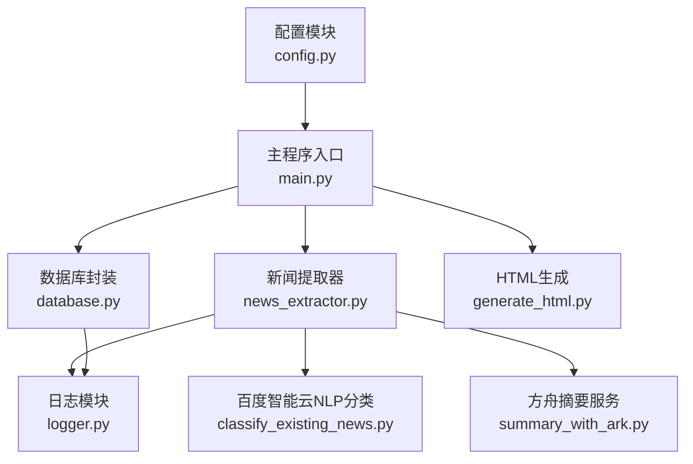
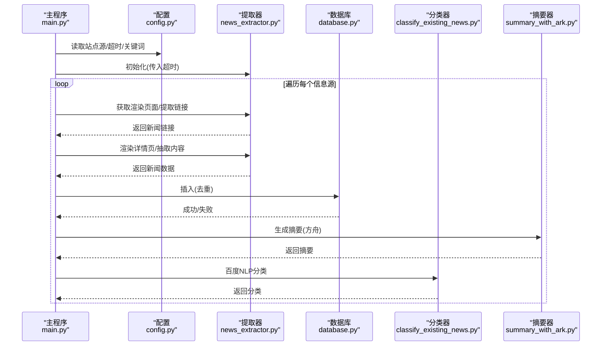
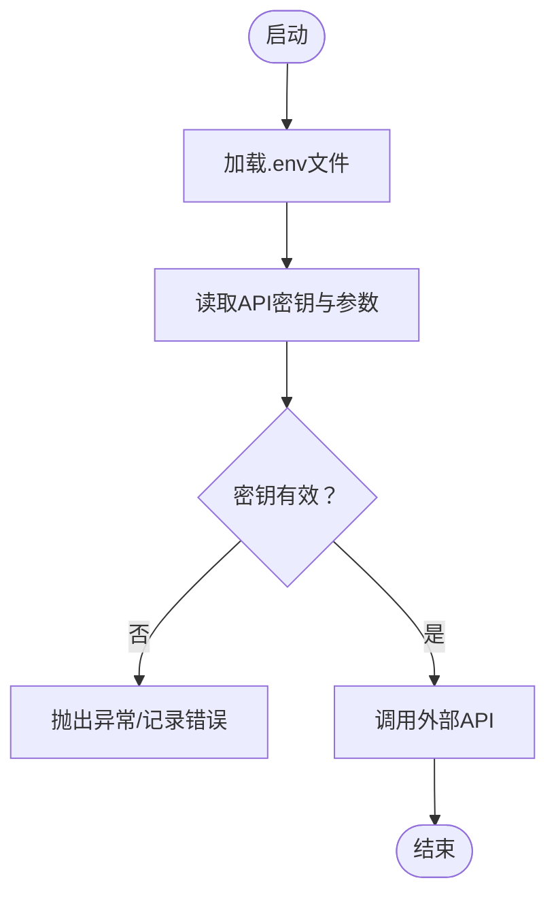
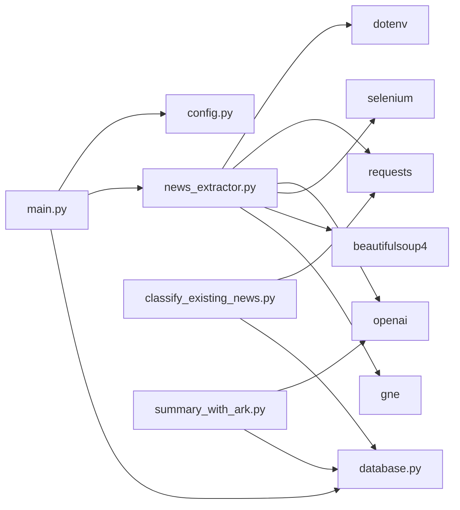

# 外部API配置管理

<cite>
**本文档引用的文件**
- [config.py](file://config.py)
- [main.py](file://main.py)
- [news_extractor.py](file://news_extractor.py)
- [database.py](file://database.py)
- [logger.py](file://logger.py)
- [classify_existing_news.py](file://classify_existing_news.py)
- [summary_with_ark.py](file://summary_with_ark.py)
- [requirements.txt](file://requirements.txt)
- [readme.MD](file://readme.MD)
</cite>

## 目录
1. [简介](#简介)
2. [项目结构](#项目结构)
3. [核心组件](#核心组件)
4. [架构总览](#架构总览)
5. [详细组件分析](#详细组件分析)
6. [依赖关系分析](#依赖关系分析)
7. [性能考虑](#性能考虑)
8. [故障排查指南](#故障排查指南)
9. [结论](#结论)
10. [附录](#附录)

## 简介
本文件面向外部API配置管理，系统化梳理本项目在环境变量配置、API密钥存储与轮换、超时参数设置、代理配置、配置文件管理、版本兼容性与降级策略、故障转移、配置监控与成本控制等方面的实现与最佳实践。文档同时提供配置模板、验证脚本与部署指南，帮助读者快速落地安全、可靠、可维护的配置管理体系。

## 项目结构
项目采用功能模块化组织，围绕“配置-抓取-存储-分类-生成摘要”的流程展开：
- 配置层：集中存放常量与默认参数
- 抓取层：封装浏览器自动化与第三方API调用
- 存储层：SQLite本地数据库
- 分类层：基于百度智能云NLP的文本分类
- 工具层：日志、摘要生成等辅助模块

图表来源
- [config.py:1-78](file://config.py#L1-L78)
- [main.py:1-206](file://main.py#L1-L206)
- [news_extractor.py:1-800](file://news_extractor.py#L1-L800)
- [database.py:1-92](file://database.py#L1-L92)
- [logger.py:1-104](file://logger.py#L1-L104)
- [classify_existing_news.py:1-302](file://classify_existing_news.py#L1-L302)
- [summary_with_ark.py:1-60](file://summary_with_ark.py#L1-L60)

章节来源
- [config.py:1-78](file://config.py#L1-L78)
- [main.py:1-206](file://main.py#L1-L206)

## 核心组件
- 配置模块：集中管理站点源、数据库路径、Selenium与提取超时、关键词过滤等
- 新闻提取器：封装Selenium驱动初始化、页面渲染、链接提取、内容抽取、摘要生成、分类调用
- 数据库封装：SQLite表结构、插入、查询、更新、去重约束
- 日志模块：统一日志格式、文件轮转、分类日志记录
- 分类与摘要：百度智能云NLP分类、方舟大模型摘要

章节来源
- [config.py:1-78](file://config.py#L1-L78)
- [news_extractor.py:21-800](file://news_extractor.py#L21-L800)
- [database.py:5-92](file://database.py#L5-L92)
- [logger.py:25-104](file://logger.py#L25-L104)
- [classify_existing_news.py:64-302](file://classify_existing_news.py#L64-L302)
- [summary_with_ark.py:11-60](file://summary_with_ark.py#L11-L60)

## 架构总览
系统通过配置模块提供运行参数，主程序按配置遍历信息源，提取器负责页面渲染与内容抽取，数据库持久化，分类器与摘要器分别对接百度智能云与方舟服务。

图表来源
- [main.py:11-198](file://main.py#L11-L198)
- [news_extractor.py:180-750](file://news_extractor.py#L180-L750)
- [database.py:40-58](file://database.py#L40-L58)
- [classify_existing_news.py:92-168](file://classify_existing_news.py#L92-L168)
- [summary_with_ark.py:43-58](file://summary_with_ark.py#L43-L58)

## 详细组件分析

### 环境变量与API密钥配置
- 环境变量加载：在多个模块中通过dotenv加载.env文件，读取API密钥与参数
- 密钥类型与用途：
  - 百度智能云NLP：WENXIN_API_KEY、WENXIN_SECRET_KEY
  - 方舟摘要服务：ARK_API_KEY
  - 微信公众号参数：wechat_cookie、wechat_querystring
- 安全策略：
  - 仅在需要时加载dotenv，避免硬编码
  - 对敏感字段进行最小暴露（如打印cookie键名但不打印值）

图表来源
- [news_extractor.py:27-40](file://news_extractor.py#L27-L40)
- [classify_existing_news.py:242-252](file://classify_existing_news.py#L242-L252)
- [summary_with_ark.py:11-19](file://summary_with_ark.py#L11-L19)

章节来源
- [news_extractor.py:27-40](file://news_extractor.py#L27-L40)
- [classify_existing_news.py:242-252](file://classify_existing_news.py#L242-L252)
- [summary_with_ark.py:11-19](file://summary_with_ark.py#L11-L19)

### 超时参数与代理配置
- 超时参数：
  - Selenium页面加载超时：来自配置模块的SELENIUM_TIMEOUT
  - 内容提取超时：来自配置模块的EXTRACT_TIMEOUT
  - 外部HTTP请求超时：百度NLP认证与分类请求均设置为10秒/15秒
- 代理配置：
  - 代码中未发现显式代理设置，若需代理应在系统环境或Selenium选项中配置

章节来源
- [config.py:70-74](file://config.py#L70-L74)
- [news_extractor.py:74-76](file://news_extractor.py#L74-L76)
- [classify_existing_news.py:72-73](file://classify_existing_news.py#L72-L73)
- [classify_existing_news.py:124-125](file://classify_existing_news.py#L124-L125)

### 配置文件管理最佳实践
- dotenv文件结构建议：
  - WENXIN_API_KEY=WENXIN_API_KEY_VALUE
  - WENXIN_SECRET_KEY=WENXIN_SECRET_KEY_VALUE
  - ARK_API_KEY=ARK_API_KEY_VALUE
  - wechat_cookie=cookie1=value1; cookie2=value2
  - wechat_querystring=token=xxx&lang=zh_CN&f=json&ajax=1
- 配置验证：
  - 启动时检查关键环境变量是否存在
  - 对HTTP请求设置合理超时，捕获异常并记录
- 默认值设置：
  - 代码中对Selenium与提取超时设置了默认值，建议在配置模块中集中管理

章节来源
- [news_extractor.py:27-40](file://news_extractor.py#L27-L40)
- [classify_existing_news.py:242-252](file://classify_existing_news.py#L242-L252)
- [config.py:70-74](file://config.py#L70-L74)

### API版本兼容性管理与降级策略
- 版本兼容：
  - 方舟摘要服务使用OpenAI兼容接口，base_url指向方舟域名
  - 百度NLP分类接口使用固定RPC端点
- 降级策略：
  - 分类失败时返回默认分类“其他”
  - 摘要生成失败时返回原文或空字符串
  - 页面渲染失败时记录错误并跳过该链接

章节来源
- [news_extractor.py:714-750](file://news_extractor.py#L714-L750)
- [news_extractor.py:796-800](file://news_extractor.py#L796-L800)
- [classify_existing_news.py:164-168](file://classify_existing_news.py#L164-L168)

### 故障转移机制
- 页面渲染失败：记录错误并跳过当前链接，继续处理下一个
- 外部API失败：捕获异常并记录，返回默认值或跳过
- 缓存失效：加载失败时清空缓存并重新初始化

章节来源
- [news_extractor.py:200-206](file://news_extractor.py#L200-L206)
- [news_extractor.py:774-794](file://news_extractor.py#L774-L794)
- [main.py:40-43](file://main.py#L40-L43)

### 配置监控、性能指标与成本控制
- 日志监控：
  - 统一日志格式与文件轮转，支持按类别输出
  - 记录关键事件（成功/失败、错误堆栈）
- 性能指标：
  - 页面渲染等待时间、链接提取耗时、摘要生成耗时
  - 可通过日志时间戳与消息级别评估性能
- 成本控制：
  - 控制API调用频率（主程序中有限速sleep）
  - 限制每次处理的新闻数量（主程序中对链接截断）
  - 使用缓存避免重复抓取

章节来源
- [logger.py:25-56](file://logger.py#L25-L56)
- [main.py:173](file://main.py#L173)
- [main.py:81](file://main.py#L81)

### 配置模板与验证脚本
- 配置模板（.env示例）：
  - WENXIN_API_KEY=your_baidu_api_key
  - WENXIN_SECRET_KEY=your_baidu_secret_key
  - ARK_API_KEY=your_volcengine_api_key
  - wechat_cookie=cookie1=value1; cookie2=value2
  - wechat_querystring=token=xxx&lang=zh_CN&f=json&ajax=1
- 验证脚本建议：
  - 启动时读取并校验关键环境变量
  - 对外部API进行连通性测试（如获取access_token）
  - 记录校验结果到日志

章节来源
- [news_extractor.py:27-40](file://news_extractor.py#L27-L40)
- [classify_existing_news.py:242-252](file://classify_existing_news.py#L242-L252)

### 部署指南
- 依赖安装：requirements.txt中包含selenium、requests、beautifulsoup4、webdriver-manager、python-dotenv、langchain、openai、jinja2等
- 环境准备：
  - 准备.env文件，填入API密钥与参数
  - 确保ChromeDriver可用（代码中尝试自动管理）
- 运行步骤：
  - 执行主程序，自动加载配置与环境变量
  - 观察日志，确认抓取、分类、摘要流程正常

章节来源
- [requirements.txt:1-10](file://requirements.txt#L1-L10)
- [readme.MD:1-11](file://readme.MD#L1-L11)
- [main.py:11-198](file://main.py#L11-L198)

## 依赖关系分析
- 模块耦合：
  - 主程序依赖配置模块与提取器、数据库
  - 提取器依赖dotenv、requests、OpenAI、Selenium
  - 分类器与摘要器各自独立，依赖数据库与外部API
- 外部依赖：
  - 百度智能云NLP、方舟摘要服务、Selenium/ChromeDriver

图表来源
- [main.py:1-8](file://main.py#L1-L8)
- [news_extractor.py:16-18](file://news_extractor.py#L16-L18)
- [classify_existing_news.py:7-11](file://classify_existing_news.py#L7-L11)
- [summary_with_ark.py:2-7](file://summary_with_ark.py#L2-L7)

章节来源
- [main.py:1-8](file://main.py#L1-L8)
- [news_extractor.py:16-18](file://news_extractor.py#L16-L18)
- [classify_existing_news.py:7-11](file://classify_existing_news.py#L7-L11)
- [summary_with_ark.py:2-7](file://summary_with_ark.py#L2-L7)

## 性能考虑
- 超时与节流：
  - Selenium页面加载超时与隐式等待控制页面渲染时间
  - 外部HTTP请求设置超时，避免阻塞
  - 主程序中对API调用进行限速sleep
- 缓存与去重：
  - 链接缓存避免重复抓取
  - 数据库唯一约束防止重复入库
- 资源释放：
  - 提取器关闭Selenium驱动
  - 数据库连接在finally中关闭

章节来源
- [news_extractor.py:74-77](file://news_extractor.py#L74-L77)
- [news_extractor.py:755-758](file://news_extractor.py#L755-L758)
- [database.py:90-92](file://database.py#L90-L92)
- [main.py:193-195](file://main.py#L193-L195)

## 故障排查指南
- 环境变量缺失：
  - 症状：API调用失败或提示密钥未设置
  - 处理：检查.env文件，确认键名与值正确
- 外部API异常：
  - 症状：获取access_token失败、分类/摘要接口报错
  - 处理：查看日志中的错误码与错误信息，检查网络与配额
- 页面渲染失败：
  - 症状：渲染页面为空或超时
  - 处理：调整等待时间、检查目标站点结构变化
- 数据库异常：
  - 症状：插入失败或查询异常
  - 处理：检查表结构与唯一约束，查看日志错误

章节来源
- [news_extractor.py:766-794](file://news_extractor.py#L766-L794)
- [classify_existing_news.py:72-90](file://classify_existing_news.py#L72-L90)
- [main.py:176-182](file://main.py#L176-L182)
- [database.py:40-52](file://database.py#L40-L52)

## 结论
本项目在外部API配置管理方面具备良好的基础：通过dotenv集中管理密钥、在多处模块中按需加载、对外部API调用设置超时与降级策略、并通过日志与缓存提升可观测性与性能。建议进一步完善代理配置、引入配置校验脚本、细化成本控制策略，并在CI/CD中集成配置验证，以形成闭环的配置管理体系。

## 附录
- 配置清单
  - 百度智能云NLP：WENXIN_API_KEY、WENXIN_SECRET_KEY
  - 方舟摘要服务：ARK_API_KEY
  - 微信公众号：wechat_cookie、wechat_querystring
  - 超时参数：SELENIUM_TIMEOUT、EXTRACT_TIMEOUT
- 建议的.env文件示例
  - WENXIN_API_KEY=your_baidu_api_key
  - WENXIN_SECRET_KEY=your_baidu_secret_key
  - ARK_API_KEY=your_volcengine_api_key
  - wechat_cookie=cookie1=value1; cookie2=value2
  - wechat_querystring=token=xxx&lang=zh_CN&f=json&ajax=1