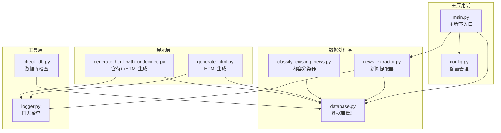
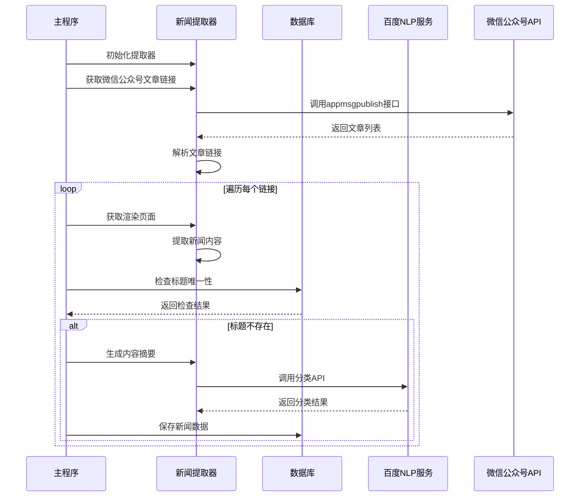
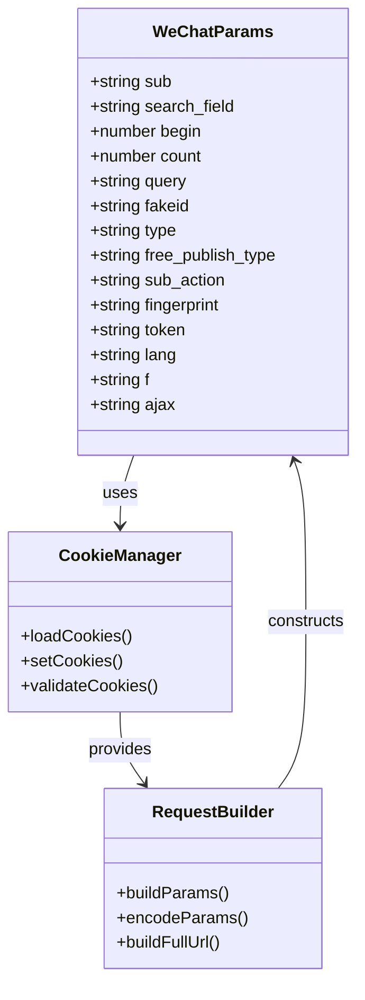
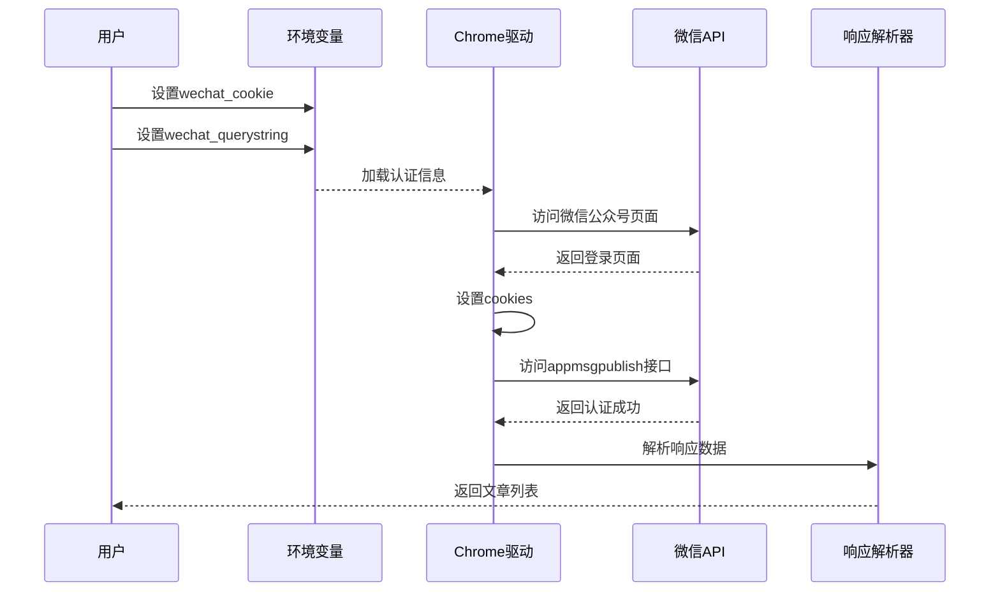
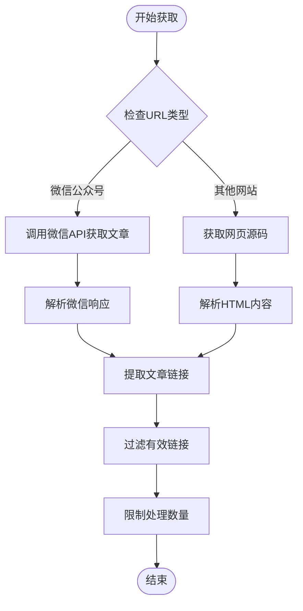
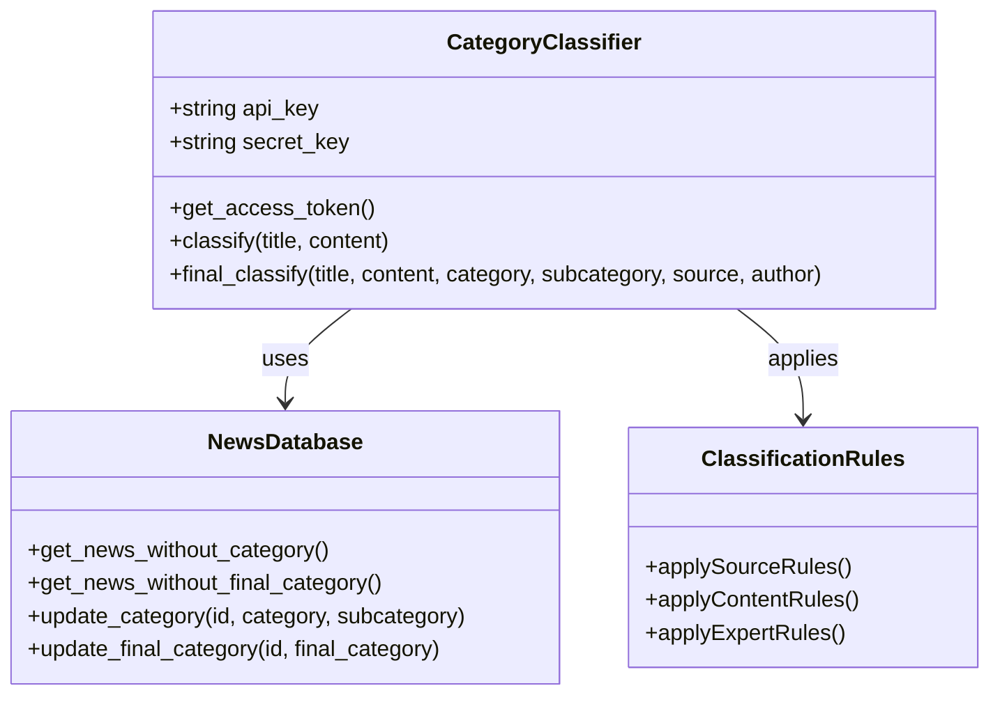
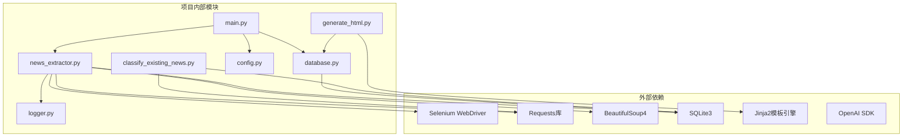
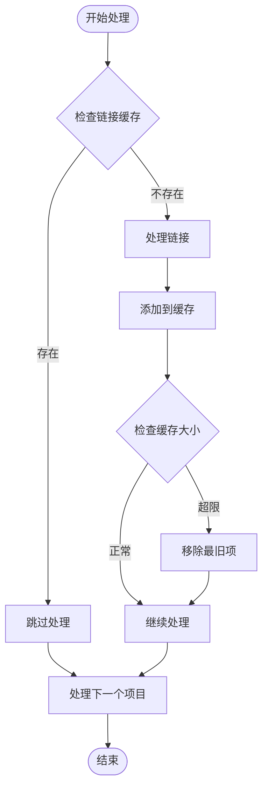

# 微信公众号API

<cite>
**本文档引用的文件**
- [main.py](file://main.py)
- [config.py](file://config.py)
- [news_extractor.py](file://news_extractor.py)
- [database.py](file://database.py)
- [logger.py](file://logger.py)
- [classify_existing_news.py](file://classify_existing_news.py)
- [generate_html.py](file://generate_html.py)
- [generate_html_with_undecided.py](file://generate_html_with_undecided.py)
- [check_db.py](file://check_db.py)
- [requirements.txt](file://requirements.txt)
- [readme.MD](file://readme.MD)
</cite>

## 目录
1. [简介](#简介)
2. [项目结构](#项目结构)
3. [核心组件](#核心组件)
4. [架构概览](#架构概览)
5. [详细组件分析](#详细组件分析)
6. [依赖关系分析](#依赖关系分析)
7. [性能考虑](#性能考虑)
8. [故障排除指南](#故障排除指南)
9. [结论](#结论)
10. [附录](#附录)

## 简介

这是一个基于Python的微信公众号新闻采集与分析系统。该项目实现了对多个教育领域新闻源的自动化采集，包括微信公众号、政府部门官网、高校网站等。系统采用Selenium进行页面渲染，BeautifulSoup进行内容提取，SQLite进行数据存储，并集成了百度智能云的自然语言处理服务进行内容分类。

**章节来源**
- [readme.MD:1-11](file://readme.MD#L1-L11)

## 项目结构

项目采用模块化设计，主要包含以下核心模块：



**图表来源**
- [main.py:1-206](file://main.py#L1-L206)
- [news_extractor.py:21-893](file://news_extractor.py#L21-L893)
- [database.py:5-92](file://database.py#L5-L92)

**章节来源**
- [main.py:1-206](file://main.py#L1-L206)
- [config.py:1-78](file://config.py#L1-L78)

## 核心组件

### 1. 新闻提取器 (NewsExtractor)

新闻提取器是系统的核心组件，负责处理各种类型的新闻源：

- **微信公众号支持**: 专门处理微信公众号的appmsgpublish接口
- **多站点适配**: 支持教育部、北京市政府、高校等多个官方网站
- **反爬虫策略**: 实现了完整的反检测机制
- **内容提取**: 使用GeneralNewsExtractor进行准确的内容提取

### 2. 数据库管理系统

采用SQLite进行数据持久化，支持：
- 新闻数据的增删改查操作
- 唯一性约束防止重复数据
- 自动化的数据清理和优化

### 3. 内容分类系统

集成了百度智能云的NLP服务：
- **自动分类**: 基于标题和摘要的智能分类
- **人工审核**: 支持最终人工复核
- **多级分类**: 支持主分类、子分类和最终分类

**章节来源**
- [news_extractor.py:21-893](file://news_extractor.py#L21-L893)
- [database.py:5-92](file://database.py#L5-L92)
- [classify_existing_news.py:64-302](file://classify_existing_news.py#L64-L302)

## 架构概览

系统采用分层架构设计，确保了良好的可维护性和扩展性：



**图表来源**
- [main.py:57-173](file://main.py#L57-L173)
- [news_extractor.py:78-178](file://news_extractor.py#L78-L178)
- [news_extractor.py:759-888](file://news_extractor.py#L759-L888)

## 详细组件分析

### 微信公众号API集成

#### appmsgpublish接口调用

系统通过以下方式集成微信公众号的appmsgpublish接口：

```mermaid
flowchart TD
Start([开始]) --> ParseURL["解析URL参数<br/>提取fakeid"]
ParseURL --> LoadEnv["加载环境变量<br/>获取cookies和参数"]
LoadEnv --> InitDriver["初始化Chrome驱动<br/>设置反检测参数"]
InitDriver --> SetCookies["设置微信cookies"]
SetCookies --> BuildParams["构建请求参数<br/>fakeid, begin, count"]
BuildParams --> EncodeParams["URL编码参数"]
EncodeParams --> CallAPI["调用appmsgpublish接口"]
CallAPI --> ParseResponse["解析JSON响应<br/>提取publish_page"]
ParseResponse --> ExtractLinks["提取文章链接"]
ExtractLinks --> End([结束])
```



**图表来源**
- [news_extractor.py:78-178](file://news_extractor.py#L78-L178)

#### 认证机制实现

系统实现了完整的微信公众号认证机制：

1. **Cookie管理**: 从环境变量加载cookies，自动设置到浏览器会话中
2. **Token管理**: 通过百度智能云API获取access_token用于内容分类
3. **反爬虫策略**: 
   - 设置真实的User-Agent
   - 移除WebDriver检测标志
   - 使用无头模式运行
   - 实施随机延迟

#### 参数构造与URL编码



**图表来源**
- [news_extractor.py:80-105](file://news_extractor.py#L80-L105)
- [news_extractor.py:34-39](file://news_extractor.py#L34-L39)

**章节来源**
- [news_extractor.py:78-178](file://news_extractor.py#L78-L178)

### 登录认证流程

系统实现了完整的登录认证流程：



**图表来源**
- [news_extractor.py:143-147](file://news_extractor.py#L143-L147)
- [news_extractor.py:116-155](file://news_extractor.py#L116-L155)

**章节来源**
- [news_extractor.py:43-77](file://news_extractor.py#L43-L77)

### 新闻列表获取机制

系统实现了智能的新闻列表获取机制：

#### 分页处理



**图表来源**
- [main.py:57-78](file://main.py#L57-L78)
- [news_extractor.py:208-683](file://news_extractor.py#L208-L683)

#### 时间筛选机制

系统实现了灵活的时间筛选功能：

1. **发布时间检查**: 自动解析文章发布时间
2. **时间范围限制**: 默认筛选最近一周的内容
3. **灵活配置**: 支持自定义时间范围

#### 链接提取方法

针对不同网站实现了专门的链接提取策略：

| 网站类型 | 提取策略 | 特殊处理 |
|---------|---------|----------|
| 教育部官网 | 提取特定class的div | 处理相对路径 |
| 今日头条 | 提取main-l容器 | 支持滚动加载 |
| 北京市政府 | 提取listBox容器 | 处理复杂相对路径 |
| 高校网站 | 提取page-list容器 | 限制提取数量 |

**章节来源**
- [main.py:124-144](file://main.py#L124-L144)
- [news_extractor.py:208-683](file://news_extractor.py#L208-L683)

### 内容分类系统

#### 百度智能云NLP集成



**图表来源**
- [classify_existing_news.py:64-302](file://classify_existing_news.py#L64-L302)

系统实现了多层次的分类策略：

1. **自动分类**: 基于百度智能云的NLP服务
2. **规则分类**: 针对不同来源的特定规则
3. **人工审核**: 支持最终的人工复核

**章节来源**
- [classify_existing_news.py:92-168](file://classify_existing_news.py#L92-L168)
- [news_extractor.py:759-888](file://news_extractor.py#L759-L888)

## 依赖关系分析

项目的主要依赖关系如下：



**图表来源**
- [requirements.txt:1-10](file://requirements.txt#L1-L10)
- [main.py:1-8](file://main.py#L1-L8)

**章节来源**
- [requirements.txt:1-10](file://requirements.txt#L1-L10)

## 性能考虑

### 1. 并发处理

系统采用了合理的并发策略：
- **单线程设计**: 避免对目标网站造成过大压力
- **智能延迟**: 在每次请求间添加1秒延迟
- **资源管理**: 自动关闭浏览器和数据库连接

### 2. 缓存机制



**图表来源**
- [main.py:86-97](file://main.py#L86-L97)

### 3. 内存管理

- **链接缓存**: 使用OrderedDict实现LRU缓存
- **数据库连接**: 合理的连接池管理
- **浏览器资源**: 自动清理临时文件

## 故障排除指南

### 常见问题及解决方案

#### 1. 微信公众号访问失败

**问题症状**: appmsgpublish接口返回认证失败

**解决步骤**:
1. 检查环境变量配置
   - `wechat_cookie`: 确保包含所有必需的cookies
   - `wechat_querystring`: 确保参数完整
2. 验证cookies有效性
   - 重新登录微信公众号
   - 更新cookies值
3. 检查网络连接
   - 确保能够访问微信服务器
   - 避免使用受限网络

#### 2. Selenium驱动问题

**问题症状**: Chrome驱动启动失败或无法找到驱动

**解决步骤**:
1. 确认ChromeDriver版本兼容性
2. 检查驱动文件路径
3. 验证Chrome浏览器安装

#### 3. 数据库连接问题

**问题症状**: SQLite数据库操作失败

**解决步骤**:
1. 检查数据库文件权限
2. 确保磁盘空间充足
3. 验证数据库文件完整性

#### 4. 内容提取失败

**问题症状**: 新闻内容提取不完整或为空

**解决步骤**:
1. 检查目标网站的HTML结构变化
2. 更新相应的CSS选择器
3. 调整等待时间参数

**章节来源**
- [logger.py:74-104](file://logger.py#L74-L104)
- [check_db.py:1-32](file://check_db.py#L1-L32)

### 调试技巧

#### 1. 日志分析

系统提供了完善的日志记录机制：
- **分类日志**: 不同模块使用不同的日志分类
- **详细追踪**: 每个关键步骤都有对应的日志记录
- **错误堆栈**: 完整的异常信息和堆栈跟踪

#### 2. 环境变量配置

推荐的环境变量配置：
```bash
# 微信公众号认证
wechat_cookie=token=xxx;data_ticket=xxx;wxuin=xxx
wechat_querystring=sub=list&search_field=null&begin=0&count=5&fakeid=xxx

# 百度智能云API
WENXIN_API_KEY=your_api_key
WENXIN_SECRET_KEY=your_secret_key

# 方舟大模型API
ARK_API_KEY=your_ark_api_key
```

#### 3. 性能监控

建议的监控指标：
- **页面加载时间**: 记录每个页面的加载耗时
- **API调用成功率**: 统计微信API和百度API的调用成功率
- **内存使用情况**: 监控系统的内存占用情况

## 结论

本项目成功实现了微信公众号API的完整集成，包括：

1. **认证机制**: 完整的cookies管理和token获取流程
2. **接口调用**: 稳定的appmsgpublish接口调用实现
3. **内容提取**: 高精度的新闻内容提取算法
4. **数据管理**: 完善的数据存储和查询机制
5. **分类系统**: 智能的内容分类和人工审核流程

系统具有良好的扩展性，可以轻松添加新的新闻源和功能模块。通过合理的性能优化和错误处理机制，确保了系统的稳定性和可靠性。

## 附录

### API配置示例

#### 微信公众号配置
```python
# config.py中的配置示例
NEWS_SOURCES = [
    {
        "url": "https://mp.weixin.qq.com/cgi-bin/appmsgpublish?fakeid=YOUR_FAKEID",
        "source": "公众号名称"
    }
]
```

#### 环境变量配置
```bash
# .env文件示例
wechat_cookie=token=xxx;data_ticket=xxx;wxuin=xxx
wechat_querystring=sub=list&search_field=null&begin=0&count=5&fakeid=xxx
WENXIN_API_KEY=your_baidu_api_key
WENXIN_SECRET_KEY=your_baidu_secret_key
ARK_API_KEY=your_ark_api_key
```

### 错误处理策略

系统实现了多层次的错误处理：

1. **网络错误**: 自动重试机制和超时处理
2. **解析错误**: 完善的异常捕获和降级处理
3. **数据库错误**: 事务回滚和数据一致性保证
4. **API错误**: 错误码解析和用户友好的错误提示

### 稳定性保障措施

- **资源管理**: 自动化的资源清理和释放
- **监控告警**: 完善的日志记录和异常通知
- **备份恢复**: 数据库的定期备份机制
- **版本控制**: 代码变更的版本管理和回滚机制