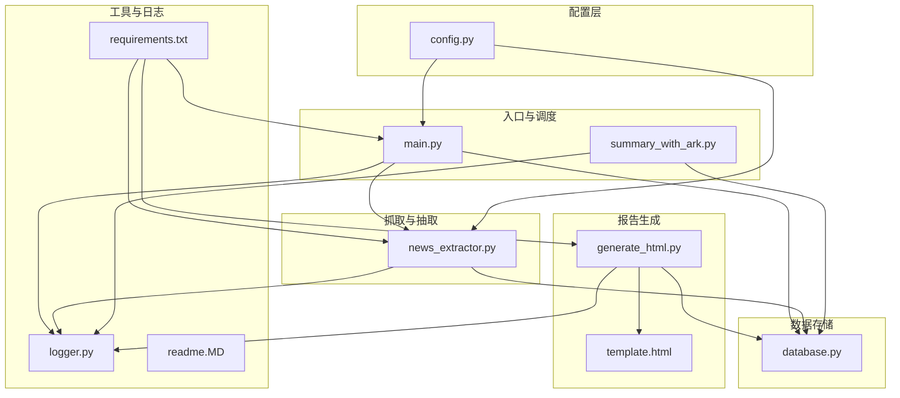
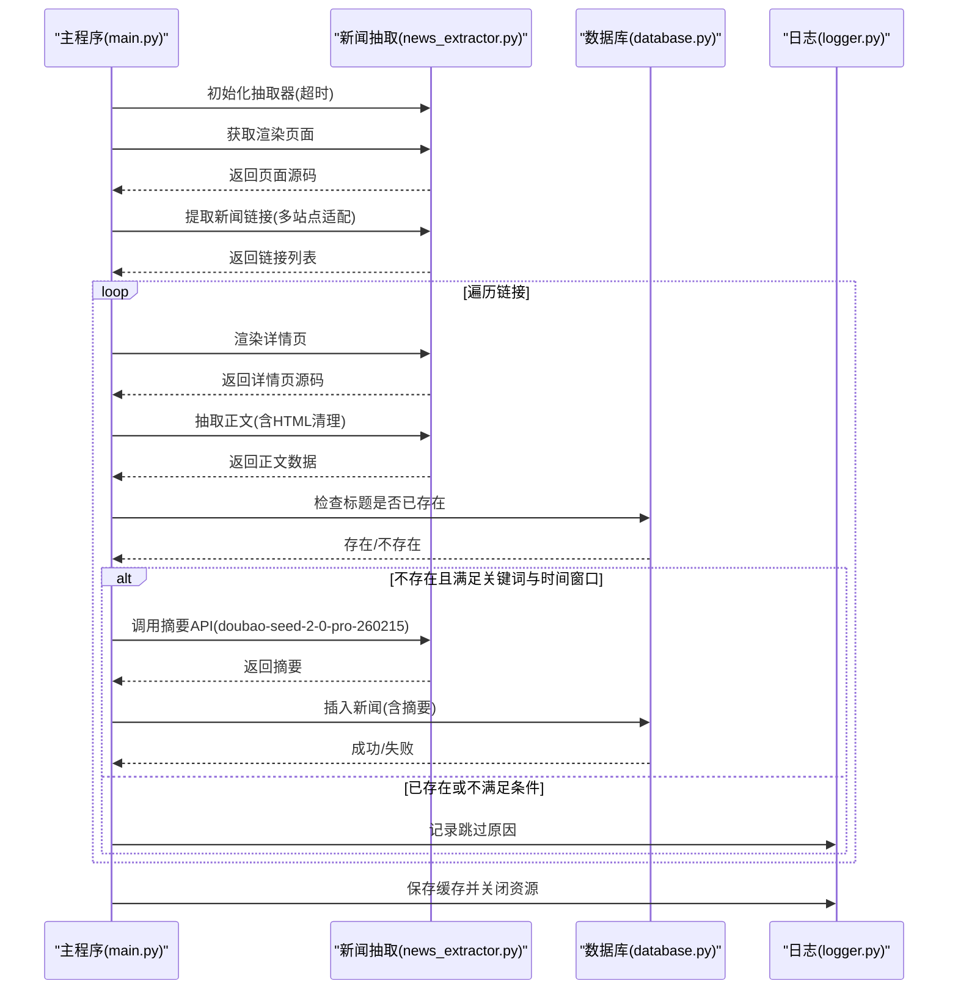
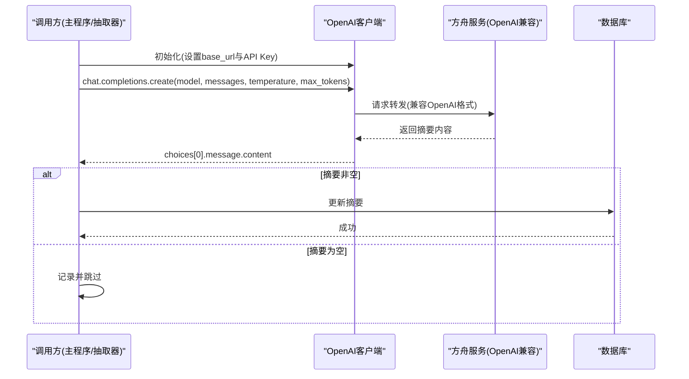
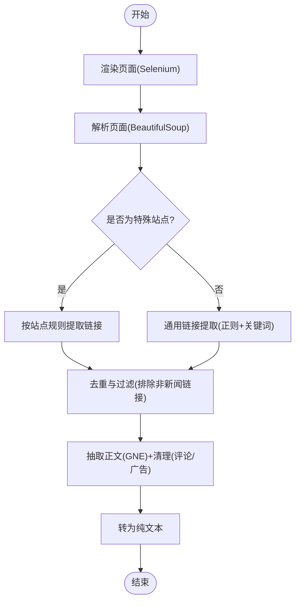
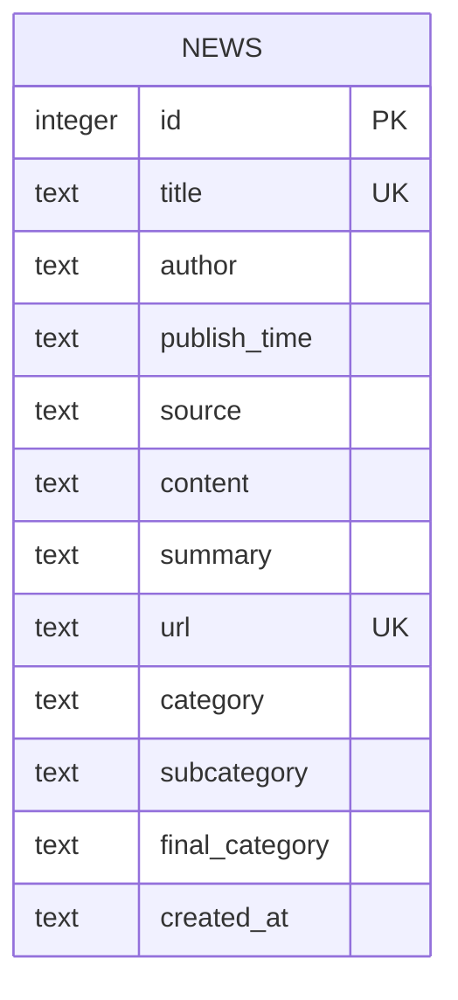
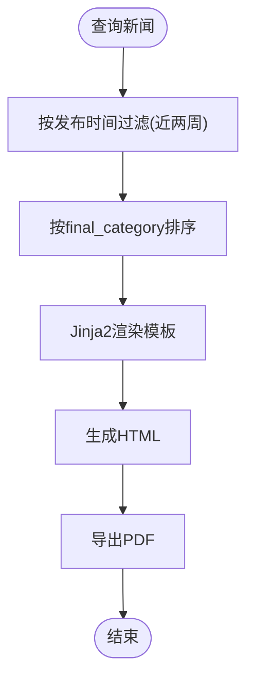
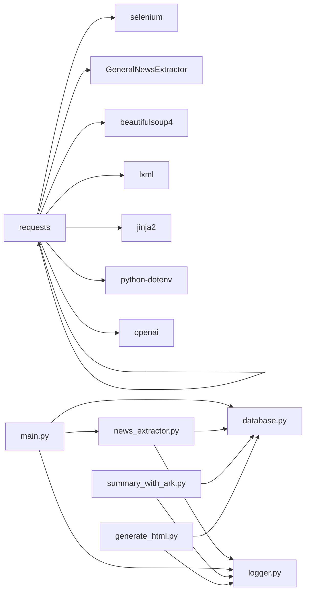

# 火山方舟大模型API

<cite>
**本文引用的文件**
- [config.py](file://config.py)
- [main.py](file://main.py)
- [news_extractor.py](file://news_extractor.py)
- [database.py](file://database.py)
- [summary_with_ark.py](file://summary_with_ark.py)
- [generate_html.py](file://generate_html.py)
- [logger.py](file://logger.py)
- [requirements.txt](file://requirements.txt)
- [readme.MD](file://readme.MD)
</cite>

## 目录
1. [简介](#简介)
2. [项目结构](#项目结构)
3. [核心组件](#核心组件)
4. [架构总览](#架构总览)
5. [详细组件分析](#详细组件分析)
6. [依赖分析](#依赖分析)
7. [性能考虑](#性能考虑)
8. [故障排查指南](#故障排查指南)
9. [结论](#结论)
10. [附录](#附录)

## 简介
本项目围绕“新闻采集与摘要”场景，集成火山方舟大模型API（OpenAI兼容接口）实现内容摘要自动化。系统通过Selenium抓取目标站点页面，使用通用新闻提取器抽取正文，随后调用方舟大模型API生成中文摘要，并将结果持久化至SQLite数据库，最后基于模板生成静态HTML与PDF报告。项目同时包含批量摘要脚本与日志体系，便于生产级运行与排障。

## 项目结构
项目采用功能分层组织：
- 配置层：集中管理站点源、数据库路径、Selenium超时、关键词过滤等配置
- 抓取与抽取层：封装Selenium驱动、链接提取、正文抽取、内容清洗与摘要生成
- 数据层：SQLite数据库封装，提供插入、查询、更新摘要等操作
- 报告层：基于Jinja2模板生成HTML，并导出PDF
- 工具与日志：统一日志输出、轮转与分类日志记录

图表来源
- [main.py:11-206](file://main.py#L11-L206)
- [news_extractor.py:21-893](file://news_extractor.py#L21-L893)
- [database.py:5-92](file://database.py#L5-L92)
- [summary_with_ark.py:1-60](file://summary_with_ark.py#L1-L60)
- [generate_html.py:1-81](file://generate_html.py#L1-L81)
- [logger.py:1-104](file://logger.py#L1-L104)
- [config.py:1-78](file://config.py#L1-L78)
- [requirements.txt:1-10](file://requirements.txt#L1-L10)
- [readme.MD:1-11](file://readme.MD#L1-L11)

章节来源
- [main.py:11-206](file://main.py#L11-L206)
- [news_extractor.py:21-893](file://news_extractor.py#L21-L893)
- [database.py:5-92](file://database.py#L5-L92)
- [summary_with_ark.py:1-60](file://summary_with_ark.py#L1-L60)
- [generate_html.py:1-81](file://generate_html.py#L1-L81)
- [logger.py:1-104](file://logger.py#L1-L104)
- [config.py:1-78](file://config.py#L1-L78)
- [requirements.txt:1-10](file://requirements.txt#L1-L10)
- [readme.MD:1-11](file://readme.MD#L1-L11)

## 核心组件
- OpenAI兼容客户端初始化与方舟API调用
  - 客户端初始化：通过OpenAI SDK，设置base_url为方舟服务地址，API Key来自环境变量
  - 摘要调用：使用chat.completions.create接口，传入system与user消息，设置temperature与max_tokens
- 新闻抽取与预处理
  - Selenium驱动初始化与反检测参数
  - 页面渲染与链接提取（针对多个站点的特殊规则）
  - 正文抽取与HTML标签清理，去除评论与广告节点
- 数据库封装
  - 表结构设计（唯一约束、时间排序、分类字段）
  - 插入、查询、更新摘要、检查标题唯一性
- 报告生成
  - 近两周内新闻过滤、模板渲染、HTML/PDF导出
- 日志与异常
  - 分类日志记录器、文件轮转、统一异常捕获与回退

章节来源
- [news_extractor.py:21-893](file://news_extractor.py#L21-L893)
- [database.py:5-92](file://database.py#L5-L92)
- [generate_html.py:1-81](file://generate_html.py#L1-L81)
- [logger.py:1-104](file://logger.py#L1-L104)

## 架构总览
系统整体流程分为“采集-抽取-摘要-入库-报告”五步，OpenAI兼容接口贯穿摘要阶段，确保与方舟服务一致的调用体验。

图表来源
- [main.py:48-198](file://main.py#L48-L198)
- [news_extractor.py:685-750](file://news_extractor.py#L685-L750)
- [database.py:40-52](file://database.py#L40-L52)
- [logger.py:74-104](file://logger.py#L74-L104)

## 详细组件分析

### OpenAI兼容客户端与方舟摘要调用
- 客户端初始化
  - 通过OpenAI SDK创建客户端，设置base_url为方舟服务地址，API Key从环境变量加载
- 摘要调用流程
  - 模型选择：doubao-seed-2-0-pro-260215
  - 消息格式：system角色用于设定摘要风格与长度约束；user角色传入清洗后的纯文本
  - 参数：temperature=0.2（稳定、贴近原文），max_tokens=300~400（摘要长度上限）
- 错误处理
  - 摘要生成失败时返回空字符串，保证流程继续

图表来源
- [news_extractor.py:710-750](file://news_extractor.py#L710-L750)
- [summary_with_ark.py:44-58](file://summary_with_ark.py#L44-L58)
- [database.py:79-87](file://database.py#L79-L87)

章节来源
- [news_extractor.py:710-750](file://news_extractor.py#L710-L750)
- [summary_with_ark.py:15-58](file://summary_with_ark.py#L15-L58)
- [database.py:79-87](file://database.py#L79-L87)

### 新闻抽取与HTML预处理
- Selenium驱动初始化
  - 无头模式、禁用沙箱、GPU禁用、用户代理伪装、CDP注入反检测
  - 显式设置页面加载超时与隐式等待
- 页面渲染与链接提取
  - 针对不同站点（教育部、今日头条、北京政府、北外网站等）定制CSS选择器与相对路径拼接
  - 统一使用BeautifulSoup解析，支持多种相对路径形式
- 正文抽取与HTML清理
  - 使用通用新闻提取器抽取正文，移除评论与广告节点
  - 对GNE误删body的兼容处理（替换特定关键字）
  - 将HTML内容转为纯文本，作为摘要输入

图表来源
- [news_extractor.py:180-683](file://news_extractor.py#L180-L683)
- [news_extractor.py:685-708](file://news_extractor.py#L685-L708)

章节来源
- [news_extractor.py:43-77](file://news_extractor.py#L43-L77)
- [news_extractor.py:180-683](file://news_extractor.py#L180-L683)
- [news_extractor.py:685-708](file://news_extractor.py#L685-L708)

### 数据库封装与摘要更新
- 表结构要点
  - 唯一约束：title、url
  - 时间字段：publish_time、created_at
  - 分类字段：category、subcategory、final_category
- 常用操作
  - 插入：OR IGNORE避免重复
  - 查询：按发布时间倒序、过滤final_category
  - 更新：仅更新摘要字段
  - 唯一性检查：基于title

图表来源
- [database.py:20-38](file://database.py#L20-L38)
- [database.py:40-52](file://database.py#L40-L52)
- [database.py:79-87](file://database.py#L79-L87)

章节来源
- [database.py:5-92](file://database.py#L5-L92)

### 报告生成与成本控制
- 报告生成
  - 过滤近两周内新闻，按final_category排序
  - Jinja2模板渲染，输出HTML并转PDF
- 成本控制
  - 通过关键词过滤与时间窗口减少无效API调用
  - 链接缓存避免重复抓取
  - 单次处理数量限制（主流程对链接切片）

图表来源
- [generate_html.py:15-81](file://generate_html.py#L15-L81)

章节来源
- [generate_html.py:15-81](file://generate_html.py#L15-L81)

## 依赖分析
- 外部库
  - selenium、webdriver-manager：浏览器驱动与自动化
  - GeneralNewsExtractor、beautifulsoup4、lxml：正文抽取与HTML解析
  - requests、jinja2：HTTP请求与模板渲染
  - python-dotenv：环境变量加载
  - openai：OpenAI兼容SDK
- 内部模块耦合
  - main.py依赖news_extractor.py与database.py
  - news_extractor.py依赖database.py（摘要场景下）
  - generate_html.py依赖database.py与Jinja2模板
  - logger.py被各模块广泛使用

图表来源
- [requirements.txt:1-10](file://requirements.txt#L1-L10)
- [main.py:1-206](file://main.py#L1-L206)
- [news_extractor.py:21-893](file://news_extractor.py#L21-L893)
- [database.py:5-92](file://database.py#L5-L92)
- [summary_with_ark.py:1-60](file://summary_with_ark.py#L1-L60)
- [generate_html.py:1-81](file://generate_html.py#L1-L81)
- [logger.py:1-104](file://logger.py#L1-L104)

章节来源
- [requirements.txt:1-10](file://requirements.txt#L1-L10)
- [main.py:1-206](file://main.py#L1-L206)
- [news_extractor.py:21-893](file://news_extractor.py#L21-L893)
- [database.py:5-92](file://database.py#L5-L92)
- [summary_with_ark.py:1-60](file://summary_with_ark.py#L1-L60)
- [generate_html.py:1-81](file://generate_html.py#L1-L81)
- [logger.py:1-104](file://logger.py#L1-L104)

## 性能考虑
- 浏览器驱动与渲染
  - 无头模式与反检测参数降低资源占用与识别风险
  - 合理设置页面加载超时与隐式等待，避免长时间阻塞
- 链接与内容处理
  - 链接缓存（有序字典）控制内存与IO开销
  - 正文抽取前先做HTML清理，减少噪声输入
- API调用
  - 通过关键词过滤与时间窗口减少无效调用
  - 控制max_tokens与temperature提升稳定性与成本可控
- I/O与并发
  - 主流程对链接切片处理，避免一次性拉满API并发
  - 数据库写入使用唯一约束，减少重复写入

[本节为通用性能建议，无需特定文件引用]

## 故障排查指南
- 环境变量与API密钥
  - 确认.env中存在正确的API Key（方舟与百度NLP均需）
  - OpenAI客户端初始化时会从环境变量读取
- Selenium驱动
  - 若ChromeDriver版本不匹配，使用webdriver-manager或手动指定路径
  - 反检测参数与页面加载超时可根据目标站点调整
- 正文抽取失败
  - GNE误删body的兼容处理已在抽取前生效
  - 如仍失败，检查页面结构变化与cookies参数
- 摘要生成失败
  - 检查网络连通性与方舟服务可用性
  - 观察日志输出，确认消息格式与参数设置
- 数据库异常
  - 确认SQLite文件权限与磁盘空间
  - 检查唯一约束冲突导致的插入失败

章节来源
- [news_extractor.py:27-39](file://news_extractor.py#L27-L39)
- [news_extractor.py:43-77](file://news_extractor.py#L43-L77)
- [news_extractor.py:685-708](file://news_extractor.py#L685-L708)
- [database.py:40-52](file://database.py#L40-L52)
- [logger.py:74-104](file://logger.py#L74-L104)

## 结论
本项目以OpenAI兼容接口无缝接入火山方舟大模型API，在新闻采集、正文抽取、摘要生成与报告输出全链路中实现了高可用与低成本。通过关键词过滤、时间窗口、链接缓存与参数调优，有效平衡了质量与成本。建议在生产环境中结合监控与告警，持续优化站点适配与参数策略。

[本节为总结性内容，无需特定文件引用]

## 附录

### OpenAI兼容接口配置清单
- 客户端初始化
  - base_url：方舟服务地址
  - api_key：从环境变量读取
- 摘要调用参数
  - model：doubao-seed-2-0-pro-260215
  - messages：system（摘要风格与长度约束）+ user（纯文本正文）
  - temperature：0.2（稳定）
  - max_tokens：300~400（摘要长度上限）

章节来源
- [news_extractor.py:710-750](file://news_extractor.py#L710-L750)
- [summary_with_ark.py:44-58](file://summary_with_ark.py#L44-L58)

### HTML内容预处理策略
- 标签清理
  - 使用BeautifulSoup移除HTML标签，保留纯文本
  - 兼容GNE误删body的处理
- 文本提取
  - 通用正文抽取，去除评论与广告节点
- 内容长度优化
  - 对极短内容直接返回原文
  - 对长内容截断或分段处理（视业务需求）

章节来源
- [news_extractor.py:724-730](file://news_extractor.py#L724-L730)
- [news_extractor.py:685-708](file://news_extractor.py#L685-L708)

### 摘要质量控制与批量优化
- 质量控制
  - system提示词明确摘要风格与长度约束
  - temperature=0.2提升稳定性
- 批量处理
  - 主流程对链接切片，避免一次性并发过高
  - 链接缓存避免重复抓取
- 成本控制
  - 关键词过滤与时间窗口减少无效调用
  - max_tokens限制摘要长度，降低token消耗

章节来源
- [main.py:81-173](file://main.py#L81-L173)
- [news_extractor.py:733-741](file://news_extractor.py#L733-L741)

### API调用示例与错误处理
- 示例路径
  - OpenAI兼容客户端初始化与调用：[news_extractor.py:710-750](file://news_extractor.py#L710-L750)
  - 批量摘要脚本：[summary_with_ark.py:44-58](file://summary_with_ark.py#L44-L58)
- 错误处理
  - 摘要为空时回退为空字符串
  - 日志记录器统一输出错误与警告
  - 数据库写入异常捕获并回退

章节来源
- [news_extractor.py:710-750](file://news_extractor.py#L710-L750)
- [summary_with_ark.py:44-58](file://summary_with_ark.py#L44-L58)
- [logger.py:74-104](file://logger.py#L74-L104)
- [database.py:40-52](file://database.py#L40-L52)