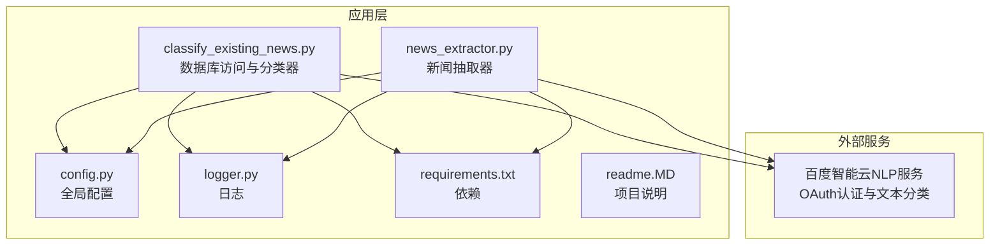
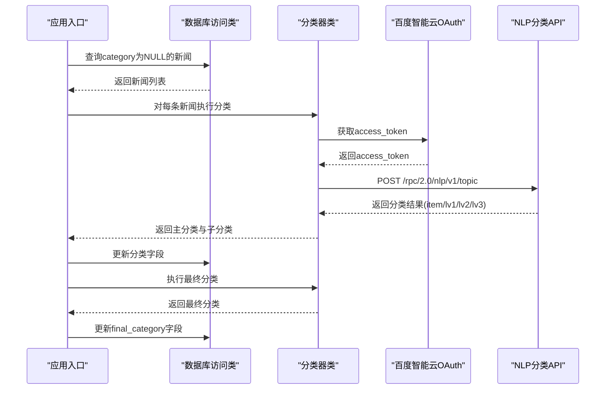
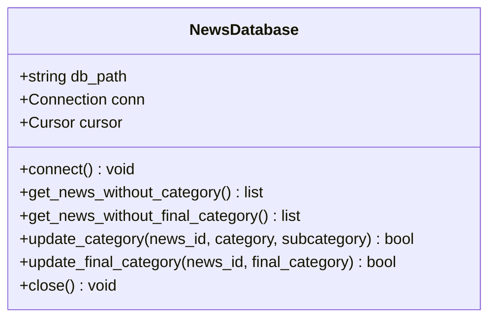
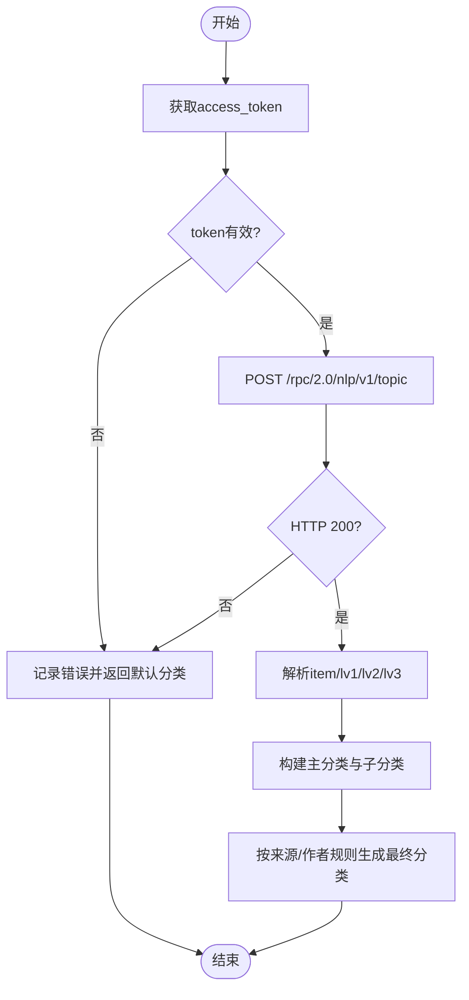
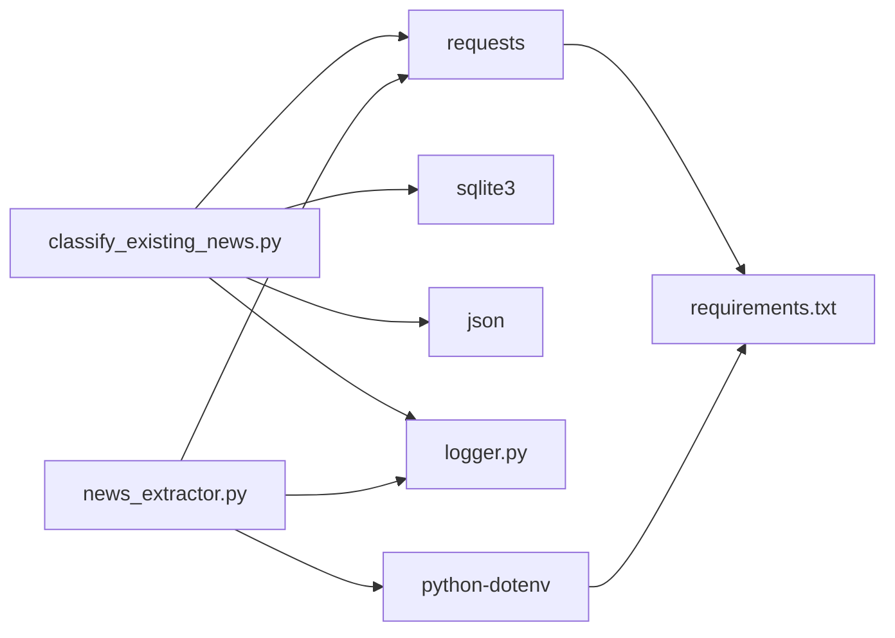

# 百度智能云NLP分类API

<cite>
**本文引用的文件**
- [classify_existing_news.py](file://classify_existing_news.py)
- [news_extractor.py](file://news_extractor.py)
- [config.py](file://config.py)
- [logger.py](file://logger.py)
- [requirements.txt](file://requirements.txt)
- [readme.MD](file://readme.MD)
</cite>

## 目录
1. [简介](#简介)
2. [项目结构](#项目结构)
3. [核心组件](#核心组件)
4. [架构总览](#架构总览)
5. [详细组件分析](#详细组件分析)
6. [依赖关系分析](#依赖关系分析)
7. [性能与优化](#性能与优化)
8. [故障排查指南](#故障排查指南)
9. [结论](#结论)
10. [附录](#附录)

## 简介
本文件面向需要在现有系统中集成百度智能云NLP分类API的开发者，提供从OAuth认证到文本分类调用、从请求参数到返回解析、从错误处理到性能优化的完整实践指南。本文档基于仓库中的实际实现，重点覆盖以下方面：
- OAuth认证流程：client_credentials授权方式、access_token获取机制与有效期管理
- 文本分类API调用：请求参数格式、JSON数据结构、分类标签体系与返回值解析
- API配置示例：API_KEY/SECRET_KEY设置、请求头配置、错误处理策略
- 准确率优化技巧、批量处理策略与性能监控方法
- 常见问题排查与限流处理方案

## 项目结构
该项目围绕“新闻采集—抽取—分类—汇总”的流水线展开，其中分类模块直接对接百度智能云NLP分类服务。核心文件与职责如下：
- classify_existing_news.py：封装数据库访问与百度智能云分类器，负责对已有新闻条目进行分类与最终归类
- news_extractor.py：通用新闻抽取器，内含百度智能云NLP分类调用逻辑（用于抽取流程）
- config.py：全局配置（数据库路径、超时、筛选关键词等）
- logger.py：统一日志输出与轮转
- requirements.txt：第三方依赖清单
- readme.MD：项目功能概述

图表来源
- [classify_existing_news.py:1-302](file://classify_existing_news.py#L1-L302)
- [news_extractor.py:1-200](file://news_extractor.py#L1-L200)
- [config.py:1-78](file://config.py#L1-L78)
- [logger.py:1-104](file://logger.py#L1-L104)
- [requirements.txt:1-10](file://requirements.txt#L1-L10)
- [readme.MD:1-11](file://readme.MD#L1-L11)

章节来源
- [classify_existing_news.py:1-302](file://classify_existing_news.py#L1-L302)
- [news_extractor.py:1-200](file://news_extractor.py#L1-L200)
- [config.py:1-78](file://config.py#L1-L78)
- [logger.py:1-104](file://logger.py#L1-L104)
- [requirements.txt:1-10](file://requirements.txt#L1-L10)
- [readme.MD:1-11](file://readme.MD#L1-L11)

## 核心组件
- 数据库访问类：负责连接SQLite、查询未分类新闻、更新分类结果
- 分类器类：封装百度智能云OAuth认证与文本分类调用，解析返回的多级标签
- 新闻抽取器：在抽取流程中复用百度智能云NLP分类能力
- 日志模块：统一输出分类过程中的信息、调试、错误与警告

章节来源
- [classify_existing_news.py:14-63](file://classify_existing_news.py#L14-L63)
- [classify_existing_news.py:64-169](file://classify_existing_news.py#L64-L169)
- [news_extractor.py:21-40](file://news_extractor.py#L21-L40)
- [logger.py:25-104](file://logger.py#L25-L104)

## 架构总览
整体调用链路如下：应用启动后，读取环境变量中的API密钥，连接数据库，查询未分类新闻，调用百度智能云NLP分类API获取主/子分类，再根据来源与作者等规则进行最终分类，最后写回数据库。

图表来源
- [classify_existing_news.py:237-299](file://classify_existing_news.py#L237-L299)
- [classify_existing_news.py:69-90](file://classify_existing_news.py#L69-L90)
- [classify_existing_news.py:105-168](file://classify_existing_news.py#L105-L168)

## 详细组件分析

### 组件一：数据库访问类（NewsDatabase）
职责
- 连接SQLite数据库，设置UTF-8编码
- 查询未分类新闻与未最终分类新闻
- 更新分类字段与最终分类字段

关键点
- 查询SQL语句明确限定category或final_category为NULL
- 更新操作使用事务提交，异常时记录错误日志

图表来源
- [classify_existing_news.py:14-63](file://classify_existing_news.py#L14-L63)

章节来源
- [classify_existing_news.py:14-63](file://classify_existing_news.py#L14-L63)

### 组件二：分类器类（CategoryClassifier）
职责
- 通过client_credentials方式获取access_token
- 调用百度智能云NLP分类API，解析多级标签
- 根据来源与作者等规则生成最终分类

OAuth与Token管理
- 使用GET请求向OAuth端点申请access_token
- 请求参数包含grant_type、client_id、client_secret
- 成功后从响应JSON中提取access_token
- 错误时抛出异常并记录日志

文本分类调用
- 目标URL：/rpc/2.0/nlp/v1/topic
- 请求头：Content-Type、Accept、User-Agent
- 参数：access_token、charset
- 载荷：title、content（均有限制长度）
- 返回解析：优先取lv1_tag_list作为主分类，lv2/lv3合并为子分类

最终分类规则
- 基于source与author等字段进行规则化映射，形成最终分类

图表来源
- [classify_existing_news.py:69-90](file://classify_existing_news.py#L69-L90)
- [classify_existing_news.py:105-168](file://classify_existing_news.py#L105-L168)
- [classify_existing_news.py:169-235](file://classify_existing_news.py#L169-L235)

章节来源
- [classify_existing_news.py:64-169](file://classify_existing_news.py#L64-L169)
- [classify_existing_news.py:169-235](file://classify_existing_news.py#L169-L235)

### 组件三：新闻抽取器中的分类调用（news_extractor.py）
职责
- 在抽取流程中复用百度智能云NLP分类能力
- 与分类器类一致的认证与调用流程，但对输入长度限制不同

要点
- 从环境变量读取API_KEY与SECRET_KEY
- 获取access_token后调用NLP分类接口
- 对响应进行手动解码与JSON解析，确保编码正确
- 解析返回的多级标签并记录日志

章节来源
- [news_extractor.py:21-40](file://news_extractor.py#L21-L40)
- [news_extractor.py:766-893](file://news_extractor.py#L766-L893)

### 组件四：日志模块（logger.py）
职责
- 统一日志格式、级别与输出位置（文件与控制台）
- 提供info/debug/error/warning便捷函数
- 支持按类别命名的日志记录器

章节来源
- [logger.py:25-104](file://logger.py#L25-L104)

## 依赖关系分析
- classify_existing_news.py依赖requests、sqlite3、json、logger
- news_extractor.py依赖requests、dotenv、logger等
- requirements.txt声明了selenium、requests、beautifulsoup4、lxml、webdriver-manager、python-dotenv、langchain、openai、jinja2等

图表来源
- [classify_existing_news.py:7-11](file://classify_existing_news.py#L7-L11)
- [news_extractor.py:16-18](file://news_extractor.py#L16-L18)
- [requirements.txt:1-10](file://requirements.txt#L1-L10)

章节来源
- [classify_existing_news.py:7-11](file://classify_existing_news.py#L7-L11)
- [news_extractor.py:16-18](file://news_extractor.py#L16-L18)
- [requirements.txt:1-10](file://requirements.txt#L1-L10)

## 性能与优化
- 认证缓存策略
  - 当前实现每次分类都重新获取access_token，建议在进程内缓存token并在过期前刷新，减少HTTP往返
- 批量处理
  - 可将多条新闻聚合后分批调用API，降低请求次数与网络开销
- 超时与重试
  - 为请求设置合理超时与指数退避重试，提升稳定性
- 编码与截断
  - 对title/content进行长度截断，避免超出API限制；确保响应解码采用UTF-8
- 日志与监控
  - 使用logger记录关键指标（耗时、成功率、错误类型），便于后续性能分析

[本节为通用指导，不直接分析具体文件，故无章节来源]

## 故障排查指南
- API密钥未设置
  - 现象：启动时报错提示未设置API密钥
  - 处理：在环境变量中设置WENXIN_API_KEY与WENXIN_SECRET_KEY
- access_token获取失败
  - 现象：HTTP状态码非200或响应包含error字段
  - 处理：检查API_KEY/SECRET_KEY是否正确、网络连通性、是否触发风控
- NLP分类返回错误
  - 现象：响应包含error_code与error_msg
  - 处理：检查请求参数（title/content长度、charset）、网络状况
- 数据库更新失败
  - 现象：更新分类或最终分类失败
  - 处理：查看日志中的异常信息，确认SQL执行与事务提交
- 最终分类异常
  - 现象：最终分类不符合预期
  - 处理：检查规则映射逻辑，必要时增加调试日志

章节来源
- [classify_existing_news.py:246-252](file://classify_existing_news.py#L246-L252)
- [classify_existing_news.py:76-81](file://classify_existing_news.py#L76-L81)
- [classify_existing_news.py:132-133](file://classify_existing_news.py#L132-L133)
- [classify_existing_news.py:46-48](file://classify_existing_news.py#L46-L48)
- [classify_existing_news.py:166-168](file://classify_existing_news.py#L166-L168)

## 结论
本项目已完整实现了百度智能云NLP分类API的集成：从OAuth认证到文本分类调用，从请求参数到返回解析，再到数据库更新与最终分类规则化。建议在生产环境中引入token缓存、批量处理、超时与重试、以及完善的监控与告警机制，以进一步提升稳定性与性能。

[本节为总结性内容，不直接分析具体文件，故无章节来源]

## 附录

### 百度智能云OAuth认证与文本分类调用要点
- 授权方式：client_credentials
- 认证端点：/oauth/2.0/token
- 请求参数：grant_type、client_id、client_secret
- 认证成功后返回access_token
- 文本分类端点：/rpc/2.0/nlp/v1/topic
- 请求头：Content-Type、Accept、User-Agent
- 请求参数：access_token、charset
- 请求体：title、content（均有长度限制）
- 返回结构：item包含lv1_tag_list、lv2_tag_list、lv3_tag_list
- 解析策略：主分类取lv1第一个tag，子分类合并lv2与lv3所有tag

章节来源
- [classify_existing_news.py:69-90](file://classify_existing_news.py#L69-L90)
- [classify_existing_news.py:105-168](file://classify_existing_news.py#L105-L168)
- [news_extractor.py:766-893](file://news_extractor.py#L766-L893)

### API配置示例（步骤说明）
- 设置环境变量
  - WENXIN_API_KEY：百度智能云API Key
  - WENXIN_SECRET_KEY：百度智能云Secret Key
- 请求头配置
  - Content-Type: application/json; charset=utf-8
  - Accept: application/json; charset=utf-8
  - User-Agent: 自定义UA
- 请求参数
  - access_token：通过OAuth获取
  - charset：UTF-8
- 错误处理
  - 捕获HTTP状态码异常与JSON错误字段
  - 记录日志并回退到默认分类

章节来源
- [classify_existing_news.py:108-112](file://classify_existing_news.py#L108-L112)
- [classify_existing_news.py:115-116](file://classify_existing_news.py#L115-L116)
- [classify_existing_news.py:132-133](file://classify_existing_news.py#L132-L133)
- [logger.py:74-104](file://logger.py#L74-L104)

### 分类准确率优化技巧
- 输入预处理：清洗噪声、标准化文本、控制长度
- 规则融合：结合来源、作者、标题关键词进行二次判定
- 结果校验：对低置信度或异常结果进行人工复核
- 持续迭代：基于误判样本调整规则与阈值

[本节为通用指导，不直接分析具体文件，故无章节来源]

### 批量处理策略
- 分批请求：将多条新闻打包，减少API调用次数
- 并发控制：限制并发数，避免触发限流
- 断点续跑：记录已完成批次，异常恢复继续

[本节为通用指导，不直接分析具体文件，故无章节来源]

### 性能监控方法
- 指标采集：请求耗时、成功率、错误分布
- 日志分级：info/debug/error/warning按需输出
- 文件轮转：避免日志过大影响性能

章节来源
- [logger.py:38-54](file://logger.py#L38-L54)

### 常见问题与限流处理
- 限流与配额
  - 若出现频繁错误或被限流，建议降低请求频率、增加重试间隔
- 网络异常
  - 增加重试与超时设置，避免单次失败导致任务中断
- 编码问题
  - 明确charset并确保响应解码为UTF-8

章节来源
- [classify_existing_news.py:76-81](file://classify_existing_news.py#L76-L81)
- [classify_existing_news.py:132-133](file://classify_existing_news.py#L132-L133)
- [news_extractor.py:824-829](file://news_extractor.py#L824-L829)