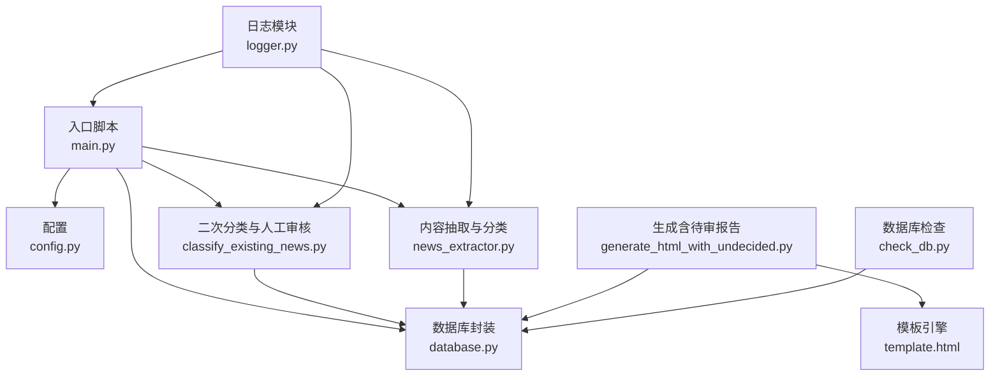
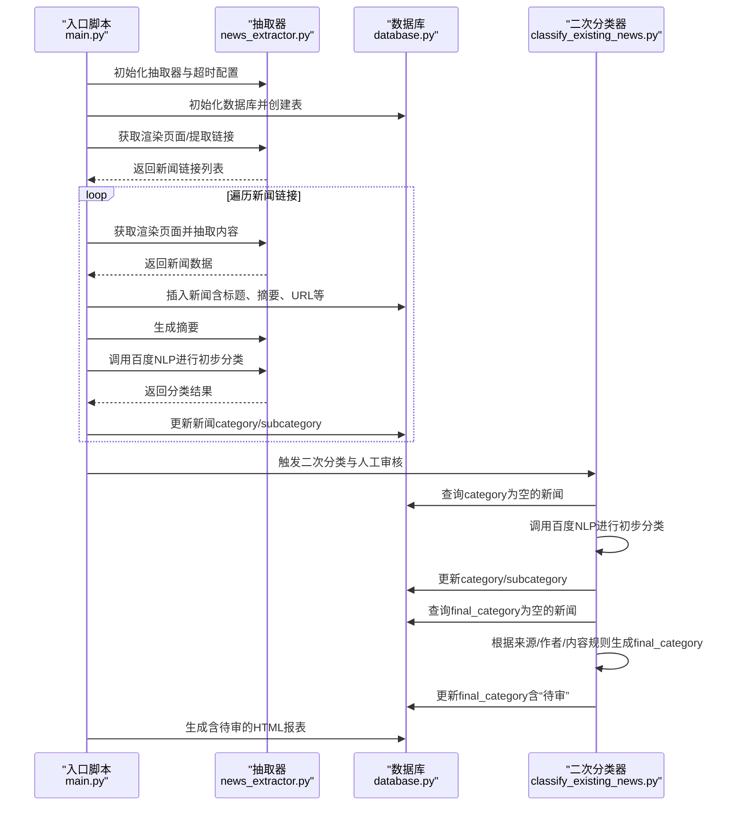
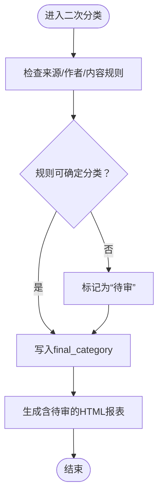
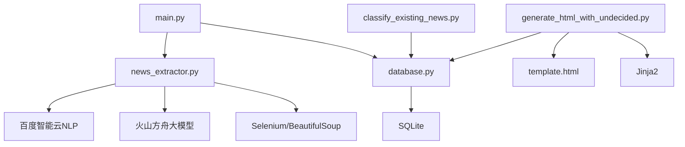

# 人工审核流程

<cite>
**本文引用的文件**
- [main.py](file://main.py)
- [config.py](file://config.py)
- [database.py](file://database.py)
- [news_extractor.py](file://news_extractor.py)
- [classify_existing_news.py](file://classify_existing_news.py)
- [generate_html_with_undecided.py](file://generate_html_with_undecided.py)
- [template.html](file://template.html)
- [logger.py](file://logger.py)
- [check_db.py](file://check_db.py)
- [readme.MD](file://readme.MD)
</cite>

## 目录
1. [简介](#简介)
2. [项目结构](#项目结构)
3. [核心组件](#核心组件)
4. [架构总览](#架构总览)
5. [详细组件分析](#详细组件分析)
6. [依赖分析](#依赖分析)
7. [性能考虑](#性能考虑)
8. [故障排查指南](#故障排查指南)
9. [结论](#结论)
10. [附录](#附录)

## 简介
本文件面向“人工审核流程”的设计与实施，围绕现有代码库中的分类系统与质量保证机制，系统化阐述以下内容：
- “待审”状态的触发条件与判定规则
- 人工复核的标准与流程
- 如何识别需要人工审核的新闻（分类不明确、来源不可靠、内容异常等）
- 审核界面、审核标准、决策流程与审核结果记录方式
- 审核员权限管理、审核进度跟踪与质量评估机制
- 具体审核案例分析与常见问题解决方案

本项目通过自动化采集、抽取、摘要与初步分类，结合“最终分类”阶段的人工介入，形成“自动初筛 + AI辅助 + 人工复核”的质量保障闭环。

## 项目结构
项目采用“功能分层 + 文件职责清晰”的组织方式：
- 入口与调度：main.py
- 配置与常量：config.py
- 数据访问与持久化：database.py
- 内容抽取与分类：news_extractor.py、classify_existing_news.py
- 展示与报告：generate_html_with_undecided.py、template.html
- 日志与诊断：logger.py
- 数据库检查工具：check_db.py
- 项目说明：readme.MD

图表来源
- [main.py:11-206](file://main.py#L11-L206)
- [config.py:1-78](file://config.py#L1-L78)
- [database.py:1-92](file://database.py#L1-L92)
- [news_extractor.py:21-800](file://news_extractor.py#L21-L800)
- [classify_existing_news.py:14-302](file://classify_existing_news.py#L14-L302)
- [generate_html_with_undecided.py:1-72](file://generate_html_with_undecided.py#L1-L72)
- [template.html:1-108](file://template.html#L1-L108)
- [logger.py:1-104](file://logger.py#L1-L104)
- [check_db.py:1-32](file://check_db.py#L1-L32)

章节来源
- [main.py:11-206](file://main.py#L11-L206)
- [config.py:1-78](file://config.py#L1-L78)
- [database.py:1-92](file://database.py#L1-L92)
- [news_extractor.py:21-800](file://news_extractor.py#L21-L800)
- [classify_existing_news.py:14-302](file://classify_existing_news.py#L14-L302)
- [generate_html_with_undecided.py:1-72](file://generate_html_with_undecided.py#L1-L72)
- [template.html:1-108](file://template.html#L1-L108)
- [logger.py:1-104](file://logger.py#L1-L104)
- [check_db.py:1-32](file://check_db.py#L1-L32)
- [readme.MD:1-11](file://readme.MD#L1-L11)

## 核心组件
- 入口与调度：负责初始化数据库、抽取器、链接缓存，遍历信息源，抓取与清洗数据，生成摘要与初步分类，写入数据库，并触发最终分类与人工审核。
- 数据库封装：提供新闻表的创建、插入、查询与更新接口，支持“仅展示非待审”和“含待审”的两种报表查询。
- 内容抽取与分类：负责页面渲染、链接提取、正文抽取、摘要生成、百度智能云NLP分类与二次分类。
- 二次分类与人工审核：对“category为空”的新闻进行初步分类，再根据来源、作者、内容等规则生成“final_category”，其中“待审”作为人工复核的触发状态。
- 报表与展示：按“最终分类”分组生成HTML报告，便于人工审核人员浏览与操作。
- 日志与诊断：统一的日志输出，便于追踪抓取、分类与审核过程。

章节来源
- [main.py:11-206](file://main.py#L11-L206)
- [database.py:20-92](file://database.py#L20-L92)
- [news_extractor.py:21-800](file://news_extractor.py#L21-L800)
- [classify_existing_news.py:14-302](file://classify_existing_news.py#L14-L302)
- [generate_html_with_undecided.py:1-72](file://generate_html_with_undecided.py#L1-L72)
- [template.html:1-108](file://template.html#L1-L108)
- [logger.py:1-104](file://logger.py#L1-L104)

## 架构总览
整体流程分为“采集与预处理”、“自动分类与摘要”、“二次分类与人工审核”、“报表与展示”四个阶段。

图表来源
- [main.py:11-206](file://main.py#L11-L206)
- [news_extractor.py:21-800](file://news_extractor.py#L21-L800)
- [database.py:20-92](file://database.py#L20-L92)
- [classify_existing_news.py:14-302](file://classify_existing_news.py#L14-L302)
- [generate_html_with_undecided.py:1-72](file://generate_html_with_undecided.py#L1-L72)

## 详细组件分析

### 组件A：人工审核触发与“待审”状态判定
- 触发条件
  - 二次分类阶段，当“来源/作者/内容”等规则无法确定最终分类时，默认标记为“待审”，交由人工复核。
  - 数据库查询“final_category为空”的新闻，进入二次分类流程；若规则判定不确定，则回写“待审”。

- 判定规则要点（节选）
  - 来源特定：如“Ai机器人-每日AI新闻”若初步分类非“科技”，则标记“待审”。
  - 内容特征：若内容包含特定关键词组合（如“本文/主任谈/观点/专家/学术/讲座”），可能调整为“专家视点”；否则可能退回“待审”。
  - 作者与来源：若作者为“胡编”或来源不在预期范围，标记“待审”。
  - 时间窗口：报表默认展示近两周内的新闻，便于审核员聚焦最新内容。

- 审核结果记录
  - 二次分类完成后，将“final_category”写回数据库；报表按此字段分组展示，人工审核人员据此识别“待审”项。

图表来源
- [classify_existing_news.py:169-235](file://classify_existing_news.py#L169-L235)
- [database.py:54-67](file://database.py#L54-L67)
- [generate_html_with_undecided.py:10-37](file://generate_html_with_undecided.py#L10-L37)

章节来源
- [classify_existing_news.py:169-235](file://classify_existing_news.py#L169-L235)
- [database.py:54-67](file://database.py#L54-L67)
- [generate_html_with_undecided.py:10-37](file://generate_html_with_undecided.py#L10-L37)

### 组件B：人工复核的标准与流程
- 复核标准
  - 分类不明确：当二次分类规则无法覆盖或存在歧义时，标记“待审”。
  - 来源不可靠：作者为“胡编”或来源不在预期范围，标记“待审”。
  - 内容异常：标题/摘要/正文存在明显错误、敏感信息或与领域无关，标记“待审”。

- 复核流程
  1. 审核员登录报表页面，查看“待审”分类下的新闻列表。
  2. 对每条新闻进行逐项核验：来源可信度、作者真实性、内容一致性、关键词匹配度、时效性等。
  3. 根据复核结果，将“待审”改为最终分类（如“1.行业新闻”“2.专家视点”“3.高校动态”“4.科技前沿”等）。
  4. 将审核结果写回数据库，刷新报表。

- 审核结果记录
  - 二次分类器在生成“final_category”后，更新数据库对应记录；报表按“final_category”字段分组渲染，便于跟踪。

章节来源
- [classify_existing_news.py:169-235](file://classify_existing_news.py#L169-L235)
- [generate_html_with_undecided.py:10-37](file://generate_html_with_undecided.py#L10-L37)
- [template.html:87-105](file://template.html#L87-L105)

### 组件C：识别需要人工审核的新闻
- 分类不明确
  - 规则无法确定主分类或子分类，或与来源/作者/内容不一致，标记“待审”。
- 来源不可靠
  - 作者为“胡编”或来源不在预期范围，标记“待审”。
- 内容异常
  - 标题/摘要/正文存在明显错误、敏感信息或与领域无关，标记“待审”。

章节来源
- [classify_existing_news.py:174-235](file://classify_existing_news.py#L174-L235)

### 组件D：审核界面与操作指南
- 审核界面
  - 使用Jinja2模板生成HTML页面，按“最终分类”分组展示新闻，包含标题、来源、作者、发布时间、摘要与原文链接。
  - 报表默认展示近两周内的新闻，便于聚焦最新内容。

- 操作指南
  1. 打开生成的HTML页面，定位至“待审”分组。
  2. 逐条核验：来源、作者、内容、关键词、时效性。
  3. 修改“最终分类”字段值，保存数据库。
  4. 刷新报表，确认变更生效。

章节来源
- [generate_html_with_undecided.py:10-72](file://generate_html_with_undecided.py#L10-L72)
- [template.html:87-105](file://template.html#L87-L105)

### 组件E：权限管理、进度跟踪与质量评估
- 权限管理
  - 建议：对数据库写操作进行权限控制，仅授权审核员账号执行“更新final_category”操作。
- 进度跟踪
  - 报表按“最终分类”分组，可直观查看“待审”数量与分布；结合日志文件定位异常。
- 质量评估
  - 建议：统计“待审”占比、人工修正率、错误分类率等指标，持续优化二次分类规则。

章节来源
- [logger.py:1-104](file://logger.py#L1-L104)
- [generate_html_with_undecided.py:10-37](file://generate_html_with_undecided.py#L10-L37)

### 组件F：审核案例分析
- 案例1：来源为“Ai机器人-每日AI新闻”
  - 若初步分类非“科技”，标记“待审”；若为“科技”，则直接归类为“4.科技前沿”。
- 案例2：来源为“中国教育和科研计算机网滚动新闻”
  - 若内容包含“本文/主任谈/观点/专家/学术/讲座”等关键词，归类为“2.专家视点”；否则退回“待审”。
- 案例3：来源为“中国教育新闻网”
  - 若作者为“胡编”，标记“待审”；若初步分类不在“教育/科技/时事”，标记“待审”。

章节来源
- [classify_existing_news.py:174-235](file://classify_existing_news.py#L174-L235)

## 依赖分析
- 组件耦合
  - main.py依赖news_extractor.py与database.py；classify_existing_news.py依赖database.py；generate_html_with_undecided.py依赖database.py与template.html。
- 外部依赖
  - 百度智能云NLP（token获取与分类API）、火山方舟大模型（摘要生成）、SQLite（本地存储）、Jinja2（模板渲染）、Selenium/BeautifulSoup（页面渲染与解析）。

图表来源
- [main.py:11-206](file://main.py#L11-L206)
- [news_extractor.py:21-800](file://news_extractor.py#L21-L800)
- [database.py:1-92](file://database.py#L1-L92)
- [classify_existing_news.py:14-302](file://classify_existing_news.py#L14-L302)
- [generate_html_with_undecided.py:1-72](file://generate_html_with_undecided.py#L1-72)
- [template.html:1-108](file://template.html#L1-L108)

章节来源
- [main.py:11-206](file://main.py#L11-L206)
- [news_extractor.py:21-800](file://news_extractor.py#L21-L800)
- [database.py:1-92](file://database.py#L1-L92)
- [classify_existing_news.py:14-302](file://classify_existing_news.py#L14-L302)
- [generate_html_with_undecided.py:1-72](file://generate_html_with_undecided.py#L1-L72)
- [template.html:1-108](file://template.html#L1-L108)

## 性能考虑
- 页面渲染与解析
  - Selenium渲染与BeautifulSoup解析可能成为瓶颈，建议合理设置超时与并发策略，避免阻塞。
- 数据库写入
  - 批量写入与事务提交需谨慎，避免频繁IO导致延迟。
- 报表生成
  - HTML生成涉及大量字符串拼接与模板渲染，建议对数据量进行分页或分批处理。

## 故障排查指南
- 常见问题
  - 百度NLP认证失败：检查API Key与Secret Key是否正确配置。
  - 页面渲染失败：检查Selenium驱动版本与目标站点反爬策略。
  - 报表为空：确认数据库中是否存在“final_category为空”的新闻，或查询条件是否过滤掉“待审”。

- 定位手段
  - 日志：通过logger模块输出的info/debug/error/warning信息定位问题。
  - 数据库检查：使用check_db.py查看表结构与数据量，辅助验证数据完整性。

章节来源
- [logger.py:1-104](file://logger.py#L1-L104)
- [check_db.py:1-32](file://check_db.py#L1-L32)
- [news_extractor.py:760-800](file://news_extractor.py#L760-L800)

## 结论
本项目通过“自动采集 + AI分类 + 人工复核”的闭环机制，有效提升了新闻内容的质量与一致性。其中，“待审”状态作为人工干预的关键触发点，配合报表与模板渲染，为审核员提供了清晰的工作流与可视化界面。建议在后续迭代中进一步完善权限控制、质量评估指标与规则自学习能力，持续提升审核效率与准确性。

## 附录
- 术语
  - 待审：尚未人工确认的新闻，需由审核员进行最终分类。
  - 最终分类：经AI与人工共同确认的新闻分类结果。
- 参考实现路径
  - 二次分类与人工审核：[classify_existing_news.py:169-235](file://classify_existing_news.py#L169-L235)
  - 报表生成与展示：[generate_html_with_undecided.py:10-72](file://generate_html_with_undecided.py#L10-L72)，[template.html:87-105](file://template.html#L87-L105)
  - 数据库查询与更新：[database.py:54-67](file://database.py#L54-L67)，[database.py:39-58](file://database.py#L39-L58)