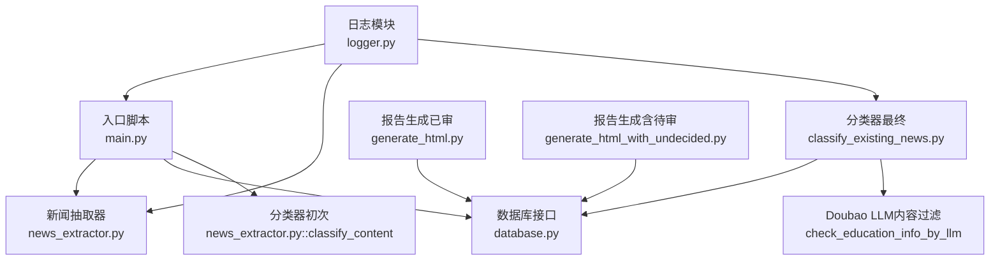
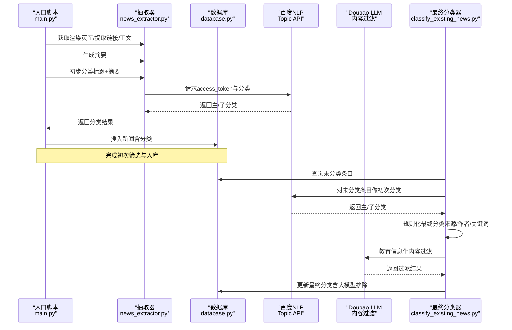
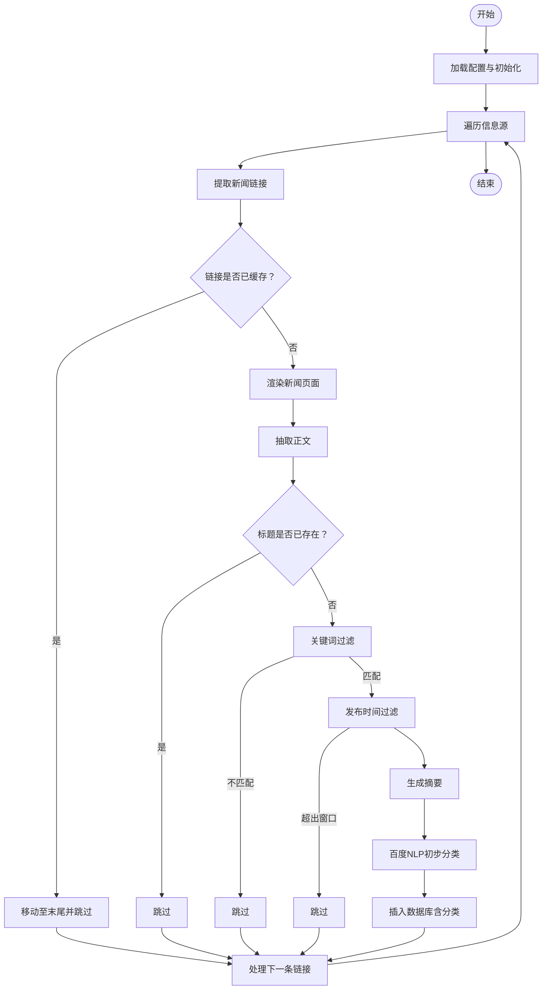
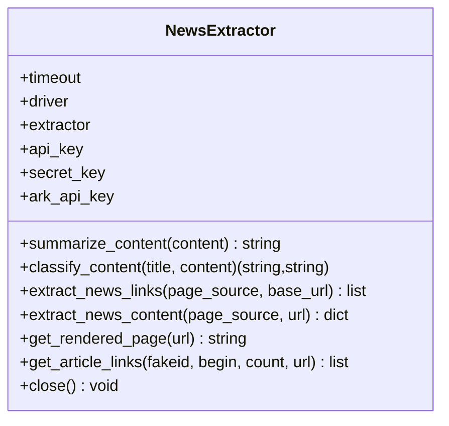
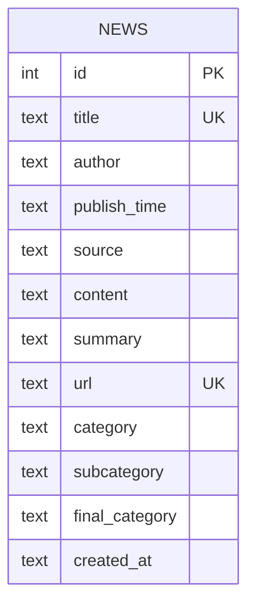
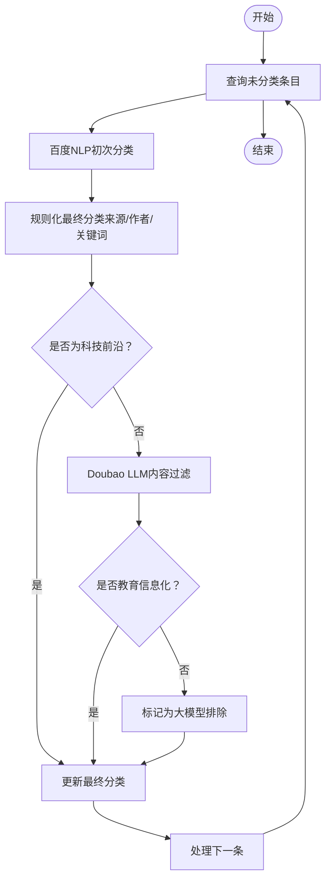
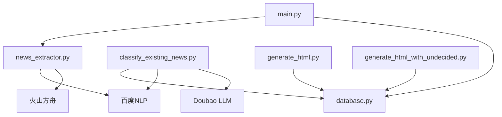

# 分类系统设计

<cite>
**本文引用的文件**
- [main.py](file://main.py)
- [config.py](file://config.py)
- [news_extractor.py](file://news_extractor.py)
- [classify_existing_news.py](file://classify_existing_news.py)
- [database.py](file://database.py)
- [logger.py](file://logger.py)
- [generate_html.py](file://generate_html.py)
- [generate_html_with_undecided.py](file://generate_html_with_undecided.py)
- [requirements.txt](file://requirements.txt)
- [readme.MD](file://readme.MD)
</cite>

## 更新摘要
**变更内容**
- 新增Volcengine Doubao LLM API集成用于教育信息化内容过滤
- 增强分类系统的双重过滤机制：百度NLP + Doubao LLM
- 新增"大模型排除"分类类别用于标识不符合教育信息化的内容
- 完善分类质量控制和人工审核流程

## 目录
1. [引言](#引言)
2. [项目结构](#项目结构)
3. [核心组件](#核心组件)
4. [架构总览](#架构总览)
5. [详细组件分析](#详细组件分析)
6. [依赖分析](#依赖分析)
7. [性能考虑](#性能考虑)
8. [故障排查指南](#故障排查指南)
9. [结论](#结论)
10. [附录](#附录)

## 引言
本设计文档围绕 news-exacter 的"分类系统"展开，系统目标是：
- 利用百度智能云 NLP 服务对新闻进行初步分类；
- 结合特征字串、标题、摘要、来源与作者等多维信息生成最终分类；
- **新增**：集成Volcengine Doubao LLM API进行教育信息化内容过滤，提升分类准确性；
- 支持人工审核与校核流程；
- 提供分类质量评估、规则配置与性能优化建议；
- 明确与其他模块（抓取、数据库、生成报告）的数据流与集成方式。

## 项目结构
项目采用"入口脚本 + 抽取器 + 数据库 + 分类器 + 报告生成"的分层组织：
- 入口脚本负责调度抓取、预筛选、摘要生成与初步分类；
- 抽取器封装浏览器渲染、链接提取、正文抽取、摘要生成与百度 NLP 分类；
- 数据库模块负责持久化与查询；
- 分类器模块负责对已有数据进行最终分类与人工审核，**新增**：集成Doubao LLM进行内容过滤；
- 报告生成模块负责按最终分类输出 HTML/PDF。

**图表来源**
- [main.py:11-196](file://main.py#L11-L196)
- [news_extractor.py:21-887](file://news_extractor.py#L21-L887)
- [database.py:5-92](file://database.py#L5-L92)
- [classify_existing_news.py:64-302](file://classify_existing_news.py#L64-L302)
- [generate_html.py:1-81](file://generate_html.py#L1-L81)
- [generate_html_with_undecided.py:1-72](file://generate_html_with_undecided.py#L1-L72)

**章节来源**
- [main.py:11-196](file://main.py#L11-L196)
- [config.py:1-78](file://config.py#L1-L78)
- [readme.MD:1-11](file://readme.MD#L1-L11)

## 核心组件
- 入口调度与预筛选：在入口脚本中完成链接缓存、关键词过滤、时间窗口过滤、摘要生成与初步分类，并写入数据库。
- 新闻抽取器：封装 Selenium 渲染、链接提取、正文抽取、摘要生成、百度 NLP 分类。
- 数据库接口：SQLite 表结构包含标题唯一、摘要、分类字段与最终分类字段。
- 分类器（初次）：调用百度 NLP Topic 接口，返回主分类与子分类。
- 分类器（最终）：基于来源、作者、标题/摘要关键词、初步分类结果进行规则化最终分类，并支持"待审"标记；**新增**：集成Doubao LLM进行教育信息化内容过滤。
- 报告生成：按最终分类输出 HTML/PDF，支持仅已审与含待审两种模式。

**章节来源**
- [main.py:111-164](file://main.py#L111-L164)
- [news_extractor.py:753-887](file://news_extractor.py#L753-L887)
- [database.py:20-52](file://database.py#L20-L52)
- [classify_existing_news.py:92-235](file://classify_existing_news.py#L92-L235)
- [generate_html.py:15-81](file://generate_html.py#L15-L81)

## 架构总览
系统整体流程分为"采集与预处理"和"分类与报告"两大阶段：
- 采集与预处理：入口脚本遍历信息源，抓取页面、提取链接、渲染页面、抽取正文、关键词与时间过滤、摘要生成、初步分类、入库。
- 分类与报告：独立运行的分类脚本对未分类条目进行初次分类，再基于规则生成最终分类，**新增**：通过Doubao LLM进行教育信息化内容过滤，最后生成报告。

**图表来源**
- [main.py:101-164](file://main.py#L101-L164)
- [news_extractor.py:753-887](file://news_extractor.py#L753-L887)
- [classify_existing_news.py:237-299](file://classify_existing_news.py#L237-L299)

## 详细组件分析

### 组件A：入口脚本与预筛选
- 功能要点
  - 遍历配置中的信息源，针对微信公众号与普通站点分别处理；
  - 使用链接缓存避免重复抓取；
  - 标题去重、关键词过滤、发布时间窗口过滤；
  - 生成摘要、调用百度 NLP 初步分类、入库。
- 关键流程
  - 链接提取与缓存更新；
  - 页面渲染与正文抽取；
  - 关键词与时间过滤；
  - 摘要生成与初步分类；
  - 数据库插入（含分类字段）。

**图表来源**
- [main.py:48-173](file://main.py#L48-L173)

**章节来源**
- [main.py:48-173](file://main.py#L48-L173)
- [config.py:1-78](file://config.py#L1-L78)

### 组件B：新闻抽取器（链接提取、正文抽取、摘要生成、百度 NLP 分类）
- 链接提取
  - 针对不同站点（教育部、今日头条、edu.cn、ai-bot、beijing.gov、北外网站、信息中心）有专门的解析策略；
  - 通用正则与关键词过滤辅助识别新闻链接；
  - 支持相对路径补全与去重。
- 正文抽取
  - 使用 GeneralNewsExtractor 并排除评论与广告节点；
  - 返回标题、作者、发布时间、来源、正文、URL。
- 摘要生成
  - 使用火山方舟大模型（OpenAI 兼容接口）生成摘要，去除 HTML 后进行长度控制；
  - 若正文过短则直接返回原文。
- 百度 NLP 分类
  - 先获取 access_token，再调用 Topic 接口；
  - 请求参数包含标题与内容，限制长度；
  - 解析返回的主/子分类层级，异常时回退为"其他"。

**图表来源**
- [news_extractor.py:21-887](file://news_extractor.py#L21-L887)

**章节来源**
- [news_extractor.py:180-683](file://news_extractor.py#L180-L683)
- [news_extractor.py:704-744](file://news_extractor.py#L704-L744)
- [news_extractor.py:753-887](file://news_extractor.py#L753-L887)

### 组件C：数据库接口
- 表结构
  - 主键自增 id；
  - 标题与 URL 唯一约束；
  - 字段包含标题、作者、发布时间、来源、正文、摘要、分类、子分类、最终分类、创建时间等；
  - 提供插入、查询、更新摘要、标题存在性检查等操作。
- 查询策略
  - 获取所有已审新闻（按发布时间倒序）；
  - 获取含待审新闻（按发布时间倒序）；
  - 获取未分类/未最终分类条目用于后续分类。

**图表来源**
- [database.py:20-52](file://database.py#L20-L52)

**章节来源**
- [database.py:5-92](file://database.py#L5-L92)

### 组件D：分类器（初次与最终）
- 初次分类（入口脚本调用）
  - 调用百度 NLP Topic 接口，返回主分类与子分类；
  - 异常回退为"其他"。
- 最终分类（独立脚本）
  - 基于来源、作者、标题/摘要关键词、初步分类结果进行规则化；
  - 支持"待审"标记，便于人工复核；
  - **新增**：集成Doubao LLM进行教育信息化内容过滤，对非"4.科技前沿"内容进行二次验证；
  - 更新数据库 final_category 字段，**新增**：支持"9.大模型排除"类别。

**图表来源**
- [classify_existing_news.py:237-299](file://classify_existing_news.py#L237-L299)

**章节来源**
- [classify_existing_news.py:92-235](file://classify_existing_news.py#L92-L235)

### 组件E：报告生成
- 已审报告：仅展示 final_category 不为"待审"的新闻，按发布时间排序，生成 HTML 与 PDF。
- 含待审报告：展示全部新闻，便于人工审核与导出。

**章节来源**
- [generate_html.py:15-81](file://generate_html.py#L15-L81)
- [generate_html_with_undecided.py:10-72](file://generate_html_with_undecided.py#L10-L72)

## 依赖分析
- 外部服务
  - 百度智能云 NLP Topic 接口（access_token 获取与分类请求）；
  - 火山方舟大模型摘要接口（OpenAI 兼容）；
  - **新增**：Volcengine Doubao LLM API（内容过滤服务）。
- 第三方库
  - selenium、GeneralNewsExtractor、requests、beautifulsoup4、lxml、webdriver-manager、python-dotenv、langchain、openai。
- 模块间耦合
  - 入口脚本依赖抽取器与数据库；
  - 抽取器依赖百度与火山 API；
  - 最终分类器依赖数据库与百度 API；**新增**：依赖Doubao LLM API；
  - 报告生成依赖数据库。

**图表来源**
- [requirements.txt:1-9](file://requirements.txt#L1-L9)
- [main.py:11-196](file://main.py#L11-L196)
- [news_extractor.py:753-887](file://news_extractor.py#L753-L887)
- [classify_existing_news.py:237-299](file://classify_existing_news.py#L237-L299)

**章节来源**
- [requirements.txt:1-9](file://requirements.txt#L1-L9)

## 性能考虑
- 浏览器渲染与链接提取
  - 针对特定站点（如今日头条）增加等待与滚动，避免内容未加载；
  - 使用链接缓存（有序字典）减少重复抓取，控制最大缓存大小。
- API 调用节流
  - 入口脚本在循环中添加延时，避免请求过快；
  - 百度 NLP 与火山方舟接口设置超时，防止阻塞；
  - **新增**：Doubao LLM API调用设置合理的超时和重试机制。
- 文本截断与编码
  - 对标题与内容进行长度限制，避免 API 参数过大；
  - 对响应进行显式编码处理，确保 JSON 解析稳定。
- 数据库写入
  - 使用"忽略重复"策略，避免重复写入；
  - 批量更新 final_category 前先查询未分类条目，减少无效请求。

**章节来源**
- [main.py:173](file://main.py#L173)
- [news_extractor.py:186-193](file://news_extractor.py#L186-L193)
- [news_extractor.py:807-810](file://news_extractor.py#L807-L810)
- [database.py:40-52](file://database.py#L40-L52)

## 故障排查指南
- 百度 NLP 授权失败
  - 现象：获取 access_token 失败或返回错误码；
  - 排查：确认环境变量中 API Key 与 Secret Key 设置正确；
  - 影响：分类回退为"其他"。
- 火山方舟摘要失败
  - 现象：摘要为空或异常；
  - 排查：检查 API Key 与网络连通性，确认模型可用；
  - 影响：摘要生成失败时直接返回原文。
- **新增**：Doubao LLM 内容过滤失败
  - 现象：大模型审核异常或返回空结果；
  - 排查：检查 ARK_API_KEY 环境变量设置，确认网络连通性；
  - 影响：内容过滤失败时，默认认为内容属于教育信息化。
- 数据库写入冲突
  - 现象：标题或 URL 重复导致插入失败；
  - 排查：检查唯一约束与去重逻辑；
  - 影响：忽略重复项，继续处理下一条。
- 报告生成异常
  - 现象：HTML/PDF 生成失败；
  - 排查：确认 wkhtmltopdf 路径与模板文件存在；
  - 影响：仅影响报告输出，不影响分类流程。

**章节来源**
- [news_extractor.py:768-789](file://news_extractor.py#L768-L789)
- [news_extractor.py:825-834](file://news_extractor.py#L825-L834)
- [classify_existing_news.py:178-209](file://classify_existing_news.py#L178-L209)
- [database.py:40-52](file://database.py#L40-L52)
- [generate_html.py:9-10](file://generate_html.py#L9-L10)

## 结论
本分类系统通过"关键词过滤 + 时间窗口 + 摘要 + 百度 NLP 初次分类 + 规则化最终分类 + 人工审核"的闭环，实现了对教育信息化领域新闻的自动化分类与报告输出。**新增**：通过Volcengine Doubao LLM API增强了内容过滤能力，显著提升了分类准确性。系统具备良好的扩展性：可替换 NLP 服务、调整规则、接入更多来源与数据库后端。建议持续完善规则库与人工审核流程，提升分类准确率与可解释性。

## 附录

### 分类质量评估方法
- 人工抽样评估：定期抽取一定数量的新闻，对比百度 NLP 初次分类与规则化最终分类的准确性；
- **新增**：内容过滤效果评估：对比Doubao LLM过滤前后的内容准确性；
- 指标建议：准确率、召回率、F1 值、人工审核通过率、**新增**：内容过滤准确率；
- 规则迭代：基于误判案例优化规则与关键词集合。

### 分类规则配置
- 来源规则：不同来源赋予默认类别与阈值；
- 作者规则：针对特定作者标记"待审"；
- 标题/摘要关键词：用于识别专家视点、高校动态、科技前沿等；
- 初次分类联动：当初次分类与来源/作者不一致时退回"待审"；
- **新增**：Doubao LLM过滤规则：对非"4.科技前沿"内容进行教育信息化范畴判断。

**章节来源**
- [classify_existing_news.py:169-235](file://classify_existing_news.py#L169-L235)

### 人工校核流程
- 生成含待审报告，标注"待审"条目；
- 人工复核后更新 final_category；
- **新增**：对"9.大模型排除"类别的内容进行二次审核；
- 重新生成已审报告，形成闭环。

**章节来源**
- [generate_html_with_undecided.py:10-72](file://generate_html_with_undecided.py#L10-L72)
- [generate_html.py:15-81](file://generate_html.py#L15-L81)

### 配置参数说明
- 信息源配置：包含 URL 与来源名称；
- 关键词过滤：用于筛选与教育信息化相关的新闻；
- Selenium/提取超时：控制渲染与解析耗时；
- 链接缓存：控制缓存大小与持久化；
- **新增**：Doubao LLM API配置：ARK_API_KEY环境变量设置。

**章节来源**
- [config.py:1-78](file://config.py#L1-L78)

### 性能优化建议
- 缓存策略：扩大链接缓存容量，定期清理过期缓存；
- API 限流：统一设置请求间隔，避免触发限流；
- 文本截断：根据实际业务调整标题/内容长度限制；
- 数据库索引：为常用查询字段建立索引（如 final_category、publish_time）；
- **新增**：Doubao LLM调优：合理设置temperature和max_tokens参数，平衡准确性和性能。

**章节来源**
- [main.py:24-47](file://main.py#L24-L47)
- [news_extractor.py:807-810](file://news_extractor.py#L807-L810)
- [database.py:54-67](file://database.py#L54-L67)

### Doubao LLM内容过滤详解
- **功能概述**：通过Volcengine Doubao LLM判断新闻内容是否属于教育信息化范畴；
- **过滤范围**：对非"4.科技前沿"类别的内容进行教育信息化判定；
- **判定标准**：教育信息化包括高校信息化、教育技术应用、智慧教育、在线教育、教育数字化转型、教育装备信息化、教育管理信息化、教育大数据、人工智能对教育的影响等；
- **输出格式**：仅返回"是"或"否"，用于决定内容是否保留；
- **异常处理**：Doubao LLM调用失败时，默认认为内容属于教育信息化，确保分类系统的稳定性。

**章节来源**
- [classify_existing_news.py:178-209](file://classify_existing_news.py#L178-L209)