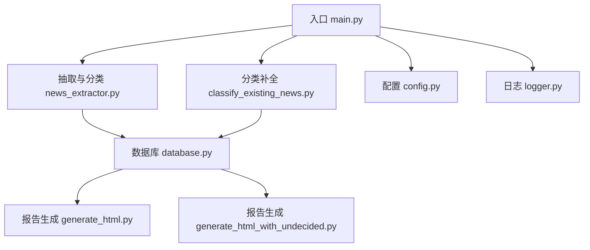
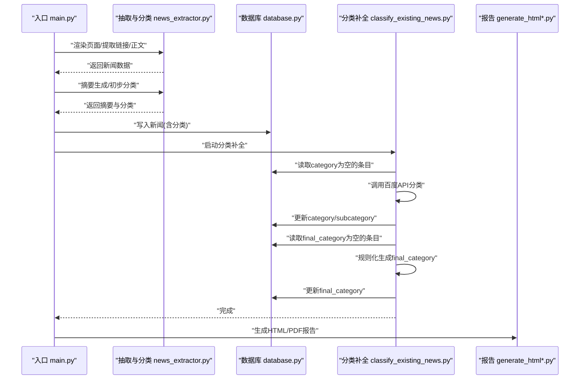
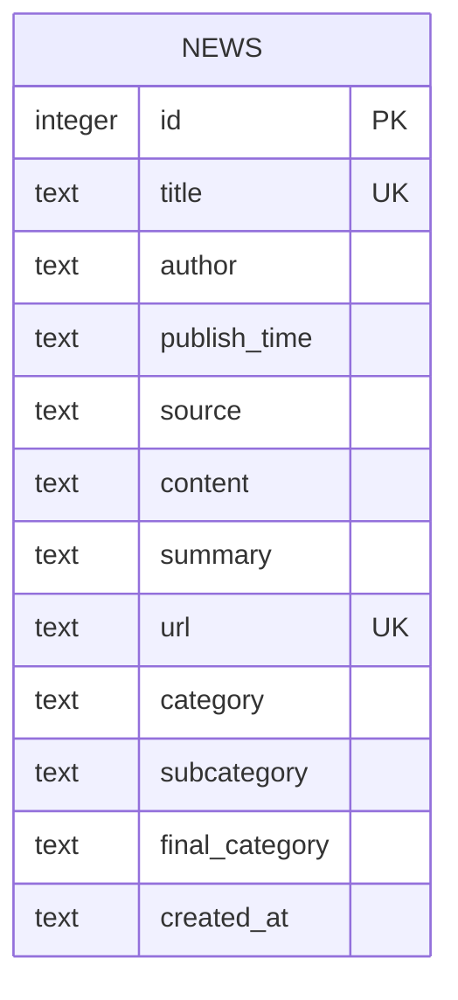
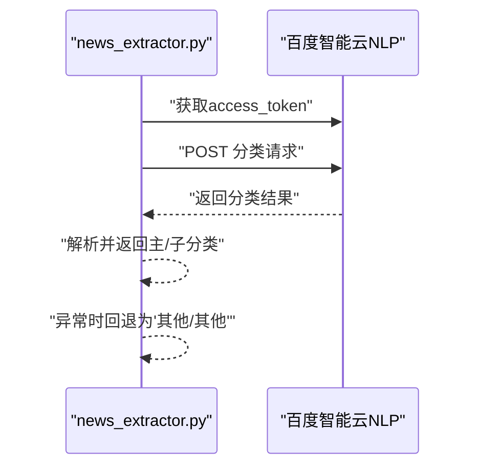
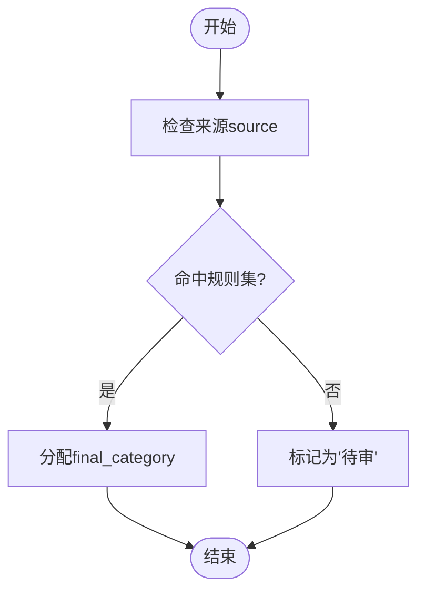
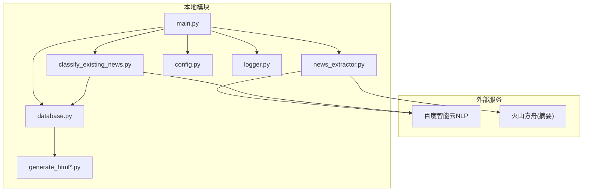

# 分类质量评估

<cite>
**本文引用的文件**
- [main.py](file://main.py)
- [news_extractor.py](file://news_extractor.py)
- [classify_existing_news.py](file://classify_existing_news.py)
- [database.py](file://database.py)
- [generate_html.py](file://generate_html.py)
- [generate_html_with_undecided.py](file://generate_html_with_undecided.py)
- [config.py](file://config.py)
- [logger.py](file://logger.py)
- [readme.MD](file://readme.MD)
- [requirements.txt](file://requirements.txt)
</cite>

## 目录
1. [简介](#简介)
2. [项目结构](#项目结构)
3. [核心组件](#核心组件)
4. [架构总览](#架构总览)
5. [详细组件分析](#详细组件分析)
6. [依赖分析](#依赖分析)
7. [性能考量](#性能考量)
8. [故障排查指南](#故障排查指南)
9. [结论](#结论)
10. [附录](#附录)

## 简介
本项目围绕“新闻采集与分类”构建，具备以下关键流程：
- 采集多来源新闻链接与内容
- 生成摘要
- 初步分类（百度智能云NLP）
- 最终人工复核/规则化分类
- 生成报告（HTML/PDF）

针对分类质量评估，项目已内置两类分类结果：初步分类（category/subcategory）与最终分类（final_category）。本文将基于现有代码与数据结构，系统阐述如何评估分类准确性与可靠性，包括指标计算、错误分析、稳定性与一致性监控、A/B测试与交叉验证思路，以及持续改进机制与工具方法论。

## 项目结构
项目采用分层设计：
- 入口与调度：main.py
- 抽取与分类：news_extractor.py（含摘要与分类接口）
- 分类补全与最终分类：classify_existing_news.py
- 数据存储：database.py（SQLite表结构）
- 报告生成：generate_html.py、generate_html_with_undecided.py
- 配置与日志：config.py、logger.py
- 依赖声明：requirements.txt
- 项目说明：readme.MD

图表来源
- [main.py:11-206](file://main.py#L11-L206)
- [news_extractor.py:21-893](file://news_extractor.py#L21-L893)
- [classify_existing_news.py:14-302](file://classify_existing_news.py#L14-L302)
- [database.py:5-92](file://database.py#L5-L92)
- [generate_html.py:1-81](file://generate_html.py#L1-L81)
- [generate_html_with_undecided.py:1-72](file://generate_html_with_undecided.py#L1-L72)
- [config.py:1-78](file://config.py#L1-L78)
- [logger.py:1-104](file://logger.py#L1-L104)

章节来源
- [main.py:11-206](file://main.py#L11-L206)
- [readme.MD:1-11](file://readme.MD#L1-L11)

## 核心组件
- 新闻抽取与分类器：负责渲染页面、提取链接与正文、生成摘要、调用百度智能云NLP进行初步分类，并支持在主流程中直接分类。
- 分类补全器：对数据库中category为空的条目进行批量分类，并基于规则生成final_category。
- 数据库：统一存储新闻元数据、摘要、初步分类与最终分类。
- 报告生成：按最终分类输出HTML/PDF，支持过滤“待审”条目。
- 配置与日志：集中管理信息源、关键词、超时、日志级别与输出。

章节来源
- [news_extractor.py:21-893](file://news_extractor.py#L21-L893)
- [classify_existing_news.py:14-302](file://classify_existing_news.py#L14-L302)
- [database.py:5-92](file://database.py#L5-L92)
- [generate_html.py:1-81](file://generate_html.py#L1-L81)
- [generate_html_with_undecided.py:1-72](file://generate_html_with_undecided.py#L1-L72)
- [config.py:1-78](file://config.py#L1-L78)
- [logger.py:1-104](file://logger.py#L1-L104)

## 架构总览
整体流程从入口开始，依次完成采集、过滤、摘要、分类、入库与报告生成。分类质量评估的关键在于对比“初步分类”与“最终分类”，并结合来源、作者等上下文信息进行归因与改进。

图表来源
- [main.py:11-206](file://main.py#L11-L206)
- [news_extractor.py:710-893](file://news_extractor.py#L710-L893)
- [classify_existing_news.py:237-302](file://classify_existing_news.py#L237-L302)
- [database.py:40-92](file://database.py#L40-L92)
- [generate_html.py:1-81](file://generate_html.py#L1-L81)
- [generate_html_with_undecided.py:1-72](file://generate_html_with_undecided.py#L1-L72)

## 详细组件分析

### 组件A：分类流程与数据模型
- 初步分类：由百度智能云NLP提供，返回主分类与子分类列表，存储于category与subcategory。
- 最终分类：由规则化逻辑生成，存储于final_category，用于报告与人工复核。
- 数据模型：news表包含title、author、publish_time、source、content、summary、url、category、subcategory、final_category、created_at等字段。

图表来源
- [database.py:20-38](file://database.py#L20-L38)

章节来源
- [database.py:20-38](file://database.py#L20-L38)
- [news_extractor.py:759-893](file://news_extractor.py#L759-L893)
- [classify_existing_news.py:64-235](file://classify_existing_news.py#L64-L235)

### 组件B：分类API调用与错误回退
- 百度智能云NLP分类API调用流程：获取access_token -> 组装请求 -> 发送POST -> 解析结果 -> 返回主/子分类。
- 错误处理：当API异常或无有效结果时，回退至“其他/其他”。

图表来源
- [news_extractor.py:764-893](file://news_extractor.py#L764-L893)

章节来源
- [news_extractor.py:764-893](file://news_extractor.py#L764-L893)

### 组件C：规则化最终分类
- 规则化逻辑：依据source、author、category、subcategory、title等字段，映射到固定类别集合（如“行业新闻”、“专家视点”、“高校动态”、“科技前沿”、“待审”等）。
- 该过程为分类质量评估提供了“人工校核/规则化”的基准。

图表来源
- [classify_existing_news.py:169-235](file://classify_existing_news.py#L169-L235)

章节来源
- [classify_existing_news.py:169-235](file://classify_existing_news.py#L169-L235)

### 组件D：报告与可视化
- 报告生成：按最终分类输出HTML/PDF，支持过滤“待审”条目。
- 该输出可用于人工抽样核查与质量评估。

章节来源
- [generate_html.py:1-81](file://generate_html.py#L1-L81)
- [generate_html_with_undecided.py:1-72](file://generate_html_with_undecided.py#L1-L72)

## 依赖分析
- 外部服务：百度智能云NLP（access_token与分类API）、火山方舟（摘要API）。
- 本地依赖：SQLite、Selenium、BeautifulSoup、Jinja2等。
- 配置与日志：通过config.py与logger.py集中管理。

图表来源
- [requirements.txt:1-10](file://requirements.txt#L1-L10)
- [news_extractor.py:764-893](file://news_extractor.py#L764-L893)
- [classify_existing_news.py:69-90](file://classify_existing_news.py#L69-L90)
- [main.py:11-206](file://main.py#L11-L206)
- [database.py:5-92](file://database.py#L5-L92)
- [generate_html.py:1-81](file://generate_html.py#L1-L81)
- [generate_html_with_undecided.py:1-72](file://generate_html_with_undecided.py#L1-L72)
- [config.py:1-78](file://config.py#L1-L78)
- [logger.py:1-104](file://logger.py#L1-L104)

章节来源
- [requirements.txt:1-10](file://requirements.txt#L1-L10)
- [config.py:1-78](file://config.py#L1-L78)
- [logger.py:1-104](file://logger.py#L1-L104)

## 性能考量
- API调用频率与限流：百度智能云NLP与火山方舟均有限额，需控制并发与速率。
- 网络与渲染：Selenium渲染页面耗时较长，建议合理设置超时与重试。
- 数据库写入：批量写入与事务提交需注意性能与一致性。
- 报告生成：HTML/PDF生成涉及模板渲染与PDF转换，建议在任务完成后异步执行。

[本节为通用建议，无需特定文件来源]

## 故障排查指南
- 分类API失败：检查access_token获取与请求参数，确认网络连通性与超时设置。
- 数据库写入失败：检查唯一约束冲突（title/url），查看日志定位异常。
- 报告生成异常：确认模板文件存在与编码一致，检查PDF转换依赖路径。
- 日志定位：使用logger模块按类别输出，结合日志文件定位问题。

章节来源
- [news_extractor.py:764-893](file://news_extractor.py#L764-L893)
- [database.py:40-92](file://database.py#L40-L92)
- [generate_html.py:1-81](file://generate_html.py#L1-L81)
- [generate_html_with_undecided.py:1-72](file://generate_html_with_undecided.py#L1-L72)
- [logger.py:1-104](file://logger.py#L1-L104)

## 结论
本项目已具备完整的分类闭环：采集、摘要、初步分类、规则化最终分类与报告输出。为实现分类质量评估，建议在现有基础上补充：
- 明确评估目标与指标体系（准确率、召回率、F1、稳定性、覆盖率、一致性）
- 建立抽样与标注流程，形成“人工标注”作为基准
- 对比初步分类与最终分类，统计错误类型与来源
- 基于来源、作者、关键词等维度进行分层分析
- 设计A/B测试与交叉验证方案，持续优化分类策略

[本节为总结性内容，无需特定文件来源]

## 附录

### A. 分类质量评估指标体系
- 准确率（Precision）：预测为正例且实际为正例的比例
- 召回率（Recall）：实际为正例且被预测为正例的比例
- F1分数：精确率与召回率的调和平均
- 稳定性：跨时间窗口分类分布的一致性（如周级/月级）
- 覆盖率：可分类样本占总样本的比例
- 一致性：不同来源/规则下分类的一致程度（Kappa系数等）

章节来源
- [classify_existing_news.py:169-235](file://classify_existing_news.py#L169-L235)
- [database.py:20-38](file://database.py#L20-L38)

### B. 分类错误识别与分析方法
- 误分类案例统计：按来源、作者、关键词、时间窗口统计错误分布
- 错误原因归类：API误判、规则边界、噪声内容、来源适配不足
- 可视化：热力图/柱状图展示错误类型与来源占比

章节来源
- [generate_html.py:1-81](file://generate_html.py#L1-L81)
- [generate_html_with_undecided.py:1-72](file://generate_html_with_undecided.py#L1-L72)

### C. A/B测试与交叉验证
- A/B测试：对同一来源的样本随机分为两组，一组沿用现有规则，另一组采用新规则，比较最终分类一致性与人工评分
- 交叉验证：按时间切片（如周/月）划分训练/验证集，评估模型/规则稳定性

章节来源
- [classify_existing_news.py:169-235](file://classify_existing_news.py#L169-L235)
- [config.py:1-78](file://config.py#L1-L78)

### D. 持续改进机制
- 定期抽样核查与标注，形成基线
- 建立分类错误追踪工单，按来源/规则维度复盘
- 优化规则与阈值，引入反馈回路
- 自动化报告与趋势监控

章节来源
- [generate_html.py:1-81](file://generate_html.py#L1-L81)
- [generate_html_with_undecided.py:1-72](file://generate_html_with_undecided.py#L1-L72)

### E. 工具与方法论清单
- 指标计算：使用pandas/NumPy进行混淆矩阵与指标计算
- 可视化：matplotlib/seaborn绘制分布与趋势
- 抽样策略：分层抽样（按来源/时间/关键词）
- 标注规范：制定统一标注指南与一致性校验

章节来源
- [requirements.txt:1-10](file://requirements.txt#L1-L10)