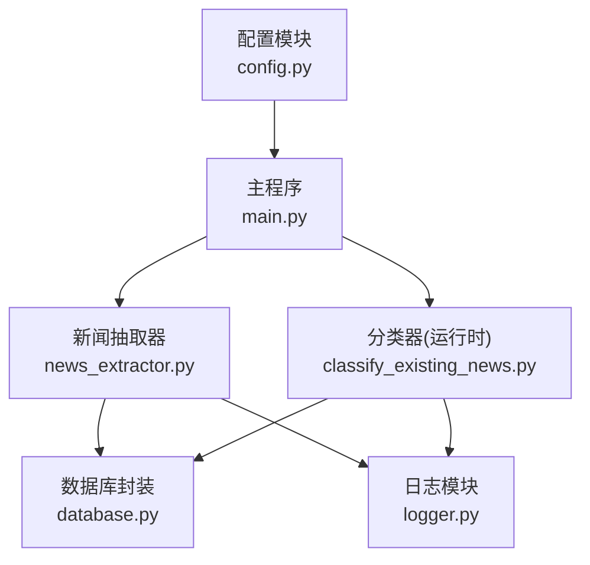
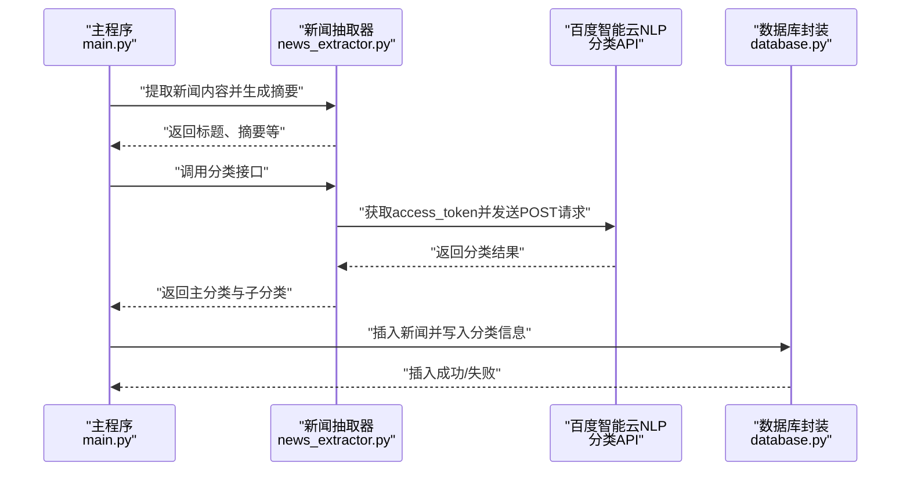
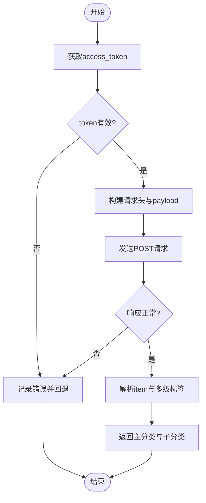
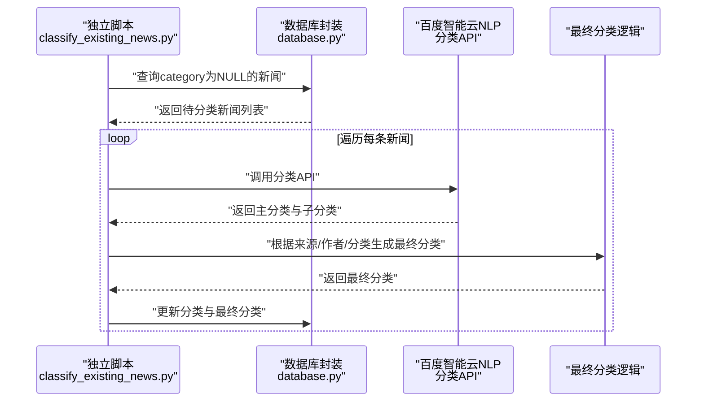
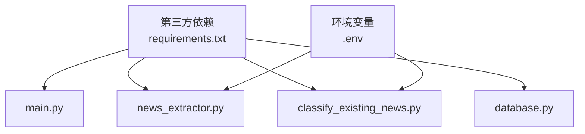

# 初步分类机制

<cite>
**本文档引用的文件**
- [config.py](file://config.py)
- [main.py](file://main.py)
- [news_extractor.py](file://news_extractor.py)
- [classify_existing_news.py](file://classify_existing_news.py)
- [database.py](file://database.py)
- [logger.py](file://logger.py)
- [check_db.py](file://check_db.py)
- [requirements.txt](file://requirements.txt)
- [readme.MD](file://readme.MD)
</cite>

## 目录
1. [简介](#简介)
2. [项目结构](#项目结构)
3. [核心组件](#核心组件)
4. [架构总览](#架构总览)
5. [详细组件分析](#详细组件分析)
6. [依赖关系分析](#依赖关系分析)
7. [性能考虑](#性能考虑)
8. [故障排查指南](#故障排查指南)
9. [结论](#结论)
10. [附录](#附录)

## 简介
本文件围绕“新闻初步分类机制”展开，重点说明如何使用百度智能云NLP服务对新闻进行初步分类。内容涵盖：
- 百度智能云NLP分类API的认证流程与请求参数配置
- 请求头设置、payload构建与响应结果解析
- 分类器实现原理（access token获取、文本预处理、API调用与结果提取）
- 错误处理机制与分类结果数据结构
- 如何将分类结果存储到SQLite数据库

## 项目结构
该项目采用分层设计：
- 配置层：集中管理新闻源、数据库路径、关键词过滤等配置
- 抽取层：负责网页渲染、链接提取、正文抽取与摘要生成
- 分类层：封装百度智能云NLP分类API调用与结果解析
- 数据层：封装SQLite数据库操作
- 日志层：统一日志输出与分类日志分类
- 入口与调度：主程序负责调度抽取、过滤、摘要与分类，并持久化结果

图表来源
- [main.py:11-206](file://main.py#L11-L206)
- [news_extractor.py:21-887](file://news_extractor.py#L21-L887)
- [classify_existing_news.py:64-302](file://classify_existing_news.py#L64-L302)
- [database.py:5-92](file://database.py#L5-L92)
- [config.py:1-78](file://config.py#L1-L78)
- [logger.py:1-104](file://logger.py#L1-L104)

章节来源
- [main.py:11-206](file://main.py#L11-L206)
- [config.py:1-78](file://config.py#L1-L78)
- [readme.MD:1-11](file://readme.MD#L1-L11)

## 核心组件
- 百度智能云NLP分类器（运行时）：封装access token获取、请求参数构造、API调用与结果解析
- 新闻抽取器：负责从网页中抽取标题、作者、发布时间、正文等，并生成摘要
- 数据库封装：提供新闻表的创建、插入、查询与更新
- 日志模块：按类别输出日志，便于问题定位
- 主程序：调度抽取、关键词过滤、摘要生成、分类与入库

章节来源
- [classify_existing_news.py:64-302](file://classify_existing_news.py#L64-L302)
- [news_extractor.py:21-887](file://news_extractor.py#L21-L887)
- [database.py:5-92](file://database.py#L5-L92)
- [logger.py:1-104](file://logger.py#L1-L104)

## 架构总览
整体流程分为两个阶段：
1) 实时分类阶段：在主程序中，抽取器先生成摘要，再调用百度智能云NLP分类API进行初步分类
2) 批量补充分类阶段：启动独立脚本，对数据库中尚未分类的新闻进行批量分类，并生成最终分类

图表来源
- [main.py:146-164](file://main.py#L146-L164)
- [news_extractor.py:753-887](file://news_extractor.py#L753-L887)
- [database.py:40-52](file://database.py#L40-L52)

## 详细组件分析

### 百度智能云NLP分类器（运行时）
- 认证流程
  - 通过client_credentials方式获取access_token，参数包含API Key与Secret Key
  - 对响应状态码与错误字段进行校验，失败时抛出异常并记录日志
- 请求参数配置
  - 请求URL：文本分类RPC端点
  - 请求头：Content-Type、Accept、User-Agent
  - 查询参数：access_token、charset
  - 请求体payload：包含title与content，均做长度截断
- 结果解析
  - 从响应中提取item节点，遍历lv1_tag_list、lv2_tag_list、lv3_tag_list，提取tag字段
  - 若无有效分类，则回退为默认值
- 错误处理
  - 对HTTP状态码非200、API返回错误码、编码解码失败等情况进行捕获与记录

图表来源
- [news_extractor.py:753-887](file://news_extractor.py#L753-L887)

章节来源
- [news_extractor.py:753-887](file://news_extractor.py#L753-L887)

### 百度智能云NLP分类器（独立脚本）
- 该脚本在数据库中查找category为NULL的新闻，逐条调用分类API并更新分类信息
- 同时提供最终分类逻辑，结合来源、作者、分类与子分类进行二次判定
- 通过dotenv加载API密钥，若未设置则直接报错退出

图表来源
- [classify_existing_news.py:237-302](file://classify_existing_news.py#L237-L302)
- [classify_existing_news.py:64-302](file://classify_existing_news.py#L64-L302)

章节来源
- [classify_existing_news.py:64-302](file://classify_existing_news.py#L64-L302)
- [classify_existing_news.py:237-302](file://classify_existing_news.py#L237-L302)

### 新闻抽取器与摘要生成
- 使用Selenium渲染动态页面，针对特定站点进行链接提取与正文抽取
- 生成摘要时优先调用火山方舟大模型API，失败则回退
- 提供分类接口，内部封装百度智能云NLP调用

章节来源
- [news_extractor.py:21-887](file://news_extractor.py#L21-L887)

### 数据库封装
- 表结构包含标题、作者、发布时间、来源、正文、摘要、URL、分类、子分类、最终分类与创建时间等字段
- 提供插入、查询、更新与去重约束（标题与URL唯一）

章节来源
- [database.py:20-52](file://database.py#L20-L52)

### 日志模块
- 支持按类别输出日志，便于区分分类、数据库、缓存等不同模块的日志
- 文件轮转与控制台输出并存

章节来源
- [logger.py:1-104](file://logger.py#L1-L104)

## 依赖关系分析
- 外部依赖：requests、selenium、BeautifulSoup、gne、openai、langchain、python-dotenv
- 内部模块：config、news_extractor、database、logger
- 环境变量：WENXIN_API_KEY、WENXIN_SECRET_KEY、ARK_API_KEY、wechat_cookie、wechat_querystring

图表来源
- [requirements.txt:1-9](file://requirements.txt#L1-L9)
- [news_extractor.py:27-39](file://news_extractor.py#L27-L39)
- [classify_existing_news.py:239-247](file://classify_existing_news.py#L239-L247)

章节来源
- [requirements.txt:1-9](file://requirements.txt#L1-L9)
- [news_extractor.py:27-39](file://news_extractor.py#L27-L39)
- [classify_existing_news.py:239-247](file://classify_existing_news.py#L239-L247)

## 性能考虑
- 请求限速：主程序在保存后sleep 1秒，避免请求过快
- 缓存机制：链接缓存采用有序字典，限制最大容量，避免重复抓取
- 文本截断：对title与content进行长度限制，减少API调用成本与响应体积
- 并发与超时：分类API设置合理超时，避免阻塞主线程

章节来源
- [main.py:173](file://main.py#L173)
- [news_extractor.py:807-810](file://news_extractor.py#L807-L810)

## 故障排查指南
- API密钥未设置
  - 现象：分类失败并记录错误
  - 处理：在.env中设置WENXIN_API_KEY与WENXIN_SECRET_KEY
- access_token获取失败
  - 现象：状态码非200或返回error字段
  - 处理：检查密钥有效性与网络连通性
- API响应异常
  - 现象：返回error_code或编码解码失败
  - 处理：查看日志中的错误消息，确认payload长度与字符集
- 数据库插入失败
  - 现象：标题或URL重复导致插入失败
  - 处理：检查去重约束与数据一致性

章节来源
- [news_extractor.py:768-789](file://news_extractor.py#L768-L789)
- [news_extractor.py:825-834](file://news_extractor.py#L825-L834)
- [database.py:40-52](file://database.py#L40-L52)
- [logger.py:74-104](file://logger.py#L74-L104)

## 结论
本项目通过“抽取-过滤-摘要-分类-入库”的流水线实现了新闻初步分类机制。百度智能云NLP分类API在本系统中承担初步分类职责，配合独立脚本完成批量补分与最终分类。通过严格的错误处理、日志记录与数据库约束，系统具备较好的稳定性与可维护性。

## 附录

### 分类结果数据结构与字段含义
- 主分类（category）：来自百度智能云NLP的一级标签
- 子分类（subcategory）：来自百度智能云NLP的二级与三级标签集合，以逗号分隔
- 最终分类（final_category）：结合来源、作者与分类结果生成的最终分类

章节来源
- [classify_existing_news.py:39-58](file://classify_existing_news.py#L39-L58)
- [database.py:20-38](file://database.py#L20-L38)

### 如何调用百度智能云NLP分类API（步骤说明）
- 步骤1：准备API密钥
  - 在.env中设置WENXIN_API_KEY与WENXIN_SECRET_KEY
- 步骤2：获取access_token
  - 使用client_credentials方式请求授权
- 步骤3：构造请求
  - URL：文本分类RPC端点
  - 头部：Content-Type、Accept、User-Agent
  - 参数：access_token、charset
  - 载荷：title、content（均做长度截断）
- 步骤4：发送请求并解析结果
  - 从item中提取lv1/lv2/lv3标签
  - 若无有效标签，回退为默认值
- 步骤5：错误处理
  - 捕获HTTP状态码、API错误码与编码异常
- 步骤6：存储结果
  - 将分类信息写入数据库对应字段

章节来源
- [news_extractor.py:753-887](file://news_extractor.py#L753-L887)
- [classify_existing_news.py:92-168](file://classify_existing_news.py#L92-L168)
- [database.py:40-52](file://database.py#L40-L52)