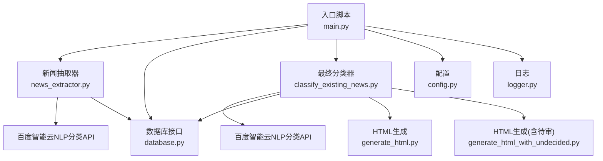
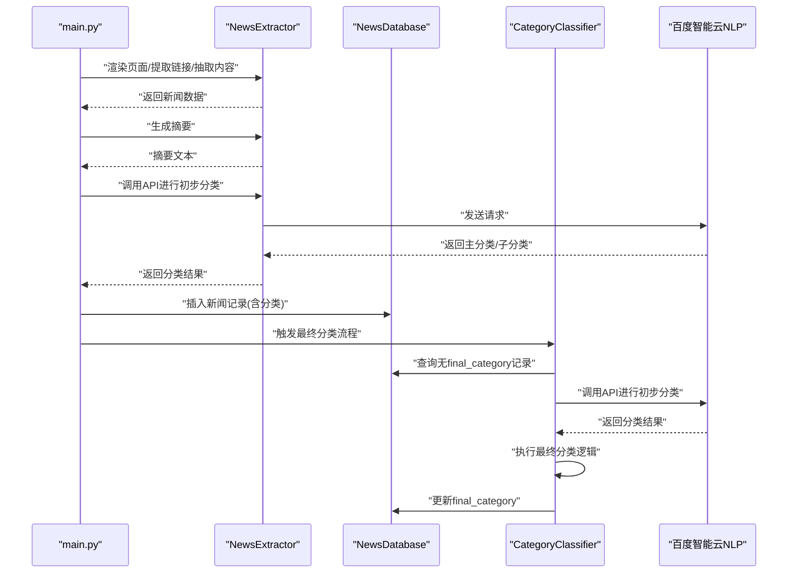
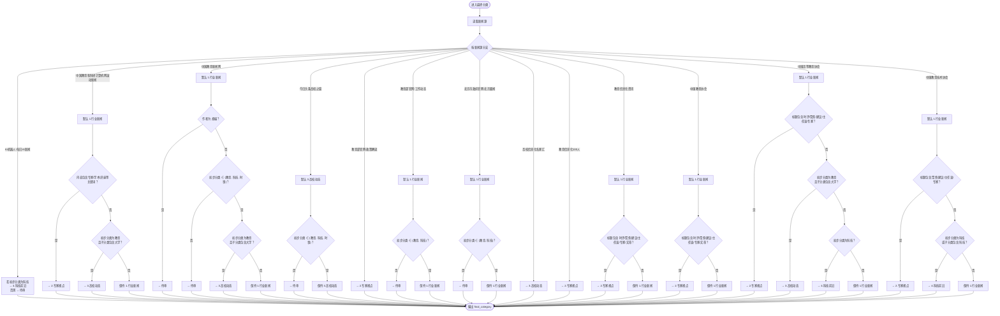
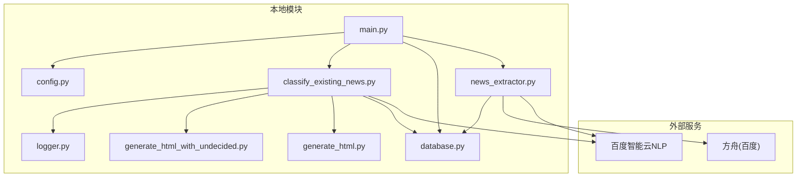

# 最终分类算法

<cite>
**本文引用的文件**
- [main.py](file://main.py)
- [classify_existing_news.py](file://classify_existing_news.py)
- [news_extractor.py](file://news_extractor.py)
- [config.py](file://config.py)
- [database.py](file://database.py)
- [generate_html.py](file://generate_html.py)
- [generate_html_with_undecided.py](file://generate_html_with_undecided.py)
- [logger.py](file://logger.py)
- [check_db.py](file://check_db.py)
- [requirements.txt](file://requirements.txt)
</cite>

## 目录
1. [简介](#简介)
2. [项目结构](#项目结构)
3. [核心组件](#核心组件)
4. [架构总览](#架构总览)
5. [详细组件分析](#详细组件分析)
6. [依赖分析](#依赖分析)
7. [性能考虑](#性能考虑)
8. [故障排除指南](#故障排除指南)
9. [结论](#结论)
10. [附录](#附录)

## 简介
本文件系统性阐述“最终分类算法”的实现与运行机制，重点解释基于多因素综合判断的最终分类逻辑，涵盖新闻源、作者、标题关键词、内容特征等多个维度的权重计算与决策规则。文档还详细说明各类新闻源的特定分类策略（如“中国教育和科研计算机网滚动新闻”、“教育部官网”等），并提供具体分类条件判断示例、异常处理与边界情况处理方法，以及分类结果的优先级排序与冲突解决机制。

## 项目结构
该项目采用分层设计：
- 入口与调度：main.py 负责抓取、预筛选、摘要生成与初步分类，并在完成后触发最终分类流程。
- 抽取与预处理：news_extractor.py 负责网页渲染、链接提取、内容抽取、摘要生成与初步分类。
- 分类与持久化：classify_existing_news.py 负责调用外部API进行初步分类，并执行最终分类；database.py 提供数据库访问与更新。
- 配置与输出：config.py 定义新闻源清单与筛选关键词；generate_html.py 与 generate_html_with_undecided.py 负责生成报告与PDF。
- 日志与工具：logger.py 提供统一日志；check_db.py 用于数据库结构检查；requirements.txt 列出依赖。

图表来源
- [main.py:11-206](file://main.py#L11-L206)
- [news_extractor.py:21-893](file://news_extractor.py#L21-L893)
- [classify_existing_news.py:14-302](file://classify_existing_news.py#L14-L302)
- [database.py:5-92](file://database.py#L5-L92)
- [config.py:1-78](file://config.py#L1-L78)
- [generate_html.py:1-81](file://generate_html.py#L1-L81)
- [generate_html_with_undecided.py:1-72](file://generate_html_with_undecided.py#L1-L72)
- [logger.py:1-104](file://logger.py#L1-L104)

章节来源
- [main.py:11-206](file://main.py#L11-L206)
- [config.py:1-78](file://config.py#L1-L78)

## 核心组件
- 新闻抽取器（NewsExtractor）：负责渲染网页、提取链接、抽取正文、生成摘要、调用百度智能云NLP进行初步分类。
- 最终分类器（CategoryClassifier）：在已有初步分类基础上，结合新闻源、作者、标题关键词与内容特征，执行最终分类。
- 数据库接口（NewsDatabase）：提供新闻数据的增删改查、唯一性校验与最终分类更新。
- 配置（config.py）：定义新闻源清单、筛选关键词、数据库路径、Selenium超时等。
- HTML生成：根据最终分类结果生成报告与PDF。

章节来源
- [news_extractor.py:21-893](file://news_extractor.py#L21-L893)
- [classify_existing_news.py:64-302](file://classify_existing_news.py#L64-L302)
- [database.py:5-92](file://database.py#L5-L92)
- [config.py:1-78](file://config.py#L1-L78)

## 架构总览
整体流程分为两阶段：
- 预处理与初步分类：main.py 调用 NewsExtractor 抓取页面、抽取内容、生成摘要，并通过百度智能云NLP进行初步分类，写入数据库。
- 最终分类：classify_existing_news.py 读取数据库中尚未有 final_category 的记录，先调用百度智能云NLP进行初步分类，再执行最终分类逻辑，更新 final_category。

图表来源
- [main.py:101-164](file://main.py#L101-L164)
- [news_extractor.py:759-893](file://news_extractor.py#L759-L893)
- [classify_existing_news.py:237-302](file://classify_existing_news.py#L237-L302)
- [database.py:40-92](file://database.py#L40-L92)

## 详细组件分析

### 组件一：最终分类器（CategoryClassifier.final_classify）
最终分类的核心逻辑位于 CategoryClassifier.final_classify 方法中，其输入包括标题、摘要、初步分类（主分类与子分类）、来源与作者。该方法根据新闻源进行分支判断，并结合标题关键词与内容特征进行细化，最终输出 final_category。

- 分支策略（按新闻源）：
  - Ai机器人-每日AI新闻：若初步分类为“科技”，则归为“4.科技前沿”，否则退回“待审”。
  - 中国教育和科研计算机网滚动新闻：默认“1.行业新闻”，若内容包含特定关键词则归为“2.专家视点”，若初步分类为“教育”且子分类包含“大学”则归为“3.高校动态”。
  - 中国教育新闻网：默认“1.行业新闻”，若作者为“胡编”或初步分类不在“教育/科技/时事”范围内则退回“待审”，若初步分类为“教育”且子分类包含“大学”则归为“3.高校动态”。
  - 今日头条高校之窗：默认“3.高校动态”，若初步分类不在“教育/科技/时事”范围内则退回“待审”。
  - 教育部官网-政策解读：固定为“2.专家视点”。
  - 教育部官网-工作动态：默认“1.行业新闻”，若初步分类不在“教育/科技”范围内则退回“待审”。
  - 北京市政府官网-北京要闻：默认“1.行业新闻”，若初步分类不在“教育/科技”范围内则退回“待审”。
  - 高校信息化名家汇：固定为“3.高校动态”。
  - 教育信息化100人：固定为“2.专家视点”。
  - 教育信息化资讯：默认“1.行业新闻”，若标题包含特定关键词则归为“2.专家视点”。
  - 中国教育协会：默认“1.行业新闻”，若标题包含特定关键词则归为“2.专家视点”。
  - 中国高等教育协会：默认“1.行业新闻”，若标题包含特定关键词则归为“2.专家视点”，若初步分类为“教育”且子分类包含“大学”则归为“3.高校动态”，若初步分类为“科技”则归为“4.科技前沿”。
  - 中国教育技术协会：默认“1.行业新闻”，若标题包含特定关键词则归为“2.专家视点”，若初步分类为“科技”或子分类包含“科技”则归为“4.科技前沿”。

- 决策规则与权重：
  - 新闻源优先级最高，决定初始类别与可接受范围。
  - 标题关键词用于识别专家评论、时评、聚焦、建议等倾向，提升至“2.专家视点”。
  - 内容关键词用于识别“本文”“主任谈”“观点”“专家”“学术”“讲座”等，提升至“2.专家视点”。
  - 子分类包含“大学”或初步分类为“教育”时，归为“3.高校动态”。
  - 初步分类为“科技”或子分类包含“科技”时，归为“4.科技前沿”。

- 冲突解决与回退：
  - 若初步分类超出新闻源允许范围，则退回“待审”。
  - 若无法确定，则退回“待审”，交由人工复核。

图表来源
- [classify_existing_news.py:169-235](file://classify_existing_news.py#L169-L235)

章节来源
- [classify_existing_news.py:64-302](file://classify_existing_news.py#L64-L302)

### 组件二：新闻抽取器（NewsExtractor）
- 渲染与链接提取：支持多种网站的特殊处理（如教育部、今日头条、edu.cn、ai-bot.cn、beijing.gov.cn、北外网站等），并提供通用链接过滤规则（排除CSS/JS/PDF等非新闻链接，保留包含关键词或日期模式或较长的HTML链接）。
- 内容抽取：使用 GeneralNewsExtractor 并规避误删问题，确保正文提取稳定。
- 摘要生成：优先使用方舟（百度）摘要API，失败时回退为空字符串。
- 初步分类：调用百度智能云NLP分类API，返回主分类与子分类，失败时回退为“其他/其他”。

章节来源
- [news_extractor.py:180-750](file://news_extractor.py#L180-L750)
- [news_extractor.py:759-893](file://news_extractor.py#L759-L893)

### 组件三：数据库接口（NewsDatabase）
- 表结构：包含标题唯一约束、URL唯一约束、分类字段与最终分类字段。
- 查询与更新：提供获取无分类/无最终分类记录、更新分类与最终分类等功能。
- 唯一性校验：插入时使用 OR IGNORE，避免重复。

章节来源
- [database.py:20-92](file://database.py#L20-L92)

### 组件四：入口与调度（main.py）
- 抓取流程：遍历 NEWS_SOURCES，渲染页面，提取链接，逐条抓取新闻内容，生成摘要，调用API进行初步分类，写入数据库。
- 预筛选：基于关键词与发布时间窗口进行过滤，减少后续分类压力。
- 触发最终分类：在抓取完成后调用 classify_existing_news.main()。

章节来源
- [main.py:11-206](file://main.py#L11-L206)
- [config.py:1-78](file://config.py#L1-L78)

### 组件五：HTML生成与报告
- generate_html.py：仅输出 final_category 非“待审”的新闻，按发布时间排序，生成HTML与PDF。
- generate_html_with_undecided.py：输出全部新闻（含“待审”），用于人工复核。

章节来源
- [generate_html.py:1-81](file://generate_html.py#L1-L81)
- [generate_html_with_undecided.py:1-72](file://generate_html_with_undecided.py#L1-L72)

## 依赖分析
- 外部API：百度智能云NLP（分类与摘要）、方舟（摘要）。
- 第三方库：selenium、GeneralNewsExtractor、requests、beautifulsoup4、lxml、webdriver-manager、python-dotenv、openai、jinja2。
- 数据存储：SQLite（news.db）。

图表来源
- [requirements.txt:1-10](file://requirements.txt#L1-L10)
- [main.py:11-206](file://main.py#L11-L206)
- [news_extractor.py:759-893](file://news_extractor.py#L759-L893)
- [classify_existing_news.py:237-302](file://classify_existing_news.py#L237-L302)
- [database.py:5-92](file://database.py#L5-L92)
- [config.py:1-78](file://config.py#L1-L78)
- [generate_html.py:1-81](file://generate_html.py#L1-L81)
- [generate_html_with_undecided.py:1-72](file://generate_html_with_undecided.py#L1-L72)
- [logger.py:1-104](file://logger.py#L1-L104)

## 性能考虑
- 并发与限速：抓取过程中对每个链接间隔1秒，避免请求过快导致被封禁或API限流。
- 缓存：使用 link_cache.json 缓存已处理链接，避免重复抓取，提高吞吐量。
- 页面渲染：针对特定站点（如今日头条）增加等待时间，确保动态内容加载完成。
- 摘要与分类：摘要长度与分类输入长度限制，降低API调用成本与延迟。
- 数据库写入：使用 OR IGNORE 避免重复插入，减少冲突与回滚开销。

章节来源
- [main.py:173-196](file://main.py#L173-L196)
- [news_extractor.py:180-206](file://news_extractor.py#L180-L206)
- [news_extractor.py:710-750](file://news_extractor.py#L710-L750)
- [news_extractor.py:759-893](file://news_extractor.py#L759-L893)

## 故障排除指南
- API密钥缺失：百度智能云NLP与方舟摘要均需配置环境变量，若未设置会触发错误日志并回退分类。
- 页面渲染失败：selenium 超时或反爬虫检测导致页面加载失败，需检查ChromeDriver版本与反检测参数。
- 链接提取异常：部分站点结构变化导致链接提取失败，需检查对应站点的特殊处理逻辑。
- 数据库异常：唯一键冲突或编码问题，检查表结构与插入语句。
- 日志定位：使用 logger 模块输出详细日志，按分类（info/debug/error/warning）区分问题类型。

章节来源
- [classify_existing_news.py:246-253](file://classify_existing_news.py#L246-L253)
- [news_extractor.py:43-77](file://news_extractor.py#L43-L77)
- [news_extractor.py:208-684](file://news_extractor.py#L208-L684)
- [database.py:40-52](file://database.py#L40-L52)
- [logger.py:58-104](file://logger.py#L58-L104)

## 结论
最终分类算法通过“新闻源优先、关键词辅助、内容特征细化”的多因素综合判断，实现了对教育信息化领域新闻的自动化分类。其规则清晰、可扩展性强，能够有效处理不同来源、不同风格的新闻内容，并在必要时退回“待审”交由人工复核，确保分类质量与一致性。

## 附录
- 新闻源清单与筛选关键词见配置文件。
- 数据库结构与字段说明见数据库接口。
- 报告生成与PDF导出见HTML生成脚本。

章节来源
- [config.py:1-78](file://config.py#L1-L78)
- [database.py:20-38](file://database.py#L20-L38)
- [generate_html.py:1-81](file://generate_html.py#L1-L81)
- [generate_html_with_undecided.py:1-72](file://generate_html_with_undecided.py#L1-L72)