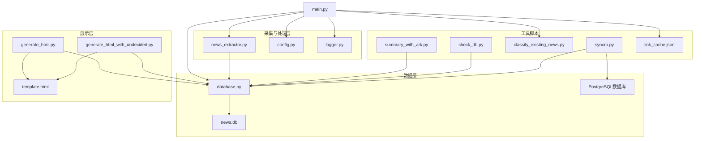
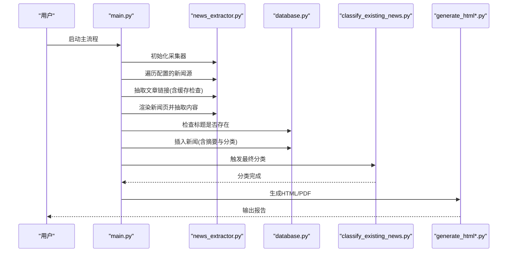
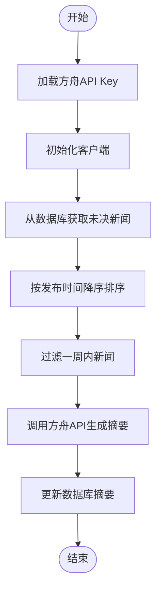
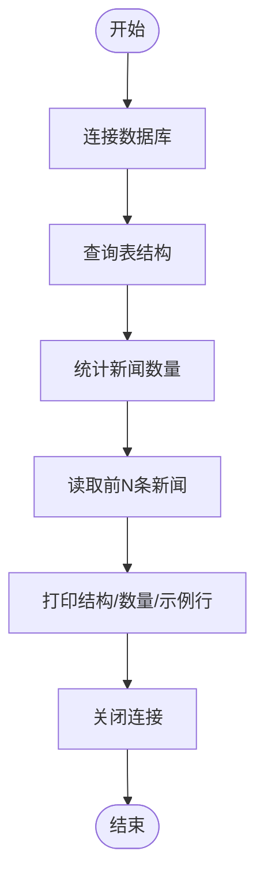
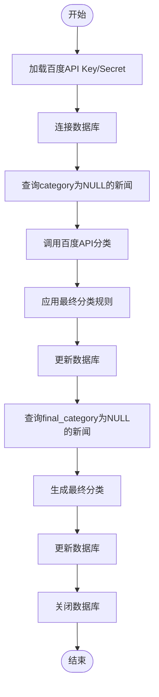
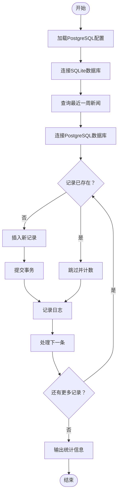
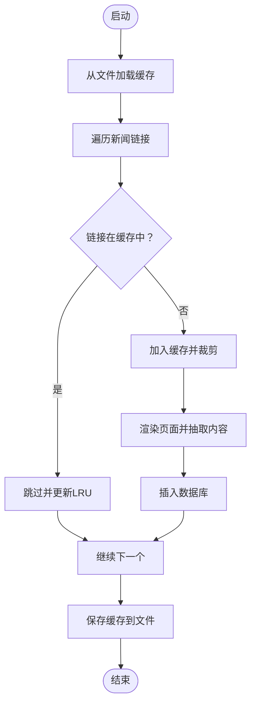
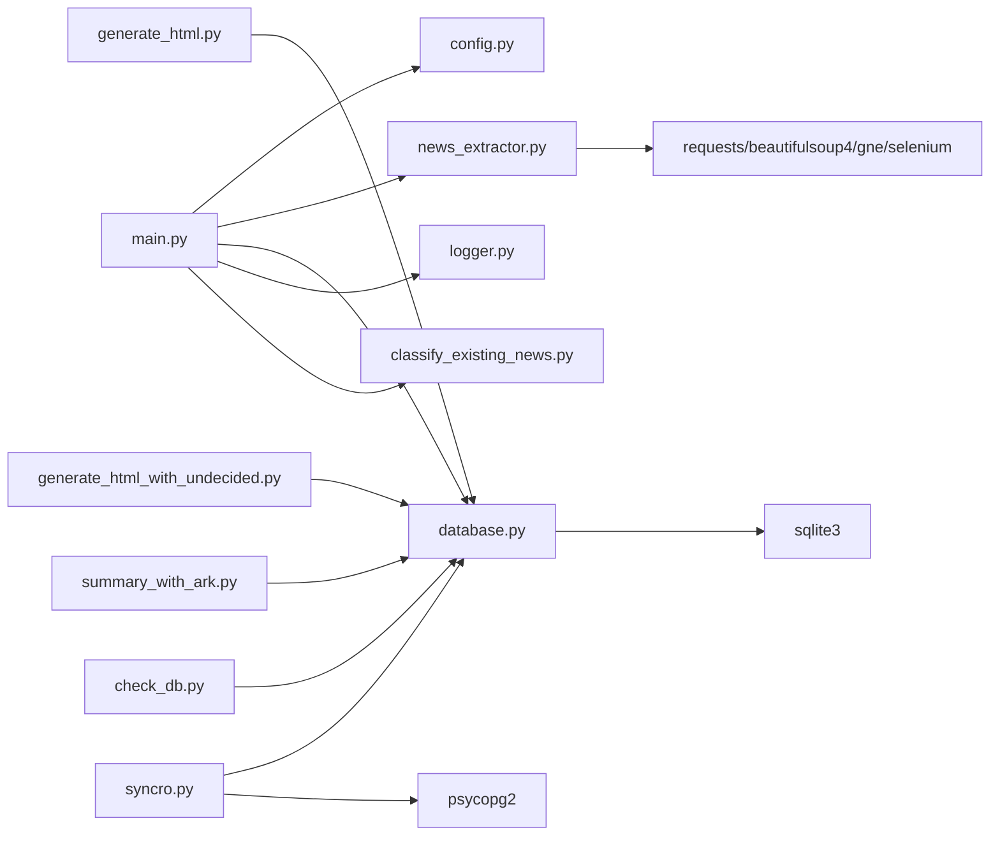

# 工具脚本说明

<cite>
**本文引用的文件**
- [check_db.py](file://check_db.py)
- [summary_with_ark.py](file://summary_with_ark.py)
- [classify_existing_news.py](file://classify_existing_news.py)
- [syncro.py](file://syncro.py)
- [link_cache.json](file://link_cache.json)
- [config.py](file://config.py)
- [database.py](file://database.py)
- [main.py](file://main.py)
- [news_extractor.py](file://news_extractor.py)
- [logger.py](file://logger.py)
- [generate_html.py](file://generate_html.py)
- [generate_html_with_undecided.py](file://generate_html_with_undecided.py)
- [readme.MD](file://readme.MD)
- [requirements.txt](file://requirements.txt)
</cite>

## 目录
1. [简介](#简介)
2. [项目结构](#项目结构)
3. [核心组件](#核心组件)
4. [架构总览](#架构总览)
5. [详细组件分析](#详细组件分析)
6. [依赖关系分析](#依赖关系分析)
7. [性能与稳定性考虑](#性能与稳定性考虑)
8. [故障排查指南](#故障排查指南)
9. [结论](#结论)
10. [附录](#附录)

## 简介
本项目围绕"新闻采集—摘要—分类—展示"的完整流水线，提供多类工具脚本，覆盖数据采集、摘要生成、分类处理、数据库检查与HTML/PDF报告生成。本文档聚焦以下五个工具脚本：
- AI摘要工具：summary_with_ark.py
- 数据库检查工具：check_db.py
- 现有新闻分类工具：classify_existing_news.py
- 数据同步工具：syncro.py（新增）
- 链接缓存管理：link_cache.json

同时，本文将解释这些工具在系统中的作用、相互关系、使用场景、参数配置、执行流程、常见问题与最佳实践。

## 项目结构
项目采用"脚本化工具 + 配置 + 数据库 + 模板"的组织方式，核心文件如下：
- 配置与常量：config.py
- 数据库封装：database.py
- 日志模块：logger.py
- 主流程调度：main.py
- 新闻采集与处理：news_extractor.py
- HTML生成：generate_html.py、generate_html_with_undecided.py
- 工具脚本：check_db.py、summary_with_ark.py、classify_existing_news.py、syncro.py
- 链接缓存：link_cache.json
- 依赖声明：requirements.txt
- 项目说明：readme.MD

**图表来源**
- [main.py:1-206](file://main.py#L1-L206)
- [news_extractor.py:1-887](file://news_extractor.py#L1-L887)
- [database.py:1-92](file://database.py#L1-L92)
- [generate_html.py:1-81](file://generate_html.py#L1-L81)
- [generate_html_with_undecided.py:1-72](file://generate_html_with_undecided.py#L1-L72)
- [check_db.py:1-32](file://check_db.py#L1-L32)
- [summary_with_ark.py:1-60](file://summary_with_ark.py#L1-L60)
- [classify_existing_news.py:1-302](file://classify_existing_news.py#L1-L302)
- [syncro.py:1-151](file://syncro.py#L1-L151)
- [link_cache.json:1-563](file://link_cache.json#L1-L563)

**章节来源**
- [main.py:1-206](file://main.py#L1-L206)
- [config.py:1-78](file://config.py#L1-L78)
- [database.py:1-92](file://database.py#L1-L92)
- [news_extractor.py:1-887](file://news_extractor.py#L1-L887)
- [generate_html.py:1-81](file://generate_html.py#L1-L81)
- [generate_html_with_undecided.py:1-72](file://generate_html_with_undecided.py#L1-L72)
- [check_db.py:1-32](file://check_db.py#L1-L32)
- [summary_with_ark.py:1-60](file://summary_with_ark.py#L1-L60)
- [classify_existing_news.py:1-302](file://classify_existing_news.py#L1-L302)
- [syncro.py:1-151](file://syncro.py#L1-L151)
- [link_cache.json:1-563](file://link_cache.json#L1-L563)

## 核心组件
- 配置模块：集中管理新闻来源、数据库路径、Selenium超时、提取超时、筛选关键词等。
- 数据库封装：统一创建表、插入新闻、查询、更新摘要、检查标题是否存在等。
- 日志模块：按类别输出到文件与控制台，支持轮转。
- 新闻采集器：封装Selenium渲染、BeautifulSoup解析、链接提取、内容抽取、摘要与分类API调用。
- HTML生成器：基于模板渲染新闻列表，生成HTML并导出PDF。
- 工具脚本：独立运行的辅助工具，分别用于数据库检查、AI摘要生成、现有新闻分类、数据同步、链接缓存维护。

**章节来源**
- [config.py:1-78](file://config.py#L1-L78)
- [database.py:1-92](file://database.py#L1-L92)
- [logger.py:1-104](file://logger.py#L1-L104)
- [news_extractor.py:1-887](file://news_extractor.py#L1-L887)
- [generate_html.py:1-81](file://generate_html.py#L1-L81)
- [generate_html_with_undecided.py:1-72](file://generate_html_with_undecided.py#L1-L72)

## 架构总览
系统以main.py为主入口，负责：
- 初始化数据库与采集器
- 从配置的新闻源抓取链接
- 基于链接缓存避免重复处理
- 过滤关键词与时间窗口
- 生成摘要与分类
- 插入数据库
- 结束后触发分类工具脚本进行最终分类
- 最终生成HTML/PDF报告

**图表来源**
- [main.py:1-206](file://main.py#L1-L206)
- [news_extractor.py:1-887](file://news_extractor.py#L1-L887)
- [database.py:1-92](file://database.py#L1-L92)
- [generate_html.py:1-81](file://generate_html.py#L1-L81)
- [generate_html_with_undecided.py:1-72](file://generate_html_with_undecided.py#L1-L72)

## 详细组件分析

### AI摘要工具：summary_with_ark.py
用途
- 对数据库中"未决"新闻（按发布时间排序）调用方舟大模型API生成摘要，并回写数据库。

输入输出
- 输入：数据库中满足时间窗口的新闻列表（通过数据库接口获取）
- 输出：为每条新闻生成摘要并更新数据库对应记录

执行流程
- 从环境变量加载方舟API Key
- 初始化OpenAI兼容客户端（base_url指向方舟）
- 从数据库获取未决新闻并按发布时间降序
- 过滤发布时间早于一周的新闻
- 调用API生成摘要，更新数据库

**图表来源**
- [summary_with_ark.py:1-60](file://summary_with_ark.py#L1-L60)
- [database.py:61-67](file://database.py#L61-L67)

使用场景
- 需要为数据库中尚未生成摘要的新闻批量生成摘要时
- 与main.py配合，在采集完成后补充摘要

参数与配置
- 环境变量：方舟API Key（用于初始化客户端）
- 数据库接口：获取未决新闻、更新摘要

执行示例
- 在命令行中直接运行脚本，会自动从数据库读取数据并生成摘要

常见问题
- API Key未配置：需在环境变量中设置
- 时间解析异常：脚本会跳过无法解析时间的新闻
- 摘要为空：若API返回空摘要，脚本不会更新数据库

最佳实践
- 先在数据库中确认新闻已入库再运行此脚本
- 控制并发与频率，避免API限流
- 定期清理过期新闻，减少处理量

**章节来源**
- [summary_with_ark.py:1-60](file://summary_with_ark.py#L1-L60)
- [database.py:61-67](file://database.py#L61-L67)

### 数据库检查工具：check_db.py
用途
- 快速检查news.db的表结构、记录数量、前若干条记录，便于快速验证数据库状态

执行流程
- 连接SQLite数据库
- 查询表结构（PRAGMA table_info)
- 统计新闻总数
- 读取前若干条新闻并打印关键字段

**图表来源**
- [check_db.py:1-32](file://check_db.py#L1-L32)

使用场景
- 初次运行或怀疑数据库异常时，快速确认表结构与数据量
- 验证main.py是否成功插入数据

参数与配置
- 无需额外参数，直接连接默认数据库文件

执行示例
- python check_db.py

常见问题
- 数据库文件不存在：需先运行main.py完成初始化
- 表未创建：需先确保数据库初始化逻辑执行

最佳实践
- 与数据库封装模块配合，确认表结构一致
- 定期运行以监控数据增长趋势

**章节来源**
- [check_db.py:1-32](file://check_db.py#L1-L32)
- [database.py:20-38](file://database.py#L20-L38)

### 现有新闻分类工具：classify_existing_news.py
用途
- 对数据库中category或final_category为空的新闻进行分类与最终分类标注，支持百度智能云NLP分类API与自定义规则

输入输出
- 输入：数据库中category为NULL或final_category为NULL的新闻集合
- 输出：更新数据库中的category/subcategory或final_category字段

执行流程
- 从环境变量加载百度API Key与Secret Key
- 连接数据库，查询待分类新闻
- 调用百度智能云NLP分类API获取主/子分类
- 应用自定义规则生成最终分类
- 更新数据库并记录日志

**图表来源**
- [classify_existing_news.py:1-302](file://classify_existing_news.py#L1-L302)
- [database.py:28-58](file://database.py#L28-L58)

使用场景
- 采集完成后，批量补充分类信息
- 需要人工复核与校正时，先生成初分类，再进行人工干预

参数与配置
- 环境变量：WENXIN_API_KEY、WENXIN_SECRET_KEY
- 数据库接口：查询、更新分类

执行示例
- python classify_existing_news.py

常见问题
- API Key未配置：需在环境变量中设置
- API调用失败：检查网络与Key有效性
- 自定义规则匹配不到：根据实际来源扩展规则

最佳实践
- 先运行分类，再运行最终分类，确保两阶段逻辑清晰
- 对异常来源或特殊标题，预留兜底规则
- 定期维护规则，提升自动化准确率

**章节来源**
- [classify_existing_news.py:1-302](file://classify_existing_news.py#L1-L302)
- [database.py:28-58](file://database.py#L28-L58)

### 数据同步工具：syncro.py（新增）
用途
- 将SQLite数据库中最近一周的新闻数据同步到PostgreSQL数据库，实现双数据库间的实时数据流

输入输出
- 输入：SQLite news表中最近一周且final_category不为'大模型排除'或'待审'的新闻记录
- 输出：PostgreSQL news_ts表中对应的新闻数据，避免重复同步

执行流程
- 从环境变量加载PostgreSQL连接配置
- 连接SQLite数据库，查询最近一周的新闻数据
- 连接PostgreSQL数据库，检查记录是否已存在
- 对不存在的记录执行插入操作
- 记录同步统计信息

**图表来源**
- [syncro.py:1-151](file://syncro.py#L1-L151)

使用场景
- 需要在多个数据库间共享新闻数据时
- 需要将SQLite数据迁移到PostgreSQL时
- 实现数据备份与冗余存储

参数与配置
- PostgreSQL连接配置：主机、端口、数据库名、用户名、密码
- SQLite数据库路径：news.db文件
- 时间窗口：默认最近7天
- 过滤条件：final_category不为'大模型排除'或'待审'

执行示例
- python syncro.py

常见问题
- PostgreSQL连接失败：检查主机、端口、认证信息
- SQLite数据库不存在：确保news.db文件存在
- 数据类型不匹配：脚本会自动处理日期时间格式
- 重复数据：脚本会基于created_at字段检查重复

最佳实践
- 定期运行同步任务，保持数据一致性
- 监控同步进度和错误日志
- 在业务低峰期执行大批量同步
- 建立数据同步的监控告警机制

**章节来源**
- [syncro.py:1-151](file://syncro.py#L1-L151)

### 链接缓存管理：link_cache.json
用途
- 记录已处理过的新闻链接，避免重复抓取与处理，提高效率

工作机制
- main.py启动时从link_cache.json加载缓存，使用有序字典维护最近使用顺序
- 处理新链接时，若已在缓存中则跳过；否则加入缓存并维持最大容量
- 程序结束时将缓存写回文件

**图表来源**
- [main.py:19-195](file://main.py#L19-L195)
- [link_cache.json:1-563](file://link_cache.json#L1-L563)

使用场景
- 长时间运行的采集任务，避免重复抓取同一链接
- 与其他工具脚本配合，统一去重策略

参数与配置
- 缓存文件：link_cache.json
- 最大缓存容量：2000
- 缓存结构：有序列表（保持最近使用顺序）

执行示例
- 直接运行main.py即可自动维护缓存
- 可手动编辑link_cache.json进行维护（谨慎操作）

常见问题
- 缓存过大：程序会自动裁剪最旧项
- 缓存损坏：程序会捕获异常并重新初始化缓存
- 缓存失效：可删除文件后重新生成

最佳实践
- 定期备份link_cache.json
- 在网络波动或站点改版后，可清空缓存以避免误判
- 与采集策略结合，合理设置最大容量

**章节来源**
- [main.py:19-195](file://main.py#L19-L195)
- [link_cache.json:1-563](file://link_cache.json#L1-L563)

## 依赖关系分析
- main.py依赖config.py、news_extractor.py、database.py、logger.py，并在最后触发classify_existing_news.py
- news_extractor.py依赖requests、beautifulsoup4、gne、selenium、dotenv等
- database.py依赖sqlite3与logger
- generate_html*.py依赖database.py与jinja2模板
- 工具脚本（check_db.py、summary_with_ark.py、classify_existing_news.py、syncro.py）各自独立运行
- syncro.py额外依赖psycopg2用于PostgreSQL连接

**图表来源**
- [main.py:1-206](file://main.py#L1-L206)
- [news_extractor.py:1-887](file://news_extractor.py#L1-L887)
- [database.py:1-92](file://database.py#L1-L92)
- [generate_html.py:1-81](file://generate_html.py#L1-L81)
- [generate_html_with_undecided.py:1-72](file://generate_html_with_undecided.py#L1-L72)
- [check_db.py:1-32](file://check_db.py#L1-L32)
- [summary_with_ark.py:1-60](file://summary_with_ark.py#L1-L60)
- [classify_existing_news.py:1-302](file://classify_existing_news.py#L1-L302)
- [syncro.py:1-151](file://syncro.py#L1-L151)

**章节来源**
- [main.py:1-206](file://main.py#L1-L206)
- [news_extractor.py:1-887](file://news_extractor.py#L1-L887)
- [database.py:1-92](file://database.py#L1-L92)
- [generate_html.py:1-81](file://generate_html.py#L1-L81)
- [generate_html_with_undecided.py:1-72](file://generate_html_with_undecided.py#L1-L72)
- [check_db.py:1-32](file://check_db.py#L1-L32)
- [summary_with_ark.py:1-60](file://summary_with_ark.py#L1-L60)
- [classify_existing_news.py:1-302](file://classify_existing_news.py#L1-L302)
- [syncro.py:1-151](file://syncro.py#L1-L151)

## 性能与稳定性考虑
- 链接缓存：通过有序字典与最大容量限制，降低重复抓取成本
- 时间窗口过滤：仅处理近一周新闻，减少API与数据库压力
- 分类与摘要：优先使用API，失败时回退默认值，保证流程稳定
- 日志轮转：避免日志文件无限增长
- Selenium反检测：降低被目标站点识别的风险
- PDF生成：依赖wkhtmltopdf，需确保安装路径正确
- 数据同步：支持断点续传和错误恢复，避免重复数据

**章节来源**
- [syncro.py:68-131](file://syncro.py#L68-L131)

## 故障排查指南
- API Key缺失
  - 现象：分类或摘要API调用失败
  - 处理：在环境变量中设置相应Key（如方舟、百度）
- 网络异常
  - 现象：Selenium渲染失败或API请求超时
  - 处理：检查代理、DNS与防火墙；适当增加超时
- 数据库异常
  - 现象：表不存在或插入失败
  - 处理：先运行main.py初始化数据库；使用check_db.py检查结构
- 缓存问题
  - 现象：重复抓取或缓存损坏
  - 处理：删除link_cache.json后重启；检查文件权限
- PDF生成失败
  - 现象：HTML生成成功但PDF失败
  - 处理：确认wkhtmltopdf安装路径与版本
- PostgreSQL连接失败
  - 现象：数据同步中断或连接超时
  - 处理：检查主机、端口、认证信息；确认PostgreSQL服务运行正常

**章节来源**
- [logger.py:1-104](file://logger.py#L1-L104)
- [news_extractor.py:1-887](file://news_extractor.py#L1-L887)
- [database.py:1-92](file://database.py#L1-L92)
- [check_db.py:1-32](file://check_db.py#L1-L32)
- [main.py:1-206](file://main.py#L1-L206)
- [syncro.py:134-146](file://syncro.py#L134-L146)

## 结论
本项目通过工具脚本与主流程的协同，实现了从新闻采集、摘要、分类到报告生成的闭环。五个核心工具脚本分别承担：
- 数据库健康检查（check_db.py）
- AI摘要生成（summary_with_ark.py）
- 现有新闻分类（classify_existing_news.py）
- 数据同步（syncro.py，新增）
- 链接缓存维护（link_cache.json）

建议在生产环境中：
- 明确各脚本职责边界，按需组合执行
- 完善环境变量与依赖管理
- 建立定期巡检与缓存维护机制
- 结合日志与告警，保障稳定性
- 新增数据同步监控，确保跨数据库数据一致性

## 附录

### 使用清单与最佳实践
- 环境准备
  - 安装依赖：pip install -r requirements.txt
  - 配置环境变量：方舟API Key、百度API Key/Secret、微信Cookie与Querystring
  - 安装ChromeDriver与wkhtmltopdf
  - 安装PostgreSQL驱动（如需使用数据同步功能）
- 常见执行顺序
  - 采集与入库：python main.py
  - 补充摘要：python summary_with_ark.py
  - 批量分类：python classify_existing_news.py
  - 数据同步：python syncro.py（新增）
  - 数据检查：python check_db.py
  - 生成报告：python generate_html.py 或 python generate_html_with_undecided.py
- 维护建议
  - 定期备份news.db与link_cache.json
  - 根据网站改版调整链接提取规则
  - 优化分类规则，提升自动化准确率
  - 监控数据同步状态，及时处理异常
  - 建立跨数据库数据一致性检查机制

**章节来源**
- [requirements.txt:1-9](file://requirements.txt#L1-L9)
- [config.py:1-78](file://config.py#L1-L78)
- [main.py:1-206](file://main.py#L1-L206)
- [readme.MD:1-11](file://readme.MD#L1-L11)
- [syncro.py:16-26](file://syncro.py#L16-L26)