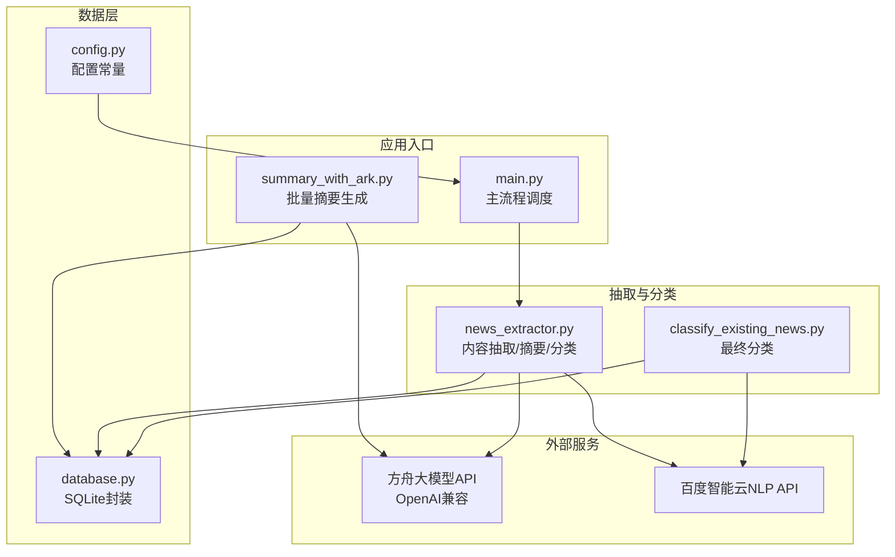
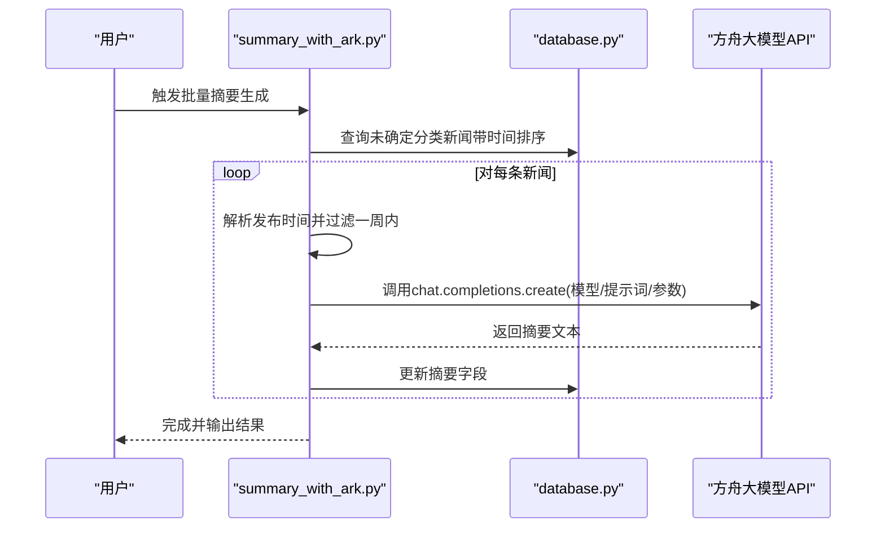
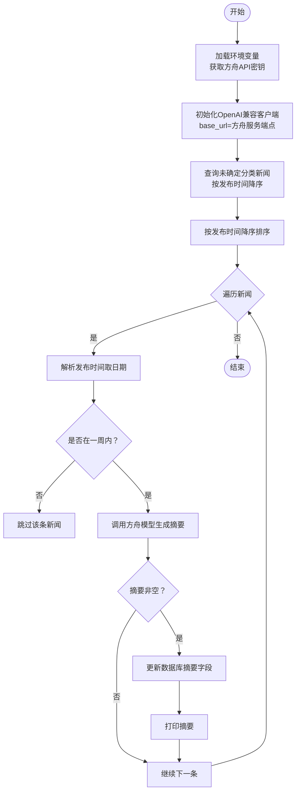
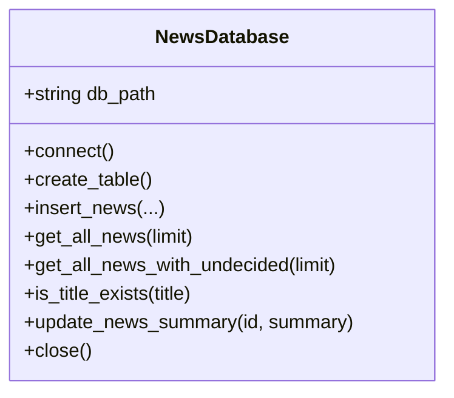
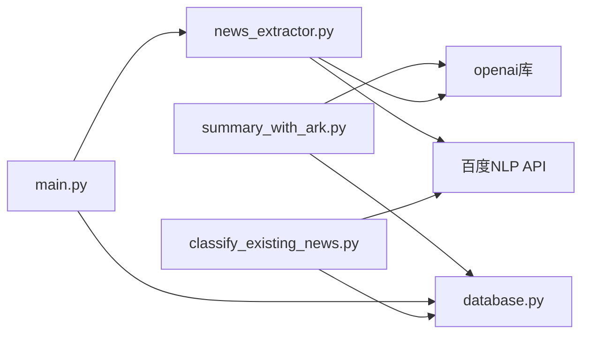

# 摘要生成工具

<cite>
**本文引用的文件**
- [summary_with_ark.py](file://summary_with_ark.py)
- [news_extractor.py](file://news_extractor.py)
- [database.py](file://database.py)
- [config.py](file://config.py)
- [main.py](file://main.py)
- [classify_existing_news.py](file://classify_existing_news.py)
- [logger.py](file://logger.py)
- [requirements.txt](file://requirements.txt)
- [readme.MD](file://readme.MD)
</cite>

## 目录
1. [简介](#简介)
2. [项目结构](#项目结构)
3. [核心组件](#核心组件)
4. [架构总览](#架构总览)
5. [详细组件分析](#详细组件分析)
6. [依赖关系分析](#依赖关系分析)
7. [性能考虑](#性能考虑)
8. [故障排查指南](#故障排查指南)
9. [结论](#结论)
10. [附录](#附录)

## 简介
本文件面向“摘要生成工具”（summary_with_ark.py）的使用者与维护者，系统性阐述基于火山方舟（Volces Ark）大模型的AI摘要功能实现原理与使用方法。内容涵盖：
- OpenAI兼容客户端配置与API调用流程
- 摘要生成参数设置与提示词设计
- 从数据库获取未确定分类新闻、时间过滤机制
- 摘要更新到数据库的完整流程
- 具体使用示例、API密钥配置方法、参数调优建议与性能优化技巧
- 与其他组件的集成关系与最佳实践

## 项目结构
该项目采用“功能分层 + 组件化”的组织方式，围绕“新闻采集 -> 内容抽取 -> 摘要生成 -> 分类 -> 展示”的主流程展开。摘要生成工具位于顶层，直接对接数据库与方舟大模型服务。

图表来源
- [main.py:11-206](file://main.py#L11-L206)
- [summary_with_ark.py:1-60](file://summary_with_ark.py#L1-L60)
- [database.py:1-92](file://database.py#L1-L92)
- [news_extractor.py:21-800](file://news_extractor.py#L21-L800)
- [classify_existing_news.py:14-302](file://classify_existing_news.py#L14-L302)

章节来源
- [main.py:11-206](file://main.py#L11-L206)
- [readme.MD:1-11](file://readme.MD#L1-L11)

## 核心组件
- 摘要生成工具（summary_with_ark.py）
  - 功能：从数据库读取未确定分类新闻，按发布时间过滤，调用方舟大模型生成摘要，并回写数据库。
  - 关键点：OpenAI兼容客户端初始化、模型参数、时间过滤、摘要更新。
- 数据库封装（database.py）
  - 功能：提供SQLite访问、表结构、查询与更新接口（含“未确定分类”查询与摘要更新）。
- 抽取与摘要（news_extractor.py）
  - 功能：内容抽取、摘要生成（备用方案）、分类（百度NLP）。
- 主流程（main.py）
  - 功能：采集新闻、关键词过滤、时间过滤、调用抽取器生成摘要、入库、触发最终分类。
- 最终分类（classify_existing_news.py）
  - 功能：对已有新闻进行分类与最终分类标注。
- 日志（logger.py）
  - 功能：统一日志输出与轮转。

章节来源
- [summary_with_ark.py:1-60](file://summary_with_ark.py#L1-L60)
- [database.py:54-87](file://database.py#L54-L87)
- [news_extractor.py:710-750](file://news_extractor.py#L710-L750)
- [main.py:111-173](file://main.py#L111-L173)
- [classify_existing_news.py:28-58](file://classify_existing_news.py#L28-L58)
- [logger.py:25-104](file://logger.py#L25-L104)

## 架构总览
摘要生成工具的运行时交互如下：

图表来源
- [summary_with_ark.py:21-59](file://summary_with_ark.py#L21-L59)
- [database.py:61-87](file://database.py#L61-L87)

## 详细组件分析

### 组件A：摘要生成工具（summary_with_ark.py）
- OpenAI兼容客户端配置
  - 通过环境变量加载API密钥，初始化OpenAI客户端并指向方舟大模型服务端点。
  - 客户端构造参数包含：api_key、base_url。
- 数据库交互
  - 使用NewsDatabase实例连接news.db。
  - 查询未确定分类新闻（按发布时间降序），支持limit限制。
  - 对查询结果按发布时间降序排序。
- 时间过滤机制
  - 计算一周前的时间阈值。
  - 解析新闻发布日期字符串（仅取日期部分），若早于阈值则跳过。
  - 若解析失败则跳过该条新闻的时间检查。
- 摘要生成流程
  - 调用client.chat.completions.create，传入系统提示词与用户输入（文章正文）。
  - 参数：model（方舟模型ID）、messages（系统+用户）、temperature（稳定性）、max_tokens（长度上限）。
  - 提取choices[0].message.content作为摘要。
- 摘要更新
  - 若摘要非空，则调用db.update_news_summary(id, summary)更新数据库。
  - 输出摘要文本到控制台。

图表来源
- [summary_with_ark.py:10-59](file://summary_with_ark.py#L10-L59)

章节来源
- [summary_with_ark.py:10-59](file://summary_with_ark.py#L10-L59)

### 组件B：数据库封装（database.py）
- 表结构要点
  - 字段包含：id、title、author、publish_time、source、content、summary、url、category、subcategory、final_category、created_at。
- 查询接口
  - get_all_news_with_undecided：按发布时间降序查询全部新闻（用于摘要工具的输入）。
- 更新接口
  - update_news_summary：按id更新summary字段。

图表来源
- [database.py:5-92](file://database.py#L5-L92)

章节来源
- [database.py:54-87](file://database.py#L54-L87)

### 组件C：抽取与摘要（news_extractor.py）
- 摘要生成（备用方案）
  - 与summary_with_ark.py类似，但用于主流程中首次生成摘要。
  - 同样使用OpenAI兼容客户端调用方舟模型，参数与提示词与摘要工具一致。
- 分类（百度NLP）
  - 通过获取access_token并调用百度NLP分类API，返回主分类与子分类。
  - 该能力在主流程中被调用，用于后续“最终分类”。

章节来源
- [news_extractor.py:710-750](file://news_extractor.py#L710-L750)
- [news_extractor.py:759-800](file://news_extractor.py#L759-L800)

### 组件D：主流程（main.py）
- 关键流程
  - 采集新闻、链接去重、渲染页面、抽取内容。
  - 标题去重检查、关键词过滤、时间过滤（一周内）。
  - 调用抽取器生成摘要（备用方案），随后进行分类与入库。
  - 最后触发“最终分类”流程。

章节来源
- [main.py:111-173](file://main.py#L111-L173)

### 组件E：最终分类（classify_existing_news.py）
- 作用：对数据库中category为NULL或final_category为NULL的新闻进行分类与最终分类标注。
- 流程：获取待分类新闻 -> 调用百度NLP分类API -> 更新数据库 -> 根据来源与关键词规则生成最终分类。

章节来源
- [classify_existing_news.py:28-58](file://classify_existing_news.py#L28-L58)
- [classify_existing_news.py:237-302](file://classify_existing_news.py#L237-L302)

## 依赖关系分析
- 外部依赖
  - openai、python-dotenv、selenium、GeneralNewsExtractor、requests、beautifulsoup4、lxml、jinja2等。
- 内部依赖
  - summary_with_ark.py依赖database.py与OpenAI兼容客户端。
  - main.py依赖news_extractor.py与database.py。
  - classify_existing_news.py依赖requests与sqlite3。

图表来源
- [requirements.txt:1-10](file://requirements.txt#L1-L10)
- [summary_with_ark.py:3,9](file://summary_with_ark.py#L3,L9)
- [news_extractor.py:4,17](file://news_extractor.py#L4,L17)
- [classify_existing_news.py:7-11](file://classify_existing_news.py#L7-L11)

章节来源
- [requirements.txt:1-10](file://requirements.txt#L1-L10)

## 性能考虑
- 请求频率控制
  - 主流程中对每条新闻处理后sleep 1秒，避免请求过快导致限流或不稳定。
- 缓存与去重
  - 主流程使用link_cache.json维护已处理链接，减少重复抓取与API调用。
- 数据库查询优化
  - 摘要工具按发布时间降序排序，便于优先处理最新内容。
- 摘要生成参数
  - temperature较低（稳定、贴近原文），max_tokens适中，避免超长输出与额外成本。
- HTML清洗
  - 抽取器在摘要前会移除HTML标签，减少噪声，提升摘要质量与速度。

章节来源
- [main.py:173](file://main.py#L173)
- [news_extractor.py:724-730](file://news_extractor.py#L724-L730)
- [summary_with_ark.py:50-52](file://summary_with_ark.py#L50-L52)

## 故障排查指南
- 环境变量未配置
  - 症状：无法加载API密钥，导致客户端初始化失败。
  - 处理：在.env文件中设置方舟API密钥（ARK_API_KEY）。
- 方舟API调用失败
  - 症状：模型调用返回异常或空摘要。
  - 处理：检查base_url、模型ID、提示词与参数；确认网络可达与配额充足。
- 数据库连接异常
  - 症状：查询或更新失败。
  - 处理：确认news.db存在且可读写；检查表结构是否完整。
- 时间解析异常
  - 症状：部分新闻因发布时间格式不一致被跳过。
  - 处理：确保publish_time字段格式为YYYY-MM-DD；必要时在上游清洗。
- 日志定位
  - 使用logger模块输出到logs目录，按类别区分info/debug/error/warning，便于快速定位问题。

章节来源
- [logger.py:25-104](file://logger.py#L25-L104)
- [summary_with_ark.py:10-19](file://summary_with_ark.py#L10-L19)
- [database.py:13-18](file://database.py#L13-L18)

## 结论
摘要生成工具通过OpenAI兼容客户端对接方舟大模型，实现了对未确定分类新闻的自动化摘要生成与数据库回写。其与抽取、分类、主流程形成清晰的职责边界，具备良好的扩展性与可维护性。建议在生产环境中结合缓存、限速与日志监控，持续优化摘要质量与吞吐性能。

## 附录

### 使用示例
- 批量生成摘要
  - 步骤：准备.env文件（设置ARK_API_KEY），运行summary_with_ark.py。
  - 行为：从数据库读取未确定分类新闻，按发布时间过滤，调用方舟模型生成摘要并更新数据库。
- 与主流程集成
  - 步骤：运行main.py，完成采集、抽取、摘要、分类与入库；随后运行classify_existing_news.py进行最终分类。
- 参数调优建议
  - temperature：越低越稳定，建议0.1~0.3。
  - max_tokens：根据目标摘要长度调整，避免过长或过短。
  - 提示词：强调“简洁、通顺、保留核心信息”，控制在150字左右。
- 性能优化技巧
  - 控制请求频率（主流程sleep 1秒）。
  - 使用link_cache.json减少重复抓取。
  - 对HTML内容先清洗再摘要，提升质量与速度。
- 集成最佳实践
  - 将API密钥集中管理于.env文件，避免硬编码。
  - 对数据库操作进行异常捕获与日志记录，便于追踪。
  - 对不同来源网站的链接提取策略进行针对性优化，提高命中率。

章节来源
- [summary_with_ark.py:44-52](file://summary_with_ark.py#L44-L52)
- [news_extractor.py:733-741](file://news_extractor.py#L733-L741)
- [main.py:173](file://main.py#L173)