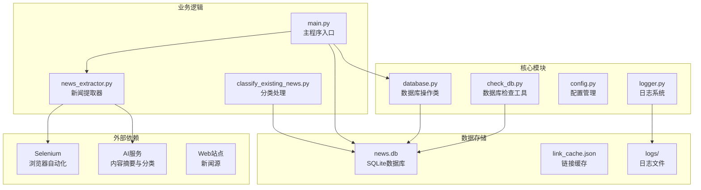
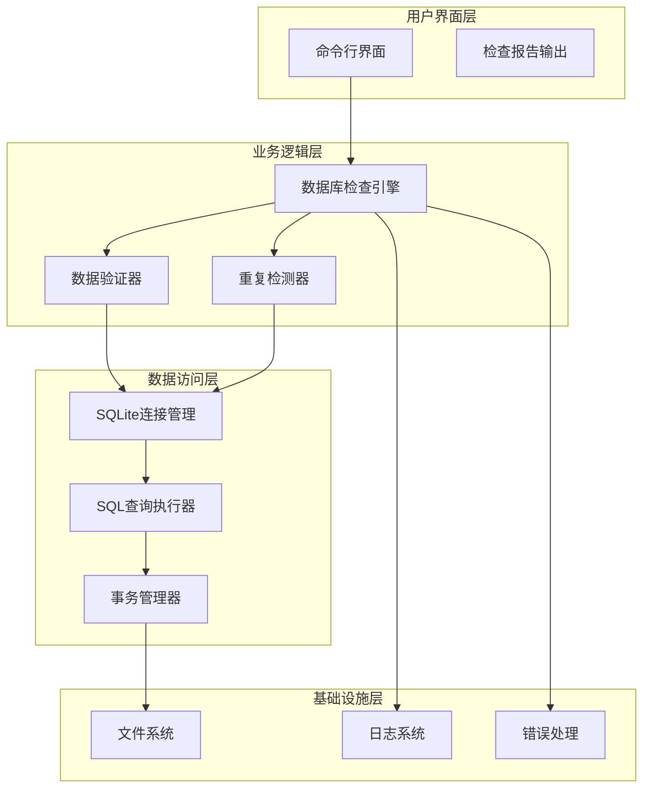
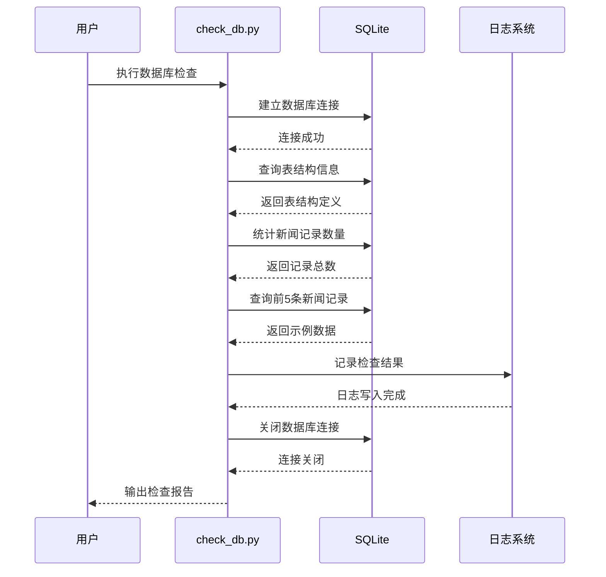
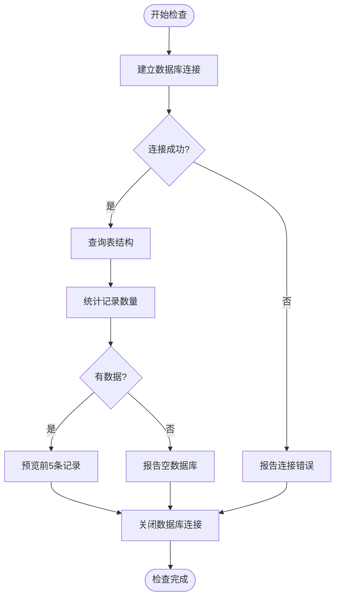
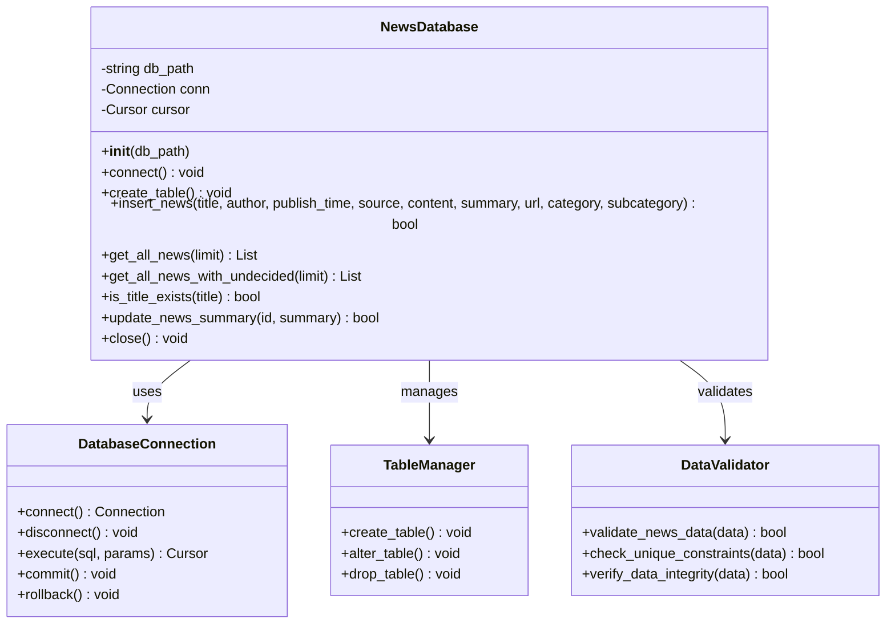
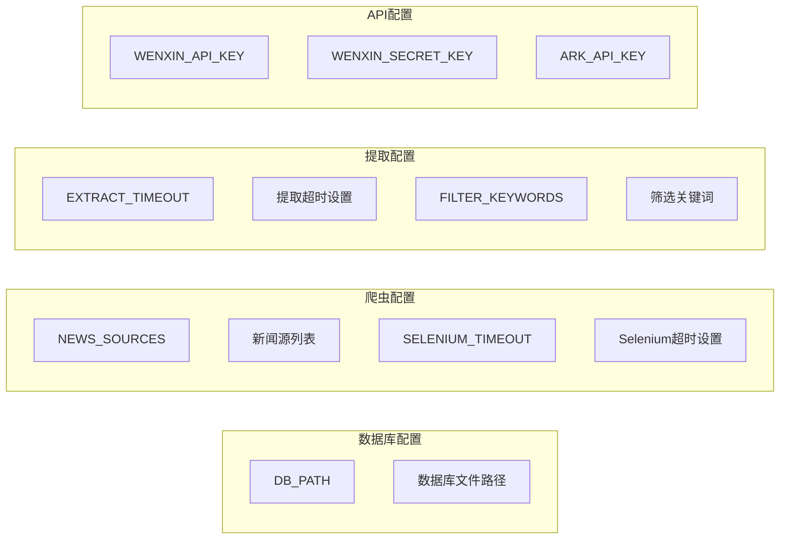
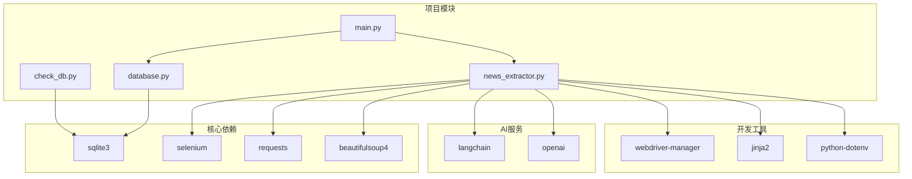
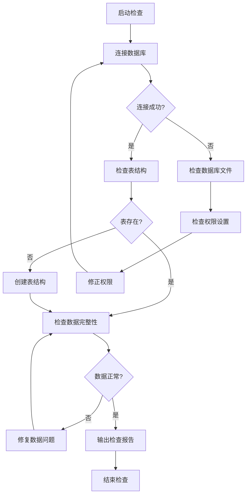

# 数据库检查工具

<cite>
**本文档引用的文件**
- [check_db.py](file://check_db.py)
- [database.py](file://database.py)
- [config.py](file://config.py)
- [logger.py](file://logger.py)
- [main.py](file://main.py)
- [news_extractor.py](file://news_extractor.py)
- [requirements.txt](file://requirements.txt)
- [readme.MD](file://readme.MD)
</cite>

## 目录
1. [简介](#简介)
2. [项目结构](#项目结构)
3. [核心组件](#核心组件)
4. [架构概览](#架构概览)
5. [详细组件分析](#详细组件分析)
6. [依赖关系分析](#依赖关系分析)
7. [性能考虑](#性能考虑)
8. [故障排除指南](#故障排除指南)
9. [结论](#结论)
10. [附录](#附录)

## 简介

数据库检查工具（check_db.py）是news-exacter项目中的一个实用工具，专门用于验证SQLite数据库的数据完整性。该工具提供了全面的数据库健康检查功能，包括数据库连接验证、表结构检查、数据一致性验证和重复记录检测等核心功能。

news-exacter是一个教育新闻自动化采集系统，通过爬取多个教育网站的新闻内容，使用AI技术进行内容分类和摘要生成，并将结果存储在SQLite数据库中。check_db.py作为该项目的重要维护工具，帮助开发者和运维人员快速诊断数据库问题，确保数据的完整性和一致性。

## 项目结构

项目采用模块化设计，各个组件职责明确，形成了完整的数据采集和管理生态系统：



**图表来源**
- [check_db.py:1-32](file://check_db.py#L1-L32)
- [database.py:1-92](file://database.py#L1-L92)
- [config.py:1-78](file://config.py#L1-L78)

**章节来源**
- [check_db.py:1-32](file://check_db.py#L1-L32)
- [database.py:1-92](file://database.py#L1-L92)
- [config.py:1-78](file://config.py#L1-L78)

## 核心组件

### 数据库检查工具（check_db.py）

check_db.py是一个轻量级的数据库诊断脚本，专注于提供快速的数据库健康检查功能。该工具通过直接使用SQLite原生命令来执行各种检查任务，确保能够准确识别数据库中的潜在问题。

主要功能特性：
- **数据库连接验证**：确认数据库文件可访问且连接正常
- **表结构检查**：验证news表的列定义和约束条件
- **数据完整性验证**：检查关键字段的完整性和一致性
- **重复记录检测**：识别可能存在的重复数据
- **基本数据浏览**：提供数据库内容的快速预览

### 数据库操作类（database.py）

NewsDatabase类提供了完整的数据库操作接口，封装了所有数据库相关的CRUD操作。该类实现了数据访问层的抽象，为上层应用提供了统一的数据库操作接口。

核心功能：
- **自动连接管理**：确保数据库连接的建立和关闭
- **表结构管理**：自动创建和维护news表结构
- **数据插入保护**：使用INSERT OR IGNORE防止重复数据
- **查询优化**：提供高效的查询接口
- **错误处理**：完善的异常处理机制

### 配置管理系统（config.py）

集中管理项目的各种配置参数，包括数据库路径、新闻源列表、API密钥等关键配置信息。该模块采用了模块化的配置管理方式，便于维护和修改。

**章节来源**
- [check_db.py:1-32](file://check_db.py#L1-L32)
- [database.py:5-92](file://database.py#L5-L92)
- [config.py:67-78](file://config.py#L67-L78)

## 架构概览

系统采用分层架构设计，各层职责清晰，便于维护和扩展：



**图表来源**
- [check_db.py:3-32](file://check_db.py#L3-L32)
- [database.py:13-92](file://database.py#L13-L92)

系统的核心执行流程如下：



**图表来源**
- [check_db.py:3-32](file://check_db.py#L3-L32)

**章节来源**
- [check_db.py:1-32](file://check_db.py#L1-L32)
- [database.py:1-92](file://database.py#L1-L92)

## 详细组件分析

### 数据库检查工具实现分析

check_db.py虽然代码量较少，但实现了完整的数据库健康检查功能。该工具的设计体现了"简单即美"的原则，通过直接使用SQLite原生命令来实现精确的检查。

#### 核心检查流程



**图表来源**
- [check_db.py:3-32](file://check_db.py#L3-L32)

#### 表结构验证机制

check_db.py使用SQLite的PRAGMA语句来获取表的详细结构信息。这种方法的优势在于能够获取到完整的表定义，包括约束条件、索引信息等。

#### 数据完整性检查

工具通过以下方式验证数据完整性：
- **记录计数**：确保数据库中有预期数量的记录
- **字段完整性**：检查关键字段（标题、URL等）的完整性
- **数据一致性**：验证不同字段之间的逻辑关系

**章节来源**
- [check_db.py:1-32](file://check_db.py#L1-L32)

### 数据库操作类深度分析

NewsDatabase类是整个系统的核心数据访问层，提供了完整的数据库操作功能。

#### 类设计模式



**图表来源**
- [database.py:5-92](file://database.py#L5-L92)

#### 错误处理机制

NewsDatabase类实现了多层次的错误处理机制：

1. **连接错误处理**：捕获数据库连接异常
2. **SQL执行错误处理**：处理SQL语句执行错误
3. **数据完整性错误处理**：验证数据约束条件
4. **事务回滚机制**：确保数据一致性

**章节来源**
- [database.py:1-92](file://database.py#L1-L92)

### 配置管理系统分析

config.py模块采用了集中式配置管理策略，将所有配置参数统一管理：

#### 配置分类



**图表来源**
- [config.py:1-78](file://config.py#L1-L78)

**章节来源**
- [config.py:1-78](file://config.py#L1-L78)

## 依赖关系分析

系统依赖关系清晰，各模块间耦合度适中，便于维护和扩展。



**图表来源**
- [requirements.txt:1-10](file://requirements.txt#L1-L10)
- [check_db.py:1](file://check_db.py#L1)
- [database.py:1](file://database.py#L1)
- [news_extractor.py:1](file://news_extractor.py#L1)

### 外部依赖分析

系统对外部依赖的使用体现了合理的架构设计：

1. **Selenium**：用于处理JavaScript渲染的网页
2. **BeautifulSoup**：用于HTML解析和数据提取
3. **OpenAI**：用于内容摘要生成
4. **Jinja2**：用于模板渲染和报告生成

**章节来源**
- [requirements.txt:1-10](file://requirements.txt#L1-L10)
- [news_extractor.py:1-800](file://news_extractor.py#L1-L800)

## 性能考虑

### 数据库性能优化

1. **连接池管理**：check_db.py使用一次性连接模式，适合短期检查任务
2. **查询优化**：使用LIMIT子句限制返回结果数量
3. **索引利用**：news表的关键字段（title, url）具有UNIQUE约束

### 内存使用优化

1. **批量操作**：避免一次性加载大量数据
2. **及时释放**：检查完成后立即关闭数据库连接
3. **资源清理**：确保所有数据库资源得到正确释放

### 并发处理考虑

系统目前采用单线程模式，适合命令行工具的使用场景。对于高并发需求，可以考虑：

1. **连接池**：实现数据库连接复用
2. **异步操作**：使用asyncio处理I/O密集型任务
3. **缓存机制**：缓存常用的查询结果

## 故障排除指南

### 常见问题及解决方案

#### 数据库连接问题

**问题症状**：
- 连接失败或超时
- 数据库文件权限不足
- 数据库文件损坏

**诊断步骤**：
1. 检查数据库文件是否存在
2. 验证文件权限设置
3. 使用SQLite命令行工具测试连接
4. 检查磁盘空间是否充足

**解决方案**：
- 确保数据库文件路径正确
- 修改文件权限为读写模式
- 使用VACUUM命令整理数据库
- 重新创建数据库文件

#### 表结构不一致问题

**问题症状**：
- 查询失败或返回意外结果
- 字段类型不匹配
- 缺少必要的索引

**诊断步骤**：
1. 使用PRAGMA table_info检查表结构
2. 对比预期的表定义
3. 检查约束条件是否满足

**解决方案**：
- 执行CREATE TABLE IF NOT EXISTS语句
- 添加缺失的字段或索引
- 重建表结构

#### 数据重复问题

**问题症状**：
- 插入操作失败
- 记录数量异常
- 唯一性约束冲突

**诊断步骤**：
1. 检查UNIQUE约束字段
2. 查询重复记录
3. 分析重复原因

**解决方案**：
- 使用INSERT OR IGNORE避免重复
- 清理重复数据
- 优化数据导入流程

### 错误诊断方法

#### 日志分析

系统提供了完整的日志记录机制，可以通过以下方式分析问题：

1. **检查日志文件**：查看logs目录下的日志文件
2. **分析错误级别**：区分不同严重程度的问题
3. **追踪调用链**：通过堆栈跟踪定位问题源头

#### 数据库状态检查



**图表来源**
- [check_db.py:3-32](file://check_db.py#L3-L32)

### 预防措施

#### 定期维护计划

1. **数据库备份**：定期备份数据库文件
2. **性能监控**：监控数据库性能指标
3. **容量规划**：预留足够的存储空间
4. **版本升级**：及时更新数据库软件

#### 最佳实践建议

1. **数据验证**：在插入数据前进行完整性检查
2. **错误处理**：实现完善的异常处理机制
3. **日志记录**：详细记录所有数据库操作
4. **安全防护**：设置适当的文件权限和访问控制

**章节来源**
- [logger.py:1-104](file://logger.py#L1-L104)
- [check_db.py:1-32](file://check_db.py#L1-L32)

## 结论

数据库检查工具（check_db.py）作为news-exacter项目的重要组成部分，为数据库维护提供了简单而有效的解决方案。该工具通过直接使用SQLite原生命令，实现了精确的数据库健康检查功能，能够有效识别和报告各种数据库问题。

### 主要优势

1. **简单易用**：代码简洁，易于理解和使用
2. **功能完整**：涵盖数据库检查的主要方面
3. **实时反馈**：提供即时的检查结果和诊断信息
4. **成本低廉**：无需额外的硬件或软件投入

### 改进建议

1. **增强错误处理**：添加更详细的错误信息和恢复选项
2. **扩展检查范围**：支持更多的数据库检查项目
3. **图形化界面**：提供可视化的检查报告
4. **自动化集成**：支持定时检查和告警通知

### 使用建议

1. **定期执行**：建议每周至少执行一次数据库检查
2. **记录结果**：保存检查结果用于历史对比
3. **及时修复**：发现问题后尽快采取修复措施
4. **持续监控**：建立长期的数据库健康监控机制

通过合理使用check_db.py工具，可以有效保障news-exacter项目的数据库健康，确保系统的稳定运行和数据的完整性。

## 附录

### 使用场景示例

#### 开发环境检查
- 新增数据库表后验证结构完整性
- 修改数据模型后检查兼容性
- 集成新功能前进行数据库健康检查

#### 生产环境维护
- 定期巡检数据库健康状况
- 系统升级前的数据完整性验证
- 故障排查时的快速诊断工具

#### 数据迁移验证
- 迁移前后数据一致性检查
- 新旧系统切换时的数据验证
- 备份恢复后的完整性确认

### 命令行参数说明

当前版本的check_db.py不支持命令行参数，但可以在源代码中进行扩展：

```python
# 示例：添加命令行参数支持
import argparse

def parse_arguments():
    parser = argparse.ArgumentParser(description='数据库检查工具')
    parser.add_argument('--db-path', default='news.db', help='数据库文件路径')
    parser.add_argument('--check-type', choices=['basic', 'full'], default='basic', help='检查类型')
    parser.add_argument('--output-format', choices=['text', 'json'], default='text', help='输出格式')
    return parser.parse_args()
```

### 输出结果解读

#### 正常情况输出
- 显示表结构定义
- 报告数据库中记录数量
- 展示前几条记录的示例数据
- 确认数据库连接状态

#### 异常情况输出
- 连接失败的具体错误信息
- 表结构不匹配的详细描述
- 数据完整性问题的定位信息
- 建议的修复步骤和注意事项

### 数据库维护最佳实践

#### 日常维护
1. **定期备份**：每天备份数据库文件
2. **性能监控**：监控数据库响应时间和存储空间
3. **日志清理**：定期清理过期的日志文件
4. **权限审计**：检查数据库文件的访问权限

#### 周期性维护
1. **数据库整理**：定期执行VACUUM命令优化数据库
2. **索引重建**：根据查询模式优化索引结构
3. **统计信息更新**：更新数据库的统计信息
4. **安全检查**：检查数据库的安全配置和访问控制

#### 应急响应
1. **故障预案**：制定数据库故障的应急处理流程
2. **快速恢复**：准备数据库快速恢复的工具和脚本
3. **数据恢复**：建立数据恢复的测试环境
4. **团队培训**：确保相关人员掌握数据库维护技能

通过遵循这些最佳实践，可以有效提高数据库的可靠性，减少故障发生的概率，并在出现问题时能够快速有效地进行恢复。