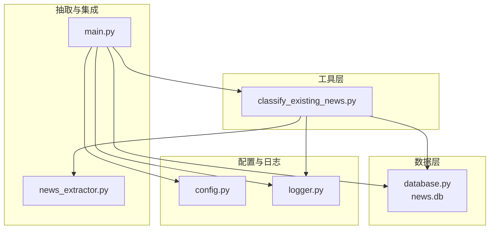
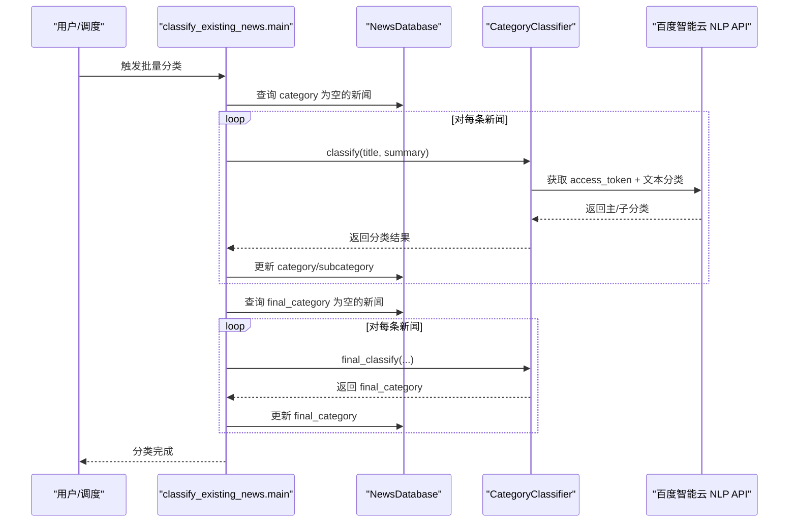
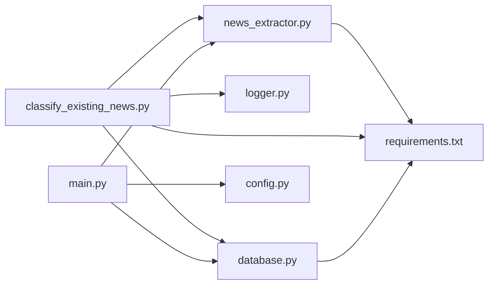

# 现有新闻分类工具

<cite>
**本文引用的文件**
- [classify_existing_news.py](file://classify_existing_news.py)
- [config.py](file://config.py)
- [database.py](file://database.py)
- [main.py](file://main.py)
- [news_extractor.py](file://news_extractor.py)
- [logger.py](file://logger.py)
- [readme.MD](file://readme.MD)
- [requirements.txt](file://requirements.txt)
</cite>

## 目录
1. [简介](#简介)
2. [项目结构](#项目结构)
3. [核心组件](#核心组件)
4. [架构总览](#架构总览)
5. [详细组件分析](#详细组件分析)
6. [依赖关系分析](#依赖关系分析)
7. [性能与优化](#性能与优化)
8. [故障排查指南](#故障排查指南)
9. [结论](#结论)
10. [附录](#附录)

## 简介
本文件面向“现有新闻分类工具”（classify_existing_news.py），系统性阐述其批量处理数据库中已有新闻的分类机制，包括：
- 初步分类算法（百度智能云 NLP 文本分类）与参数
- 最终分类规则（基于来源、作者、内容等多维特征）
- 分类结果写回数据库的流程
- 人工审核（“待审”）与后续处理
- 质量评估与验证方法
- 性能优化与稳定性保障

该工具与主流程（main.py）配合，在抓取完成后自动对数据库中 category 或 final_category 为空的新闻进行批量分类，形成最终可展示的分类体系。

## 项目结构
该项目采用“功能分层 + 文件职责清晰”的组织方式：
- 工具入口与调度：classify_existing_news.py
- 抽取与预处理：news_extractor.py（用于抓取阶段的分类/摘要能力，分类工具复用其分类接口）
- 数据访问：database.py（SQLite 表结构与 CRUD）
- 全局配置：config.py（来源清单、关键词、数据库路径等）
- 启动与集成：main.py（抓取结束后触发批量分类）
- 日志系统：logger.py
- 依赖声明：requirements.txt
- 项目说明：readme.MD

图表来源
- [classify_existing_news.py:1-302](file://classify_existing_news.py#L1-L302)
- [database.py:1-92](file://database.py#L1-L92)
- [config.py:1-78](file://config.py#L1-L78)
- [main.py:1-206](file://main.py#L1-L206)
- [news_extractor.py:1-893](file://news_extractor.py#L1-L893)
- [logger.py:1-104](file://logger.py#L1-L104)

章节来源
- [classify_existing_news.py:1-302](file://classify_existing_news.py#L1-L302)
- [database.py:1-92](file://database.py#L1-L92)
- [config.py:1-78](file://config.py#L1-L78)
- [main.py:1-206](file://main.py#L1-L206)
- [news_extractor.py:1-893](file://news_extractor.py#L1-L893)
- [logger.py:1-104](file://logger.py#L1-L104)

## 核心组件
- 新闻数据库适配器（NewsDatabase）
  - 负责连接 SQLite、创建表、查询 category 为空的新闻、更新分类与最终分类字段、关闭连接。
- 分类器（CategoryClassifier）
  - 负责获取百度智能云 access_token 并调用 NLP 文本分类接口，产出主分类与子分类；随后根据来源、作者、内容等规则生成最终分类（含“待审”）。
- 工具主流程（classify_existing_news.main）
  - 从 .env 读取百度 API 密钥，按需对两类新闻进行批量处理：category 为空 → 初步分类；final_category 为空 → 最终分类。
- 日志系统（logger）
  - 统一日志输出，支持文件轮转与控制台输出，按类别区分（info/debug/error/warning）。

章节来源
- [classify_existing_news.py:14-63](file://classify_existing_news.py#L14-L63)
- [classify_existing_news.py:64-236](file://classify_existing_news.py#L64-L236)
- [classify_existing_news.py:237-302](file://classify_existing_news.py#L237-L302)
- [logger.py:25-104](file://logger.py#L25-L104)

## 架构总览
整体流程分为两阶段：
- 初步分类阶段：针对 category 为空的新闻，调用百度 NLP 文本分类接口，写入 category 与 subcategory。
- 最终分类阶段：针对 final_category 为空的新闻，依据来源、作者、内容等规则生成 final_category，并写回数据库。

图表来源
- [classify_existing_news.py:237-302](file://classify_existing_news.py#L237-L302)
- [classify_existing_news.py:64-236](file://classify_existing_news.py#L64-L236)
- [database.py:20-38](file://database.py#L20-L38)

## 详细组件分析

### 数据库层（NewsDatabase）
- 表结构要点
  - 字段包含 id、title、author、publish_time、source、content、summary、url、category、subcategory、final_category、created_at。
  - 初次分类后写入 category 与 subcategory；二次分类后写入 final_category。
- 关键操作
  - 连接与建表：确保 UTF-8 编码，避免乱码。
  - 查询两类新闻：get_news_without_category、get_news_without_final_category。
  - 更新分类：update_category、update_final_category。
  - 关闭连接：避免资源泄漏。

章节来源
- [database.py:20-38](file://database.py#L20-L38)
- [database.py:40-92](file://database.py#L40-L92)

### 分类器（CategoryClassifier）
- 初步分类（classify）
  - 获取 access_token，构造请求参数（title、content，截断至限定长度），调用百度 NLP 文本分类接口。
  - 解析返回的 lv1/lv2/lv3 标签，合并为主/子分类。
  - 异常时回退为“其他/其他”，并记录错误日志。
- 最终分类（final_classify）
  - 基于来源 source、作者 author、内容关键字、以及初步分类结果，映射到最终分类。
  - 支持“待审”状态，便于人工复核。

章节来源
- [classify_existing_news.py:64-168](file://classify_existing_news.py#L64-L168)
- [classify_existing_news.py:169-236](file://classify_existing_news.py#L169-L236)

### 工具主流程（classify_existing_news.main）
- 环境准备
  - 通过 .env 读取 WENXIN_API_KEY/WENXIN_SECRET_KEY；若缺失则终止并记录错误。
- 初步分类阶段
  - 查询 category 为空的新闻，逐条调用 classify，更新数据库。
- 最终分类阶段
  - 查询 final_category 为空的新闻，逐条调用 final_classify，更新数据库。
- 结束
  - 关闭数据库连接，输出“分类完成”。

章节来源
- [classify_existing_news.py:237-302](file://classify_existing_news.py#L237-L302)

### 日志系统（logger）
- 统一日志输出，支持文件轮转（最多5个备份，每个不超过10MB），控制台 INFO 级别输出。
- 按类别（info/debug/error/warning）输出，便于问题定位与审计。

章节来源
- [logger.py:25-104](file://logger.py#L25-L104)

### 与抽取模块的关系
- 抓取阶段（main.py）会调用 news_extractor 的分类接口（extractor.classify_content）生成初步分类。
- 分类工具（classify_existing_news.py）复用相同的分类逻辑（CategoryClassifier），但走独立的数据库查询与更新路径。

章节来源
- [main.py:149-151](file://main.py#L149-L151)
- [news_extractor.py:759-893](file://news_extractor.py#L759-L893)

## 依赖关系分析
- classify_existing_news.py
  - 依赖：sqlite3、requests、json、datetime、logger（info/debug/error/warning）、dotenv（读取 .env）。
  - 间接依赖：database.py（NewsDatabase）、news_extractor.py（CategoryClassifier 的实现思路一致）。
- database.py
  - 依赖：sqlite3、datetime、logger。
- main.py
  - 依赖：config.py（NEWS_SOURCES、DB_PATH、SELENIUM_TIMEOUT、FILTER_KEYWORDS）、news_extractor.py、database.py。
- news_extractor.py
  - 依赖：selenium、gne、bs4、requests、openai、dotenv、logger。
- logger.py
  - 依赖：logging、os、RotatingFileHandler、datetime。
- requirements.txt
  - 定义了运行所需第三方库。

图表来源
- [classify_existing_news.py:1-302](file://classify_existing_news.py#L1-L302)
- [database.py:1-92](file://database.py#L1-L92)
- [main.py:1-206](file://main.py#L1-L206)
- [news_extractor.py:1-893](file://news_extractor.py#L1-L893)
- [logger.py:1-104](file://logger.py#L1-L104)
- [requirements.txt:1-10](file://requirements.txt#L1-L10)

章节来源
- [requirements.txt:1-10](file://requirements.txt#L1-L10)

## 性能与优化
- API 调用节流
  - 百度 NLP 文本分类接口设置超时，避免阻塞；建议在批量处理时增加延时或并发控制，防止触发限流。
- 数据库写入批量化
  - 当前逐条更新，建议在大量数据场景下采用事务包裹（BEGIN/COMMIT）减少 IO 开销。
- 截断策略
  - 标题与内容在传入 API 前进行截断，避免超出接口限制并提升稳定性。
- 日志级别
  - 生产环境建议降低 debug 输出频率，仅保留 info/error，减少磁盘 IO。
- 缓存与重试
  - 可考虑对 access_token 进行短期缓存；对网络异常进行指数退避重试。
- 并发与队列
  - 若需加速，可引入线程池/进程池与任务队列，但需注意 SQLite 的并发写入限制，必要时切换为支持并发的数据库。

[本节为通用建议，无需特定文件引用]

## 故障排查指南
- API 密钥未配置
  - 现象：启动即报错并退出。
  - 处理：在 .env 中设置 WENXIN_API_KEY 与 WENXIN_SECRET_KEY。
- 百度 NLP 接口异常
  - 现象：分类失败回退为“其他/其他”，日志出现 error。
  - 处理：检查 access_token 获取与请求参数；确认网络可达与配额充足。
- 数据库连接/写入失败
  - 现象：更新失败日志；数据库未变更。
  - 处理：检查 news.db 是否被占用；确认字段类型与编码；必要时重建表。
- 最终分类为“待审”
  - 现象：final_category 为“待审”。
  - 处理：根据规则检查来源、作者、内容关键字，必要时人工干预修正。
- 日志定位
  - 使用 logger 的 info/debug/error/warning 分类输出，结合 logs 目录下的日志文件定位问题。

章节来源
- [classify_existing_news.py:246-252](file://classify_existing_news.py#L246-L252)
- [classify_existing_news.py:166-168](file://classify_existing_news.py#L166-L168)
- [database.py:40-52](file://database.py#L40-L52)
- [logger.py:74-104](file://logger.py#L74-L104)

## 结论
现有新闻分类工具通过“初步分类 + 最终分类 + 人工审核”的三层机制，实现了对数据库中历史新闻的自动化批量处理。其核心优势在于：
- 易部署：依赖简单，仅需配置 API 密钥与数据库。
- 可扩展：最终分类规则可按业务需求灵活调整。
- 可追溯：完善的日志与数据库字段，便于质量评估与回溯。

建议在生产环境中结合缓存、重试、批处理与并发控制进一步提升吞吐与稳定性。

[本节为总结性内容，无需特定文件引用]

## 附录

### 使用示例（步骤说明）
- 准备环境
  - 安装依赖：pip install -r requirements.txt
  - 在项目根目录创建 .env，设置 WENXIN_API_KEY 与 WENXIN_SECRET_KEY
- 执行批量分类
  - 直接运行：python classify_existing_news.py
  - 或在抓取流程结束后由 main.py 自动触发
- 验证结果
  - 查询数据库中 final_category 字段，确认分类结果；对“待审”项进行人工复核

章节来源
- [requirements.txt:1-10](file://requirements.txt#L1-L10)
- [main.py:200-204](file://main.py#L200-L204)
- [classify_existing_news.py:237-302](file://classify_existing_news.py#L237-L302)

### 分类参数与规则
- 初步分类参数
  - 输入：title、summary（均进行截断）
  - 输出：category、subcategory
- 最终分类规则（示例要点）
  - 来源精确匹配与前缀匹配（如“Ai机器人-每日AI新闻”、“中国教育和科研计算机网滚动新闻”等）
  - 作者字段过滤（如作者为“胡编”时标记“待审”）
  - 内容关键字识别（如“本文”“主任谈”“专家”“讲座”等）
  - 初步分类一致性校验（如来源为“Ai机器人-每日AI新闻”时要求 category 为“科技”）

章节来源
- [classify_existing_news.py:92-168](file://classify_existing_news.py#L92-L168)
- [classify_existing_news.py:169-236](file://classify_existing_news.py#L169-L236)

### 质量评估与验证
- 评估指标
  - 正确率：人工标注样本中 final_category 与人工判定一致的比例
  - 召回率：被标记为“待审”的样本中，人工复核后被纠正的比例
  - 误判率：被错误归类的样本比例
- 验证流程
  - 抽样：从 final_category 为空的样本中随机抽样
  - 人工复核：对抽样样本进行人工判定
  - 统计：计算上述指标并反馈到规则调整

[本节为通用方法论，无需特定文件引用]

### 与抓取流程的衔接
- 抓取阶段（main.py）会先对新采集的新闻进行初步分类与摘要，并写入数据库
- 分类工具（classify_existing_news.py）在抓取结束后对历史数据进行补全分类
- 两者共享同一分类接口（百度 NLP），保证一致性

章节来源
- [main.py:149-151](file://main.py#L149-L151)
- [news_extractor.py:759-893](file://news_extractor.py#L759-L893)
- [main.py:200-204](file://main.py#L200-L204)