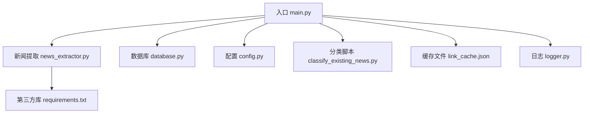
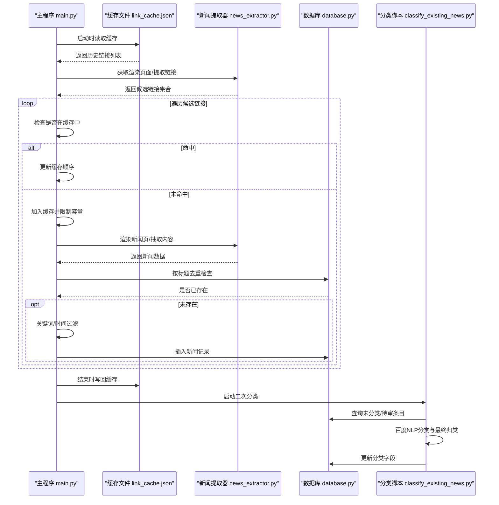
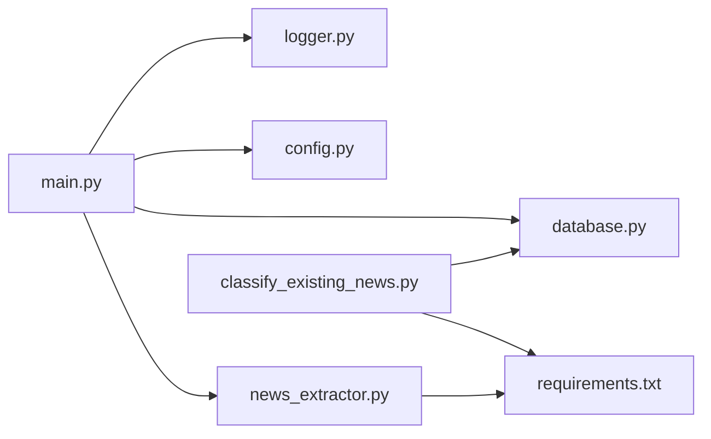
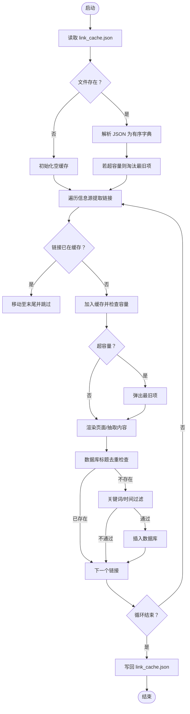

# 链接缓存管理

<cite>
**本文档引用的文件**
- [link_cache.json](file://link_cache.json)
- [main.py](file://main.py)
- [news_extractor.py](file://news_extractor.py)
- [config.py](file://config.py)
- [database.py](file://database.py)
- [classify_existing_news.py](file://classify_existing_news.py)
- [logger.py](file://logger.py)
- [requirements.txt](file://requirements.txt)
</cite>

## 目录
1. [简介](#简介)
2. [项目结构](#项目结构)
3. [核心组件](#核心组件)
4. [架构总览](#架构总览)
5. [详细组件分析](#详细组件分析)
6. [依赖关系分析](#依赖关系分析)
7. [性能考量](#性能考量)
8. [故障排查指南](#故障排查指南)
9. [结论](#结论)
10. [附录](#附录)

## 简介
本文件系统性阐述“链接缓存管理”的设计与实现，重点围绕 link_cache.json 文件的作用、结构、去重机制、缓存策略、过期时间管理、读写操作、更新时机、清理策略与性能优化方法，并结合新闻采集流程给出最佳实践与故障恢复方案。读者无需深厚的编程背景，也能通过图示与步骤说明快速掌握。

## 项目结构
本项目采用功能分层组织：
- 入口与调度：main.py
- 新闻提取：news_extractor.py
- 数据存储：database.py
- 配置与常量：config.py
- 分类与二次处理：classify_existing_news.py
- 日志：logger.py
- 缓存文件：link_cache.json
- 依赖声明：requirements.txt

图表来源
- [main.py:11-206](file://main.py#L11-L206)
- [news_extractor.py:21-893](file://news_extractor.py#L21-L893)
- [database.py:5-92](file://database.py#L5-L92)
- [config.py:1-78](file://config.py#L1-L78)
- [classify_existing_news.py:1-302](file://classify_existing_news.py#L1-L302)
- [logger.py:1-104](file://logger.py#L1-L104)
- [requirements.txt:1-10](file://requirements.txt#L1-L10)

章节来源
- [main.py:11-206](file://main.py#L11-L206)
- [config.py:1-78](file://config.py#L1-L78)

## 核心组件
- 链接缓存（内存+持久化）：基于有序字典维护最近访问顺序，落地为 JSON 列表，支持加载、去重、淘汰与落盘。
- 新闻提取器：负责渲染页面、提取链接、抽取正文、摘要与分类。
- 数据库：SQLite 存储新闻元数据，提供去重与查询接口。
- 配置：统一管理信息源、超时、筛选关键词等。
- 分类脚本：对数据库中未分类或待审条目进行二次分类与最终归类。

章节来源
- [main.py:24-46](file://main.py#L24-L46)
- [news_extractor.py:21-893](file://news_extractor.py#L21-L893)
- [database.py:5-92](file://database.py#L5-L92)
- [config.py:1-78](file://config.py#L1-L78)
- [classify_existing_news.py:14-302](file://classify_existing_news.py#L14-L302)

## 架构总览
链接缓存贯穿采集流程：启动时从 link_cache.json 加载历史链接，遍历信息源提取新闻链接时先查缓存，命中则跳过；未命中则加入缓存并继续抓取与入库。最终在分类阶段可配合数据库去重策略，保证整体流程高效稳定。

图表来源
- [main.py:28-196](file://main.py#L28-L196)
- [news_extractor.py:180-708](file://news_extractor.py#L180-L708)
- [database.py:40-78](file://database.py#L40-L78)
- [classify_existing_news.py:237-299](file://classify_existing_news.py#L237-L299)

## 详细组件分析

### 链接缓存文件 link_cache.json
- 文件类型：纯 JSON 数组，元素为字符串形式的 URL。
- 文件作用：持久化历史已处理链接，避免重复抓取与入库，提升吞吐与稳定性。
- 文件位置：项目根目录。
- 文件读写：仅在进程启动时加载一次，在退出时写回；运行期间仅在内存中维护有序字典。

章节来源
- [link_cache.json:1-666](file://link_cache.json#L1-L666)
- [main.py:28-46](file://main.py#L28-L46)
- [main.py:185-192](file://main.py#L185-L192)

### 链接去重机制
- 内存层面：使用有序字典（OrderedDict）维护链接集合，键为 URL，值为占位；利用字典的 O(1) 查找与移动能力实现“最近最少使用”淘汰。
- 文件层面：JSON 数组天然去重（同一 URL 不会重复出现），但数组顺序不代表访问顺序。
- 实践建议：若需严格按访问顺序持久化，可考虑在写回时也按访问顺序排序，但当前实现以“最后访问顺序”为准。

章节来源
- [main.py:26-46](file://main.py#L26-L46)
- [main.py:86-98](file://main.py#L86-L98)
- [main.py:185-189](file://main.py#L185-L189)

### 缓存策略与容量管理
- 容量上限：MAX_CACHE_SIZE=2000，超过即淘汰最旧项（队首）。
- 访问顺序：每次命中或新增都会将该项移动至末尾，体现“最近使用优先”。
- 淘汰触发：新增时检查容量，超出即弹出最旧项；启动时若缓存过大也会主动裁剪。

章节来源
- [main.py:24-26](file://main.py#L24-L26)
- [main.py:36-38](file://main.py#L36-L38)
- [main.py:95-97](file://main.py#L95-L97)

### 过期时间管理
- 当前实现：link_cache.json 未包含时间戳字段，因此不支持基于时间的过期策略。
- 替代方案：可在 JSON 中扩展为对象数组，包含 URL 与 ts 字段；或引入独立 TTL 管理器。但当前仓库未实现此类功能。

章节来源
- [link_cache.json:1-666](file://link_cache.json#L1-L666)
- [main.py:24-26](file://main.py#L24-L26)

### 缓存读写操作
- 读取：启动时检查文件是否存在，存在则读取 JSON 数组并填充有序字典；异常时记录错误并回退为空缓存。
- 写入：结束时将有序字典的键序列写回 JSON 文件，覆盖原文件。
- 编码：统一使用 UTF-8，确保多语言链接兼容。

章节来源
- [main.py:28-46](file://main.py#L28-L46)
- [main.py:185-192](file://main.py#L185-L192)

### 缓存更新时机
- 新增：首次处理某链接时加入缓存。
- 更新：命中链接时将其移动至末尾，更新最近使用顺序。
- 落盘：程序结束时统一写回，保证一致性。

章节来源
- [main.py:86-98](file://main.py#L86-L98)
- [main.py:185-192](file://main.py#L185-L192)

### 缓存清理策略
- 启动清理：若缓存数量超过上限，立即删除最旧项，直至满足容量约束。
- 运行清理：新增时若超过上限，立即删除最旧项。
- 终止清理：结束时一次性写回，避免频繁 IO。

章节来源
- [main.py:36-38](file://main.py#L36-L38)
- [main.py:95-97](file://main.py#L95-L97)

### 性能优化方法
- 内存缓存：使用有序字典实现 O(1) 查找与移动，显著降低重复抓取成本。
- 限流与节流：对每个链接抓取后延迟 1 秒，避免触发目标站点风控。
- 页面渲染：针对特定站点（如今日头条）增加等待与滚动，提高内容加载稳定性。
- 去重前置：在入库前先检查标题唯一性，减少无效摘要与分类调用。

章节来源
- [main.py:173](file://main.py#L173)
- [news_extractor.py:186-198](file://news_extractor.py#L186-L198)
- [news_extractor.py:655-683](file://news_extractor.py#L655-L683)
- [database.py:68-77](file://database.py#L68-L77)

### 配置示例与最佳实践
- 配置项
  - NEWS_SOURCES：信息源列表，包含 URL 与来源名称。
  - DB_PATH：数据库路径。
  - SELENIUM_TIMEOUT：Selenium 超时。
  - EXTRACT_TIMEOUT：提取超时。
  - FILTER_KEYWORDS：筛选关键词列表。
- 最佳实践
  - 合理设置 MAX_CACHE_SIZE 与 SELENIUM_TIMEOUT，平衡吞吐与稳定性。
  - 对于高并发场景，建议拆分任务或引入队列，避免一次性处理过多链接。
  - 定期备份 link_cache.json，防止异常中断导致历史缓存丢失。

章节来源
- [config.py:1-78](file://config.py#L1-L78)
- [main.py:24-26](file://main.py#L24-L26)

### 缓存文件格式说明
- 结构：数组，元素为字符串 URL。
- 编码：UTF-8。
- 示例片段（非代码）：["https://example.com/news/1", "https://example.com/news/2", ...]。

章节来源
- [link_cache.json:1-666](file://link_cache.json#L1-L666)

### 手动维护操作
- 查看缓存：直接打开 link_cache.json 查阅历史链接。
- 清空缓存：删除 link_cache.json 或清空数组内容，重启程序后重建。
- 扩展容量：修改 MAX_CACHE_SIZE（需同时修改 main.py 中的定义）。
- 临时禁用缓存：注释掉缓存加载与写回逻辑（不推荐长期使用）。

章节来源
- [main.py:28-46](file://main.py#L28-L46)
- [main.py:185-192](file://main.py#L185-L192)

### 故障恢复方案
- 缓存损坏：启动时捕获异常并回退为空缓存，不影响后续正常运行。
- 写入失败：捕获异常并记录错误日志，程序继续执行，下次再尝试写回。
- 数据库冲突：标题唯一约束导致插入失败时跳过该条目并记录告警。
- 日志定位：通过 logger 模块输出到 logs 目录，按日期分割，便于排障。

章节来源
- [main.py:40-43](file://main.py#L40-L43)
- [main.py:190-192](file://main.py#L190-L192)
- [database.py:49-52](file://database.py#L49-L52)
- [logger.py:12-56](file://logger.py#L12-L56)

## 依赖关系分析
- main.py 依赖 news_extractor、database、config、logger。
- news_extractor 依赖 selenium、requests、bs4、gne、dotenv 等。
- database 依赖 sqlite3。
- classify_existing_news 依赖 requests、sqlite3、dotenv。
- requirements.txt 声明了第三方库版本需求。

图表来源
- [main.py:1-7](file://main.py#L1-L7)
- [news_extractor.py:1-18](file://news_extractor.py#L1-L18)
- [database.py:1-3](file://database.py#L1-L3)
- [classify_existing_news.py:1-12](file://classify_existing_news.py#L1-L12)
- [requirements.txt:1-10](file://requirements.txt#L1-L10)

章节来源
- [main.py:1-7](file://main.py#L1-L7)
- [requirements.txt:1-10](file://requirements.txt#L1-L10)

## 性能考量
- 时间复杂度
  - 缓存查找/更新：O(1)（有序字典）。
  - 去重：O(n)（set 去重，n 为候选链接数）。
  - 写回：O(k)（k 为缓存大小）。
- 空间复杂度
  - 缓存占用：约 k × 平均 URL 长度（k 为缓存大小）。
- I/O
  - 单次写回，避免频繁刷盘。
- 并发与限速
  - 通过延迟与超时参数控制请求节奏，降低被封风险。

[本节为通用性能讨论，无需具体文件分析]

## 故障排查指南
- 缓存无法加载
  - 检查 link_cache.json 是否存在且为合法 JSON。
  - 查看日志中“加载缓存失败”相关记录。
- 缓存无法写回
  - 检查磁盘权限与空间。
  - 查看日志中“保存缓存失败”相关记录。
- 抓取页面失败
  - 检查 Selenium 驱动路径与版本。
  - 针对特定站点（如今日头条）适当延长等待时间。
- 数据库插入失败
  - 检查标题唯一约束冲突。
  - 查看数据库日志与异常栈。
- 分类 API 失败
  - 检查百度 NLP API 的密钥与网络连通性。
  - 查看分类日志与错误信息。

章节来源
- [main.py:40-43](file://main.py#L40-L43)
- [main.py:190-192](file://main.py#L190-L192)
- [news_extractor.py:180-206](file://news_extractor.py#L180-L206)
- [database.py:49-52](file://database.py#L49-L52)
- [classify_existing_news.py:88-90](file://classify_existing_news.py#L88-L90)
- [logger.py:12-56](file://logger.py#L12-L56)

## 结论
link_cache.json 作为轻量级缓存层，有效避免重复抓取与入库，提升整体采集效率与稳定性。其设计简单可靠，结合数据库去重与日志监控，形成闭环保障。建议在生产环境中定期备份缓存文件，合理设置容量与超时参数，并关注目标站点的反爬策略变化。

[本节为总结性内容，无需具体文件分析]

## 附录

### 缓存流程图（算法实现映射）

图表来源
- [main.py:28-196](file://main.py#L28-L196)