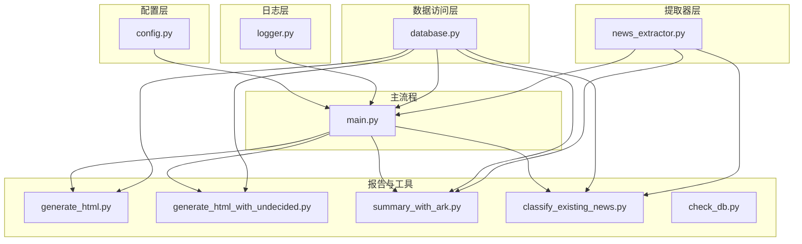
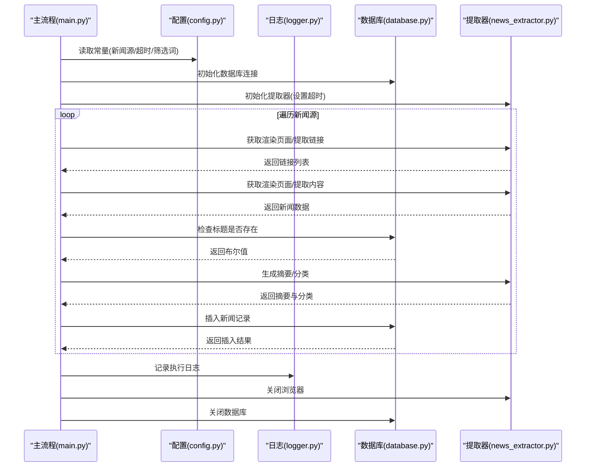
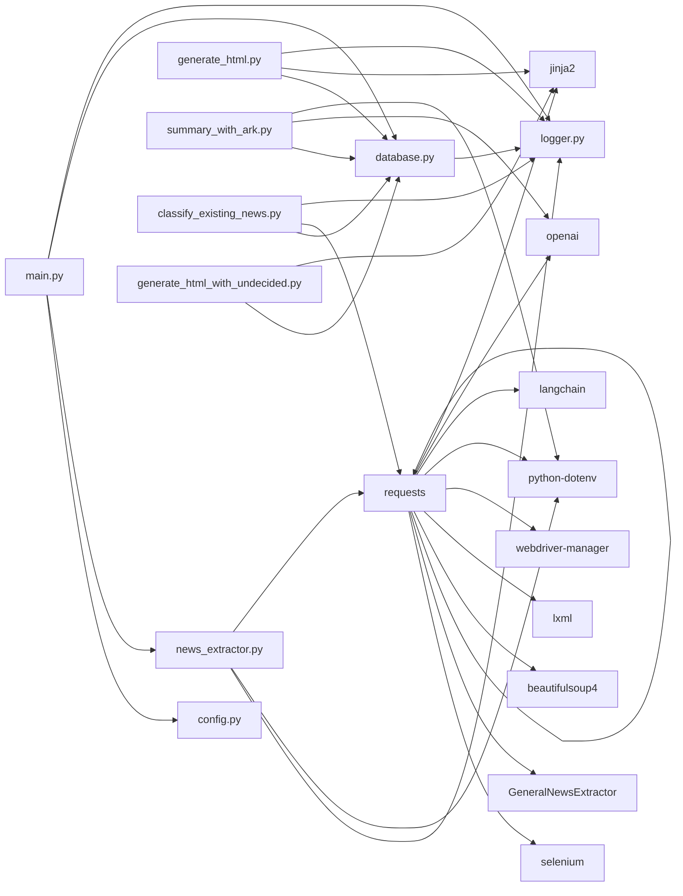

# 代码规范

<cite>
**本文引用的文件**
- [main.py](file://main.py)
- [news_extractor.py](file://news_extractor.py)
- [database.py](file://database.py)
- [config.py](file://config.py)
- [logger.py](file://logger.py)
- [classify_existing_news.py](file://classify_existing_news.py)
- [generate_html.py](file://generate_html.py)
- [generate_html_with_undecided.py](file://generate_html_with_undecided.py)
- [summary_with_ark.py](file://summary_with_ark.py)
- [check_db.py](file://check_db.py)
- [requirements.txt](file://requirements.txt)
- [readme.MD](file://readme.MD)
</cite>

## 目录
1. [引言](#引言)
2. [项目结构](#项目结构)
3. [核心组件](#核心组件)
4. [架构总览](#架构总览)
5. [详细组件分析](#详细组件分析)
6. [依赖关系分析](#依赖关系分析)
7. [性能考虑](#性能考虑)
8. [故障排除指南](#故障排除指南)
9. [结论](#结论)
10. [附录](#附录)

## 引言
本文件为 news-exacter 项目的代码规范文档，旨在统一 Python 代码风格、命名约定与编码标准，明确模块组织原则、接口设计规范与错误处理模式。文档同时结合项目现状，给出符合 PEP 8 的实践建议与常见反面案例提示，帮助开发者编写高质量、可维护的代码。

## 项目结构
项目采用功能模块化组织，围绕“数据采集 -> 内容提取 -> 摘要生成 -> 分类 -> 数据持久化 -> 报告生成”的主流程展开，核心模块如下：
- 配置层：集中管理常量与配置项
- 日志层：统一日志输出与分类
- 数据访问层：封装 SQLite 操作
- 提取器层：封装浏览器自动化与内容提取
- 主流程：协调各模块执行
- 报告与工具：生成 HTML/PDF 报告及辅助工具

图表来源
- [main.py:11-206](file://main.py#L11-L206)
- [news_extractor.py:21-800](file://news_extractor.py#L21-L800)
- [database.py:5-92](file://database.py#L5-L92)
- [config.py:1-78](file://config.py#L1-L78)
- [logger.py:1-104](file://logger.py#L1-L104)
- [generate_html.py:1-81](file://generate_html.py#L1-L81)
- [generate_html_with_undecided.py:1-72](file://generate_html_with_undecided.py#L1-L72)
- [summary_with_ark.py:1-60](file://summary_with_ark.py#L1-L60)
- [classify_existing_news.py:1-302](file://classify_existing_news.py#L1-L302)
- [check_db.py:1-32](file://check_db.py#L1-L32)

章节来源
- [main.py:11-206](file://main.py#L11-L206)
- [config.py:1-78](file://config.py#L1-L78)
- [logger.py:1-104](file://logger.py#L1-L104)
- [database.py:5-92](file://database.py#L5-L92)
- [news_extractor.py:21-800](file://news_extractor.py#L21-L800)
- [generate_html.py:1-81](file://generate_html.py#L1-L81)
- [generate_html_with_undecided.py:1-72](file://generate_html_with_undecided.py#L1-L72)
- [summary_with_ark.py:1-60](file://summary_with_ark.py#L1-L60)
- [classify_existing_news.py:1-302](file://classify_existing_news.py#L1-L302)
- [check_db.py:1-32](file://check_db.py#L1-L32)

## 核心组件
- 配置模块：集中存放常量（如新闻源、数据库路径、超时、筛选词等）
- 日志模块：提供按类别分发的日志记录器，支持文件轮转与控制台输出
- 数据库模块：封装 SQLite 表结构、插入、查询与关闭操作
- 新闻提取器：封装浏览器初始化、页面渲染、链接提取、内容提取、摘要生成、分类调用
- 主流程：协调配置、提取器、数据库与缓存，执行采集与处理
- 报告与工具：生成 HTML/PDF 报告，批量生成摘要，对已有数据进行分类

章节来源
- [config.py:1-78](file://config.py#L1-L78)
- [logger.py:1-104](file://logger.py#L1-L104)
- [database.py:5-92](file://database.py#L5-L92)
- [news_extractor.py:21-800](file://news_extractor.py#L21-L800)
- [main.py:11-206](file://main.py#L11-L206)
- [generate_html.py:1-81](file://generate_html.py#L1-L81)
- [generate_html_with_undecided.py:1-72](file://generate_html_with_undecided.py#L1-L72)
- [summary_with_ark.py:1-60](file://summary_with_ark.py#L1-L60)
- [classify_existing_news.py:1-302](file://classify_existing_news.py#L1-L302)

## 架构总览
系统采用“配置-日志-数据访问-提取器-主流程-报告工具”的分层架构，模块间通过清晰的接口交互，避免循环依赖，保证职责单一。

图表来源
- [main.py:11-206](file://main.py#L11-L206)
- [news_extractor.py:21-800](file://news_extractor.py#L21-L800)
- [database.py:5-92](file://database.py#L5-L92)
- [config.py:1-78](file://config.py#L1-L78)
- [logger.py:1-104](file://logger.py#L1-L104)

## 详细组件分析

### 配置模块规范
- 命名约定
  - 常量使用全大写加下划线，如 DB_PATH、SELENIUM_TIMEOUT、FILTER_KEYWORDS
  - 列表字典使用语义化名称，如 NEWS_SOURCES
- 组织原则
  - 将所有全局常量集中在一个文件，便于维护与变更
  - 对于不同用途的常量，建议分组注释说明
- 示例参考
  - 正确示例：[config.py:1-78](file://config.py#L1-L78)
- 常见反面案例
  - 在业务逻辑中直接硬编码常量，破坏集中管理原则

章节来源
- [config.py:1-78](file://config.py#L1-L78)

### 日志模块规范
- 接口设计
  - 提供 info/debug/error/warning 四种便捷函数
  - 支持按类别分发日志，便于问题定位
- 实现要点
  - 使用 RotatingFileHandler 控制日志文件大小与备份数
  - 同时输出到文件与控制台，便于开发与生产
- 示例参考
  - 正确示例：[logger.py:74-104](file://logger.py#L74-L104)
- 常见反面案例
  - 直接使用 logging.basicConfig 而非封装，导致多处重复配置

章节来源
- [logger.py:1-104](file://logger.py#L1-L104)

### 数据库模块规范
- 类设计
  - NewsDatabase 类封装连接、建表、插入、查询、更新、关闭
- 错误处理
  - 所有数据库操作均捕获异常并记录日志
- 接口设计
  - 提供 is_title_exists、get_all_news、update_news_summary 等方法
- 示例参考
  - 正确示例：[database.py:5-92](file://database.py#L5-L92)
- 常见反面案例
  - 在业务层直接拼接 SQL 字符串，未使用参数化查询

章节来源
- [database.py:5-92](file://database.py#L5-L92)

### 新闻提取器规范
- 类设计
  - NewsExtractor 封装浏览器初始化、页面渲染、链接提取、内容提取、摘要生成、分类调用
- 方法组织
  - 按功能拆分：init_driver、get_rendered_page、extract_news_links、extract_news_content、summarize_content、classify_content
- 错误处理
  - 所有外部调用均捕获异常并记录日志
- 示例参考
  - 正确示例：[news_extractor.py:21-800](file://news_extractor.py#L21-L800)
- 常见反面案例
  - 在类外直接操作 WebDriver，破坏封装性

章节来源
- [news_extractor.py:21-800](file://news_extractor.py#L21-L800)

### 主流程规范
- 控制流
  - 读取配置 -> 初始化数据库与提取器 -> 加载/维护链接缓存 -> 遍历新闻源 -> 提取链接与内容 -> 过滤与保存 -> 生成最终分类
- 缓存策略
  - 使用 OrderedDict 维护最近使用链接，超过阈值自动淘汰最旧项
- 示例参考
  - 正确示例：[main.py:11-206](file://main.py#L11-L206)
- 常见反面案例
  - 在循环中频繁创建/销毁对象，未复用资源

章节来源
- [main.py:11-206](file://main.py#L11-L206)

### 报告与工具规范
- HTML 生成
  - 使用 Jinja2 模板渲染，支持过滤时间范围与最终分类
- PDF 生成
  - 使用 pdfkit 将 HTML 转换为 PDF
- 批量摘要
  - 通过 OpenAI 兼容接口调用火山方舟模型生成摘要
- 示例参考
  - 正确示例：[generate_html.py:1-81](file://generate_html.py#L1-L81)、[summary_with_ark.py:1-60](file://summary_with_ark.py#L1-L60)
- 常见反面案例
  - 直接在模板中嵌入复杂逻辑，违反“模板只负责展示”的原则

章节来源
- [generate_html.py:1-81](file://generate_html.py#L1-L81)
- [generate_html_with_undecided.py:1-72](file://generate_html_with_undecided.py#L1-L72)
- [summary_with_ark.py:1-60](file://summary_with_ark.py#L1-L60)

## 依赖关系分析
- 外部依赖
  - selenium、GeneralNewsExtractor、requests、beautifulsoup4、lxml、webdriver-manager、python-dotenv、langchain、openai、jinja2
- 内部依赖
  - main.py 依赖 config、news_extractor、database、logger
  - news_extractor.py 依赖 logger、dotenv、requests、bs4、gne、selenium、openai
  - database.py 依赖 sqlite3、logger
  - generate_html.py 依赖 database、jinja2、pdfkit、logger
  - summary_with_ark.py 依赖 database、openai、dotenv
  - classify_existing_news.py 依赖 database、requests、logger
  - generate_html_with_undecided.py 依赖 database、jinja2
  - check_db.py 依赖 sqlite3

图表来源
- [requirements.txt:1-10](file://requirements.txt#L1-L10)
- [main.py:1-8](file://main.py#L1-L8)
- [news_extractor.py:1-18](file://news_extractor.py#L1-L18)
- [database.py:1-3](file://database.py#L1-L3)
- [generate_html.py:1-7](file://generate_html.py#L1-L7)
- [summary_with_ark.py:1-19](file://summary_with_ark.py#L1-L19)
- [classify_existing_news.py:1-11](file://classify_existing_news.py#L1-L11)
- [generate_html_with_undecided.py:1-6](file://generate_html_with_undecided.py#L1-L6)
- [check_db.py:1-3](file://check_db.py#L1-L3)

章节来源
- [requirements.txt:1-10](file://requirements.txt#L1-L10)
- [main.py:1-8](file://main.py#L1-L8)
- [news_extractor.py:1-18](file://news_extractor.py#L1-L18)
- [database.py:1-3](file://database.py#L1-L3)
- [generate_html.py:1-7](file://generate_html.py#L1-L7)
- [summary_with_ark.py:1-19](file://summary_with_ark.py#L1-L19)
- [classify_existing_news.py:1-11](file://classify_existing_news.py#L1-L11)
- [generate_html_with_undecided.py:1-6](file://generate_html_with_undecided.py#L1-L6)
- [check_db.py:1-3](file://check_db.py#L1-L3)

## 性能考虑
- 浏览器初始化与超时
  - 合理设置 SELENIUM_TIMEOUT，避免长时间阻塞
  - 使用 headless 模式减少资源消耗
- 页面渲染与等待
  - 针对特定站点（如 toutiao.com）增加等待时间，但需控制总量
- 缓存机制
  - 使用 OrderedDict 维护链接缓存，控制最大容量，避免内存膨胀
- 数据库操作
  - 使用参数化查询与事务，减少 I/O 开销
- 摘要与分类
  - 控制并发与请求频率，避免触发限流

[本节为一般性指导，无需列出具体文件来源]

## 故障排除指南
- 日志定位
  - 使用 logger.info/debug/error/warning 记录关键步骤与异常
  - 不同模块使用不同 category，便于快速定位问题域
- 常见问题
  - 浏览器驱动版本不匹配：使用 webdriver-manager 自动管理
  - 网站反爬虫：适当设置 UA 与反检测参数
  - API 密钥缺失：通过 .env 文件集中管理
  - 数据库连接异常：检查路径与权限
- 示例参考
  - 正确示例：[logger.py:74-104](file://logger.py#L74-L104)、[news_extractor.py:43-77](file://news_extractor.py#L43-L77)
- 常见反面案例
  - 使用 print 调试而非统一日志接口，影响生产环境可观测性

章节来源
- [logger.py:74-104](file://logger.py#L74-L104)
- [news_extractor.py:43-77](file://news_extractor.py#L43-L77)

## 结论
本规范总结了 news-exacter 项目在命名、模块组织、接口设计与错误处理方面的最佳实践。建议团队在后续开发中严格遵循 PEP 8 与本文档要求，持续提升代码质量与可维护性。

[本节为总结性内容，无需列出具体文件来源]

## 附录

### Python 代码风格与 PEP 8 要点
- 命名约定
  - 模块名：小写、下划线
  - 类名：CapWords
  - 函数/方法：小写_小写
  - 常量：UPPER_CASE
  - 受保护成员：_single_leading_underscore
  - 私有成员：__double_leading_underscore
- 缩进与行长
  - 使用 4 空格缩进
  - 单行不超过 79 字符（建议 100）
- 导入顺序
  - 标准库 -> 第三方库 -> 项目内模块
  - 每组之间用空行分隔
- 注释与文档字符串
  - 行内注释与代码至少留两个空格
  - 函数/类使用三引号文档字符串，描述用途、参数、返回值
- 空行使用
  - 模块级函数/类之间留两空行
  - 方法之间留一空行
- 异常处理
  - 明确捕获具体异常类型
  - 记录异常信息并保持程序可控

[本节为通用规范，无需列出具体文件来源]

### 代码示例与反面案例指引
- 正确示例（路径）
  - 配置常量定义：[config.py:1-78](file://config.py#L1-L78)
  - 日志记录封装：[logger.py:74-104](file://logger.py#L74-L104)
  - 数据库插入与查询：[database.py:40-77](file://database.py#L40-L77)
  - 浏览器初始化与反检测：[news_extractor.py:43-77](file://news_extractor.py#L43-L77)
  - 主流程控制流：[main.py:11-206](file://main.py#L11-L206)
  - HTML 模板渲染：[generate_html.py:64-76](file://generate_html.py#L64-L76)
  - 批量摘要生成：[summary_with_ark.py:44-58](file://summary_with_ark.py#L44-L58)
  - 已有数据分类：[classify_existing_news.py:237-299](file://classify_existing_news.py#L237-L299)
- 反面案例（路径）
  - 硬编码常量：避免在业务逻辑中直接出现魔法数字/字符串
  - 直接 print 调试：统一使用 logger 接口
  - 未参数化 SQL：使用占位符与元组传参
  - 未捕获异常：对外部调用与 I/O 操作必须 try/except
  - 未封装浏览器：将 WebDriver 生命周期封装在类中

[本节为示例指引，无需列出具体文件来源]