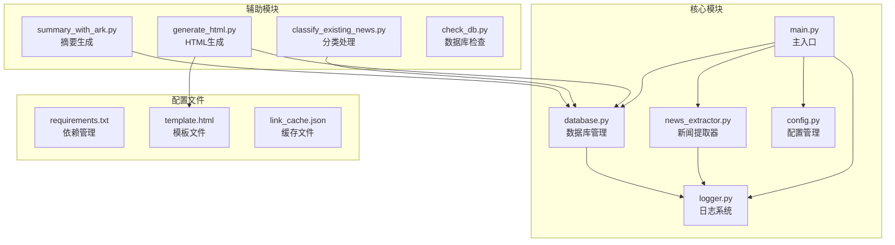
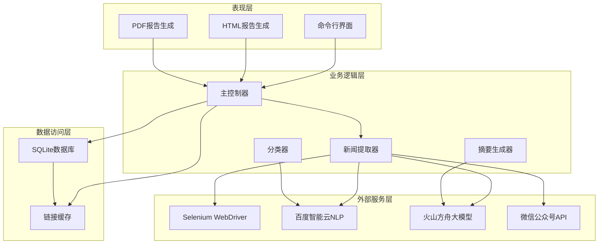
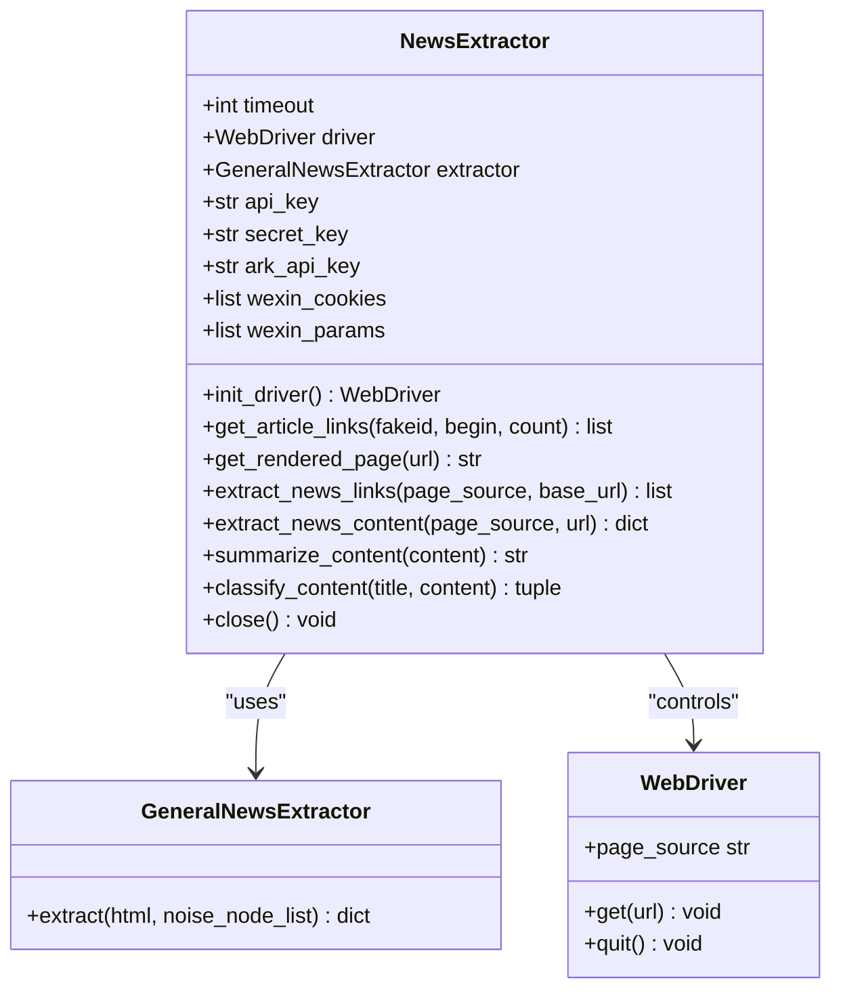
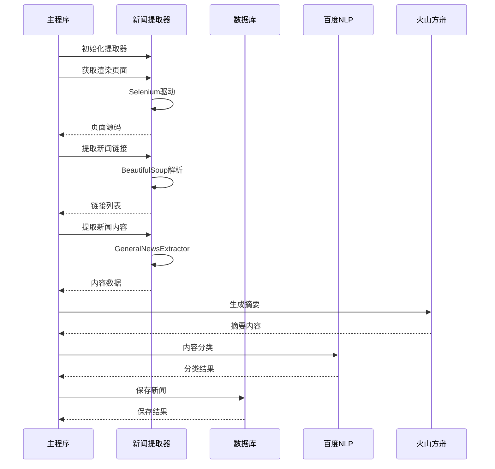
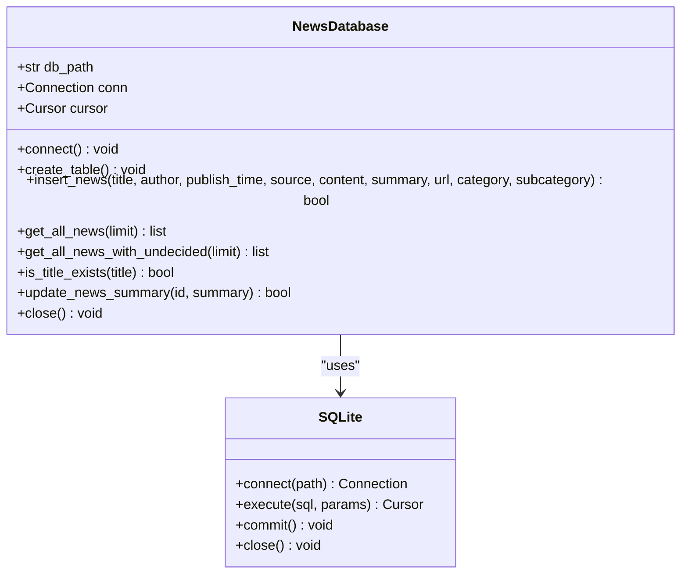
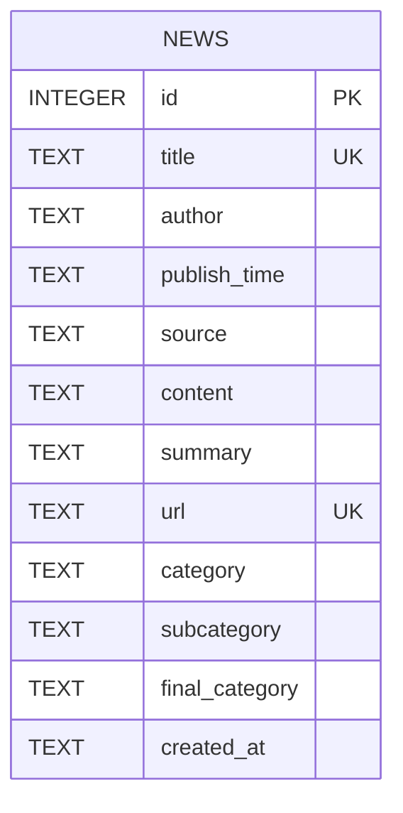
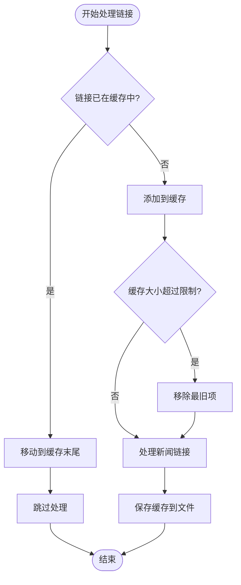
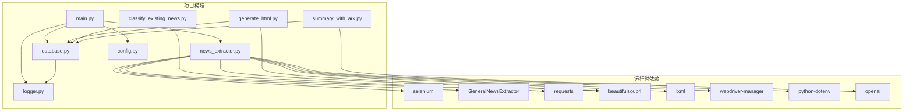

# 开发者指南

<cite>
**本文档引用的文件**
- [main.py](file://main.py)
- [news_extractor.py](file://news_extractor.py)
- [database.py](file://database.py)
- [config.py](file://config.py)
- [logger.py](file://logger.py)
- [generate_html.py](file://generate_html.py)
- [check_db.py](file://check_db.py)
- [classify_existing_news.py](file://classify_existing_news.py)
- [summary_with_ark.py](file://summary_with_ark.py)
- [requirements.txt](file://requirements.txt)
- [readme.MD](file://readme.MD)
- [template.html](file://template.html)
</cite>

## 目录
1. [简介](#简介)
2. [项目结构](#项目结构)
3. [核心组件](#核心组件)
4. [架构概览](#架构概览)
5. [详细组件分析](#详细组件分析)
6. [依赖关系分析](#依赖关系分析)
7. [代码规范](#代码规范)
8. [测试策略](#测试策略)
9. [调试技巧](#调试技巧)
10. [性能考虑](#性能考虑)
11. [扩展开发指南](#扩展开发指南)
12. [版本管理与发布](#版本管理与发布)
13. [故障排除指南](#故障排除指南)
14. [结论](#结论)

## 简介

news-exacter 是一个基于Python的新闻采集和分类系统，专门用于自动化抓取教育信息化相关的新闻内容。该项目集成了多种技术栈，包括Selenium自动化浏览器、BeautifulSoup网页解析、SQLite数据库存储、百度智能云NLP服务和火山方舟大模型服务。

该系统的主要功能包括：
- 自动化新闻采集和链接提取
- 新闻内容解析和摘要生成
- 基于百度智能云的多级分类
- HTML/PDF报告生成
- 数据库持久化存储

## 项目结构

项目采用模块化的文件组织方式，每个功能模块都有独立的文件：

**图表来源**
- [main.py:1-206](file://main.py#L1-L206)
- [news_extractor.py:1-887](file://news_extractor.py#L1-L887)
- [database.py:1-92](file://database.py#L1-L92)

**章节来源**
- [main.py:1-206](file://main.py#L1-L206)
- [requirements.txt:1-9](file://requirements.txt#L1-L9)

## 核心组件

### 主应用入口 (main.py)
主应用负责协调整个新闻采集流程，包括数据库初始化、新闻提取器配置、链接缓存管理、新闻内容处理和最终分类。

### 新闻提取器 (news_extractor.py)
实现了核心的新闻采集功能，包括：
- Selenium驱动管理
- 多网站适配的链接提取
- 新闻内容解析
- AI摘要生成
- 百度智能云分类服务

### 数据库管理 (database.py)
提供SQLite数据库操作接口，支持：
- 新闻数据的增删改查
- 唯一性约束保证
- 分类信息管理

### 配置管理 (config.py)
集中管理所有配置参数：
- 新闻源列表
- 数据库路径
- Selenium超时设置
- 关键词过滤规则

### 日志系统 (logger.py)
提供结构化的日志记录功能，支持：
- 多级别日志输出
- 文件轮转机制
- 分类日志管理

**章节来源**
- [main.py:11-198](file://main.py#L11-L198)
- [news_extractor.py:21-752](file://news_extractor.py#L21-L752)
- [database.py:5-92](file://database.py#L5-L92)
- [config.py:1-78](file://config.py#L1-L78)
- [logger.py:1-104](file://logger.py#L1-L104)

## 架构概览

系统采用分层架构设计，各层职责明确：

**图表来源**
- [main.py:11-198](file://main.py#L11-L198)
- [news_extractor.py:21-752](file://news_extractor.py#L21-L752)
- [database.py:5-92](file://database.py#L5-L92)

## 详细组件分析

### 新闻提取器类 (NewsExtractor)

**图表来源**
- [news_extractor.py:21-752](file://news_extractor.py#L21-L752)

#### 核心功能流程

**图表来源**
- [main.py:111-164](file://main.py#L111-L164)
- [news_extractor.py:704-744](file://news_extractor.py#L704-L744)

**章节来源**
- [news_extractor.py:21-752](file://news_extractor.py#L21-L752)

### 数据库管理类 (NewsDatabase)

**图表来源**
- [database.py:5-92](file://database.py#L5-L92)

#### 数据库表结构

**图表来源**
- [database.py:20-38](file://database.py#L20-L38)

**章节来源**
- [database.py:5-92](file://database.py#L5-L92)

### 链接缓存机制

系统实现了高效的链接缓存机制来避免重复处理相同内容：

**图表来源**
- [main.py:86-97](file://main.py#L86-L97)

**章节来源**
- [main.py:24-47](file://main.py#L24-L47)

## 依赖关系分析

项目依赖关系清晰，遵循单一职责原则：

**图表来源**
- [requirements.txt:1-9](file://requirements.txt#L1-L9)
- [main.py:1-7](file://main.py#L1-L7)

**章节来源**
- [requirements.txt:1-9](file://requirements.txt#L1-L9)

## 代码规范

### 命名约定
- 类名使用PascalCase（如NewsExtractor）
- 函数名使用snake_case（如get_rendered_page）
- 常量名使用UPPER_CASE（如DB_PATH）
- 私有成员使用单下划线前缀（如_wexin_cookies）

### 代码组织
- 每个模块职责单一，功能明确
- 类的设计遵循开闭原则，易于扩展
- 错误处理使用try-catch块，避免程序崩溃
- 日志记录贯穿整个应用，便于调试

### 配置管理
- 所有配置参数集中在config.py中
- 敏感信息通过环境变量管理
- 默认值合理，便于快速部署

**章节来源**
- [config.py:1-78](file://config.py#L1-L78)
- [logger.py:74-104](file://logger.py#L74-L104)

## 测试策略

### 单元测试
建议为以下模块编写单元测试：
- NewsExtractor类的方法验证
- 数据库操作的正确性
- 链接提取算法的准确性
- 分类器的稳定性

### 集成测试
- 完整的新闻采集流程测试
- 数据库持久化测试
- HTML/PDF生成测试
- 缓存机制测试

### 性能测试
- Selenium驱动启动时间
- 大批量新闻处理性能
- 数据库查询优化
- 内存使用情况监控

## 调试技巧

### 日志分析
系统提供了详细的日志记录机制：
- 使用info/debug/error/warning四个级别
- 支持按类别分类的日志
- 文件轮转机制避免日志过大

### 调试模式
- Selenium驱动支持headless模式
- 页面源码保存到文件便于分析
- 异常堆栈跟踪完整

### 常见问题排查
- WebDriver版本兼容性问题
- 网站反爬虫机制应对
- API密钥配置问题
- 数据库连接异常

**章节来源**
- [logger.py:12-56](file://logger.py#L12-L56)
- [news_extractor.py:180-206](file://news_extractor.py#L180-L206)

## 性能考虑

### 内存管理
- 及时关闭Selenium驱动
- 合理使用缓存，避免内存泄漏
- 数据库连接及时释放

### 网络优化
- 合理设置超时时间
- 避免频繁的API调用
- 使用连接池减少建立连接的开销

### 并发处理
- 当前实现为单线程，可考虑异步处理
- 批量数据库操作优化
- 缓存预热机制

## 扩展开发指南

### 新闻源扩展
要添加新的新闻源，需要：
1. 在config.py的NEWS_SOURCES中添加新的源配置
2. 在news_extractor.py中添加对应的链接提取逻辑
3. 考虑特定网站的反爬虫机制

### 分类算法扩展
当前使用百度智能云NLP服务，可替换为：
- 其他NLP服务提供商
- 自训练的分类模型
- 规则引擎结合机器学习

### 报告生成扩展
- 支持更多格式（Word、Excel等）
- 自定义模板系统
- 实时数据可视化

### 插件机制
建议实现插件架构：
- 抽象基类定义插件接口
- 动态加载插件模块
- 插件配置管理

**章节来源**
- [config.py:2-55](file://config.py#L2-L55)
- [news_extractor.py:208-683](file://news_extractor.py#L208-L683)

## 版本管理与发布

### 版本控制策略
- 使用Git进行版本管理
- 遵循语义化版本控制
- 分支管理策略：master主分支、develop开发分支

### 发布流程
1. 代码审查和测试
2. 更新版本号
3. 生成发布包
4. 部署到生产环境
5. 回滚机制准备

### 环境配置
- 开发环境：Python 3.8+
- 生产环境：Linux服务器
- 依赖管理：requirements.txt
- 环境变量：.env文件

## 故障排除指南

### 常见错误及解决方案

#### Selenium相关错误
- **错误**：WebDriver启动失败
- **解决**：检查ChromeDriver版本兼容性
- **预防**：使用webdriver-manager自动管理驱动

#### 数据库连接错误
- **错误**：SQLite连接失败
- **解决**：检查数据库文件权限
- **预防**：使用上下文管理器确保连接正确关闭

#### API调用错误
- **错误**：百度NLP API认证失败
- **解决**：检查API密钥配置
- **预防**：使用环境变量管理敏感信息

#### 内存不足错误
- **错误**：处理大量新闻时内存溢出
- **解决**：优化数据结构，及时清理缓存
- **预防**：实现分批处理机制

### 调试工具推荐
- **IDE调试器**：PyCharm/VSCode
- **网络抓包**：Charles/Fiddler
- **数据库工具**：DB Browser for SQLite
- **性能分析**：cProfile/memory_profiler

**章节来源**
- [news_extractor.py:43-76](file://news_extractor.py#L43-L76)
- [database.py:13-18](file://database.py#L13-L18)

## 结论

news-exacter项目展现了现代Web爬虫系统的最佳实践，具有以下特点：

### 技术优势
- 模块化设计，职责分离清晰
- 完善的错误处理和日志系统
- 灵活的配置管理
- 可扩展的架构设计

### 应用价值
- 自动化新闻采集和处理
- 多层次的内容理解和分类
- 结构化的数据存储和展示
- 可定制的报告生成

### 发展方向
- 增强机器学习算法
- 支持更多新闻源
- 优化性能和可扩展性
- 完善监控和运维体系

该项目为类似的信息采集和处理系统提供了良好的参考模板，其模块化设计和清晰的架构为后续的功能扩展奠定了坚实基础。