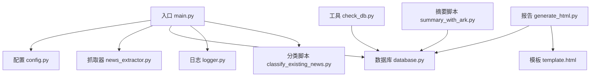
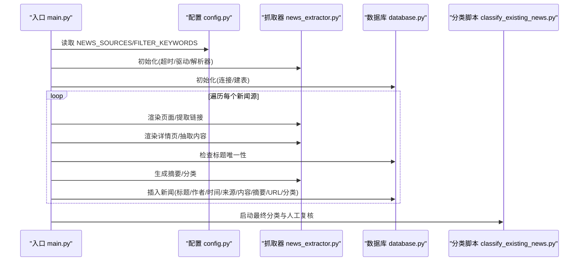
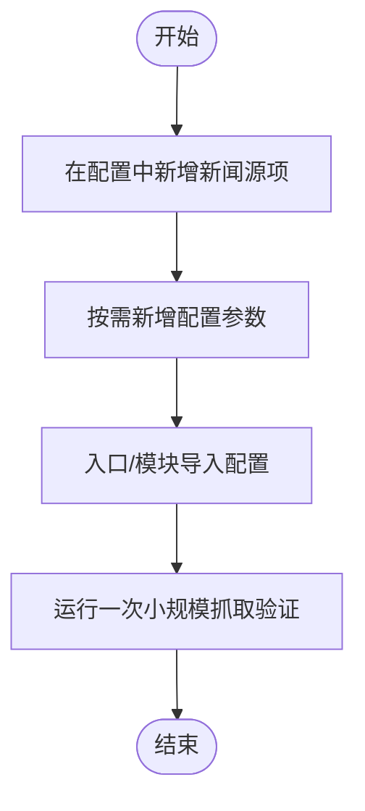
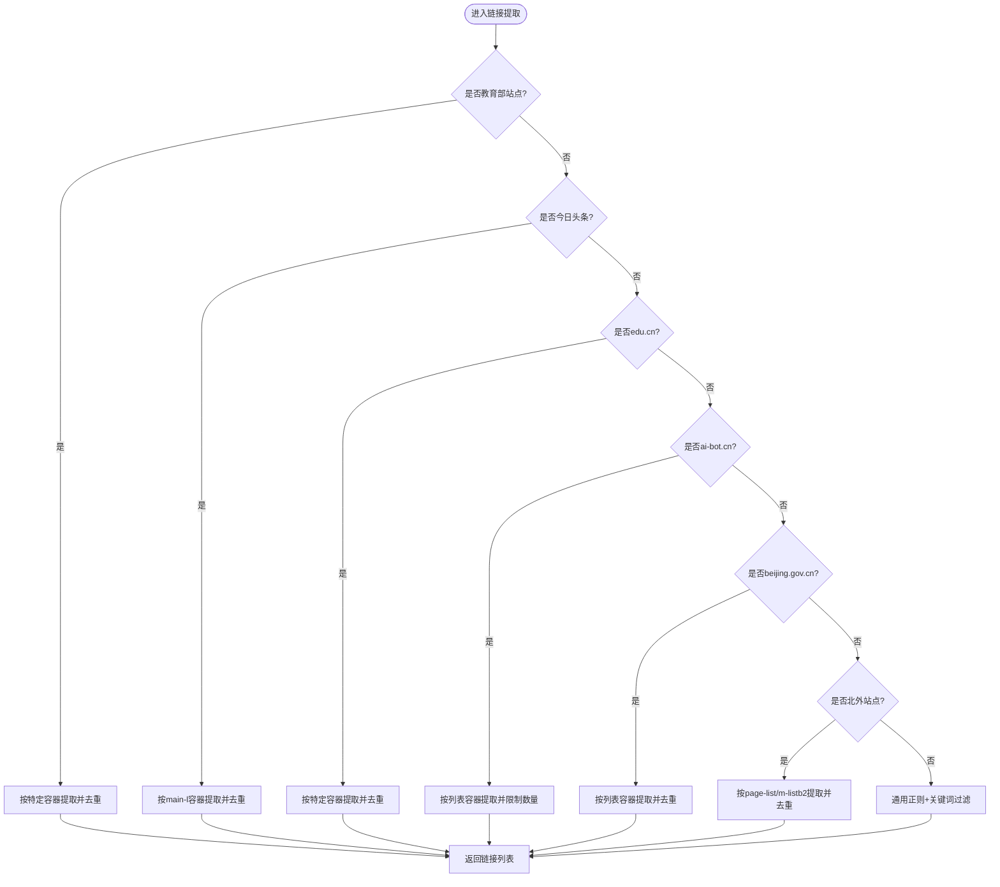
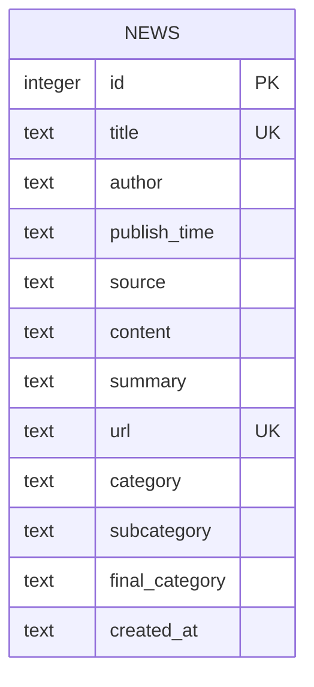
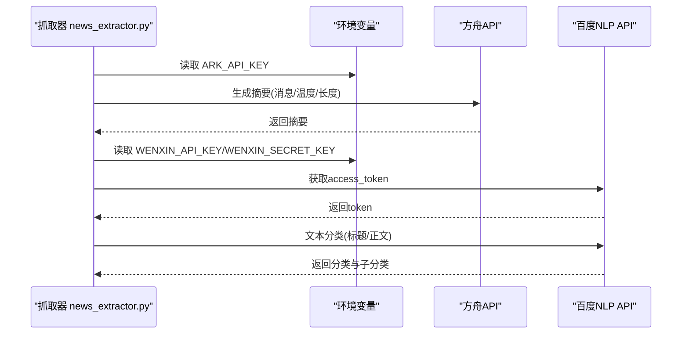
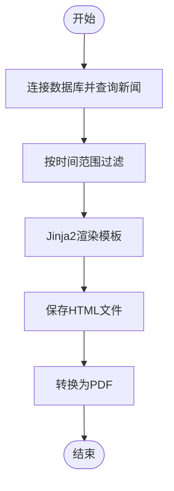
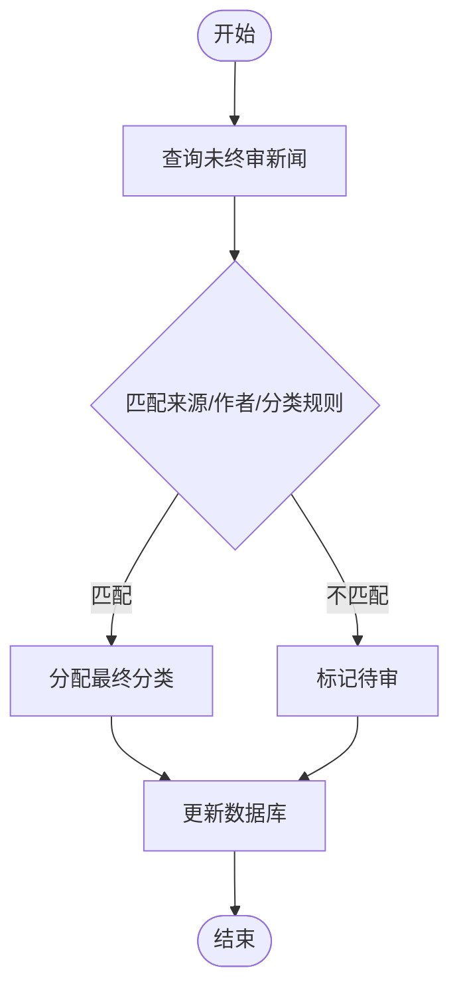
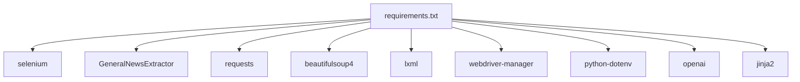

# 扩展开发

<cite>
**本文引用的文件**
- [main.py](file://main.py)
- [config.py](file://config.py)
- [database.py](file://database.py)
- [news_extractor.py](file://news_extractor.py)
- [logger.py](file://logger.py)
- [generate_html.py](file://generate_html.py)
- [classify_existing_news.py](file://classify_existing_news.py)
- [requirements.txt](file://requirements.txt)
- [template.html](file://template.html)
- [check_db.py](file://check_db.py)
- [summary_with_ark.py](file://summary_with_ark.py)
- [readme.MD](file://readme.MD)
</cite>

## 目录
1. [简介](#简介)
2. [项目结构](#项目结构)
3. [核心组件](#核心组件)
4. [架构总览](#架构总览)
5. [详细组件分析](#详细组件分析)
6. [依赖分析](#依赖分析)
7. [性能考虑](#性能考虑)
8. [故障排查指南](#故障排查指南)
9. [结论](#结论)
10. [附录](#附录)

## 简介
本指南面向希望扩展 news-exacter 项目的开发者，系统讲解如何：
- 添加新的新闻源与站点适配
- 扩展功能模块与自定义处理逻辑
- 设计插件机制、接口规范与实现方法
- 扩展配置系统、新增参数与修改既有行为
- 集成新 API、第三方服务与认证机制
- 扩展数据库 Schema、新增字段与查询优化
- 开发自定义报告格式、输出插件与数据导出
- 识别扩展点、保证向后兼容与版本管理最佳实践

## 项目结构
项目采用“配置驱动 + 组件化”的组织方式：
- 入口与调度：main.py
- 配置中心：config.py
- 数据访问层：database.py
- 抓取与解析：news_extractor.py
- 日志系统：logger.py
- 报告与导出：generate_html.py + template.html
- 分类与人工复核：classify_existing_news.py
- 环境与依赖：requirements.txt
- 工具与辅助：check_db.py、summary_with_ark.py、readme.MD

图表来源
- [main.py:11-198](file://main.py#L11-L198)
- [config.py:1-78](file://config.py#L1-L78)
- [database.py:1-92](file://database.py#L1-L92)
- [news_extractor.py:21-800](file://news_extractor.py#L21-L800)
- [logger.py:1-104](file://logger.py#L1-L104)
- [generate_html.py:1-81](file://generate_html.py#L1-L81)
- [template.html:1-108](file://template.html#L1-L108)
- [classify_existing_news.py:1-302](file://classify_existing_news.py#L1-L302)
- [check_db.py:1-32](file://check_db.py#L1-L32)
- [summary_with_ark.py:1-60](file://summary_with_ark.py#L1-L60)

章节来源
- [main.py:11-198](file://main.py#L11-L198)
- [config.py:1-78](file://config.py#L1-L78)
- [readme.MD:1-11](file://readme.MD#L1-L11)

## 核心组件
- 配置系统：集中管理新闻源、数据库路径、Selenium 超时、提取超时、筛选关键词等。
- 数据库层：SQLite 表 news，提供插入、查询、唯一性约束、更新摘要等操作。
- 抓取器：封装 Selenium、BeautifulSoup、GNX 等，支持多站点适配、链接提取、内容抽取、摘要与分类。
- 日志系统：按类别输出到文件与控制台，便于问题定位。
- 报告与导出：基于 Jinja2 渲染 HTML，再转 PDF；支持过滤与分组展示。
- 分类与复核：对未分类与未终审条目进行二次分类与人工校核。

章节来源
- [config.py:1-78](file://config.py#L1-L78)
- [database.py:20-92](file://database.py#L20-L92)
- [news_extractor.py:21-800](file://news_extractor.py#L21-L800)
- [logger.py:24-104](file://logger.py#L24-L104)
- [generate_html.py:12-81](file://generate_html.py#L12-L81)
- [classify_existing_news.py:14-302](file://classify_existing_news.py#L14-L302)

## 架构总览
整体流程：入口读取配置 → 初始化抓取器与数据库 → 遍历新闻源 → 渲染页面 → 提取链接 → 内容抽取 → 去重与筛选 → 生成摘要与分类 → 写入数据库 → 最终分类与人工复核 → 生成报告。

图表来源
- [main.py:48-173](file://main.py#L48-L173)
- [news_extractor.py:180-708](file://news_extractor.py#L180-L708)
- [database.py:20-52](file://database.py#L20-L52)
- [classify_existing_news.py:237-302](file://classify_existing_news.py#L237-L302)

## 详细组件分析

### 组件一：配置系统扩展（新增新闻源与参数）
- 新增新闻源：在配置文件中追加字典项，包含“url”和“source”，即可被入口自动遍历。
- 新增参数：在配置文件中添加键值对，入口与各模块通过导入读取。
- 修改既有行为：通过配置项控制超时、关键词、分页数量等。

图表来源
- [config.py:2-55](file://config.py#L2-L55)
- [main.py:50-74](file://main.py#L50-L74)

章节来源
- [config.py:1-78](file://config.py#L1-L78)
- [main.py:48-74](file://main.py#L48-L74)

### 组件二：抓取器与站点适配（插件式扩展）
- 站点适配策略：针对特定站点在链接提取阶段增加分支逻辑，处理不同容器、列表与相对路径拼接。
- 通用策略：若未命中特定站点，则使用正则与关键词规则进行链接过滤。
- 扩展点：在链接提取函数中新增“elif ... in base_url”分支，遵循已有风格。

图表来源
- [news_extractor.py:208-684](file://news_extractor.py#L208-L684)

章节来源
- [news_extractor.py:208-684](file://news_extractor.py#L208-L684)

### 组件三：数据库 Schema 扩展（新增字段与查询优化）
- 现有表结构：包含标题唯一、URL 唯一、分类字段、最终分类字段等。
- 新增字段建议：如“采集状态”、“去重指纹”、“来源类型”、“标签集合”等。
- 扩展步骤：迁移脚本中 ALTER TABLE 添加列；更新插入与查询逻辑；为高频查询建立索引。
- 查询优化：对常用过滤字段（如发布日期、最终分类）建立索引；分页与排序字段保持一致。

图表来源
- [database.py:21-36](file://database.py#L21-L36)

章节来源
- [database.py:20-92](file://database.py#L20-L92)
- [check_db.py:7-18](file://check_db.py#L7-L18)

### 组件四：摘要与分类（API 集成与认证）
- 摘要：优先使用方舟大模型 API；内容过短时直接返回原文。
- 分类：调用百度智能云 NLP 分类 API，先获取 access_token，再发起分类请求。
- 认证机制：通过环境变量加载 API Key 与 Secret Key，避免硬编码。
- 扩展点：新增模型或分类服务时，遵循“获取令牌 → 组装请求 → 解析结果 → 异常处理”的统一流程。

图表来源
- [news_extractor.py:710-800](file://news_extractor.py#L710-L800)
- [classify_existing_news.py:69-168](file://classify_existing_news.py#L69-L168)

章节来源
- [news_extractor.py:710-800](file://news_extractor.py#L710-L800)
- [classify_existing_news.py:64-168](file://classify_existing_news.py#L64-L168)

### 组件五：报告与导出（自定义格式与输出插件）
- 报告生成：读取数据库中近两周新闻，按最终分类分组渲染 HTML，再转 PDF。
- 自定义格式：通过模板引擎参数化渲染，新增字段只需在模板中引用。
- 输出插件：可扩展为 CSV/JSON/XLSX 等导出，保持与数据库查询接口一致。

图表来源
- [generate_html.py:12-81](file://generate_html.py#L12-L81)
- [template.html:87-105](file://template.html#L87-L105)

章节来源
- [generate_html.py:12-81](file://generate_html.py#L12-L81)
- [template.html:1-108](file://template.html#L1-108)

### 组件六：最终分类与人工复核（可插拔规则引擎）
- 规则引擎：根据来源、作者、分类、子分类等字段进行最终分类判定。
- 扩展点：新增来源或规则时，在规则函数中追加分支；保持返回值一致性。

图表来源
- [classify_existing_news.py:283-295](file://classify_existing_news.py#L283-L295)
- [classify_existing_news.py:169-235](file://classify_existing_news.py#L169-L235)

章节来源
- [classify_existing_news.py:169-235](file://classify_existing_news.py#L169-L235)

## 依赖分析
- 第三方库：selenium、GeneralNewsExtractor、requests、beautifulsoup4、lxml、webdriver-manager、python-dotenv、openai、jinja2。
- 依赖来源：requirements.txt。
- 版本建议：锁定关键版本，避免 Selenium/GNE/bs4 等升级导致的 API 变化。

图表来源
- [requirements.txt:1-10](file://requirements.txt#L1-L10)

章节来源
- [requirements.txt:1-10](file://requirements.txt#L1-L10)

## 性能考虑
- 抓取并发与限速：入口对每条链接处理后 sleep，避免触发目标站点限流。
- 缓存机制：链接缓存使用有序字典，限制最大容量，提升去重效率。
- 数据库写入：INSERT OR IGNORE 避免重复写入；批量插入可考虑事务优化。
- 查询优化：为高频字段建立索引；分页与排序字段保持一致。
- 渲染与导出：HTML 渲染与 PDF 转换为离线操作，建议异步化或批量化。

章节来源
- [main.py:173](file://main.py#L173)
- [main.py:24-47](file://main.py#L24-L47)
- [database.py:40-52](file://database.py#L40-L52)

## 故障排查指南
- 日志定位：使用日志模块按类别输出，结合异常堆栈快速定位。
- 驱动与反爬：抓取器初始化包含反检测参数；如遇异常，检查 chromedriver 路径与版本。
- API 认证：确认环境变量中 API Key/Secret Key 正确；网络超时与 JSON 解析失败需捕获并记录。
- 数据库异常：唯一约束冲突、SQL 执行异常均会记录错误日志；可通过工具脚本检查表结构与数据量。

章节来源
- [logger.py:24-104](file://logger.py#L24-L104)
- [news_extractor.py:43-77](file://news_extractor.py#L43-L77)
- [news_extractor.py:760-800](file://news_extractor.py#L760-L800)
- [check_db.py:7-18](file://check_db.py#L7-L18)

## 结论
news-exacter 通过“配置驱动 + 组件化 + 插件式扩展”的设计，提供了清晰的扩展路径。新增新闻源、站点适配、API 集成、数据库扩展与报告输出均可在现有框架内低成本实现。建议在扩展时严格遵循接口规范、保持向后兼容与版本管理策略，确保系统稳定性与可维护性。

## 附录

### A. 新增新闻源步骤清单
- 在配置中追加源项
- 如需特殊适配，在抓取器中新增站点分支
- 运行入口进行小规模验证
- 检查数据库写入与报告渲染

章节来源
- [config.py:2-55](file://config.py#L2-L55)
- [news_extractor.py:208-684](file://news_extractor.py#L208-L684)
- [main.py:48-74](file://main.py#L48-L74)

### B. 新增配置参数步骤清单
- 在配置文件中新增键值
- 在入口或模块中导入读取
- 为新参数提供默认值与边界检查
- 更新 README 与注释

章节来源
- [config.py:67-78](file://config.py#L67-L78)
- [readme.MD:1-11](file://readme.MD#L1-L11)

### C. 数据库 Schema 扩展步骤清单
- 设计新增字段与用途
- 编写迁移脚本（ALTER TABLE）
- 更新插入与查询逻辑
- 为高频查询字段建立索引
- 运行工具脚本验证结构

章节来源
- [database.py:20-52](file://database.py#L20-L52)
- [check_db.py:7-18](file://check_db.py#L7-L18)

### D. 新增 API 集成步骤清单
- 在环境变量中配置认证信息
- 实现“获取令牌 → 组装请求 → 解析结果 → 异常处理”的流程
- 在抓取器或独立模块中调用
- 记录日志并处理失败场景

章节来源
- [news_extractor.py:710-800](file://news_extractor.py#L710-L800)
- [classify_existing_news.py:69-168](file://classify_existing_news.py#L69-L168)

### E. 报告与导出扩展步骤清单
- 在模板中新增字段渲染
- 扩展导出格式（CSV/JSON/XLSX）
- 保持与数据库查询接口一致
- 测试渲染与导出流程

章节来源
- [template.html:87-105](file://template.html#L87-L105)
- [generate_html.py:12-81](file://generate_html.py#L12-L81)