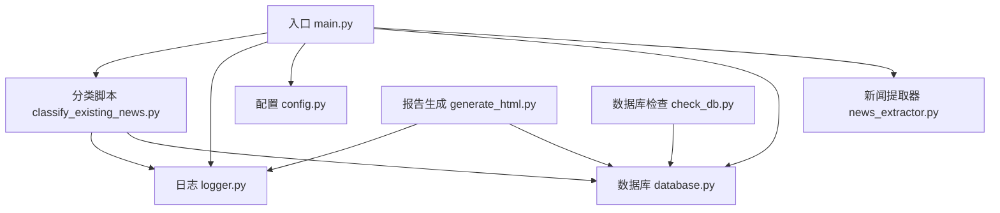
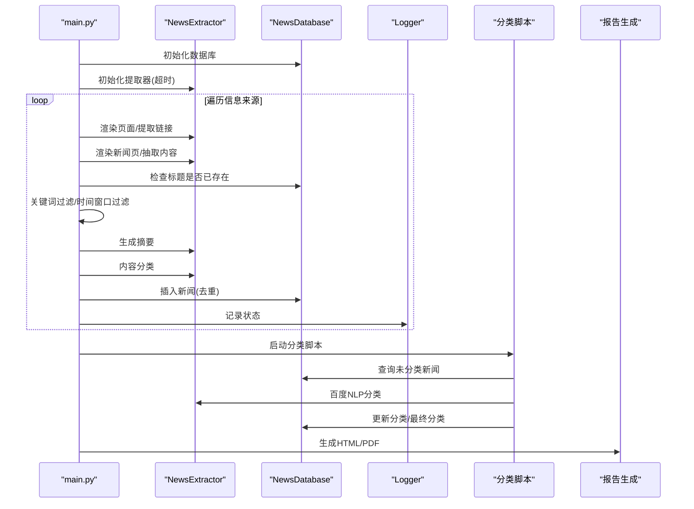
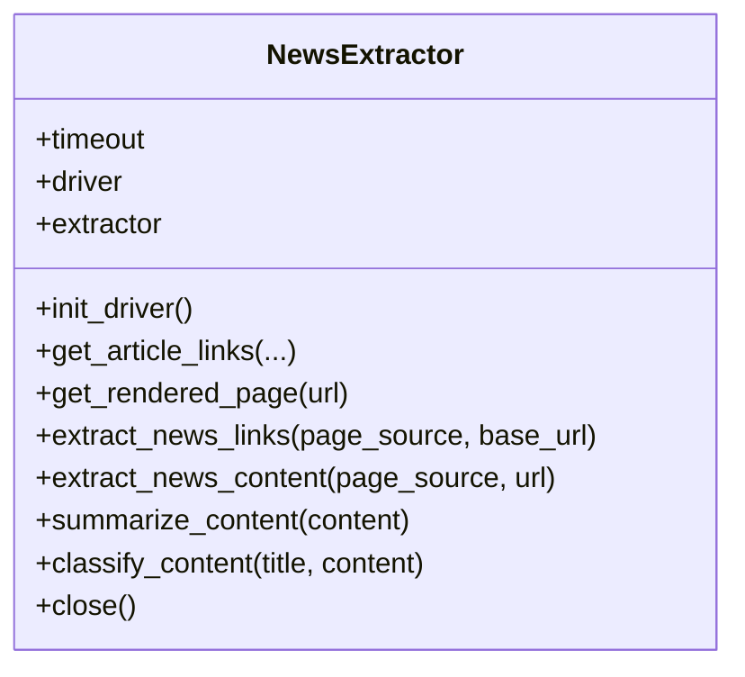
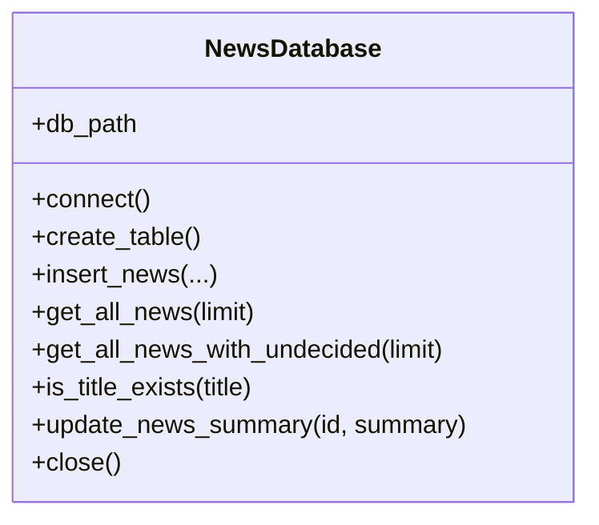
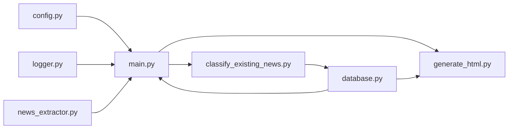

# 测试策略

<cite>
**本文引用的文件**
- [main.py](file://main.py)
- [news_extractor.py](file://news_extractor.py)
- [database.py](file://database.py)
- [config.py](file://config.py)
- [logger.py](file://logger.py)
- [classify_existing_news.py](file://classify_existing_news.py)
- [generate_html.py](file://generate_html.py)
- [check_db.py](file://check_db.py)
- [requirements.txt](file://requirements.txt)
- [readme.MD](file://readme.MD)
</cite>

## 目录
1. [引言](#引言)
2. [项目结构](#项目结构)
3. [核心组件](#核心组件)
4. [架构总览](#架构总览)
5. [详细组件分析与测试要点](#详细组件分析与测试要点)
6. [依赖关系分析](#依赖关系分析)
7. [性能与并发测试](#性能与并发测试)
8. [异常处理测试](#异常处理测试)
9. [测试环境与自动化](#测试环境与自动化)
10. [持续集成与质量门禁](#持续集成与质量门禁)
11. [故障排查指南](#故障排查指南)
12. [结论](#结论)

## 引言
本测试策略面向 news-exacter 项目，目标是建立覆盖单元测试、集成测试与端到端测试的完整测试体系，确保新闻采集、内容提取、摘要与分类、数据库持久化、报告生成等关键流程的稳定性与正确性。策略涵盖测试框架选择、用例设计、测试数据准备、模拟对象使用、性能与并发测试、异常处理测试、以及持续集成中的质量门禁。

## 项目结构
项目采用“功能模块化 + 配置集中化”的组织方式：
- 入口与主流程：main.py
- 新闻提取器：news_extractor.py（Selenium、BeautifulSoup、通用新闻抽取）
- 数据库访问：database.py（SQLite）
- 配置管理：config.py（来源、数据库路径、超时、筛选词等）
- 日志系统：logger.py（按类别输出到文件与控制台）
- 分类与最终归类：classify_existing_news.py（百度智能云NLP分类、最终分类规则）
- 报告生成：generate_html.py（Jinja2模板渲染、PDF导出）
- 数据库检查：check_db.py（快速验证表结构与数据）
- 依赖声明：requirements.txt
- 项目说明：readme.MD

图表来源
- [main.py:11-198](file://main.py#L11-L198)
- [news_extractor.py:21-758](file://news_extractor.py#L21-L758)
- [database.py:5-92](file://database.py#L5-L92)
- [config.py:1-78](file://config.py#L1-L78)
- [logger.py:25-104](file://logger.py#L25-L104)
- [classify_existing_news.py:14-302](file://classify_existing_news.py#L14-L302)
- [generate_html.py:1-81](file://generate_html.py#L1-L81)
- [check_db.py:1-32](file://check_db.py#L1-L32)

章节来源
- [main.py:1-206](file://main.py#L1-L206)
- [readme.MD:1-11](file://readme.MD#L1-L11)

## 核心组件
- 新闻提取器（NewsExtractor）
  - 功能：初始化无头浏览器、渲染页面、提取链接、抽取正文、摘要生成、内容分类
  - 关键点：Selenium 驱动初始化、Cookies/Query 参数注入、多站点适配、异常捕获与日志
- 数据库（NewsDatabase）
  - 功能：建表、插入、查询、唯一性约束、更新摘要、关闭连接
  - 关键点：SQLite 连接与 UTF-8 文本工厂、唯一约束冲突处理
- 配置（config.py）
  - 功能：来源列表、数据库路径、Selenium 超时、筛选关键词
  - 关键点：外部依赖（环境变量）与默认值
- 日志（logger.py）
  - 功能：按类别输出、文件轮转、控制台输出
  - 关键点：线程安全、编码一致性
- 分类与最终归类（classify_existing_news.py）
  - 功能：获取未分类数据、调用百度 NLP 获取分类、应用业务规则生成最终分类
  - 关键点：API 认证、请求超时、错误码处理
- 报告生成（generate_html.py）
  - 功能：查询近两周新闻、模板渲染、HTML/PDF 输出
  - 关键点：时间过滤、模板渲染、PDF 工具链路径

章节来源
- [news_extractor.py:21-758](file://news_extractor.py#L21-L758)
- [database.py:5-92](file://database.py#L5-L92)
- [config.py:1-78](file://config.py#L1-L78)
- [logger.py:25-104](file://logger.py#L25-L104)
- [classify_existing_news.py:14-302](file://classify_existing_news.py#L14-L302)
- [generate_html.py:1-81](file://generate_html.py#L1-L81)

## 架构总览

图表来源
- [main.py:11-198](file://main.py#L11-L198)
- [news_extractor.py:21-758](file://news_extractor.py#L21-L758)
- [database.py:5-92](file://database.py#L5-L92)
- [classify_existing_news.py:237-302](file://classify_existing_news.py#L237-L302)
- [generate_html.py:1-81](file://generate_html.py#L1-L81)

## 详细组件分析与测试要点

### 新闻提取器（NewsExtractor）测试
- 单元测试
  - 驱动初始化与超时设置：验证 headless、user-agent、CDP 注入、超时参数
  - 页面渲染与等待：针对不同站点（如 toutiao.com）的差异化等待策略
  - 链接提取：多站点适配（moe.gov.cn、www.edu.cn、ai-bot.cn、beijing.gov.cn、北外网站等）、相对路径拼接、去重与过滤
  - 正文抽取：GNE 抽取与异常兜底、节点排除列表
  - 摘要生成：OpenAI 兼容客户端调用、输入长度与截断策略
  - 内容分类：百度 NLP 认证与分类接口调用、错误码处理
- 集成测试
  - 与 Selenium 的真实交互：无头浏览器启动、Cookies/Query 注入、页面渲染
  - 与第三方 API 的集成：百度 NLP、火山方舟摘要服务
- 端到端测试
  - 完整抓取流程：从来源到入库的端到端验证，包括缓存命中、去重、过滤
- 测试数据
  - 静态页面快照、mock JSON 响应、分类 API 返回样例
- 模拟对象
  - requests.Session、OpenAI 客户端、Selenium WebDriver
- 关键覆盖
  - 链接提取分支覆盖率、异常路径、时间窗口与关键词过滤逻辑

图表来源
- [news_extractor.py:21-758](file://news_extractor.py#L21-L758)

章节来源
- [news_extractor.py:21-758](file://news_extractor.py#L21-L758)

### 数据库（NewsDatabase）测试
- 单元测试
  - 建表与字段约束：UNIQUE 约束（title、url）、自动时间戳
  - 插入与去重：INSERT OR IGNORE 行为、异常捕获
  - 查询与过滤：按时间倒序、final_category 过滤、limit 支持
  - 标题存在性检查：COUNT(*) 查询、异常兜底
  - 摘要更新：UPDATE 语句、异常处理
- 集成测试
  - SQLite 连接与 UTF-8 文本工厂、事务一致性
- 端到端测试
  - 插入-查询-更新闭环，结合 main.py 的主流程
- 测试数据
  - 预置测试数据库、最小化样例数据集
- 模拟对象
  - sqlite3.Connection、Cursor
- 关键覆盖
  - 唯一性冲突处理、查询边界条件、异常路径

图表来源
- [database.py:5-92](file://database.py#L5-L92)

章节来源
- [database.py:5-92](file://database.py#L5-L92)

### 配置（config.py）测试
- 单元测试
  - 来源列表结构校验、URL 有效性、默认值存在性
  - 数据库路径、超时、筛选词集合
- 集成测试
  - main.py 与 classify_existing_news.py 对配置的依赖加载
- 测试数据
  - 环境变量注入、.env 文件样例
- 关键覆盖
  - 配置项缺失时的行为（默认值 vs 异常）

章节来源
- [config.py:1-78](file://config.py#L1-L78)
- [main.py:1-206](file://main.py#L1-L206)
- [classify_existing_news.py:237-302](file://classify_existing_news.py#L237-L302)

### 日志（logger.py）测试
- 单元测试
  - 分类日志器创建、文件轮转、编码一致性
  - info/debug/error/warning 便捷函数行为
- 集成测试
  - 与各模块的日志调用点一致性
- 关键覆盖
  - 多模块日志聚合、控制台与文件输出一致性

章节来源
- [logger.py:25-104](file://logger.py#L25-L104)

### 分类与最终归类（classify_existing_news.py）测试
- 单元测试
  - 百度 NLP 认证：access_token 获取、错误码处理
  - 分类接口：请求参数构造、响应解析、异常兜底
  - 最终分类规则：按来源与内容特征的分支逻辑
- 集成测试
  - 与数据库的读写交互、批量更新
- 端到端测试
  - 未分类数据的完整分类流程
- 测试数据
  - 分类 API 响应样例、数据库样例数据
- 模拟对象
  - requests.Session、数据库游标

章节来源
- [classify_existing_news.py:14-302](file://classify_existing_news.py#L14-L302)

### 报告生成（generate_html.py）测试
- 单元测试
  - 时间过滤逻辑、排序与字段映射
  - 模板渲染与输出文件命名
- 集成测试
  - HTML 到 PDF 的工具链调用
- 关键覆盖
  - 模板变量完整性、PDF 输出可用性

章节来源
- [generate_html.py:1-81](file://generate_html.py#L1-L81)

## 依赖关系分析
- 外部依赖
  - selenium、webdriver-manager、GeneralNewsExtractor、requests、beautifulsoup4、lxml、jinja2、pdfkit、openai、langchain、python-dotenv
- 内部模块耦合
  - main.py 依赖 config、news_extractor、database、logger
  - classify_existing_news.py 依赖 requests、sqlite3、logger
  - generate_html.py 依赖 database、jinja2、pdfkit、logger
- 循环依赖
  - 无循环依赖，模块职责清晰

图表来源
- [config.py:1-78](file://config.py#L1-L78)
- [main.py:1-206](file://main.py#L1-L206)
- [news_extractor.py:21-758](file://news_extractor.py#L21-L758)
- [database.py:5-92](file://database.py#L5-L92)
- [logger.py:25-104](file://logger.py#L25-L104)
- [classify_existing_news.py:14-302](file://classify_existing_news.py#L14-L302)
- [generate_html.py:1-81](file://generate_html.py#L1-L81)

章节来源
- [requirements.txt:1-10](file://requirements.txt#L1-L10)

## 性能与并发测试
- 性能测试
  - 页面渲染耗时：对不同站点的 get_rendered_page 进行基准测试，记录平均/分位耗时
  - 抽取与摘要：对 extract_news_content 与 summarize_content 的吞吐量与延迟进行压测
  - 分类接口：对百度 NLP 的 QPS 与延迟进行测试，识别限流阈值
- 并发测试
  - 多来源并发抓取：模拟多个来源同时触发，验证链接缓存、数据库锁与异常恢复
  - 分类并发：对 classify_existing_news 的批量更新进行并发压力测试
- 资源管理
  - Selenium 驱动生命周期：确保 close() 被调用，避免资源泄漏
  - 数据库连接池：SQLite 在单进程场景下无需池，但需注意事务与锁竞争

[本节为通用指导，无需列出章节来源]

## 异常处理测试
- 新闻提取器
  - 页面渲染失败、链接提取为空、正文抽取异常、摘要/分类接口失败
- 数据库
  - 连接失败、唯一约束冲突、SQL 执行异常
- 分类脚本
  - access_token 获取失败、API 错误码、响应解析异常
- 报告生成
  - 模板渲染异常、PDF 工具链不可用
- 断言策略
  - 明确异常类型与消息关键字，确保日志记录与返回值一致

章节来源
- [news_extractor.py:180-206](file://news_extractor.py#L180-L206)
- [news_extractor.py:685-708](file://news_extractor.py#L685-L708)
- [news_extractor.py:710-750](file://news_extractor.py#L710-L750)
- [news_extractor.py:759-808](file://news_extractor.py#L759-L808)
- [database.py:40-52](file://database.py#L40-L52)
- [database.py:68-77](file://database.py#L68-L77)
- [classify_existing_news.py:69-90](file://classify_existing_news.py#L69-L90)
- [classify_existing_news.py:124-135](file://classify_existing_news.py#L124-L135)
- [generate_html.py:79](file://generate_html.py#L79)

## 测试环境与自动化
- 测试框架
  - 单元测试：pytest（推荐）
  - 集成测试：pytest + pytest-mock（模拟外部依赖）
  - 端到端测试：pytest + selenium standalone server 或 dockerized chrome
- 测试数据准备
  - 静态页面快照、mock JSON、数据库样例数据
- 模拟对象
  - requests.Session、OpenAI 客户端、sqlite3.Connection、Selenium WebDriver
- 自动化配置
  - tox/Makefile/Jenkins/GitHub Actions：分层任务（单元/集成/端到端）
  - pytest.ini：插件、标记、覆盖率配置
  - Docker：隔离依赖与浏览器环境

[本节为通用指导，无需列出章节来源]

## 持续集成与质量门禁
- CI 流水线
  - 代码检出 → 依赖安装 → 单元测试（覆盖率阈值）→ 集成测试 → 端到端测试 → 构建报告
- 质量门禁
  - 单元测试覆盖率 ≥ 80%，关键模块 ≥ 90%
  - 集成测试通过率 100%，端到端测试通过率 100%
  - 代码规范：flake8/black/isort
  - 安全扫描：依赖漏洞扫描（pip-audit/dependabot）
- 结果输出
  - 测试报告、覆盖率报告、日志归档、失败重试与通知

[本节为通用指导，无需列出章节来源]

## 故障排查指南
- 常见问题
  - Selenium 驱动版本不匹配：使用 webdriver-manager 或固定 chromedriver 版本
  - 页面渲染不稳定：增加显式等待、滚动触发、截图辅助定位
  - 百度 NLP 认证失败：检查 API Key/Secret、网络连通性、错误码
  - PDF 生成失败：确认 wkhtmltopdf 路径与依赖库
- 日志定位
  - 使用 logger 的分类日志，按模块与级别检索
- 快速验证
  - 使用 check_db.py 快速检查表结构与数据量
  - 使用 classify_existing_news.py 的独立运行模式验证分类逻辑

章节来源
- [logger.py:25-104](file://logger.py#L25-L104)
- [check_db.py:1-32](file://check_db.py#L1-L32)
- [classify_existing_news.py:237-302](file://classify_existing_news.py#L237-L302)

## 结论
本测试策略围绕新闻采集、抽取、摘要、分类、入库与报告生成的关键路径，构建了从单元到端到端的测试金字塔。通过明确的测试框架、模拟对象与数据准备策略，配合性能与异常专项测试，以及 CI 中的质量门禁，能够有效保障系统的稳定性与可维护性。建议在后续迭代中逐步提升覆盖率与自动化程度，并引入更多真实站点的回归用例。