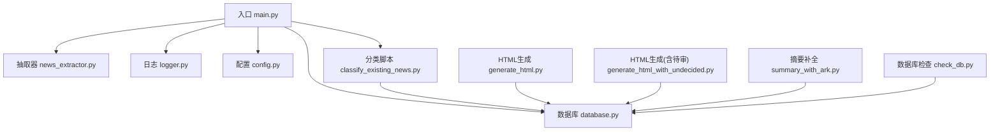
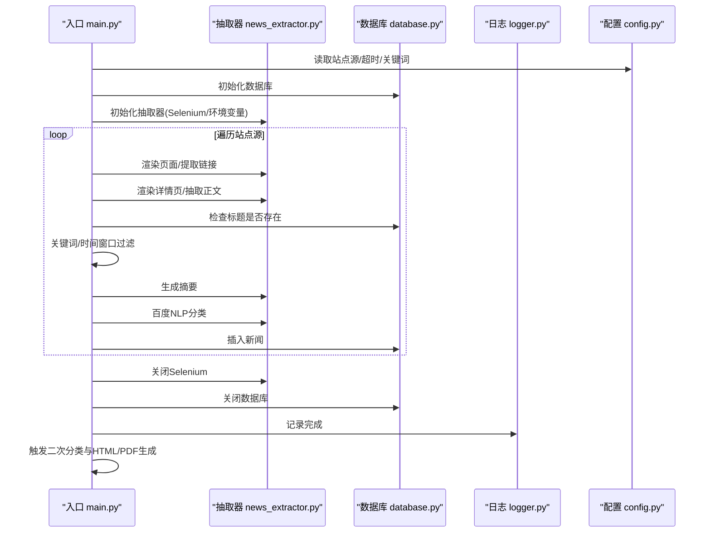
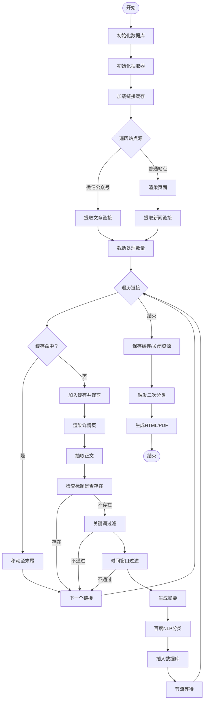
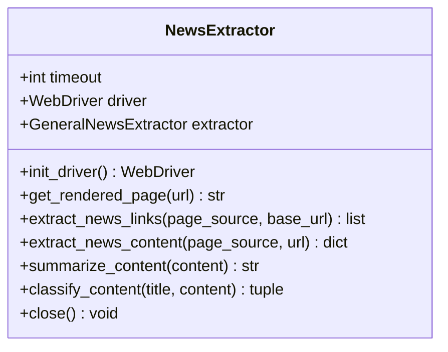
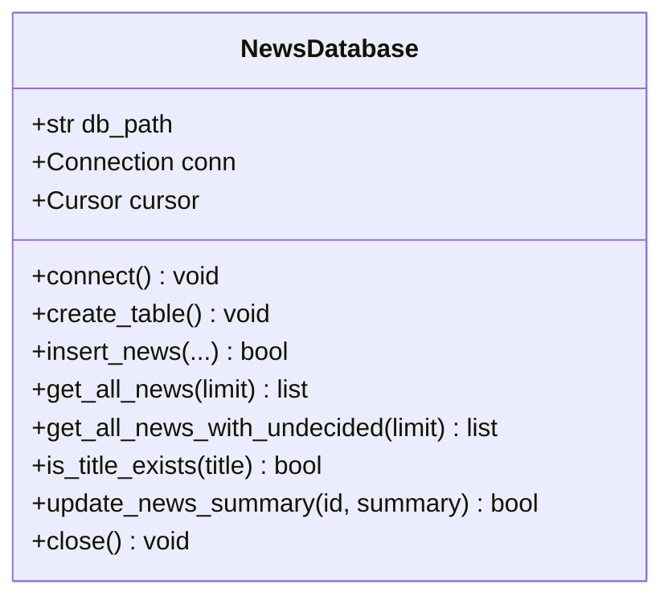
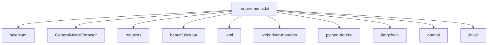

# 调试与故障排除

<cite>
**本文引用的文件**
- [main.py](file://main.py)
- [news_extractor.py](file://news_extractor.py)
- [database.py](file://database.py)
- [logger.py](file://logger.py)
- [config.py](file://config.py)
- [classify_existing_news.py](file://classify_existing_news.py)
- [check_db.py](file://check_db.py)
- [generate_html.py](file://generate_html.py)
- [generate_html_with_undecided.py](file://generate_html_with_undecided.py)
- [summary_with_ark.py](file://summary_with_ark.py)
- [requirements.txt](file://requirements.txt)
- [readme.MD](file://readme.MD)
</cite>

## 目录
1. [简介](#简介)
2. [项目结构](#项目结构)
3. [核心组件](#核心组件)
4. [架构总览](#架构总览)
5. [详细组件分析](#详细组件分析)
6. [依赖分析](#依赖分析)
7. [性能考虑](#性能考虑)
8. [故障排除指南](#故障排除指南)
9. [结论](#结论)
10. [附录](#附录)

## 简介
本指南面向news-exacter项目的开发者与运维人员，系统性地梳理开发与运行过程中的调试技巧、日志分析方法、错误诊断流程与常见问题的识别与解决策略。文档覆盖Selenium自动化、API调用（百度智能云NLP、火山方舟摘要）、数据库连接与数据一致性、性能瓶颈与并发问题排查，并提供生产环境快速定位与应急处理流程。

## 项目结构
项目采用“功能模块化 + 配置分离”的组织方式：
- 入口与调度：main.py
- 抽取与解析：news_extractor.py（Selenium渲染、BeautifulSoup解析、GNE正文抽取、摘要与分类）
- 数据存储：database.py（SQLite封装）
- 日志系统：logger.py（按类别分发、轮转文件）
- 配置管理：config.py（站点源、超时、关键词、数据库路径）
- 分类与最终归类：classify_existing_news.py
- HTML/PDF生成：generate_html.py、generate_html_with_undecided.py
- 摘要补全：summary_with_ark.py
- 数据库检查：check_db.py
- 依赖声明：requirements.txt
- 项目说明：readme.MD

图表来源
- [main.py:11-198](file://main.py#L11-L198)
- [news_extractor.py:21-758](file://news_extractor.py#L21-L758)
- [database.py:5-92](file://database.py#L5-L92)
- [logger.py:25-104](file://logger.py#L25-L104)
- [config.py:1-78](file://config.py#L1-L78)
- [classify_existing_news.py:14-299](file://classify_existing_news.py#L14-L299)
- [generate_html.py:1-81](file://generate_html.py#L1-L81)
- [generate_html_with_undecided.py:1-72](file://generate_html_with_undecided.py#L1-L72)
- [summary_with_ark.py:1-60](file://summary_with_ark.py#L1-L60)
- [check_db.py:1-32](file://check_db.py#L1-L32)

章节来源
- [main.py:11-198](file://main.py#L11-L198)
- [readme.MD:1-11](file://readme.MD#L1-L11)

## 核心组件
- 入口调度器：负责初始化数据库、抽取器、链接缓存，遍历站点源，执行抽取、过滤、摘要、分类与入库，最后触发二次分类与HTML/PDF生成。
- 新闻抽取器：封装Selenium驱动初始化、页面渲染、链接提取、正文抽取、摘要生成、分类调用与资源释放。
- 数据库封装：SQLite连接、表结构、插入、查询、更新与关闭。
- 日志系统：按类别分发（info/debug/error/warning），文件轮转，控制台输出。
- 配置模块：站点源、超时、关键词、数据库路径等集中配置。
- 分类与最终归类：对未分类新闻进行API分类，再结合来源与内容规则生成最终分类。
- HTML/PDF生成：基于Jinja2模板渲染，导出HTML与PDF。
- 摘要补全：对未生成摘要的新闻调用火山方舟API生成摘要并回写数据库。
- 数据库检查：简单查询表结构、数量与示例数据。

章节来源
- [main.py:11-198](file://main.py#L11-L198)
- [news_extractor.py:21-758](file://news_extractor.py#L21-L758)
- [database.py:5-92](file://database.py#L5-L92)
- [logger.py:25-104](file://logger.py#L25-L104)
- [config.py:1-78](file://config.py#L1-L78)
- [classify_existing_news.py:14-299](file://classify_existing_news.py#L14-L299)
- [generate_html.py:1-81](file://generate_html.py#L1-L81)
- [generate_html_with_undecided.py:1-72](file://generate_html_with_undecided.py#L1-L72)
- [summary_with_ark.py:1-60](file://summary_with_ark.py#L1-L60)
- [check_db.py:1-32](file://check_db.py#L1-L32)

## 架构总览
整体流程：入口调度器 -> 抽取器（Selenium渲染/链接提取/正文抽取）-> 过滤（关键词、时间窗口）-> 摘要生成 -> 分类 -> 入库 -> 二次分类 -> HTML/PDF生成。

图表来源
- [main.py:11-198](file://main.py#L11-L198)
- [news_extractor.py:21-758](file://news_extractor.py#L21-L758)
- [database.py:5-92](file://database.py#L5-L92)
- [logger.py:25-104](file://logger.py#L25-L104)
- [config.py:1-78](file://config.py#L1-L78)

## 详细组件分析

### 组件A：入口调度器（main.py）
- 职责：初始化数据库与抽取器；加载/维护链接缓存；遍历站点源；执行抽取、过滤、摘要、分类与入库；异常捕获与资源回收；触发二次分类与HTML/PDF生成。
- 关键调试点：
  - 缓存加载/保存失败：检查缓存文件存在性、JSON格式与权限。
  - 页面渲染失败：Selenium超时、反检测、驱动版本不一致。
  - 关键词/时间过滤：确保时间解析格式与范围。
  - 数据库唯一约束冲突：标题/URL唯一性导致插入失败。
- 性能关注：批量处理时的sleep节流、缓存命中率、Selenium会话复用。

图表来源
- [main.py:11-198](file://main.py#L11-L198)

章节来源
- [main.py:11-198](file://main.py#L11-L198)

### 组件B：新闻抽取器（news_extractor.py）
- 职责：Selenium驱动初始化（无头、反检测、超时设置）、页面渲染、链接提取（多站点适配）、正文抽取（GNE + BeautifulSoup）、摘要生成（火山方舟）、分类调用（百度智能云NLP）。
- 关键调试点：
  - 驱动初始化：Selenium版本差异、ChromeDriver路径、CDP反检测、超时设置。
  - 页面渲染：特定站点等待策略、滚动模拟、页面源保存用于调试。
  - 链接提取：多站点CSS/结构适配、相对路径拼接、去重与过滤。
  - 正文抽取：GNE噪声节点过滤、异常回退与日志。
  - API调用：环境变量加载、access_token获取、请求参数与超时。
- 性能关注：驱动生命周期复用、页面等待策略、正则与BeautifulSoup的复杂度。

图表来源
- [news_extractor.py:21-758](file://news_extractor.py#L21-L758)

章节来源
- [news_extractor.py:21-758](file://news_extractor.py#L21-L758)

### 组件C：数据库封装（database.py）
- 职责：连接SQLite、建表、插入（OR IGNORE）、查询、更新、关闭。
- 关键调试点：
  - 唯一约束冲突：标题/URL唯一，插入失败需捕获并记录。
  - 字符集与编码：text_factory设置为str，避免中文异常。
  - 查询过滤：按final_category过滤、按发布日期排序。
- 性能关注：索引缺失会导致查询慢；批量操作建议事务封装（当前为逐条插入）。

图表来源
- [database.py:5-92](file://database.py#L5-L92)

章节来源
- [database.py:5-92](file://database.py#L5-L92)

### 组件D：日志系统（logger.py）
- 职责：按类别创建日志记录器、文件轮转（10MB×5份）、控制台输出、统一格式。
- 关键调试点：
  - 分类日志：info/debug/error/warning分别对应不同类别，便于grep与聚合分析。
  - 文件路径：按日期命名，避免跨天日志混杂。
  - 重复处理器：避免重复添加处理器导致重复输出。
- 使用建议：在关键路径（Selenium渲染、API调用、数据库操作）打点，便于定位问题。

章节来源
- [logger.py:25-104](file://logger.py#L25-L104)

### 组件E：配置模块（config.py）
- 职责：站点源列表、数据库路径、Selenium超时、提取超时、关键词过滤。
- 关键调试点：
  - 站点源变更：需同步更新抽取器的站点适配逻辑。
  - 超时参数：Selenium与API调用超时需平衡稳定性与性能。
  - 关键词：过滤词需定期评估有效性。

章节来源
- [config.py:1-78](file://config.py#L1-L78)

### 组件F：二次分类与最终归类（classify_existing_news.py）
- 职责：对category为空的新闻进行API分类，再根据来源与内容规则生成final_category。
- 关键调试点：
  - API密钥：需在.env中配置，否则分类失败。
  - access_token获取：网络异常、状态码非200、JSON解析。
  - 归类规则：来源与关键词匹配需持续优化。

章节来源
- [classify_existing_news.py:14-299](file://classify_existing_news.py#L14-L299)

### 组件G：HTML/PDF生成（generate_html.py、generate_html_with_undecided.py）
- 职责：查询数据库、过滤时间窗口、渲染模板、生成HTML与PDF。
- 关键调试点：
  - 模板渲染：字段映射与空值处理。
  - PDF生成：wkhtmltopdf路径配置与依赖安装。

章节来源
- [generate_html.py:1-81](file://generate_html.py#L1-L81)
- [generate_html_with_undecided.py:1-72](file://generate_html_with_undecided.py#L1-L72)

### 组件H：摘要补全（summary_with_ark.py）
- 职责：对未生成摘要的新闻调用火山方舟API生成摘要并回写数据库。
- 关键调试点：
  - API密钥：需在.env中配置。
  - 时间窗口过滤：仅处理近一周新闻。

章节来源
- [summary_with_ark.py:1-60](file://summary_with_ark.py#L1-L60)

### 组件I：数据库检查（check_db.py）
- 职责：查看表结构、统计数量、示例行。
- 关键调试点：
  - 表结构变更：需同步更新建表SQL与查询字段映射。

章节来源
- [check_db.py:1-32](file://check_db.py#L1-L32)

## 依赖分析
- 外部库：selenium、GeneralNewsExtractor、requests、beautifulsoup4、lxml、webdriver-manager、python-dotenv、langchain、openai、jinja2。
- 关键依赖风险：
  - Selenium版本与ChromeDriver版本不匹配。
  - 火山方舟与百度智能云API限流与配额。
  - BeautifulSoup与GNE解析差异导致正文抽取不稳定。

图表来源
- [requirements.txt:1-10](file://requirements.txt#L1-L10)

章节来源
- [requirements.txt:1-10](file://requirements.txt#L1-L10)

## 性能考虑
- Selenium渲染成本高：尽量减少页面访问次数，使用缓存与节流；对特定站点增加等待与滚动策略。
- 正文抽取与链接提取：正则与BeautifulSoup的复杂度随页面规模增长，建议限制处理数量与页面大小。
- 数据库写入：逐条INSERT存在性能瓶颈，建议批量提交或使用事务包裹。
- API调用：合理设置超时与重试，避免阻塞主线程。
- 内存与并发：Selenium实例与数据库连接需及时释放；避免全局共享状态引发竞态。

[本节为通用指导，无需列出章节来源]

## 故障排除指南

### 1. Selenium相关问题
- 症状：页面无法加载、元素找不到、驱动启动失败。
- 排查步骤：
  - 检查ChromeDriver路径与版本是否匹配。
  - 确认无头模式与反检测参数生效。
  - 增加页面等待时间，针对特定站点（如今日头条）延长等待与滚动。
  - 捕获异常并记录页面源码，便于定位结构变化。
- 预防措施：
  - 固定ChromeDriver版本，避免自动下载带来的不确定性。
  - 对站点结构变化建立回归测试与告警。

章节来源
- [news_extractor.py:43-77](file://news_extractor.py#L43-L77)
- [news_extractor.py:180-206](file://news_extractor.py#L180-L206)

### 2. API调用问题（百度NLP、火山方舟）
- 症状：access_token获取失败、分类接口返回错误、摘要生成超时。
- 排查步骤：
  - 确认环境变量已正确加载（WENXIN_API_KEY/WENXIN_SECRET_KEY/ARK_API_KEY）。
  - 检查access_token获取接口状态码与JSON结构。
  - 降低请求负载（缩短标题/正文长度），观察是否仍失败。
  - 增加重试与降级策略（如摘要失败回退为原文）。
- 预防措施：
  - 建立API配额监控与告警。
  - 对关键接口增加熔断与降级逻辑。

章节来源
- [news_extractor.py:759-807](file://news_extractor.py#L759-L807)
- [classify_existing_news.py:69-90](file://classify_existing_news.py#L69-L90)
- [summary_with_ark.py:11-19](file://summary_with_ark.py#L11-L19)

### 3. 数据库连接与数据一致性
- 症状：插入失败（唯一约束冲突）、查询结果异常、中文乱码。
- 排查步骤：
  - 检查唯一约束（title/url）是否被违反。
  - 确认text_factory设置为str，避免编码问题。
  - 使用check_db.py验证表结构与数据量。
- 预防措施：
  - 在插入前先检查标题是否存在，避免重复。
  - 对批量写入使用事务，减少锁竞争。

章节来源
- [database.py:40-52](file://database.py#L40-L52)
- [database.py:68-77](file://database.py#L68-L77)
- [check_db.py:1-32](file://check_db.py#L1-L32)

### 4. 日志分析与错误追踪
- 日志分类：info/debug/error/warning按类别输出，便于grep与聚合。
- 分析方法：
  - 定位异常：查看error类别日志，结合traceback定位调用栈。
  - 关键路径打点：在Selenium渲染、API调用、数据库操作前后记录日志。
  - 文件轮转：关注最新日志文件，避免跨天混淆。
- 工具建议：结合日志聚合平台（如ELK）进行集中检索与告警。

章节来源
- [logger.py:25-104](file://logger.py#L25-L104)
- [main.py:176-181](file://main.py#L176-L181)
- [news_extractor.py:201-206](file://news_extractor.py#L201-L206)

### 5. 链接缓存问题
- 症状：缓存文件损坏、加载失败、缓存过大。
- 排查步骤：
  - 检查缓存文件JSON格式与权限。
  - 确认缓存大小裁剪逻辑（超过阈值删除最旧项）。
  - 异常时回退为空缓存并记录错误。
- 预防措施：
  - 定期备份缓存文件。
  - 监控缓存命中率与磁盘占用。

章节来源
- [main.py:24-46](file://main.py#L24-L46)
- [main.py:184-192](file://main.py#L184-L192)

### 6. HTML/PDF生成问题
- 症状：模板渲染失败、PDF生成异常。
- 排查步骤：
  - 检查模板文件是否存在与编码。
  - 确认wkhtmltopdf路径与安装状态。
  - 过滤时间窗口与字段映射是否正确。
- 预防措施：
  - 将模板与生成逻辑拆分为独立单元测试。

章节来源
- [generate_html.py:64-81](file://generate_html.py#L64-L81)
- [generate_html_with_undecided.py:59-72](file://generate_html_with_undecided.py#L59-L72)

### 7. 性能问题与内存泄漏
- 症状：CPU/内存持续上升、进程卡死。
- 排查步骤：
  - 检查Selenium实例是否正确quit。
  - 检查数据库连接是否及时关闭。
  - 使用资源监控工具（如psutil）观察线程与句柄。
- 预防措施：
  - 在finally中统一释放资源。
  - 控制并发与批处理大小，避免一次性加载过多页面。

章节来源
- [main.py:193-195](file://main.py#L193-L195)
- [news_extractor.py:755-758](file://news_extractor.py#L755-L758)
- [database.py:89-92](file://database.py#L89-L92)

### 8. 并发问题排查
- 症状：数据不一致、竞态条件、死锁。
- 排查步骤：
  - 确认数据库连接未跨线程共享。
  - 检查多进程/多线程场景下的资源隔离。
- 预防措施：
  - 单线程顺序执行抽取与入库，避免并发写入。
  - 如需并发，引入队列与锁机制。

章节来源
- [database.py:13-18](file://database.py#L13-L18)
- [main.py:11-198](file://main.py#L11-L198)

### 9. 生产环境快速定位与应急处理
- 快速定位：
  - 查看最新日志文件，定位error级别异常。
  - 使用check_db.py确认数据库状态与数据量。
  - 临时禁用部分站点或功能，缩小问题范围。
- 应急处理：
  - 降级：摘要/分类失败时回退为原文或默认值。
  - 限流：临时提高sleep间隔，降低API与Selenium压力。
  - 回滚：恢复上一个稳定版本或缓存文件。

章节来源
- [check_db.py:1-32](file://check_db.py#L1-L32)
- [logger.py:25-104](file://logger.py#L25-L104)

## 结论
本指南围绕news-exacter的关键环节提供了系统性的调试与故障排除方法。通过规范的日志体系、严格的资源管理、合理的性能与并发控制，以及完善的异常处理与应急流程，可显著提升系统的稳定性与可维护性。建议在持续集成中加入自动化测试与监控告警，确保线上问题早发现、早处理。

[本节为总结性内容，无需列出章节来源]

## 附录

### A. 常见问题清单与解决方案
- Selenium驱动版本不匹配：固定ChromeDriver版本，避免自动下载。
- 页面结构变化：站点适配逻辑需同步更新，建立回归测试。
- API配额不足：增加重试与降级策略，监控配额使用。
- 数据库唯一约束冲突：插入前检查标题是否存在。
- 日志文件过大：启用轮转并定期清理旧日志。
- PDF生成失败：检查wkhtmltopdf安装与路径配置。

[本节为通用指导，无需列出章节来源]

### B. 调试工具与配置建议
- 调试工具：浏览器开发者工具、Selenium IDE、Postman（API测试）、SQLite Browser。
- 配置建议：在.env中集中管理API密钥与敏感参数；为不同环境准备独立配置文件。

[本节为通用指导，无需列出章节来源]