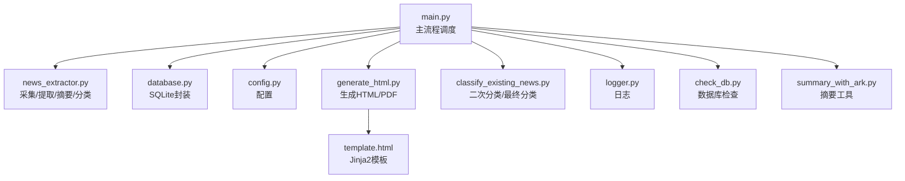
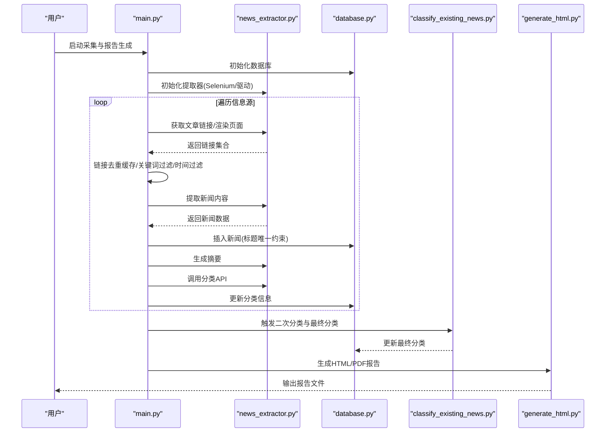
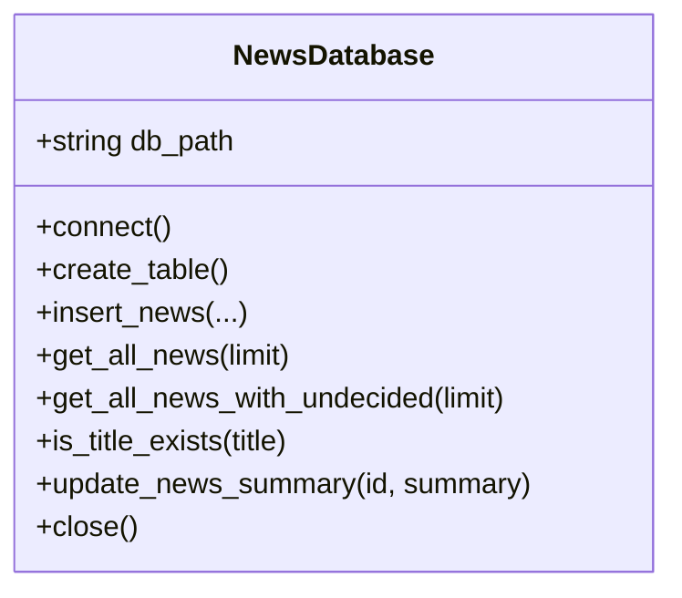
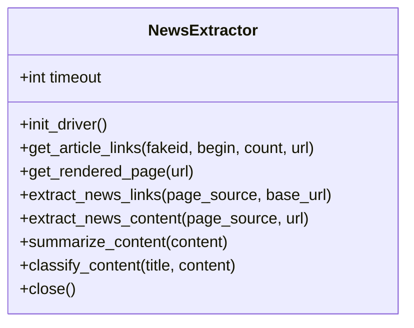
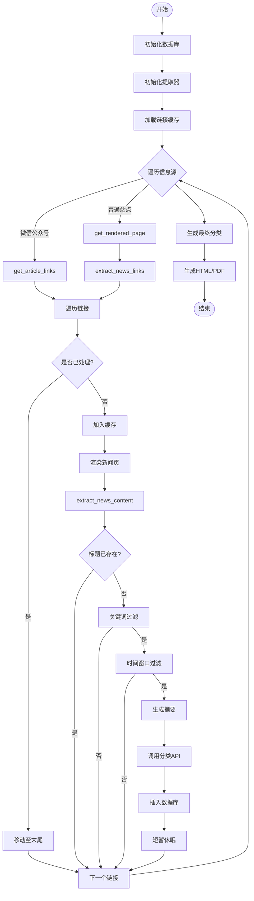

# 快速开始

<cite>
**本文引用的文件**
- [readme.MD](file://readme.MD)
- [requirements.txt](file://requirements.txt)
- [config.py](file://config.py)
- [main.py](file://main.py)
- [database.py](file://database.py)
- [news_extractor.py](file://news_extractor.py)
- [generate_html.py](file://generate_html.py)
- [classify_existing_news.py](file://classify_existing_news.py)
- [logger.py](file://logger.py)
- [check_db.py](file://check_db.py)
- [summary_with_ark.py](file://summary_with_ark.py)
- [template.html](file://template.html)
</cite>

## 目录
1. [简介](#简介)
2. [项目结构](#项目结构)
3. [核心组件](#核心组件)
4. [架构总览](#架构总览)
5. [详细组件分析](#详细组件分析)
6. [依赖与环境配置](#依赖与环境配置)
7. [安装与初始化](#安装与初始化)
8. [基本使用示例](#基本使用示例)
9. [常见配置项说明](#常见配置项说明)
10. [性能与优化建议](#性能与优化建议)
11. [故障排除指南](#故障排除指南)
12. [结语](#结语)

## 简介
news-exacter 是一个面向教育信息化领域的新闻采集与报告生成系统。它通过自动化采集多个信息源的新闻，利用大模型生成摘要，结合百度智能云 NLP 进行分类，最终输出 HTML/PDF 报告。系统默认使用 SQLite 本地数据库存储数据，并支持基于 Jinja2 模板生成静态页面。

## 项目结构
项目采用“功能模块化 + 配置集中”的组织方式：
- 配置层：集中于 config.py，包含信息源、数据库路径、Selenium/提取超时、关键词等
- 核心流程：main.py 串联采集、过滤、摘要、分类、入库、生成报告
- 数据访问：database.py 封装 SQLite 表结构与 CRUD
- 内容提取：news_extractor.py 封装 Selenium 渲染、链接提取、内容抽取、摘要与分类
- 报告生成：generate_html.py 读取数据库、渲染模板、导出 HTML/PDF
- 分类补充：classify_existing_news.py 对已有数据进行二次分类与最终归类
- 工具与诊断：logger.py 日志、check_db.py 数据库检查、summary_with_ark.py 仅摘要工具
- 模板：template.html 用于生成报告页面

图表来源
- [main.py:11-206](file://main.py#L11-L206)
- [news_extractor.py:21-752](file://news_extractor.py#L21-L752)
- [database.py:5-92](file://database.py#L5-L92)
- [config.py:1-78](file://config.py#L1-L78)
- [generate_html.py:1-81](file://generate_html.py#L1-L81)
- [template.html:1-108](file://template.html#L1-L108)
- [classify_existing_news.py:1-302](file://classify_existing_news.py#L1-L302)
- [logger.py:1-104](file://logger.py#L1-L104)
- [check_db.py:1-32](file://check_db.py#L1-L32)
- [summary_with_ark.py:1-60](file://summary_with_ark.py#L1-L60)

章节来源
- [readme.MD:1-11](file://readme.MD#L1-L11)
- [requirements.txt:1-9](file://requirements.txt#L1-L9)
- [config.py:1-78](file://config.py#L1-L78)

## 核心组件
- 配置模块：集中管理信息源、数据库路径、Selenium 超时、提取超时、关键词等
- 数据库模块：封装 SQLite 表结构、插入、查询、更新、关闭
- 新闻提取器：封装 Selenium 驱动初始化、页面渲染、链接提取、内容抽取、摘要生成、分类调用
- 主流程：遍历信息源、链接去重缓存、关键词过滤、时间窗口过滤、摘要与分类、入库、最终分类、生成报告
- 报告生成：读取数据库、按时间窗口过滤、渲染模板、输出 HTML/PDF
- 分类补充：对未分类或需人工复核的数据进行二次分类与最终归类
- 日志模块：统一日志输出与文件轮转

章节来源
- [config.py:1-78](file://config.py#L1-L78)
- [database.py:5-92](file://database.py#L5-L92)
- [news_extractor.py:21-752](file://news_extractor.py#L21-L752)
- [main.py:11-206](file://main.py#L11-L206)
- [generate_html.py:1-81](file://generate_html.py#L1-L81)
- [classify_existing_news.py:1-302](file://classify_existing_news.py#L1-L302)
- [logger.py:1-104](file://logger.py#L1-L104)

## 架构总览
系统采用“采集-过滤-摘要-分类-入库-报告”流水线式架构，核心流程如下：

图表来源
- [main.py:11-206](file://main.py#L11-L206)
- [news_extractor.py:21-752](file://news_extractor.py#L21-L752)
- [database.py:5-92](file://database.py#L5-L92)
- [classify_existing_news.py:237-302](file://classify_existing_news.py#L237-L302)
- [generate_html.py:1-81](file://generate_html.py#L1-L81)

## 详细组件分析

### 配置模块（config.py）
- 信息源列表：包含多个教育/政府/高校站点的入口 URL 与来源名称
- 数据库路径：默认 SQLite 文件路径
- 超时配置：Selenium 页面加载超时、内容提取超时
- 关键词过滤：用于筛选与教育信息化相关的新闻

章节来源
- [config.py:1-78](file://config.py#L1-L78)

### 数据库模块（database.py）
- 表结构：包含标题唯一、URL 唯一、分类字段、最终分类字段、创建时间等
- 功能：插入、查询、去重检查、更新摘要、关闭连接

图表来源
- [database.py:5-92](file://database.py#L5-L92)

章节来源
- [database.py:5-92](file://database.py#L5-L92)

### 新闻提取器（news_extractor.py）
- Selenium 初始化：无头模式、反检测、超时设置
- 微信公众号特殊处理：基于 fakeid 参数与 cookies/querystring 获取文章列表
- 通用链接提取：针对不同站点的 class 特征进行链接提取与相对路径补全
- 内容抽取：使用 GeneralNewsExtractor 提取标题、作者、发布时间、正文等
- 摘要生成：调用火山方舟大模型 API 生成摘要
- 分类调用：调用百度智能云 NLP API 获取主题分类

图表来源
- [news_extractor.py:21-752](file://news_extractor.py#L21-L752)

章节来源
- [news_extractor.py:21-752](file://news_extractor.py#L21-L752)

### 主流程（main.py）
- 初始化数据库与提取器
- 遍历信息源，处理微信公众号与普通站点
- 链接去重缓存（link_cache.json）
- 关键词过滤与时间窗口过滤
- 生成摘要与分类，写入数据库
- 完成后触发二次分类与最终分类
- 生成 HTML/PDF 报告

图表来源
- [main.py:11-206](file://main.py#L11-L206)

章节来源
- [main.py:11-206](file://main.py#L11-L206)

### 报告生成（generate_html.py）
- 读取数据库中近两周内的新闻
- 渲染 Jinja2 模板，输出 HTML 并转换为 PDF

章节来源
- [generate_html.py:1-81](file://generate_html.py#L1-L81)
- [template.html:1-108](file://template.html#L1-L108)

### 分类补充（classify_existing_news.py）
- 对未分类新闻进行二次分类
- 基于来源、作者、标题、内容等规则生成最终分类

章节来源
- [classify_existing_news.py:1-302](file://classify_existing_news.py#L1-L302)

### 日志模块（logger.py）
- 统一日志输出，支持文件轮转与控制台输出

章节来源
- [logger.py:1-104](file://logger.py#L1-L104)

## 依赖与环境配置
- Python 版本：建议使用 Python 3.8+
- 依赖包：见 requirements.txt
- 浏览器驱动：Selenium 需要 ChromeDriver，项目内置了驱动路径配置
- API 密钥：百度智能云 NLP 与火山方舟大模型 API
- 数据库：SQLite（默认）

章节来源
- [requirements.txt:1-9](file://requirements.txt#L1-L9)
- [news_extractor.py:43-76](file://news_extractor.py#L43-L76)
- [config.py:67-78](file://config.py#L67-L78)

## 安装与初始化

### 步骤 1：准备 Python 环境
- 安装 Python 3.8 或以上版本
- 建议使用虚拟环境隔离依赖

### 步骤 2：安装依赖
- 在项目根目录执行安装命令，安装 requirements.txt 中列出的所有依赖

章节来源
- [requirements.txt:1-9](file://requirements.txt#L1-L9)

### 步骤 3：配置 API 密钥
- 在项目根目录创建 .env 文件，设置以下环境变量：
  - WENXIN_API_KEY：百度智能云 NLP API Key
  - WENXIN_SECRET_KEY：百度智能云 NLP Secret Key
  - ARK_API_KEY：火山方舟大模型 API Key
  - wechat_cookie：微信公众号抓取所需的 Cookie 字符串（多个以分号分隔）
  - wechat_querystring：微信公众号抓取所需的 QueryString 参数（不含问号）
- 注意：.env 文件不要提交到版本控制

章节来源
- [news_extractor.py:27-39](file://news_extractor.py#L27-L39)
- [classify_existing_news.py:239-252](file://classify_existing_news.py#L239-L252)

### 步骤 4：初始化数据库
- 首次运行会自动创建 news.db 与 news 表
- 可使用 check_db.py 查看表结构与数据量

章节来源
- [database.py:20-38](file://database.py#L20-L38)
- [check_db.py:1-32](file://check_db.py#L1-L32)

### 步骤 5：配置信息源与关键词
- 在 config.py 中编辑 NEWS_SOURCES 列表，添加或修改目标站点
- 根据业务需求调整 FILTER_KEYWORDS

章节来源
- [config.py:1-78](file://config.py#L1-L78)

### 步骤 6：浏览器驱动准备
- 若使用内置驱动路径，请确保 chromedriver.exe 存在于项目根目录或按需修改路径
- 如需自动管理驱动，可参考 webdriver-manager 的使用方式

章节来源
- [news_extractor.py:56-76](file://news_extractor.py#L56-L76)

## 基本使用示例

### 示例 1：运行新闻采集与报告生成
- 执行主流程脚本，系统将：
  - 遍历配置中的信息源
  - 自动过滤关键词与时间窗口
  - 生成摘要与分类
  - 入库并生成 HTML/PDF 报告

章节来源
- [main.py:11-206](file://main.py#L11-L206)
- [generate_html.py:1-81](file://generate_html.py#L1-L81)

### 示例 2：仅生成摘要
- 使用 summary_with_ark.py 对数据库中未生成摘要的新闻进行批量摘要生成

章节来源
- [summary_with_ark.py:1-60](file://summary_with_ark.py#L1-L60)

### 示例 3：查看数据库状态
- 使用 check_db.py 查看表结构、记录数量与示例数据

章节来源
- [check_db.py:1-32](file://check_db.py#L1-L32)

## 常见配置项说明

- 信息源配置（config.py）
  - NEWS_SOURCES：信息源列表，包含 url 与 source 字段
  - NEWS_SOURCES1：示例配置，可按需启用
- 数据库配置（config.py）
  - DB_PATH：SQLite 数据库文件路径
- 超时配置（config.py）
  - SELENIUM_TIMEOUT：Selenium 页面加载超时
  - EXTRACT_TIMEOUT：内容提取超时
- 关键词过滤（config.py）
  - FILTER_KEYWORDS：用于筛选与教育信息化相关的新闻

章节来源
- [config.py:1-78](file://config.py#L1-L78)

## 性能与优化建议
- 控制并发与请求频率：主流程中对每个链接处理后有短暂休眠，避免请求过快
- 链接去重缓存：使用 link_cache.json 缓存已处理链接，减少重复抓取
- 时间窗口过滤：默认仅处理近一周内的新闻，降低数据规模
- 摘要与分类：仅对未存在的标题进行摘要生成，避免重复调用大模型 API
- 模板渲染：建议在生成 HTML 后再转换为 PDF，减少模板渲染压力

章节来源
- [main.py:173](file://main.py#L173)
- [main.py:24-46](file://main.py#L24-L46)
- [main.py:124-144](file://main.py#L124-L144)
- [main.py:146-147](file://main.py#L146-L147)

## 故障排除指南

- 无法加载 ChromeDriver
  - 现象：Selenium 初始化失败或驱动找不到
  - 处理：确认 chromedriver.exe 路径正确，或使用 webdriver-manager 自动管理
  - 参考路径：[news_extractor.py:56-76](file://news_extractor.py#L56-L76)

- API 密钥未设置
  - 现象：百度智能云或火山方舟调用失败
  - 处理：在 .env 中设置 WENXIN_API_KEY、WENXIN_SECRET_KEY、ARK_API_KEY
  - 参考路径：[news_extractor.py:27-39](file://news_extractor.py#L27-L39)，[classify_existing_news.py:239-252](file://classify_existing_news.py#L239-L252)

- 微信公众号抓取失败
  - 现象：get_article_links 返回空或异常
  - 处理：检查 wechat_cookie 与 wechat_querystring 是否正确设置
  - 参考路径：[news_extractor.py:77-178](file://news_extractor.py#L77-L178)

- 数据库连接问题
  - 现象：插入失败或查询异常
  - 处理：确认 news.db 文件权限与路径，使用 check_db.py 检查表结构
  - 参考路径：[database.py:20-38](file://database.py#L20-L38)，[check_db.py:1-32](file://check_db.py#L1-L32)

- 报告生成失败（PDF）
  - 现象：HTML 成功但 PDF 生成失败
  - 处理：确认 wkhtmltopdf 安装路径与配置
  - 参考路径：[generate_html.py:9-10](file://generate_html.py#L9-L10)，[generate_html.py:79](file://generate_html.py#L79)

- 日志排查
  - 现象：运行无输出或难以定位问题
  - 处理：查看 logs 目录下的日志文件，按类别筛选
  - 参考路径：[logger.py:12-18](file://logger.py#L12-L18)，[logger.py:74-104](file://logger.py#L74-L104)

## 结语
通过上述步骤，您可以快速搭建并运行 news-exacter 系统，实现教育信息化新闻的自动化采集、摘要、分类与报告生成。建议在生产环境中持续监控日志、定期清理缓存与数据库，并根据站点结构变化及时调整链接提取策略。