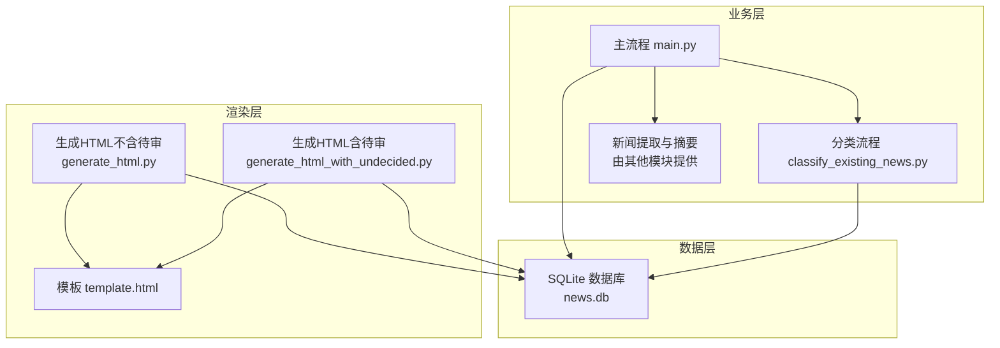
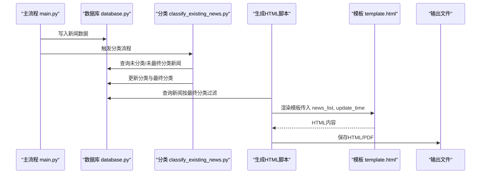
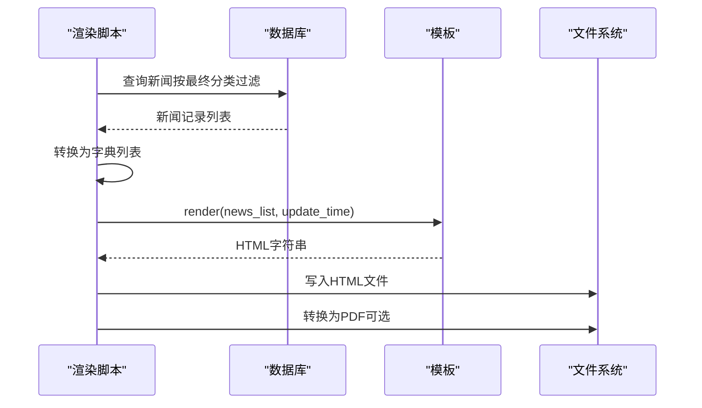
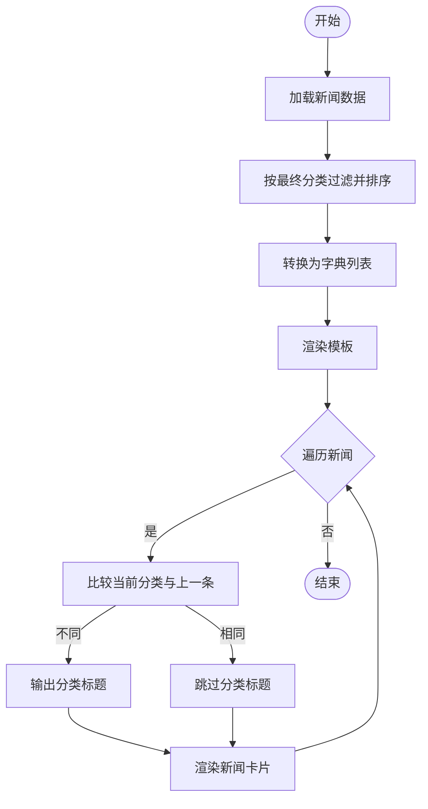
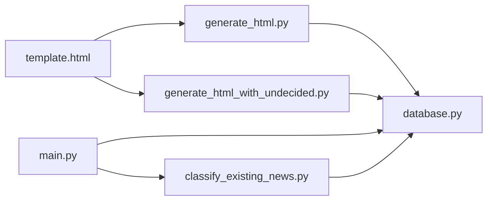

# HTML模板设计

<cite>
**本文引用的文件**
- [template.html](file://template.html)
- [generate_html.py](file://generate_html.py)
- [generate_html_with_undecided.py](file://generate_html_with_undecided.py)
- [database.py](file://database.py)
- [main.py](file://main.py)
- [classify_existing_news.py](file://classify_existing_news.py)
- [config.py](file://config.py)
- [readme.MD](file://readme.MD)
</cite>

## 目录
1. [简介](#简介)
2. [项目结构](#项目结构)
3. [核心组件](#核心组件)
4. [架构总览](#架构总览)
5. [详细组件分析](#详细组件分析)
6. [依赖分析](#依赖分析)
7. [性能考虑](#性能考虑)
8. [故障排查指南](#故障排查指南)
9. [结论](#结论)
10. [附录](#附录)

## 简介
本项目围绕“HTML模板设计”这一主题，系统性地展示了如何使用Jinja2模板引擎将结构化的新闻数据渲染为静态HTML页面，并进一步导出为PDF。本文档重点解析：
- Jinja2模板语法与变量绑定机制
- template.html的结构设计、CSS样式嵌入与响应式布局
- 新闻数据结构与模板字段的映射关系
- 模板变量定义、循环渲染、条件判断等核心功能
- 模板自定义指南、样式修改方法与布局调整技巧
- 常见模板错误排查与性能优化建议

## 项目结构
该项目采用“数据采集与处理 + 数据库存储 + 模板渲染 + 输出”的分层架构。与HTML模板设计直接相关的文件包括：
- 模板文件：template.html
- 渲染脚本：generate_html.py、generate_html_with_undecided.py
- 数据源：database.py（SQLite数据库）
- 主流程：main.py（调度与分类流程）
- 分类与最终分类：classify_existing_news.py
- 配置：config.py
- 说明：readme.MD

图表来源
- [main.py:11-206](file://main.py#L11-L206)
- [generate_html.py:12-81](file://generate_html.py#L12-L81)
- [generate_html_with_undecided.py:8-72](file://generate_html_with_undecided.py#L8-L72)
- [database.py:54-67](file://database.py#L54-L67)
- [classify_existing_news.py:237-302](file://classify_existing_news.py#L237-L302)

章节来源
- [readme.MD:1-11](file://readme.MD#L1-L11)
- [config.py:1-78](file://config.py#L1-L78)

## 核心组件
- 模板文件 template.html：定义页面结构、样式与Jinja2语法，负责将新闻数据渲染为HTML。
- 渲染脚本 generate_html.py：从数据库读取新闻数据，过滤时间范围，转换为字典列表，渲染模板并输出HTML与PDF。
- 渲染脚本 generate_html_with_undecided.py：与上述脚本类似，但包含“待审”状态的新闻。
- 数据库 database.py：提供查询接口，支持按最终分类过滤与排序。
- 主流程 main.py：驱动新闻采集、入库、分类与最终分类，随后触发HTML生成。
- 分类流程 classify_existing_news.py：对数据库中未分类或未最终分类的数据进行分类与最终分类。

章节来源
- [template.html:1-108](file://template.html#L1-L108)
- [generate_html.py:12-81](file://generate_html.py#L12-L81)
- [generate_html_with_undecided.py:8-72](file://generate_html_with_undecided.py#L8-L72)
- [database.py:54-67](file://database.py#L54-L67)
- [main.py:11-206](file://main.py#L11-L206)
- [classify_existing_news.py:237-302](file://classify_existing_news.py#L237-L302)

## 架构总览
下图展示了从数据采集到HTML/PDF输出的端到端流程，以及模板渲染的关键节点。

图表来源
- [main.py:200-204](file://main.py#L200-L204)
- [database.py:54-67](file://database.py#L54-L67)
- [classify_existing_news.py:237-302](file://classify_existing_news.py#L237-L302)
- [generate_html.py:12-81](file://generate_html.py#L12-L81)
- [template.html:87-105](file://template.html#L87-L105)

## 详细组件分析

### 模板文件 template.html 的结构与样式设计
- 页面结构
  - 文档类型声明与语言设置
  - meta viewport用于移动端适配
  - 样式内联于<head>中，便于静态页面独立运行
- 容器与排版
  - 外层容器限制最大宽度并居中，确保在大屏与小屏上的阅读体验
  - 标题区域与更新时间提示
- 新闻卡片布局
  - 每条新闻以独立的“news-item”容器呈现
  - 标题采用超链接指向原文
  - 元信息区包含来源、作者、发布时间、分类（去除前缀）
  - 摘要段落首行缩进，增强中文阅读节奏
  - “查看原文”链接指向新闻URL
- 分类分组
  - 使用Jinja2命名空间与循环控制，仅在分类变化时输出分类标题
- 响应式与可访问性
  - 使用相对单位与盒阴影提升可读性
  - hover效果改善交互反馈

章节来源
- [template.html:1-108](file://template.html#L1-L108)

### Jinja2模板语法与变量绑定机制
- 变量插值
  - 使用双花括号插值渲染动态字段，如更新时间、标题、来源、作者、发布时间、摘要、URL、最终分类等
- 控制结构
  - 使用循环遍历新闻列表，渲染每条新闻的卡片
  - 使用条件判断实现分类标题的按需输出
  - 使用命名空间变量记录当前分类，避免重复输出
- 字符串处理
  - 对最终分类字段进行切片处理，移除前缀以美化显示
- 模板渲染入口
  - 渲染脚本将新闻数据转换为字典列表，并传入模板上下文

章节来源
- [template.html:87-105](file://template.html#L87-L105)
- [generate_html.py:64-70](file://generate_html.py#L64-L70)
- [generate_html_with_undecided.py:59-65](file://generate_html_with_undecided.py#L59-L65)

### 新闻数据结构与模板字段映射
- 数据来源与过滤
  - 生成脚本从数据库读取新闻，按最终分类过滤并按发布时间降序排列
  - 仅包含非“待审”状态的新闻（不含待审版本）
- 字典字段映射
  - 模板中使用的键名与数据库列一一对应，包括：id、title、author、publish_time、source、content、summary、url、category、subcategory、final_category
- 字段用途
  - 标题与URL用于新闻卡片标题与“查看原文”链接
  - 来源、作者、发布时间用于元信息展示
  - 摘要用于正文摘要渲染
  - final_category用于分类分组与标题显示（去除前缀）

章节来源
- [database.py:54-60](file://database.py#L54-L60)
- [generate_html.py:47-62](file://generate_html.py#L47-L62)
- [template.html:95-103](file://template.html#L95-L103)

### 模板渲染流程（代码级序列图）

图表来源
- [generate_html.py:12-81](file://generate_html.py#L12-L81)
- [database.py:54-60](file://database.py#L54-L60)
- [template.html:87-105](file://template.html#L87-L105)

### 模板变量定义、循环渲染与条件判断（流程图）

图表来源
- [generate_html.py:12-42](file://generate_html.py#L12-L42)
- [template.html:87-105](file://template.html#L87-L105)

### 模板自定义指南与样式修改方法
- 自定义分类标题样式
  - 修改分类标题的CSS选择器与属性，以调整字体、间距与边框
- 调整新闻卡片外观
  - 修改新闻项容器的背景色、圆角、阴影与内边距
- 优化摘要排版
  - 调整摘要段落的字号、行高与首行缩进，提升中文阅读体验
- 响应式布局微调
  - 在容器与媒体查询处增加断点，适配更多设备尺寸
- 动态链接行为
  - 在模板中为链接添加目标窗口与可访问性属性，确保用户体验一致

章节来源
- [template.html:14-79](file://template.html#L14-L79)

### 布局调整技巧
- 容器宽度与间距
  - 通过容器的最大宽度与内边距控制页面整体密度
- 分类分组策略
  - 利用命名空间变量与条件判断，仅在分类切换时输出标题，减少冗余
- 链接与交互
  - 为标题与“查看原文”链接添加hover效果，提升可点击性

章节来源
- [template.html:87-105](file://template.html#L87-L105)

## 依赖分析
- 模板依赖
  - 模板依赖于渲染脚本提供的上下文变量（news_list、update_time）
  - 模板依赖数据库中最终分类字段进行分组
- 渲染脚本依赖
  - 渲染脚本依赖数据库查询接口与新闻数据结构
  - 渲染脚本依赖Jinja2模板引擎进行渲染
- 主流程与分类流程
  - 主流程负责采集与入库，分类流程负责生成最终分类，再由渲染脚本消费

图表来源
- [template.html:64-70](file://template.html#L64-L70)
- [generate_html.py:12-16](file://generate_html.py#L12-L16)
- [generate_html_with_undecided.py:8-11](file://generate_html_with_undecided.py#L8-L11)
- [database.py:54-67](file://database.py#L54-L67)
- [main.py:200-204](file://main.py#L200-L204)
- [classify_existing_news.py:237-302](file://classify_existing_news.py#L237-L302)

章节来源
- [generate_html.py:12-81](file://generate_html.py#L12-L81)
- [generate_html_with_undecided.py:8-72](file://generate_html_with_undecided.py#L8-L72)
- [database.py:54-67](file://database.py#L54-L67)
- [main.py:200-204](file://main.py#L200-L204)
- [classify_existing_news.py:237-302](file://classify_existing_news.py#L237-L302)

## 性能考虑
- 数据查询与过滤
  - 在数据库层面进行最终分类过滤与排序，减少Python侧处理开销
- 渲染效率
  - 将新闻数据转换为字典列表后再渲染，避免在模板中进行复杂计算
- 文件写入与导出
  - 一次性写入HTML文件，必要时再转PDF，降低I/O次数
- 模板渲染
  - 使用命名空间变量避免重复输出分类标题，减少DOM节点数量

章节来源
- [generate_html.py:12-42](file://generate_html.py#L12-L42)
- [template.html:87-105](file://template.html#L87-L105)

## 故障排查指南
- 模板变量缺失
  - 现象：页面空白或变量未渲染
  - 排查：确认渲染脚本传入的上下文键名与模板一致
  - 参考：模板变量插值与渲染调用
- 分类标题重复
  - 现象：同一分类多次出现标题
  - 排查：检查命名空间变量与条件判断逻辑
  - 参考：分类分组控制结构
- 数据库查询异常
  - 现象：渲染脚本无法获取新闻数据
  - 排查：确认数据库连接、表结构与查询语句
  - 参考：数据库查询接口与最终分类过滤
- PDF导出失败
  - 现象：HTML生成成功但PDF生成失败
  - 排查：确认wkhtmltopdf路径与依赖安装
  - 参考：渲染脚本中的PDF导出配置

章节来源
- [template.html:87-105](file://template.html#L87-L105)
- [generate_html.py:12-81](file://generate_html.py#L12-L81)
- [database.py:54-60](file://database.py#L54-L60)

## 结论
本项目通过清晰的分层架构与简洁的模板设计，实现了从新闻数据到静态HTML/PDF的高效输出。template.html以Jinja2为核心，结合数据库中的最终分类字段，实现了按类别分组的新闻展示。通过合理的数据结构映射与模板语法运用，既保证了可读性，也兼顾了可扩展性。建议在后续迭代中引入更丰富的样式变量与主题切换机制，以满足多样化的展示需求。

## 附录
- 相关配置与常量
  - 信息来源列表、数据库路径、Selenium超时、筛选关键词等
- 项目说明
  - 项目功能概述与技术栈说明

章节来源
- [config.py:1-78](file://config.py#L1-L78)
- [readme.MD:1-11](file://readme.MD#L1-L11)