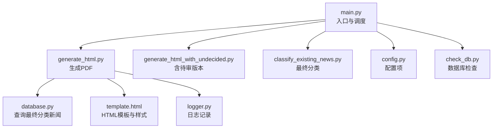
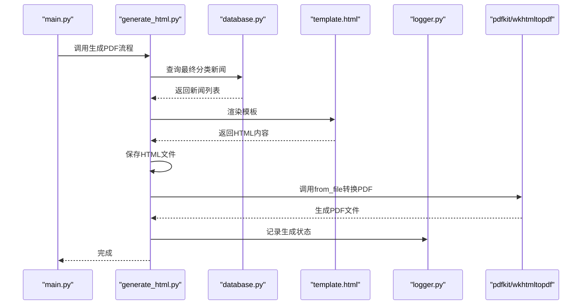
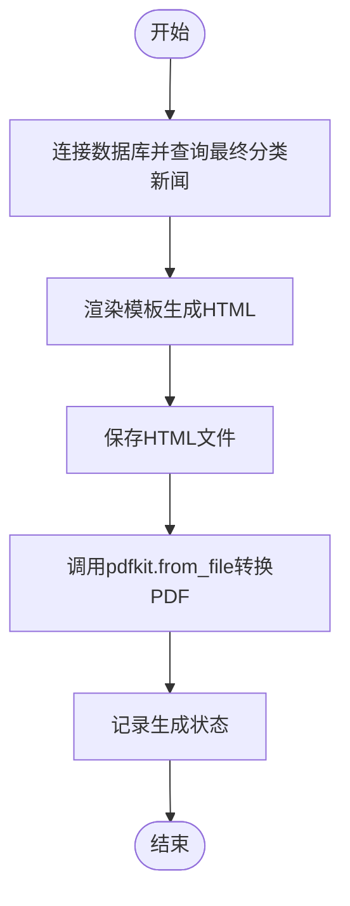
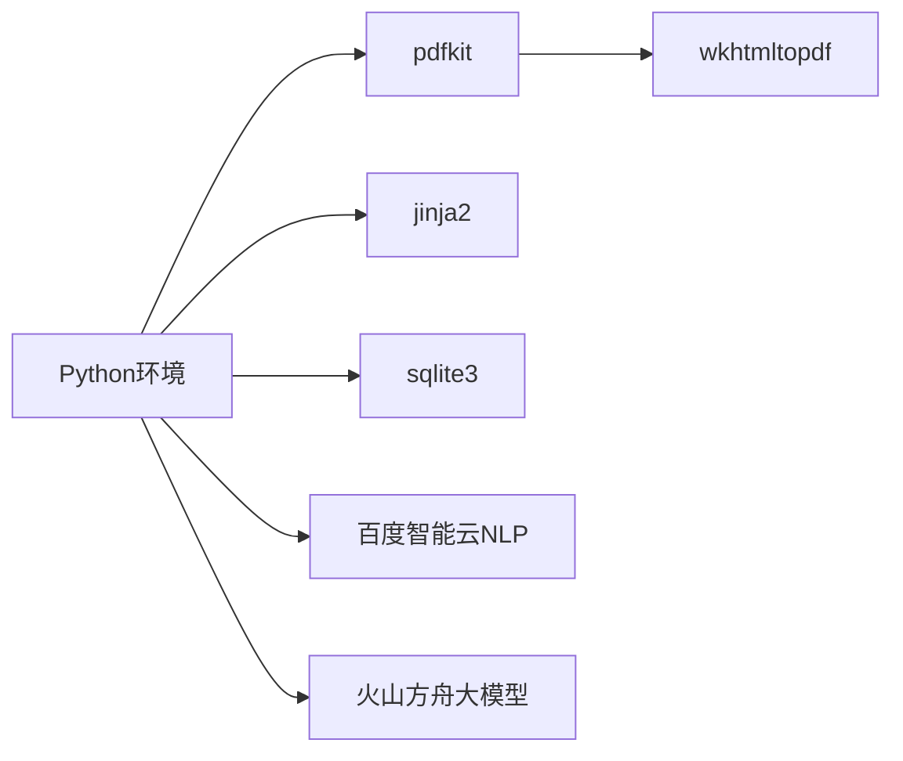

# PDF生成流程

<cite>
**本文引用的文件**
- [generate_html.py](file://generate_html.py)
- [generate_html_with_undecided.py](file://generate_html_with_undecided.py)
- [template.html](file://template.html)
- [database.py](file://database.py)
- [logger.py](file://logger.py)
- [config.py](file://config.py)
- [main.py](file://main.py)
- [classify_existing_news.py](file://classify_existing_news.py)
- [check_db.py](file://check_db.py)
- [requirements.txt](file://requirements.txt)
- [readme.MD](file://readme.MD)
</cite>

## 目录
1. [简介](#简介)
2. [项目结构](#项目结构)
3. [核心组件](#核心组件)
4. [架构总览](#架构总览)
5. [详细组件分析](#详细组件分析)
6. [依赖分析](#依赖分析)
7. [性能考虑](#性能考虑)
8. [故障排查指南](#故障排查指南)
9. [结论](#结论)
10. [附录](#附录)

## 简介
本文件系统化梳理本项目的PDF生成流程，重点覆盖以下方面：
- pdfkit库的配置与使用方法
- wkhtmltopdf集成与转换参数设置
- HTML到PDF的转换机制、页面布局控制与打印样式优化
- PDF生成的完整工作流程、错误处理策略与性能优化技巧
- 页面尺寸、边距、字体渲染等配置方法
- 输出质量控制、批量生成与文件命名规范
- 常见问题排查、依赖安装指南与跨平台兼容性说明

## 项目结构
该项目围绕“新闻采集—分类—摘要—生成HTML—生成PDF”的闭环展开，PDF生成位于数据处理链路的末端，负责将最终分类后的HTML导出为PDF报告。

图表来源
- [main.py:11-206](file://main.py#L11-L206)
- [generate_html.py:1-81](file://generate_html.py#L1-L81)
- [generate_html_with_undecided.py:1-72](file://generate_html_with_undecided.py#L1-L72)
- [database.py:1-92](file://database.py#L1-L92)
- [template.html:1-108](file://template.html#L1-L108)
- [logger.py:1-104](file://logger.py#L1-L104)
- [classify_existing_news.py:1-302](file://classify_existing_news.py#L1-L302)
- [config.py:1-78](file://config.py#L1-L78)
- [check_db.py:1-32](file://check_db.py#L1-L32)

章节来源
- [main.py:11-206](file://main.py#L11-L206)
- [generate_html.py:1-81](file://generate_html.py#L1-L81)
- [generate_html_with_undecided.py:1-72](file://generate_html_with_undecided.py#L1-L72)
- [database.py:1-92](file://database.py#L1-L92)
- [template.html:1-108](file://template.html#L1-L108)
- [logger.py:1-104](file://logger.py#L1-L104)
- [classify_existing_news.py:1-302](file://classify_existing_news.py#L1-L302)
- [config.py:1-78](file://config.py#L1-L78)
- [check_db.py:1-32](file://check_db.py#L1-L32)

## 核心组件
- PDF生成器：通过pdfkit将HTML文件转换为PDF，使用wkhtmltopdf作为底层引擎。
- HTML模板与样式：基于Jinja2模板渲染，包含中文排版、缩进、阴影等打印友好样式。
- 数据源：SQLite数据库，存储新闻元数据、摘要、分类与最终分类。
- 日志系统：统一记录PDF生成过程中的信息、警告与错误。
- 最终分类：对已有新闻进行人工/规则化的最终分类，影响PDF内容分组与展示。

章节来源
- [generate_html.py:7-81](file://generate_html.py#L7-L81)
- [template.html:7-79](file://template.html#L7-L79)
- [database.py:54-67](file://database.py#L54-L67)
- [logger.py:74-104](file://logger.py#L74-L104)
- [classify_existing_news.py:237-302](file://classify_existing_news.py#L237-L302)

## 架构总览
PDF生成流程从数据库中取出最终分类后的新闻，渲染模板生成HTML，再由pdfkit调用wkhtmltopdf生成PDF。整个过程包含数据准备、模板渲染、HTML保存、PDF转换与日志记录。

图表来源
- [generate_html.py:12-81](file://generate_html.py#L12-L81)
- [database.py:54-67](file://database.py#L54-L67)
- [template.html:64-70](file://template.html#L64-L70)
- [logger.py:74-104](file://logger.py#L74-L104)

## 详细组件分析

### 组件一：PDF生成器（pdfkit + wkhtmltopdf）
- 配置方式
  - 显式指定wkhtmltopdf可执行文件路径，确保在Windows环境下稳定运行。
  - 使用pdfkit.configuration创建配置对象，供后续转换使用。
- 转换流程
  - 从数据库读取最终分类新闻，按需过滤时间范围。
  - 渲染模板生成HTML字符串，写入HTML文件。
  - 调用pdfkit.from_file将HTML转换为PDF，输出文件名与HTML同前缀。
- 参数与行为
  - 当前实现未显式传入pdfkit选项（如页面尺寸、边距、字体等），默认使用系统wkhtmltopdf配置。
  - 若需自定义参数，可在from_file调用处传入options参数以覆盖默认行为。

图表来源
- [generate_html.py:12-81](file://generate_html.py#L12-L81)

章节来源
- [generate_html.py:9-10](file://generate_html.py#L9-L10)
- [generate_html.py:12-17](file://generate_html.py#L12-L17)
- [generate_html.py:64-70](file://generate_html.py#L64-L70)
- [generate_html.py:72-79](file://generate_html.py#L72-L79)
- [generate_html.py:79-81](file://generate_html.py#L79-L81)

### 组件二：HTML模板与打印样式（template.html）
- 字体与排版
  - 使用中文字体族，保证中文渲染一致性。
  - 段落首行缩进，提升中文阅读体验。
- 结构与分组
  - 按final_category分组显示新闻，每个分类块独立标题。
  - 新闻卡片包含标题、来源、作者、发布时间、摘要与原文链接。
- 打印友好样式
  - 使用box-shadow与圆角背景，增强打印对比度。
  - 控制容器宽度与间距，避免跨页断裂。
- 注意事项
  - 模板中未包含显式的@page、@media print或分页控制CSS，若需更精细的分页控制，可在模板中补充相应规则。

章节来源
- [template.html:7-79](file://template.html#L7-L79)
- [template.html:87-105](file://template.html#L87-L105)

### 组件三：数据源与过滤（database.py）
- 查询接口
  - 提供按最终分类过滤的查询方法，用于PDF生成的数据筛选。
  - 支持限制返回数量，便于批量生成时控制规模。
- 数据结构
  - 表包含标题、作者、发布时间、来源、内容、摘要、URL、分类、子分类、最终分类等字段。
- 与PDF的关系
  - PDF生成直接依赖最终分类字段进行内容分组与展示。

章节来源
- [database.py:54-67](file://database.py#L54-L67)
- [database.py:20-38](file://database.py#L20-L38)

### 组件四：日志与错误处理（logger.py）
- 日志级别
  - 提供info、debug、error、warning四个便捷函数，按类别记录。
- 文件轮转
  - 使用RotatingFileHandler，单文件最大10MB，最多保留5个备份。
- 在PDF流程中的作用
  - 记录HTML生成与PDF生成的状态，便于追踪问题。

章节来源
- [logger.py:74-104](file://logger.py#L74-L104)
- [generate_html.py:78-81](file://generate_html.py#L78-L81)

### 组件五：最终分类（classify_existing_news.py）
- 分类流程
  - 先调用外部NLP服务获取初步分类与子分类。
  - 再结合来源、作者、标题、内容等规则生成最终分类。
- 与PDF的关系
  - PDF生成依赖最终分类字段进行内容分组与标题展示。

章节来源
- [classify_existing_news.py:237-302](file://classify_existing_news.py#L237-L302)
- [generate_html.py:16-17](file://generate_html.py#L16-L17)

### 组件六：批量生成与命名规范（generate_html_with_undecided.py）
- 含待审版本
  - 提供包含“待审”新闻的HTML生成脚本，便于内部审阅。
- 命名规范
  - 使用日期时间戳作为文件名后缀，确保唯一性与可追溯性。
- 与PDF的关系
  - 该脚本仅生成HTML，不包含PDF转换步骤。

章节来源
- [generate_html_with_undecided.py:67-71](file://generate_html_with_undecided.py#L67-L71)

## 依赖分析
- Python包依赖
  - pdfkit：Python封装wkhtmltopdf，提供从HTML到PDF的转换能力。
  - jinja2：模板渲染引擎，用于将数据注入HTML模板。
  - sqlite3：内置数据库访问，用于存储新闻与分类信息。
- 外部依赖
  - wkhtmltopdf：必须安装并可执行，pdfkit通过配置指向其路径。
  - NLP服务（百度智能云）：用于初步分类，间接影响PDF内容分组。
  - 大模型服务（火山方舟）：用于摘要生成，间接影响PDF内容丰富度。

图表来源
- [requirements.txt:1-10](file://requirements.txt#L1-L10)
- [generate_html.py:7](file://generate_html.py#L7)
- [classify_existing_news.py:92-168](file://classify_existing_news.py#L92-L168)
- [summary_with_ark.py:13-46](file://summary_with_ark.py#L13-L46)

章节来源
- [requirements.txt:1-10](file://requirements.txt#L1-L10)
- [generate_html.py:7](file://generate_html.py#L7)
- [classify_existing_news.py:92-168](file://classify_existing_news.py#L92-L168)
- [summary_with_ark.py:13-46](file://summary_with_ark.py#L13-L46)

## 性能考虑
- 数据量控制
  - 通过limit限制查询数量，避免一次性渲染过多新闻导致内存与CPU压力。
- 时间过滤
  - 仅选择近期新闻，减少模板渲染与PDF生成的工作量。
- 模板渲染
  - Jinja2渲染在内存中完成，注意控制新闻条目数量与字段长度。
- PDF生成
  - 默认参数下，建议在低并发场景使用，避免同时触发大量wkhtmltopdf进程。
- I/O与磁盘
  - HTML与PDF文件均写入磁盘，建议确保磁盘空间充足与写入权限正常。

章节来源
- [generate_html.py:16-17](file://generate_html.py#L16-L17)
- [generate_html.py:20-42](file://generate_html.py#L20-L42)
- [generate_html.py:72-79](file://generate_html.py#L72-L79)

## 故障排查指南
- wkhtmltopdf不可用
  - 现象：pdfkit抛出找不到可执行文件或无法启动进程的异常。
  - 排查：确认wkhtmltopdf已安装，路径配置正确；在Windows上确保路径与分隔符正确。
  - 参考：配置对象中显式指定了wkhtmltopdf路径。
- HTML渲染异常
  - 现象：PDF中图片缺失、样式错乱或内容截断。
  - 排查：检查模板样式是否适合打印；必要时在模板中增加@media print规则；确保字体可用。
- 数据为空或过滤后为空
  - 现象：PDF生成但内容为空。
  - 排查：确认数据库中存在最终分类新闻；检查时间过滤条件是否过于严格。
- 日志定位
  - 使用日志记录器记录生成状态，便于快速定位问题阶段。

章节来源
- [generate_html.py:9-10](file://generate_html.py#L9-L10)
- [generate_html.py:78-81](file://generate_html.py#L78-L81)
- [database.py:54-67](file://database.py#L54-L67)
- [logger.py:74-104](file://logger.py#L74-L104)

## 结论
本项目的PDF生成流程以数据为中心，先完成最终分类与内容筛选，再通过模板渲染与pdfkit转换生成PDF。当前实现简洁可靠，适合小规模、周期性的报告生成。若要扩展到大规模批量生成与更精细的打印控制，建议引入pdfkit的options参数、模板打印样式优化与并发控制策略。

## 附录

### A. 页面尺寸、边距与字体渲染配置
- 页面尺寸与边距
  - 当前未显式传入pdfkit选项，建议在from_file调用处增加options参数以设置纸张大小、边距等。
- 字体渲染
  - 模板中使用中文字体族，确保目标系统具备对应字体；必要时在模板中声明@font-face或使用内嵌字体。
- 打印样式
  - 建议在模板中补充@media print规则，控制分页、页眉页脚与图像渲染。

章节来源
- [generate_html.py:79](file://generate_html.py#L79)
- [template.html:7-79](file://template.html#L7-L79)

### B. 错误处理策略
- 异常捕获
  - PDF生成过程中建议在外层包裹try/except，捕获pdfkit与IO异常并记录日志。
- 数据异常
  - 对发布时间解析失败的情况采用容错处理，避免中断流程。
- 日志分级
  - 使用info/warning/error区分不同严重程度，便于运维与审计。

章节来源
- [generate_html.py:28-36](file://generate_html.py#L28-L36)
- [logger.py:74-104](file://logger.py#L74-L104)

### C. 批量生成与文件命名规范
- 批量生成
  - 通过限制查询数量与时间范围控制批量规模；可拆分为多个批次逐步生成。
- 命名规范
  - 建议统一前缀+日期时间戳+描述，确保唯一性与可排序性。
- 输出路径
  - 建议固定输出目录，便于归档与检索。

章节来源
- [generate_html.py:16-17](file://generate_html.py#L16-L17)
- [generate_html.py:73-74](file://generate_html.py#L73-L74)
- [generate_html_with_undecided.py:68](file://generate_html_with_undecided.py#L68)

### D. 依赖安装与跨平台兼容性
- 依赖安装
  - 使用requirements.txt安装Python依赖；pdfkit依赖wkhtmltopdf。
- Windows
  - 需要显式配置wkhtmltopdf路径；确保可执行文件存在且可访问。
- Linux/Mac
  - 可通过包管理器安装wkhtmltopdf；在Python侧无需显式路径配置（除非自定义安装）。
- 跨平台注意事项
  - 字体与路径分隔符差异；模板中尽量使用相对路径与通用字体。

章节来源
- [requirements.txt:1-10](file://requirements.txt#L1-L10)
- [generate_html.py:9-10](file://generate_html.py#L9-L10)
- [readme.MD:1-11](file://readme.MD#L1-L11)