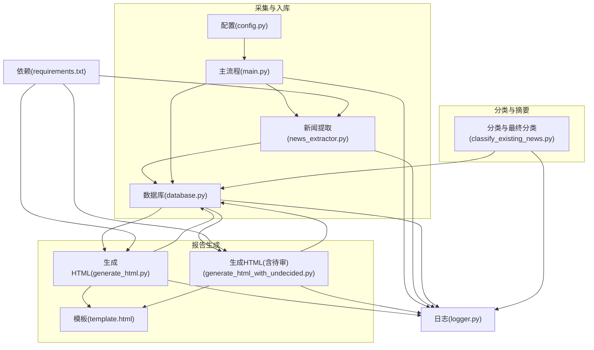
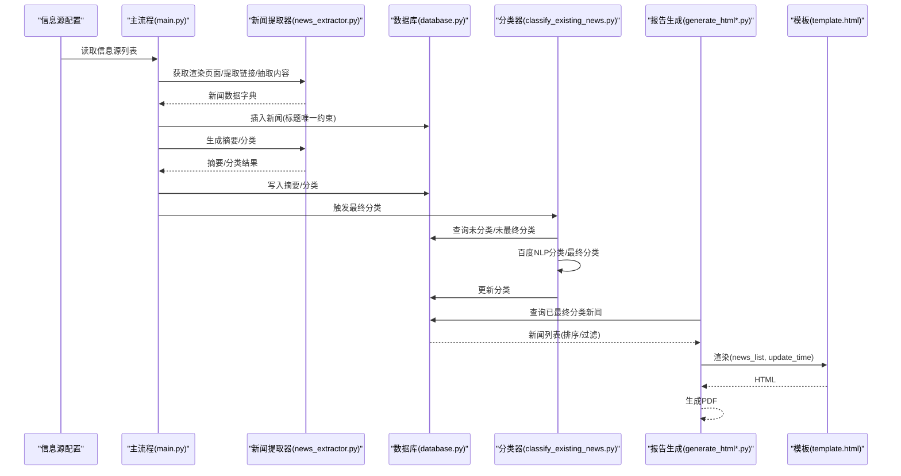
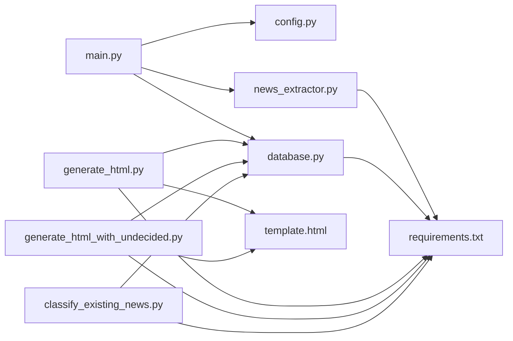
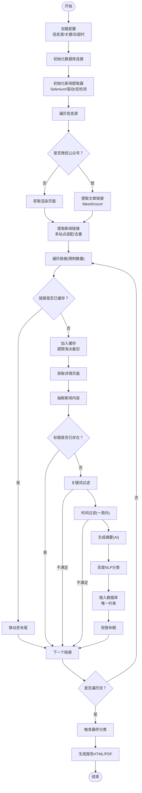

# 报告数据绑定

<cite>
**本文引用的文件**
- [main.py](file://main.py)
- [database.py](file://database.py)
- [generate_html.py](file://generate_html.py)
- [generate_html_with_undecided.py](file://generate_html_with_undecided.py)
- [news_extractor.py](file://news_extractor.py)
- [config.py](file://config.py)
- [logger.py](file://logger.py)
- [classify_existing_news.py](file://classify_existing_news.py)
- [check_db.py](file://check_db.py)
- [template.html](file://template.html)
- [requirements.txt](file://requirements.txt)
- [readme.MD](file://readme.MD)
</cite>

## 目录
1. [简介](#简介)
2. [项目结构](#项目结构)
3. [核心组件](#核心组件)
4. [架构总览](#架构总览)
5. [详细组件分析](#详细组件分析)
6. [依赖分析](#依赖分析)
7. [性能考虑](#性能考虑)
8. [故障排查指南](#故障排查指南)
9. [结论](#结论)
10. [附录](#附录)

## 简介
本项目围绕“新闻数据绑定”这一主题，构建了从采集、清洗、分类与摘要生成，到数据库存储与模板渲染的完整数据流。系统通过配置化信息源、多站点适配的链接提取、统一的数据结构转换、严格的字段映射与验证、时间过滤与排序、以及基于 Jinja2 的模板渲染，最终输出 HTML/PDF 报告。本文档将深入解释数据从数据库查询到模板渲染的全过程，涵盖数据结构转换、字段映射、数据验证、排序与过滤、预处理、模板变量绑定、动态内容生成、数据安全、最佳实践、性能优化与内存管理、格式标准化、异常处理与完整性保障，以及与其他模块的交互关系与依赖管理。

## 项目结构
项目采用功能模块化组织，核心流程分为“采集与入库”、“分类与摘要”、“报告生成”三大阶段，配合数据库与日志模块协同工作。

图表来源
- [main.py:11-198](file://main.py#L11-L198)
- [news_extractor.py:21-758](file://news_extractor.py#L21-L758)
- [database.py:5-92](file://database.py#L5-L92)
- [generate_html.py:1-81](file://generate_html.py#L1-L81)
- [generate_html_with_undecided.py:1-72](file://generate_html_with_undecided.py#L1-L72)
- [classify_existing_news.py:14-302](file://classify_existing_news.py#L14-L302)
- [config.py:1-78](file://config.py#L1-L78)
- [logger.py:1-104](file://logger.py#L1-L104)
- [requirements.txt:1-10](file://requirements.txt#L1-L10)

章节来源
- [main.py:11-198](file://main.py#L11-L198)
- [config.py:1-78](file://config.py#L1-L78)
- [requirements.txt:1-10](file://requirements.txt#L1-L10)

## 核心组件
- 配置模块：集中管理信息源、数据库路径、Selenium超时、筛选关键词等。
- 主流程：负责遍历信息源、调用提取器、执行关键词过滤、时间过滤、摘要与分类、入库与缓存管理。
- 新闻提取器：封装 Selenium、BeautifulSoup、GNX、第三方 API 的能力，实现多站点适配、链接提取、内容抽取、摘要生成、分类。
- 数据库：SQLite 表结构设计、插入、查询、更新、关闭。
- 分类器：对已有数据进行二次分类与最终分类，写回数据库。
- 报告生成：从数据库读取数据，按时间与分类过滤，转换为模板可用结构，渲染 HTML 并导出 PDF。
- 日志：统一日志输出与轮转，支持分类日志。
- 模板：Jinja2 模板，按 final_category 分组渲染。

章节来源
- [config.py:1-78](file://config.py#L1-L78)
- [main.py:11-198](file://main.py#L11-L198)
- [news_extractor.py:21-758](file://news_extractor.py#L21-L758)
- [database.py:5-92](file://database.py#L5-L92)
- [classify_existing_news.py:14-302](file://classify_existing_news.py#L14-L302)
- [generate_html.py:1-81](file://generate_html.py#L1-L81)
- [generate_html_with_undecided.py:1-72](file://generate_html_with_undecided.py#L1-L72)
- [logger.py:1-104](file://logger.py#L1-L104)
- [template.html:1-108](file://template.html#L1-L108)

## 架构总览
系统采用“采集-入库-分类-报告”的流水线式架构，数据在各阶段之间以结构化的字典/元组形式传递，最终以模板变量绑定的方式渲染为 HTML/PDF。

图表来源
- [main.py:11-198](file://main.py#L11-L198)
- [news_extractor.py:21-758](file://news_extractor.py#L21-L758)
- [database.py:5-92](file://database.py#L5-L92)
- [classify_existing_news.py:14-302](file://classify_existing_news.py#L14-L302)
- [generate_html.py:1-81](file://generate_html.py#L1-L81)
- [generate_html_with_undecided.py:1-72](file://generate_html_with_undecided.py#L1-L72)
- [template.html:1-108](file://template.html#L1-L108)

## 详细组件分析

### 数据库层（NewsDatabase）
- 表结构要点：标题唯一、URL 唯一、新增 final_category 字段用于最终分类；插入时自动记录 created_at。
- 查询接口：
  - 获取已最终分类新闻并按发布时间倒序，限制数量。
  - 获取全部新闻（含待审）并按发布时间倒序，限制数量。
  - 按标题唯一性检查。
  - 更新摘要与分类。
- 错误处理：捕获异常并记录日志，返回布尔值表示操作成败。
- 性能与内存：使用原生 SQLite，连接级 text_factory 统一编码；查询使用 LIMIT 控制输出规模。

章节来源
- [database.py:5-92](file://database.py#L5-L92)

### 新闻提取器（NewsExtractor）
- 多站点适配：针对不同站点（如教育部、今日头条、北京政府官网、高校官网等）定制链接提取规则，处理相对路径拼接与去重。
- 内容抽取：使用 GNE + BeautifulSoup，修复特定节点误删问题，确保必要字段存在。
- 摘要生成：调用火山方舟大模型 API，去除 HTML 后进行摘要，短文本直接返回原文。
- 分类：通过百度智能云 NLP API 获取主分类与子分类，失败时降级返回默认值。
- 浏览器初始化：无头模式、反检测参数、超时与隐式等待、驱动路径固定，避免网络下载。
- 资源管理：提供 close 方法释放浏览器资源。

章节来源
- [news_extractor.py:21-758](file://news_extractor.py#L21-L758)

### 主流程（main.py）
- 信息源遍历：读取配置中的信息源列表，区分微信公众号与普通网页。
- 链接缓存：使用有序字典维护最近访问链接，超过阈值淘汰最旧项，支持持久化。
- 内容采集：获取渲染页面、提取链接、逐条抓取新闻详情、抽取内容。
- 数据预处理与过滤：
  - 标题去重检查（入库前）。
  - 关键词过滤（标题+正文包含任一筛选词）。
  - 时间过滤（发布时间在一周内）。
- 摘要与分类：仅当标题不存在时才调用 AI 生成摘要，随后调用百度 NLP 进行分类。
- 入库：插入新闻，包含标题、作者、发布时间、来源、内容、摘要、URL、分类、子分类、创建时间。
- 资源清理：保存缓存、关闭浏览器与数据库连接。

章节来源
- [main.py:11-198](file://main.py#L11-L198)

### 分类与最终分类（classify_existing_news.py）
- 未分类数据查询：category 为空的新闻。
- 百度 NLP 分类：获取 access_token，调用分类 API，解析主分类与子分类。
- 最终分类：根据来源、作者、标题/内容关键词、分类结果综合判定，写入 final_category。
- 数据库更新：分别更新分类与最终分类字段。

章节来源
- [classify_existing_news.py:14-302](file://classify_existing_news.py#L14-L302)

### 报告生成（generate_html.py 与 generate_html_with_undecided.py）
- 数据查询：从数据库读取已最终分类新闻，按发布时间倒序，限制数量。
- 时间过滤：保留近两周内的新闻，解析失败或无时间字段的记录默认保留。
- 结构转换：将数据库元组转换为字典列表，确保字段存在性（缺省为空字符串）。
- 模板渲染：使用 Jinja2 模板，传入 news_list 与 update_time。
- 输出：生成 HTML 文件，并通过 wkhtmltopdf 转为 PDF。

章节来源
- [generate_html.py:1-81](file://generate_html.py#L1-L81)
- [generate_html_with_undecided.py:1-72](file://generate_html_with_undecided.py#L1-L72)
- [template.html:1-108](file://template.html#L1-L108)

### 模板（template.html）
- 按 final_category 分组渲染，使用命名空间变量跟踪当前分类，避免重复标题。
- 字段绑定：title、source、author、publish_time、summary、url、final_category。
- 动态内容：更新时间为运行时生成的时间戳。

章节来源
- [template.html:1-108](file://template.html#L1-L108)

### 日志（logger.py）
- 统一日志格式与轮转，支持 info/debug/error/warning 四种级别，按类别命名记录器。
- 输出到文件与控制台，便于问题追踪与审计。

章节来源
- [logger.py:1-104](file://logger.py#L1-L104)

### 配置（config.py）
- 信息源列表：包含多个微信公众号与政府/高校官网。
- 数据库路径、Selenium 超时、提取超时、筛选关键词集合。

章节来源
- [config.py:1-78](file://config.py#L1-L78)

## 依赖分析
- 外部依赖：selenium、GeneralNewsExtractor、requests、beautifulsoup4、lxml、webdriver-manager、python-dotenv、openai、jinja2。
- 模块间耦合：
  - main.py 依赖 config、news_extractor、database、logger。
  - news_extractor 依赖 selenium、bs4、gne、requests、openai、dotenv。
  - database 依赖 sqlite3、logger。
  - classify_existing_news 依赖 requests、sqlite3、logger。
  - generate_html 与 generate_html_with_undecided 依赖 database、jinja2、pdfkit、logger。
  - template.html 为纯前端模板，无后端依赖。

图表来源
- [main.py:11-198](file://main.py#L11-L198)
- [news_extractor.py:21-758](file://news_extractor.py#L21-L758)
- [database.py:5-92](file://database.py#L5-L92)
- [generate_html.py:1-81](file://generate_html.py#L1-L81)
- [generate_html_with_undecided.py:1-72](file://generate_html_with_undecided.py#L1-L72)
- [classify_existing_news.py:14-302](file://classify_existing_news.py#L14-L302)
- [requirements.txt:1-10](file://requirements.txt#L1-L10)

章节来源
- [requirements.txt:1-10](file://requirements.txt#L1-L10)

## 性能考虑
- 数据库查询与排序
  - 使用 LIMIT 控制输出规模，避免一次性加载过多数据。
  - 查询时按发布日期倒序，减少后续排序成本。
- 缓存与去重
  - 链接缓存采用有序字典，O(1) 访问与移动，超过阈值淘汰最旧项，降低重复抓取。
  - 链接提取阶段进行去重，减少无效请求。
- 网络与渲染
  - Selenium 无头模式与超时设置，避免长时间阻塞。
  - 对特定站点（如今日头条）增加等待与滚动，提升内容加载稳定性。
- 摘要与分类
  - 仅在标题不存在时生成摘要，避免重复调用 API。
  - 分类与最终分类分离，批量处理未分类数据，减少实时开销。
- 模板渲染
  - 先在 Python 层完成数据转换与过滤，再交给模板引擎，降低模板复杂度。
  - 使用分组渲染减少重复标题输出。

[本节为通用性能建议，无需特定文件引用]

## 故障排查指南
- 数据库连接与编码
  - 若出现乱码或无法插入，检查 text_factory 设置与 UTF-8 编码一致性。
- Selenium 驱动问题
  - 驱动路径需与实际路径一致，避免网络下载失败；必要时手动放置 chromedriver.exe。
  - 反检测参数与超时设置需根据目标站点调整。
- API 密钥与网络
  - 百度 NLP 与火山方舟 API 需正确配置环境变量；网络不稳定时增加重试或超时。
- 摘要与分类失败
  - 摘要生成失败时返回原文；分类失败时返回默认分类，确保流程不中断。
- 模板渲染异常
  - 确保模板变量齐全（如 final_category），缺失字段使用空字符串兜底。
- 日志定位
  - 使用分类日志（info/debug/error/warning）快速定位问题模块与错误堆栈。

章节来源
- [logger.py:1-104](file://logger.py#L1-L104)
- [news_extractor.py:21-758](file://news_extractor.py#L21-L758)
- [database.py:5-92](file://database.py#L5-L92)
- [generate_html.py:1-81](file://generate_html.py#L1-L81)
- [generate_html_with_undecided.py:1-72](file://generate_html_with_undecided.py#L1-L72)

## 结论
本项目通过清晰的模块划分与稳健的数据流设计，实现了从多源采集、结构化存储、智能摘要与分类，到模板渲染与报告输出的闭环。数据绑定的关键在于：
- 统一的数据结构转换与字段映射，确保模板渲染所需字段完备。
- 严格的时间过滤与排序策略，提升报告时效性与可读性。
- 完善的异常处理与日志体系，保障流程稳定性与可追溯性。
- 资源管理与性能优化策略，兼顾吞吐量与系统健康。

[本节为总结性内容，无需特定文件引用]

## 附录

### 数据绑定流程图（代码级）

图表来源
- [main.py:11-198](file://main.py#L11-L198)
- [news_extractor.py:21-758](file://news_extractor.py#L21-L758)
- [database.py:5-92](file://database.py#L5-L92)
- [classify_existing_news.py:14-302](file://classify_existing_news.py#L14-L302)
- [generate_html.py:1-81](file://generate_html.py#L1-L81)
- [generate_html_with_undecided.py:1-72](file://generate_html_with_undecided.py#L1-L72)

### 数据结构与字段映射
- 数据库表字段（示例）：id、title、author、publish_time、source、content、summary、url、category、subcategory、final_category、created_at。
- 模板渲染字典字段：id、title、author、publish_time、source、content、summary、url、category、subcategory、final_category。
- 字段映射策略：
  - 从数据库元组到字典：按索引映射，缺失字段使用空字符串兜底。
  - 模板变量：news_list 为字典列表，update_time 为字符串时间戳。

章节来源
- [database.py:20-38](file://database.py#L20-L38)
- [generate_html.py:47-62](file://generate_html.py#L47-L62)
- [generate_html_with_undecided.py:42-57](file://generate_html_with_undecided.py#L42-L57)

### 数据验证与完整性保障
- 唯一性约束：标题与 URL 唯一，避免重复入库。
- 字段存在性：抽取与转换阶段确保必要字段存在，模板渲染前补齐。
- 异常捕获：数据库、API、模板渲染均捕获异常并记录日志。
- 数据完整性：分类与最终分类分步写入，失败不影响主流程。

章节来源
- [database.py:40-52](file://database.py#L40-L52)
- [news_extractor.py:685-708](file://news_extractor.py#L685-L708)
- [generate_html.py:47-62](file://generate_html.py#L47-L62)

### 模板变量绑定与动态内容生成
- 绑定方式：Jinja2 render(news_list=..., update_time=...)。
- 动态分组：使用命名空间变量跟踪当前分类，按 final_category 分组输出。
- 动态链接：新闻标题与原文链接绑定，支持外部打开。

章节来源
- [generate_html.py:68-70](file://generate_html.py#L68-L70)
- [template.html:87-105](file://template.html#L87-L105)

### 最佳实践与性能优化清单
- 数据库
  - 使用 LIMIT 控制查询规模；按发布日期倒序减少排序成本。
  - 唯一约束避免重复数据。
- 采集与预处理
  - 链接缓存与去重；多站点规则集中维护；相对路径拼接规范化。
  - 关键词与时间过滤前置，减少入库压力。
- 摘要与分类
  - 标题存在性检查后再调用 AI；分类失败降级返回默认值。
- 模板与渲染
  - 在 Python 层完成数据转换与过滤，模板保持简洁。
  - 使用分组渲染减少重复标题。
- 资源与性能
  - Selenium 无头模式与超时设置；驱动路径固定；及时关闭资源。
  - 日志轮转与分类日志，便于问题定位。

[本节为通用最佳实践，无需特定文件引用]