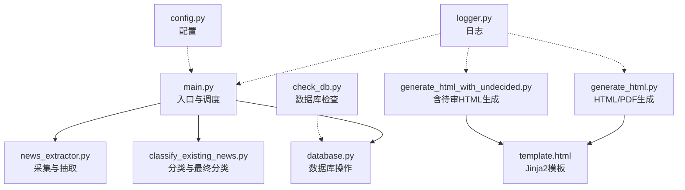
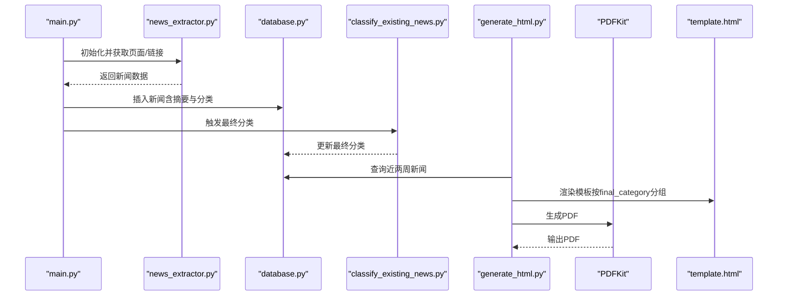
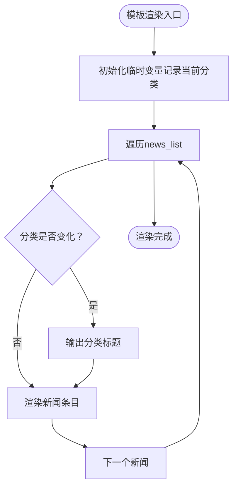
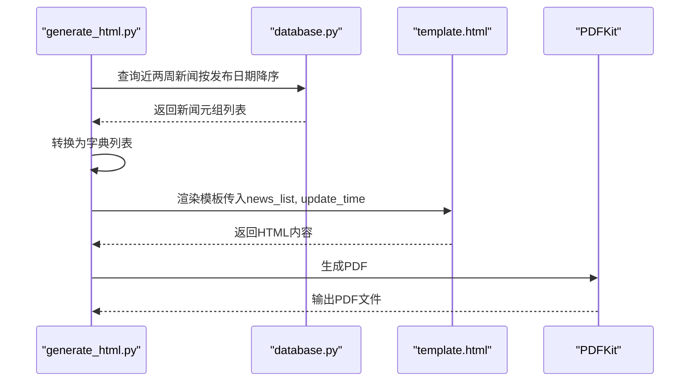
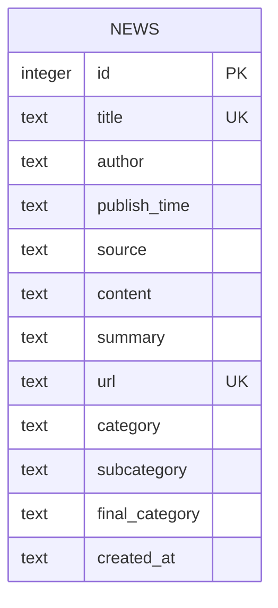
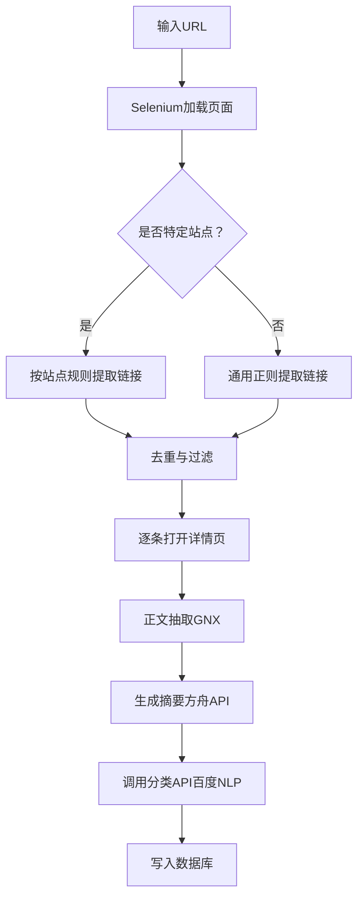
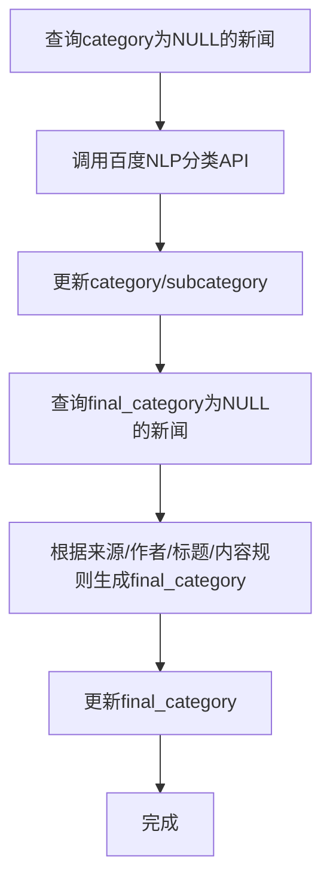
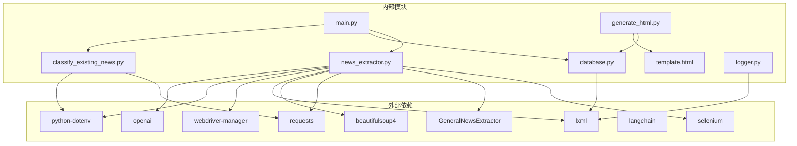

# 报告生成系统

<cite>
**本文引用的文件**
- [main.py](file://main.py)
- [generate_html.py](file://generate_html.py)
- [generate_html_with_undecided.py](file://generate_html_with_undecided.py)
- [template.html](file://template.html)
- [config.py](file://config.py)
- [database.py](file://database.py)
- [news_extractor.py](file://news_extractor.py)
- [classify_existing_news.py](file://classify_existing_news.py)
- [logger.py](file://logger.py)
- [check_db.py](file://check_db.py)
- [requirements.txt](file://requirements.txt)
- [readme.MD](file://readme.MD)
- [summary_with_ark.py](file://summary_with_ark.py)
</cite>

## 目录
1. [简介](#简介)
2. [项目结构](#项目结构)
3. [核心组件](#核心组件)
4. [架构总览](#架构总览)
5. [详细组件分析](#详细组件分析)
6. [依赖关系分析](#依赖关系分析)
7. [性能考虑](#性能考虑)
8. [故障排除指南](#故障排除指南)
9. [结论](#结论)
10. [附录](#附录)

## 简介
本项目是一个教育信息化领域的新闻采集与报告生成系统，围绕“新闻采集—内容抽取—摘要生成—分类—数据库存储—HTML/PDF报告生成”的完整流水线展开。系统通过Jinja2模板引擎渲染HTML报告，并结合PDFKit将HTML转换为PDF，支持按“最终分类”进行分组展示，同时提供“含待审”版本的报告生成能力。系统还内置了日志模块、数据库结构与查询工具，便于运维与排障。

## 项目结构
项目采用功能模块化组织，核心文件包括：
- 入口与调度：main.py
- 报告生成：generate_html.py、generate_html_with_undecided.py
- 模板：template.html
- 配置：config.py
- 数据库：database.py
- 新闻采集与抽取：news_extractor.py
- 分类与最终分类：classify_existing_news.py
- 日志：logger.py
- 数据库检查：check_db.py
- 依赖：requirements.txt
- 说明：readme.MD
- 摘要生成脚本：summary_with_ark.py

图表来源
- [main.py:11-206](file://main.py#L11-L206)
- [generate_html.py:1-81](file://generate_html.py#L1-L81)
- [generate_html_with_undecided.py:1-72](file://generate_html_with_undecided.py#L1-L72)
- [template.html:1-108](file://template.html#L1-L108)
- [config.py:1-78](file://config.py#L1-L78)
- [database.py:1-92](file://database.py#L1-L92)
- [news_extractor.py:1-800](file://news_extractor.py#L1-L800)
- [classify_existing_news.py:1-302](file://classify_existing_news.py#L1-L302)
- [logger.py:1-104](file://logger.py#L1-L104)
- [check_db.py:1-32](file://check_db.py#L1-L32)

章节来源
- [main.py:11-206](file://main.py#L11-L206)
- [config.py:1-78](file://config.py#L1-L78)
- [readme.MD:1-11](file://readme.MD#L1-L11)

## 核心组件
- 新闻采集与抽取：负责从多个信息源抓取页面、解析链接、抽取正文、生成摘要、调用分类API并写入数据库。
- 数据库：封装SQLite访问，提供插入、查询、更新、去重等能力。
- 分类与最终分类：对未分类新闻进行初步分类，再根据来源、作者、标题等规则生成“最终分类”，用于报告分组展示。
- 报告生成：读取数据库中近两周新闻，按“最终分类”分组渲染HTML模板，导出HTML与PDF。
- 日志：统一的日志记录器，按类别输出到文件与控制台。
- 配置：集中管理信息源、数据库路径、超时、筛选关键词等。

章节来源
- [news_extractor.py:21-752](file://news_extractor.py#L21-L752)
- [database.py:5-92](file://database.py#L5-L92)
- [classify_existing_news.py:64-302](file://classify_existing_news.py#L64-L302)
- [generate_html.py:1-81](file://generate_html.py#L1-L81)
- [logger.py:25-104](file://logger.py#L25-L104)
- [config.py:1-78](file://config.py#L1-L78)

## 架构总览
系统整体流程分为“采集—处理—存储—生成—导出”五步，如下图所示：

图表来源
- [main.py:11-206](file://main.py#L11-L206)
- [news_extractor.py:180-752](file://news_extractor.py#L180-L752)
- [database.py:40-92](file://database.py#L40-L92)
- [classify_existing_news.py:237-302](file://classify_existing_news.py#L237-L302)
- [generate_html.py:12-81](file://generate_html.py#L12-L81)
- [template.html:87-105](file://template.html#L87-L105)

## 详细组件分析

### 组件A：HTML模板设计与Jinja2使用
- 模板结构：模板采用标准HTML结构，包含容器、标题、更新时间、按“最终分类”分组的新闻项。
- Jinja2语法：使用循环与条件判断实现分组标题与新闻条目渲染；通过命名空间变量记录当前分类，实现相邻同类新闻的标题去重。
- 动态内容：模板接收两个上下文变量：news_list（字典列表）、update_time（字符串）。
- 分组策略：通过遍历news_list，当发现新的final_category时输出分类标题，随后输出该分类下的所有新闻条目。

图表来源
- [template.html:87-105](file://template.html#L87-L105)

章节来源
- [template.html:1-108](file://template.html#L1-L108)

### 组件B：报告生成流程与数据绑定
- 数据来源：从数据库查询近两周新闻，按发布日期降序排列，过滤掉非“最终分类”为“待审”的条目。
- 数据绑定：将查询结果映射为字典列表，键包括id、title、author、publish_time、source、content、summary、url、category、subcategory、final_category。
- 渲染与导出：使用Jinja2渲染模板，生成HTML文件；随后通过PDFKit将HTML转换为PDF。

图表来源
- [generate_html.py:12-81](file://generate_html.py#L12-L81)
- [template.html:87-105](file://template.html#L87-L105)

章节来源
- [generate_html.py:1-81](file://generate_html.py#L1-L81)

### 组件C：数据库查询与报告格式配置
- 查询接口：
  - get_all_news(limit=None)：查询final_category不为“待审”的新闻，按发布日期降序。
  - get_all_news_with_undecided(limit=None)：查询全部新闻（含“待审”），用于“含待审”报告。
- 表结构：包含标题唯一约束、URL唯一约束、创建时间字段，以及分类相关字段（category、subcategory、final_category）。
- 报告格式：模板按final_category分组，分类标题样式独立，新闻条目包含标题、来源、作者、发布时间、摘要与原文链接。

图表来源
- [database.py:20-38](file://database.py#L20-L38)

章节来源
- [database.py:40-92](file://database.py#L40-L92)
- [generate_html_with_undecided.py:1-72](file://generate_html_with_undecided.py#L1-L72)

### 组件D：新闻采集与内容抽取
- 页面渲染：使用Selenium驱动无头浏览器加载页面，针对特定站点（如今日头条）增加滚动等待。
- 链接提取：针对不同站点采用差异化选择器与相对路径处理，最终统一去重与过滤。
- 正文抽取：使用GeneralNewsExtractor去除评论、广告等噪声节点，提取标题、作者、发布时间、来源、正文与URL。
- 摘要生成：调用火山方舟（Volces）大模型API生成摘要，支持备用脚本批量补摘要。
- 分类：调用百度智能云NLP分类API生成主分类与子分类。

图表来源
- [news_extractor.py:180-752](file://news_extractor.py#L180-L752)

章节来源
- [news_extractor.py:21-752](file://news_extractor.py#L21-L752)

### 组件E：分类与最终分类
- 初步分类：对category为NULL的新闻调用百度NLP分类API，写入category与subcategory。
- 最终分类：根据来源、作者、标题关键词、内容关键词等规则，生成final_category（如“1.行业新闻”、“2.专家视点”、“3.高校动态”、“4.科技前沿”、“待审”）。
- 更新策略：先更新category/subcategory，再更新final_category。

图表来源
- [classify_existing_news.py:283-302](file://classify_existing_news.py#L283-L302)

章节来源
- [classify_existing_news.py:64-302](file://classify_existing_news.py#L64-L302)

### 组件F：日志与错误处理
- 日志模块：按类别创建独立Logger，输出到文件与控制台，支持轮转。
- 错误处理：在采集、分类、数据库操作、PDF生成等关键环节均捕获异常并记录日志。

章节来源
- [logger.py:25-104](file://logger.py#L25-L104)
- [main.py:176-182](file://main.py#L176-L182)
- [generate_html.py:79-81](file://generate_html.py#L79-L81)

## 依赖关系分析
- 外部依赖：selenium、GeneralNewsExtractor、requests、beautifulsoup4、lxml、webdriver-manager、python-dotenv、langchain、openai。
- 内部模块耦合：main.py依赖news_extractor.py、database.py、classify_existing_news.py；report生成模块依赖database.py与template.html；分类模块依赖database.py与百度NLP API。

图表来源
- [requirements.txt:1-9](file://requirements.txt#L1-L9)
- [main.py:1-206](file://main.py#L1-L206)
- [generate_html.py:1-81](file://generate_html.py#L1-L81)
- [news_extractor.py:1-800](file://news_extractor.py#L1-L800)
- [classify_existing_news.py:1-302](file://classify_existing_news.py#L1-L302)
- [database.py:1-92](file://database.py#L1-L92)
- [logger.py:1-104](file://logger.py#L1-L104)

章节来源
- [requirements.txt:1-9](file://requirements.txt#L1-L9)

## 性能考虑
- 采集性能
  - 无头浏览器与反检测参数减少被反爬识别风险，但会带来CPU与内存开销。建议在服务器上运行并合理设置超时。
  - 对特定站点（如今日头条）增加滚动与等待，避免内容未加载导致的链接缺失。
- 数据库性能
  - SQLite适合小规模数据，若新闻量增长，建议迁移至PostgreSQL/MySQL并建立索引（如final_category、publish_time）。
  - 查询时按发布日期降序，减少前端排序成本。
- 摘要与分类
  - 摘要与分类API调用次数较多，建议在批量处理时增加重试与限速，避免触发配额限制。
- 报告生成
  - HTML渲染与PDF转换耗时较长，建议在生成完成后清理中间HTML文件，避免磁盘占用。
- 缓存
  - main.py中实现了链接缓存（OrderedDict），避免重复处理相同链接，提高整体效率。

章节来源
- [news_extractor.py:43-76](file://news_extractor.py#L43-L76)
- [main.py:24-47](file://main.py#L24-L47)
- [generate_html.py:12-45](file://generate_html.py#L12-L45)

## 故障排除指南
- Selenium驱动问题
  - 症状：无法启动浏览器或页面加载失败。
  - 处理：确认ChromeDriver路径与版本匹配，或使用webdriver-manager自动管理；检查反检测参数与超时设置。
- PDF生成失败
  - 症状：PDFKit抛出异常。
  - 处理：确认wkhtmltopdf安装路径与可执行权限；检查HTML内容是否包含不可渲染元素。
- 百度NLP/方舟API失败
  - 症状：分类或摘要生成失败。
  - 处理：检查API密钥配置与网络连通性；适当增加超时与重试。
- 数据库异常
  - 症状：插入失败或查询异常。
  - 处理：使用check_db.py检查表结构与数据；确认唯一约束冲突（标题/URL）。
- 日志定位
  - 使用logger模块输出的分类日志快速定位问题模块（如“classification”、“database”、“cache”）。

章节来源
- [news_extractor.py:180-206](file://news_extractor.py#L180-L206)
- [generate_html.py:9-10](file://generate_html.py#L9-L10)
- [generate_html.py:79-81](file://generate_html.py#L79-L81)
- [classify_existing_news.py:246-252](file://classify_existing_news.py#L246-L252)
- [check_db.py:1-32](file://check_db.py#L1-L32)
- [logger.py:58-104](file://logger.py#L58-L104)

## 结论
本系统通过“采集—抽取—摘要—分类—存储—报告生成”的闭环，实现了教育信息化领域周报的自动化生产。Jinja2模板与PDFKit的组合提供了灵活的报告格式与稳定的导出能力；数据库结构清晰，便于扩展与维护。建议后续在高并发场景下引入异步任务队列与数据库迁移，并完善监控与告警体系。

## 附录

### 模板自定义指南
- 修改布局：在template.html中调整容器、标题与分组标题样式，确保与业务风格一致。
- 动态内容：通过news_list与update_time传参，按需增删字段（如新增字段需同步更新数据绑定逻辑）。
- 分组策略：如需按其他维度分组，可在生成阶段对数据进行预处理，或将模板中的分组逻辑迁移到Python侧。

章节来源
- [template.html:1-108](file://template.html#L1-L108)
- [generate_html.py:47-70](file://generate_html.py#L47-L70)

### 样式修改示例
- 字体与颜色：在template.html的<style>中调整body、标题、摘要等元素的字体与颜色。
- 布局：调整.container的最大宽度与边距，适配不同屏幕尺寸。
- 分类标题：修改.category-title的样式以突出不同层级的分类。

章节来源
- [template.html:7-79](file://template.html#L7-L79)

### 输出格式配置
- HTML/PDF命名：在generate_html.py与generate_html_with_undecided.py中调整输出文件名前缀与时间戳格式。
- PDF参数：在generate_html.py中配置PDFKit的wkhtmltopdf路径与选项（如纸张大小、边距等）。

章节来源
- [generate_html.py:73-81](file://generate_html.py#L73-L81)
- [generate_html_with_undecided.py:68-72](file://generate_html_with_undecided.py#L68-L72)

### 报告生成与数据库查询的关系
- 报告生成依赖数据库中的final_category字段进行分组；未完成最终分类的数据默认不参与报告生成。
- “含待审”版本通过get_all_news_with_undecided查询全部新闻，便于人工复核后再统一生成报告。

章节来源
- [database.py:54-67](file://database.py#L54-L67)
- [generate_html.py:15-42](file://generate_html.py#L15-L42)
- [generate_html_with_undecided.py:10-37](file://generate_html_with_undecided.py#L10-L37)

### 不同分类的展示效果
- 分类规则：最终分类由来源、作者、标题与内容关键词共同决定，形成“1.行业新闻”、“2.专家视点”、“3.高校动态”、“4.科技前沿”、“待审”等层级。
- 展示差异：模板按final_category分组输出标题，同一分组内的新闻条目样式一致，便于阅读与筛选。

章节来源
- [classify_existing_news.py:169-235](file://classify_existing_news.py#L169-L235)
- [template.html:87-105](file://template.html#L87-L105)