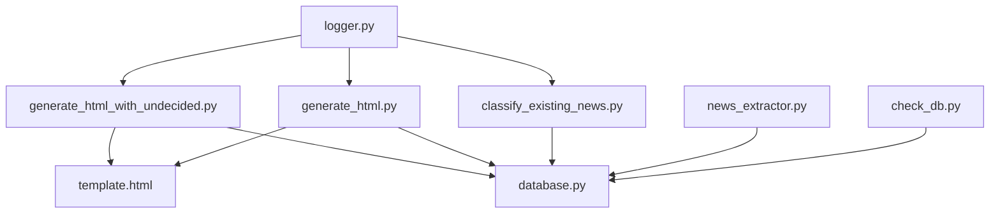
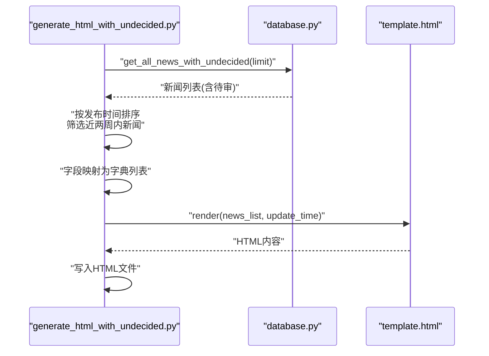
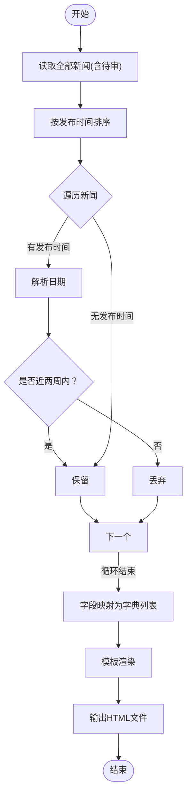
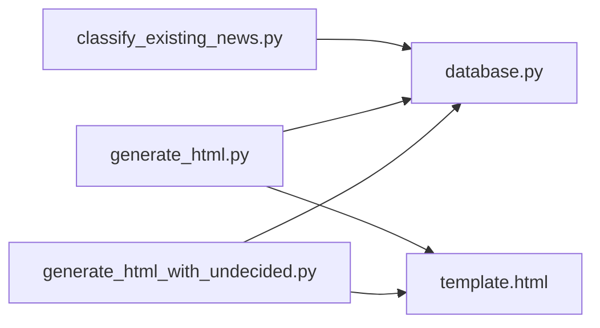

# 未决报告生成

<cite>
**本文引用的文件**
- [generate_html_with_undecided.py](file://generate_html_with_undecided.py)
- [generate_html.py](file://generate_html.py)
- [database.py](file://database.py)
- [template.html](file://template.html)
- [classify_existing_news.py](file://classify_existing_news.py)
- [config.py](file://config.py)
- [logger.py](file://logger.py)
- [news_extractor.py](file://news_extractor.py)
- [check_db.py](file://check_db.py)
- [requirements.txt](file://requirements.txt)
- [readme.MD](file://readme.MD)
</cite>

## 目录
1. [简介](#简介)
2. [项目结构](#项目结构)
3. [核心组件](#核心组件)
4. [架构总览](#架构总览)
5. [详细组件分析](#详细组件分析)
6. [依赖关系分析](#依赖关系分析)
7. [性能考虑](#性能考虑)
8. [故障排查指南](#故障排查指南)
9. [结论](#结论)
10. [附录](#附录)

## 简介
本文件围绕“未决报告生成”主题，系统性阐述 generate_html_with_undecided.py 脚本的功能特性、使用场景与实现细节。重点包括：
- 未决新闻的筛选逻辑与特殊标记处理
- 独立报告生成机制与输出格式
- 未决新闻与正常新闻的数据结构差异与显示方式
- 生成流程、模板定制与协作关系
- 未决新闻管理策略、人工审核流程与后续处理建议

## 项目结构
该项目采用“脚本化工具 + 数据库 + 模板渲染”的轻量级架构，核心文件职责如下：
- generate_html_with_undecided.py：生成含“待审”新闻的HTML报告
- generate_html.py：生成不含“待审”新闻的HTML/PDF报告
- database.py：SQLite数据库封装与查询接口
- template.html：Jinja2模板，负责报告渲染
- classify_existing_news.py：对已有新闻进行分类与“最终分类”标注
- 其他：配置、日志、爬虫与检查工具等

图表来源
- [generate_html_with_undecided.py:1-72](file://generate_html_with_undecided.py#L1-L72)
- [generate_html.py:1-81](file://generate_html.py#L1-L81)
- [database.py:1-92](file://database.py#L1-L92)
- [template.html:1-108](file://template.html#L1-L108)
- [classify_existing_news.py:1-302](file://classify_existing_news.py#L1-L302)
- [news_extractor.py:1-800](file://news_extractor.py#L1-L800)
- [check_db.py:1-32](file://check_db.py#L1-L32)
- [logger.py:1-104](file://logger.py#L1-L104)

章节来源
- [generate_html_with_undecided.py:1-72](file://generate_html_with_undecided.py#L1-L72)
- [generate_html.py:1-81](file://generate_html.py#L1-L81)
- [database.py:1-92](file://database.py#L1-L92)
- [template.html:1-108](file://template.html#L1-L108)
- [classify_existing_news.py:1-302](file://classify_existing_news.py#L1-L302)
- [news_extractor.py:1-800](file://news_extractor.py#L1-L800)
- [check_db.py:1-32](file://check_db.py#L1-L32)
- [logger.py:1-104](file://logger.py#L1-L104)

## 核心组件
- 未决报告生成脚本：从数据库读取全部新闻（含“待审”），按发布时间排序，筛选近两周内新闻，渲染模板并输出HTML
- 正常报告生成脚本：仅读取 final_category 不为“待审”的新闻，其余逻辑一致
- 数据库层：提供 get_all_news 与 get_all_news_with_undecided 查询方法，支持分类字段与最终分类字段
- 模板层：Jinja2模板，按 final_category 分组渲染，支持链接、摘要、来源、作者、时间等字段
- 分类与最终分类：通过 classify_existing_news.py 对已有新闻进行两级分类与最终分类标注，含“待审”标记

章节来源
- [generate_html_with_undecided.py:10-72](file://generate_html_with_undecided.py#L10-L72)
- [generate_html.py:15-81](file://generate_html.py#L15-L81)
- [database.py:54-67](file://database.py#L54-L67)
- [template.html:87-105](file://template.html#L87-L105)
- [classify_existing_news.py:33-58](file://classify_existing_news.py#L33-L58)

## 架构总览
未决报告生成的端到端流程如下：
- 数据访问：脚本连接数据库，调用 get_all_news_with_undecided 获取全部新闻
- 时间筛选：遍历新闻，按发布日期筛选近两周内新闻，异常日期或空日期跳过时间限制
- 字段映射：将元组字段映射为字典，便于模板渲染
- 模板渲染：读取 template.html，传入 news_list 与 update_time
- 输出生成：写入 HTML 文件，命名含“含待审”标识

图表来源
- [generate_html_with_undecided.py:10-72](file://generate_html_with_undecided.py#L10-L72)
- [database.py:61-67](file://database.py#L61-L67)
- [template.html:87-105](file://template.html#L87-L105)

## 详细组件分析

### 未决报告生成脚本（generate_html_with_undecided.py）
- 功能要点
  - 读取数据库全部新闻（含“待审”）
  - 按发布时间降序排序
  - 近两周内新闻筛选（异常日期/空日期跳过时间检查）
  - 字段映射为字典列表
  - 模板渲染并输出HTML文件
- 未决新闻的筛选逻辑
  - 仅依据发布时间字段进行时间窗口筛选
  - 对无法解析或缺失的发布时间，不进行时间过滤，直接保留
- 特殊标记处理
  - 未决新闻的 final_category 字段值为“待审”，在模板中参与分组渲染
- 输出格式
  - HTML文件，文件名包含“含待审”标识与当前时间戳

图表来源
- [generate_html_with_undecided.py:10-72](file://generate_html_with_undecided.py#L10-L72)

章节来源
- [generate_html_with_undecided.py:10-72](file://generate_html_with_undecided.py#L10-L72)

### 正常报告生成脚本（generate_html.py）
- 功能要点
  - 仅读取 final_category 不为“待审”的新闻
  - 其余逻辑与未决报告脚本一致
- 输出格式
  - 同时生成HTML与PDF文件

章节来源
- [generate_html.py:15-81](file://generate_html.py#L15-L81)

### 数据库层（database.py）
- 查询接口
  - get_all_news：排除“待审”，按发布时间倒序
  - get_all_news_with_undecided：不过滤，按发布时间倒序
- 表结构要点
  - 包含 final_category 字段，用于区分“待审”与正式分类
  - 插入时默认创建时间字段，便于审计与排序

章节来源
- [database.py:54-67](file://database.py#L54-L67)
- [database.py:20-38](file://database.py#L20-L38)

### 模板层（template.html）
- 渲染逻辑
  - 使用 Jinja2 模板，按 final_category 分组显示
  - 展示字段：标题、来源、作者、发布时间、摘要、原文链接
- 样式与布局
  - 响应式设计，适合阅读与打印

章节来源
- [template.html:87-105](file://template.html#L87-L105)

### 分类与最终分类（classify_existing_news.py）
- 两级分类
  - 初步分类：基于标题与摘要调用百度智能云NLP接口
  - 最终分类：结合来源、作者、内容特征等规则，生成最终分类，可能标记为“待审”
- 与未决报告的关系
  - 未决报告读取全部新闻（含“待审”），而正常报告仅读取非“待审”新闻
  - 两者共享同一模板，但数据来源不同

章节来源
- [classify_existing_news.py:33-58](file://classify_existing_news.py#L33-L58)
- [classify_existing_news.py:169-235](file://classify_existing_news.py#L169-L235)

### 爬虫与内容抽取（news_extractor.py）
- 作用
  - 抓取新闻列表与详情，提取正文并生成摘要
  - 为数据库提供初始数据，供分类与最终分类流程使用
- 与未决报告的关系
  - 未决报告关注的是数据库中已存在的新闻，而非抓取的新数据

章节来源
- [news_extractor.py:685-708](file://news_extractor.py#L685-L708)

### 日志与检查（logger.py、check_db.py）
- 日志
  - 统一日志输出，便于追踪未决报告生成过程
- 数据库检查
  - 快速查看表结构与数据量，辅助验证未决状态

章节来源
- [logger.py:74-104](file://logger.py#L74-L104)
- [check_db.py:1-32](file://check_db.py#L1-L32)

## 依赖关系分析
- 未决报告生成脚本依赖
  - database.py：提供 get_all_news_with_undecided 查询
  - template.html：提供渲染模板
  - datetime：用于时间计算与更新时间
- 与正常报告脚本的差异
  - 数据来源不同：前者读取全部新闻，后者过滤“待审”
  - 输出目标不同：后者还生成PDF
- 与分类脚本的协作
  - 未决报告不参与分类，仅消费已分类数据
  - 分类脚本负责将新闻标记为“待审”或正式分类

图表来源
- [generate_html_with_undecided.py:1-72](file://generate_html_with_undecided.py#L1-L72)
- [generate_html.py:1-81](file://generate_html.py#L1-L81)
- [database.py:1-92](file://database.py#L1-L92)
- [template.html:1-108](file://template.html#L1-L108)
- [classify_existing_news.py:1-302](file://classify_existing_news.py#L1-L302)

章节来源
- [generate_html_with_undecided.py:1-72](file://generate_html_with_undecided.py#L1-L72)
- [generate_html.py:1-81](file://generate_html.py#L1-L81)
- [database.py:1-92](file://database.py#L1-L92)
- [template.html:1-108](file://template.html#L1-L108)
- [classify_existing_news.py:1-302](file://classify_existing_news.py#L1-L302)

## 性能考虑
- 数据库查询
  - 未决报告脚本一次性读取全部新闻，建议配合 limit 参数控制规模
- 时间筛选
  - 逐条解析发布时间，建议确保数据库中发布日期字段规范，减少异常解析开销
- 模板渲染
  - HTML输出为静态文件，渲染成本较低；若新闻量较大，可考虑分页或分组优化

[本节为通用建议，无需特定文件引用]

## 故障排查指南
- 未决报告为空或过少
  - 检查数据库中是否存在 final_category 为“待审”的新闻
  - 使用 check_db.py 快速确认表结构与数据量
- 发布时间解析失败
  - 脚本对异常日期会跳过时间检查，建议清洗数据或修正日期格式
- 模板渲染异常
  - 确认 template.html 字段与脚本映射一致
- 日志定位
  - 使用 logger.py 输出的日志定位问题

章节来源
- [check_db.py:1-32](file://check_db.py#L1-L32)
- [generate_html_with_undecided.py:23-31](file://generate_html_with_undecided.py#L23-L31)
- [template.html:87-105](file://template.html#L87-L105)
- [logger.py:74-104](file://logger.py#L74-L104)

## 结论
- 未决报告生成脚本通过读取全部新闻（含“待审”），结合时间筛选与模板渲染，快速产出包含未决内容的HTML报告
- 与正常报告脚本相比，未决报告不进行“待审”过滤，便于集中审阅与处理
- 与分类脚本协作明确：未决报告消费已分类数据，分类脚本负责生成“待审”标记
- 建议在生产环境中配合日志与数据库检查工具，确保数据质量与生成稳定性

[本节为总结性内容，无需特定文件引用]

## 附录

### 未决新闻与正常新闻的区别
- 数据来源
  - 未决：读取全部新闻（含“待审”）
  - 正常：仅读取 final_category 不为“待审”的新闻
- 显示方式
  - 两者共用模板，按 final_category 分组显示
  - 未决报告中“待审”新闻将出现在对应分组下

章节来源
- [generate_html_with_undecided.py:10-11](file://generate_html_with_undecided.py#L10-L11)
- [generate_html.py:15-17](file://generate_html.py#L15-L17)
- [database.py:54-67](file://database.py#L54-L67)

### 数据结构差异与显示方式
- 字段映射
  - 两脚本均将数据库元组映射为包含 id、title、author、publish_time、source、content、summary、url、category、subcategory、final_category 的字典
- 模板渲染
  - 模板按 final_category 分组，展示摘要与原文链接

章节来源
- [generate_html_with_undecided.py:44-57](file://generate_html_with_undecided.py#L44-L57)
- [generate_html.py:48-62](file://generate_html.py#L48-L62)
- [template.html:87-105](file://template.html#L87-L105)

### 未决报告生成流程与模板定制
- 生成流程
  - 连接数据库 → 读取全部新闻 → 排序 → 时间筛选 → 字段映射 → 模板渲染 → 写入HTML
- 模板定制
  - 可在 template.html 中调整样式、分组标题与字段展示顺序
  - 若需隐藏“待审”分组，可在模板中增加条件判断

章节来源
- [generate_html_with_undecided.py:10-72](file://generate_html_with_undecided.py#L10-L72)
- [template.html:87-105](file://template.html#L87-L105)

### 与其他报告生成脚本的协作关系与数据同步机制
- 协作关系
  - news_extractor.py：抓取与抽取，填充数据库
  - classify_existing_news.py：对已有新闻进行两级分类与最终分类标注
  - generate_html.py：生成不含“待审”的报告
  - generate_html_with_undecided.py：生成含“待审”的报告
- 数据同步
  - 依赖 SQLite 数据库作为单一事实源
  - 未决报告与正常报告共享同一张表，通过查询条件区分数据集

章节来源
- [news_extractor.py:685-708](file://news_extractor.py#L685-L708)
- [classify_existing_news.py:254-298](file://classify_existing_news.py#L254-L298)
- [generate_html.py:15-81](file://generate_html.py#L15-L81)
- [generate_html_with_undecided.py:10-72](file://generate_html_with_undecided.py#L10-L72)

### 未决新闻管理策略、人工审核流程与后续处理建议
- 管理策略
  - 将来源、作者、内容特征与初步分类作为“待审”判定依据
  - 对高风险来源或异常内容进行优先审阅
- 审核流程
  - 未决报告集中展示，便于人工复核
  - 审核后更新 final_category，随后使用正常报告脚本生成对外发布版本
- 后续处理
  - 建议建立定期审阅机制与反馈闭环
  - 对频繁触发“待审”的来源或关键词进行规则优化

章节来源
- [classify_existing_news.py:169-235](file://classify_existing_news.py#L169-L235)
- [generate_html_with_undecided.py:10-72](file://generate_html_with_undecided.py#L10-L72)