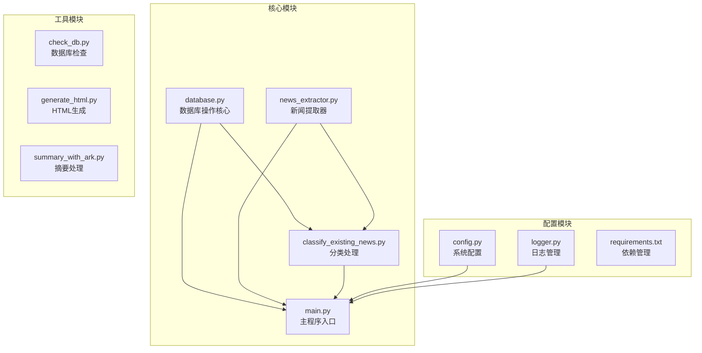
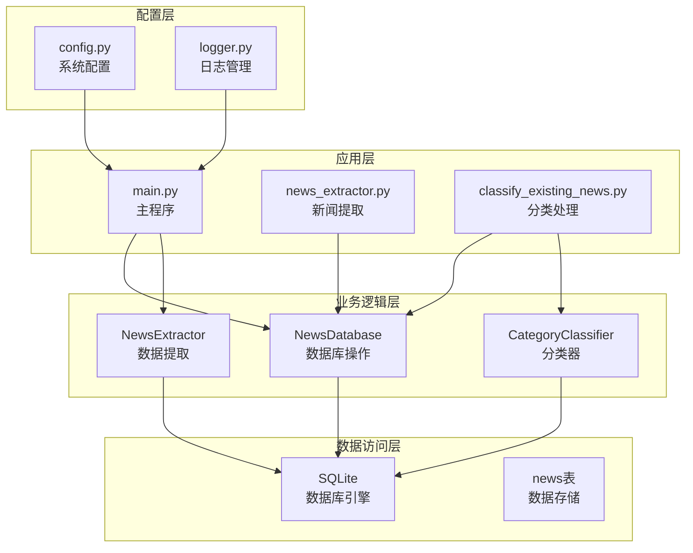
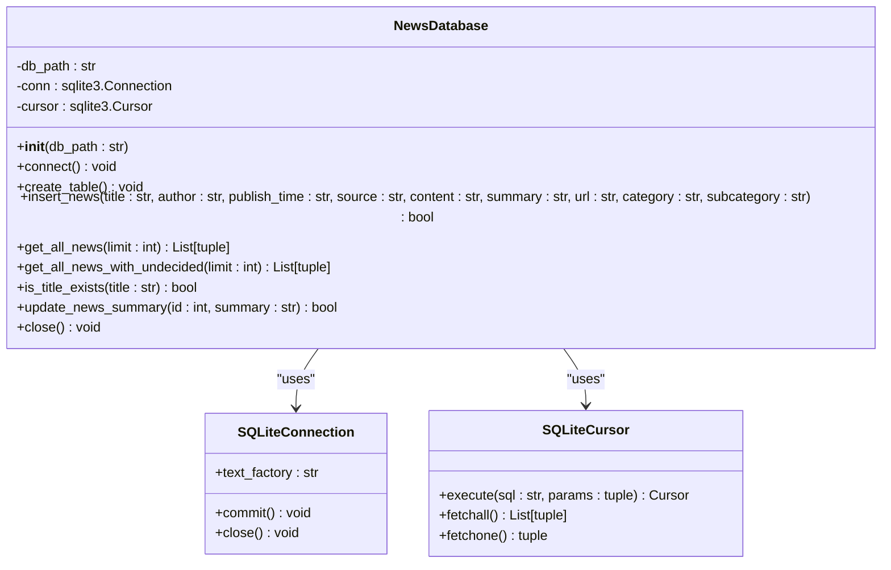
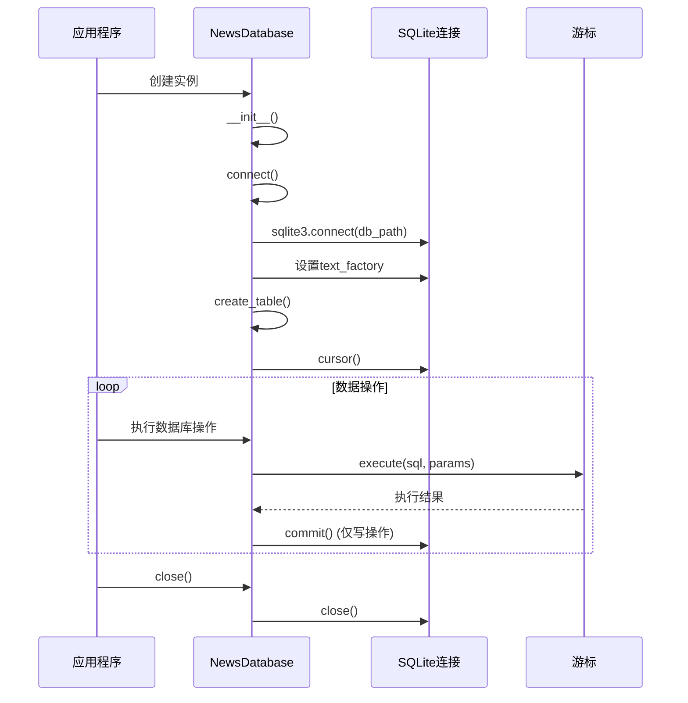
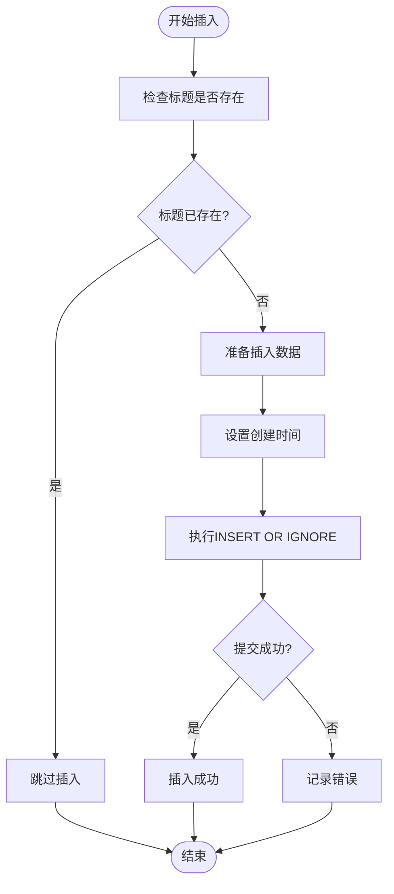
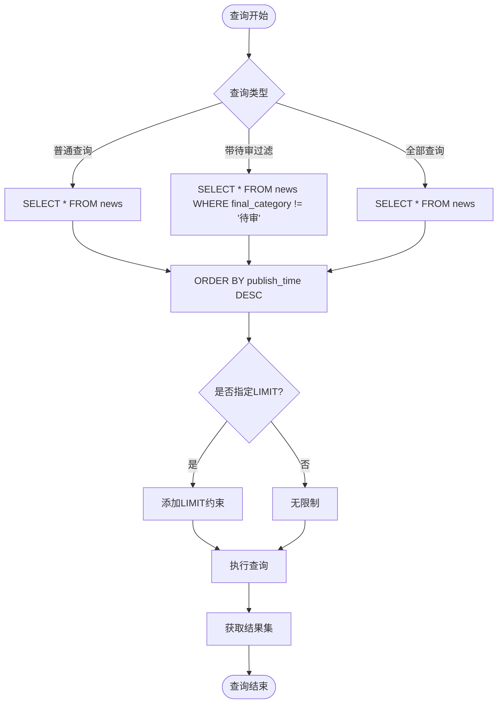
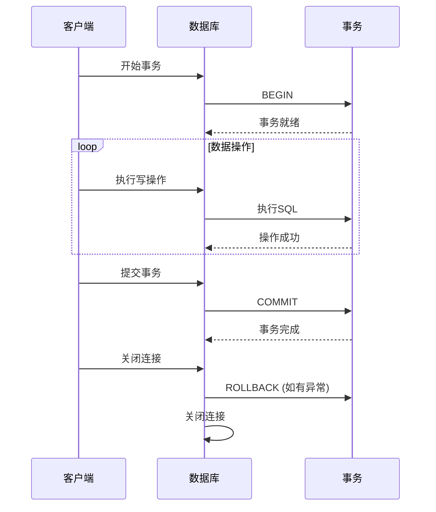
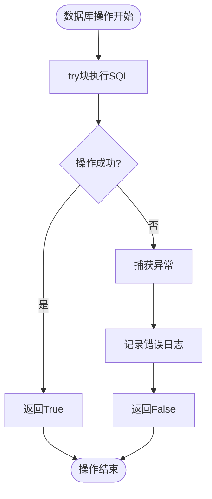
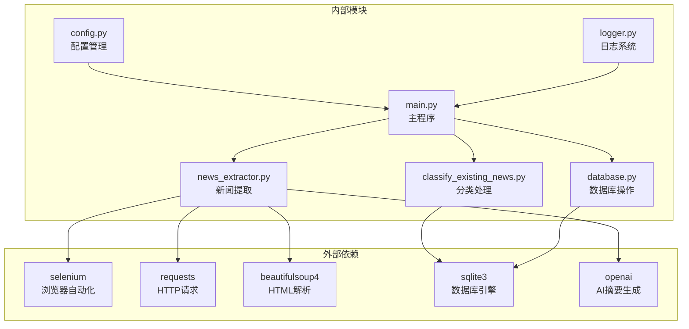
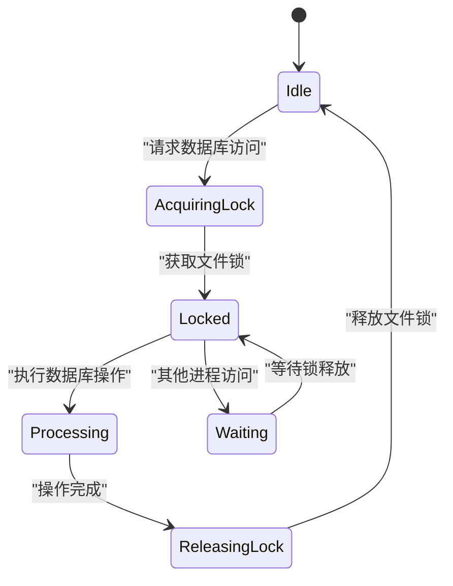

# 数据库操作

<cite>
**本文档引用的文件**
- [database.py](file://database.py)
- [check_db.py](file://check_db.py)
- [main.py](file://main.py)
- [news_extractor.py](file://news_extractor.py)
- [classify_existing_news.py](file://classify_existing_news.py)
- [config.py](file://config.py)
- [logger.py](file://logger.py)
- [requirements.txt](file://requirements.txt)
</cite>

## 目录
1. [简介](#简介)
2. [项目结构](#项目结构)
3. [核心组件](#核心组件)
4. [架构概览](#架构概览)
5. [详细组件分析](#详细组件分析)
6. [依赖关系分析](#依赖关系分析)
7. [性能考虑](#性能考虑)
8. [故障排除指南](#故障排除指南)
9. [结论](#结论)

## 简介

news-exacter是一个基于Python的新闻采集和分类系统，专注于教育信息化领域的新闻内容。该项目实现了完整的数据库操作功能，包括新闻数据的CRUD操作、分类管理和数据持久化。系统采用SQLite作为数据存储引擎，提供了高效的数据访问和管理能力。

本项目的核心数据库操作包括：
- 新闻数据的插入和去重
- 新闻数据的查询和筛选
- 新闻摘要的更新
- 分类信息的维护
- 数据库连接管理和异常处理

## 项目结构

项目采用模块化的文件组织方式，每个功能模块都有明确的职责分工：



**图表来源**
- [database.py:1-92](file://database.py#L1-L92)
- [main.py:1-206](file://main.py#L1-L206)
- [news_extractor.py:1-800](file://news_extractor.py#L1-L800)
- [classify_existing_news.py:1-302](file://classify_existing_news.py#L1-L302)

**章节来源**
- [database.py:1-92](file://database.py#L1-L92)
- [main.py:1-206](file://main.py#L1-L206)
- [config.py:1-78](file://config.py#L1-L78)

## 核心组件

### 数据库连接管理

系统使用SQLite作为数据存储引擎，通过`NewsDatabase`类实现统一的数据库连接管理。该类负责数据库的初始化、连接建立、表结构创建和资源清理。

**关键特性：**
- 自动连接管理：初始化时自动建立数据库连接
- 编码设置：确保UTF-8编码支持中文字符
- 表结构自动创建：首次运行时自动创建必要的表结构
- 资源清理：提供显式的连接关闭方法

### 新闻数据模型

数据库采用单一的`news`表存储所有新闻相关信息，表结构设计充分考虑了教育信息化领域的特点：

| 字段名 | 类型 | 约束 | 描述 |
|--------|------|------|------|
| id | INTEGER | PRIMARY KEY AUTOINCREMENT | 主键，自增标识符 |
| title | TEXT | NOT NULL UNIQUE | 新闻标题，唯一约束 |
| author | TEXT |  | 作者信息 |
| publish_time | TEXT |  | 发布时间 |
| source | TEXT |  | 新闻来源 |
| content | TEXT |  | 新闻正文内容 |
| summary | TEXT |  | 新闻摘要 |
| url | TEXT | NOT NULL UNIQUE | 新闻链接，唯一约束 |
| category | TEXT |  | 一级分类 |
| subcategory | TEXT |  | 二级分类 |
| final_category | TEXT |  | 最终分类 |
| created_at | TEXT | NOT NULL | 记录创建时间 |

### CRUD操作实现

系统实现了完整的CRUD操作，满足新闻数据的日常管理需求：

**插入操作 (`insert_news`)**
- 支持INSERT OR IGNORE语义，避免重复数据
- 自动设置创建时间戳
- 参数化查询防止SQL注入
- 异常处理和日志记录

**查询操作 (`get_all_news`, `get_all_news_with_undecided`)**
- 支持条件筛选和排序
- 可选的LIMIT限制结果集大小
- 不同查询场景的专用方法

**更新操作 (`update_news_summary`)**
- 单字段更新支持
- 原子性保证
- 错误处理机制

**章节来源**
- [database.py:40-87](file://database.py#L40-L87)

## 架构概览

系统的数据库操作架构采用分层设计，确保了良好的可维护性和扩展性：



**图表来源**
- [main.py:11-195](file://main.py#L11-L195)
- [database.py:5-11](file://database.py#L5-L11)
- [news_extractor.py:21-26](file://news_extractor.py#L21-L26)
- [classify_existing_news.py:14-27](file://classify_existing_news.py#L14-L27)

## 详细组件分析

### NewsDatabase类详细分析

`NewsDatabase`类是系统的核心数据库操作类，实现了完整的数据库管理功能：



**图表来源**
- [database.py:5-92](file://database.py#L5-L92)

#### 数据库连接生命周期



**图表来源**
- [database.py:13-18](file://database.py#L13-L18)
- [database.py:20-38](file://database.py#L20-L38)
- [database.py:90-92](file://database.py#L90-L92)

#### 插入操作流程



**图表来源**
- [database.py:40-52](file://database.py#L40-L52)

**章节来源**
- [database.py:5-92](file://database.py#L5-L92)

### 查询优化策略

系统在查询操作中采用了多种优化策略来提升性能：

#### WHERE条件优化



**图表来源**
- [database.py:54-67](file://database.py#L54-L67)

#### 排序和限制策略

- **排序优化**：按发布时间降序排列，符合新闻时效性要求
- **条件过滤**：默认过滤掉待审核状态的新闻，确保展示质量
- **结果限制**：支持可选的LIMIT参数，控制内存使用和响应时间

**章节来源**
- [database.py:54-67](file://database.py#L54-L67)

### 事务处理机制

系统采用手动事务管理模式，确保数据操作的原子性和一致性：



**图表来源**
- [database.py:40-52](file://database.py#L40-L52)
- [database.py:79-87](file://database.py#L79-L87)

**章节来源**
- [database.py:40-52](file://database.py#L40-L52)
- [database.py:79-87](file://database.py#L79-L87)

### 异常处理机制

系统实现了多层次的异常处理机制，确保数据库操作的健壮性：



**图表来源**
- [database.py:40-52](file://database.py#L40-L52)
- [database.py:79-87](file://database.py#L79-L87)

**章节来源**
- [database.py:40-52](file://database.py#L40-L52)
- [database.py:79-87](file://database.py#L79-L87)

## 依赖关系分析

系统各模块之间的依赖关系清晰明确，遵循了单一职责原则：



**图表来源**
- [requirements.txt:1-10](file://requirements.txt#L1-L10)
- [main.py:1-8](file://main.py#L1-L8)
- [news_extractor.py:1-18](file://news_extractor.py#L1-L18)

**章节来源**
- [requirements.txt:1-10](file://requirements.txt#L1-L10)
- [main.py:1-8](file://main.py#L1-L8)

## 性能考虑

### 数据库性能优化

#### 索引策略
- **唯一约束索引**：title和url字段的UNIQUE约束自动创建索引
- **查询优化**：WHERE条件和ORDER BY操作利用现有索引
- **内存管理**：合理使用LIMIT控制结果集大小

#### 连接池管理
- **单连接模式**：SQLite采用文件级锁，适合单进程应用
- **连接复用**：同一进程内复用数据库连接，减少开销
- **及时关闭**：程序结束时及时释放数据库连接

### 查询性能优化

#### SQL查询优化
- **参数化查询**：防止SQL注入同时提升查询性能
- **条件优化**：WHERE条件尽量使用索引字段
- **排序优化**：ORDER BY使用合适的字段和索引

#### 内存使用优化
- **流式处理**：大结果集采用fetchone逐条处理
- **限制结果**：合理使用LIMIT避免内存溢出
- **及时释放**：处理完数据后及时释放游标

### 并发控制

系统采用SQLite的文件级锁机制处理并发访问：



**图表来源**
- [database.py:13-18](file://database.py#L13-L18)

## 故障排除指南

### 常见数据库问题

#### 连接问题
**症状**：数据库连接失败或无法打开
**解决方案**：
1. 检查数据库文件路径是否正确
2. 确认数据库文件权限设置
3. 验证SQLite数据库文件完整性

#### 索引冲突
**症状**：INSERT操作失败，提示唯一约束冲突
**解决方案**：
1. 使用INSERT OR IGNORE避免重复数据
2. 先检查数据是否存在再插入
3. 清理重复数据后重新插入

#### 查询超时
**症状**：查询执行时间过长
**解决方案**：
1. 添加适当的LIMIT限制结果集
2. 优化WHERE条件使用索引字段
3. 考虑添加数据库索引

### 错误处理最佳实践

#### 异常捕获策略
```python
try:
    # 数据库操作
    pass
except sqlite3.Error as e:
    # 记录数据库特定错误
    log_error(f"数据库错误: {e}")
    return False
except Exception as e:
    # 记录一般性错误
    log_error(f"未知错误: {e}")
    return False
```

#### 日志记录规范
- **错误级别**：使用error()记录严重错误
- **警告级别**：使用warning()记录潜在问题
- **调试级别**：使用debug()记录详细信息
- **信息级别**：使用info()记录正常操作

**章节来源**
- [database.py:40-52](file://database.py#L40-L52)
- [database.py:79-87](file://database.py#L79-L87)
- [logger.py:74-104](file://logger.py#L74-L104)

## 结论

news-exacter项目的数据库操作设计体现了以下特点：

### 技术优势
- **简洁高效**：采用SQLite轻量级数据库，部署简单
- **安全可靠**：参数化查询防止SQL注入，完善的异常处理
- **性能优化**：合理的索引设计和查询优化策略
- **易于维护**：模块化设计，职责分离清晰

### 扩展性考虑
- **架构清晰**：分层设计便于功能扩展
- **配置灵活**：通过config.py集中管理配置
- **日志完善**：全面的日志记录便于问题排查
- **错误处理**：完善的异常处理机制确保系统稳定性

### 改进建议
1. **添加数据库索引**：为常用查询字段添加索引提升性能
2. **实现连接池**：支持多进程并发访问
3. **增加事务管理**：支持复杂业务逻辑的事务处理
4. **性能监控**：添加数据库性能指标监控

该数据库操作实现为教育信息化新闻采集系统提供了坚实的数据基础，为后续的功能扩展和性能优化奠定了良好基础。