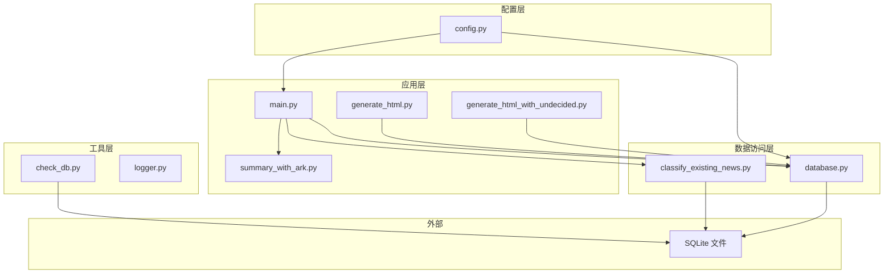
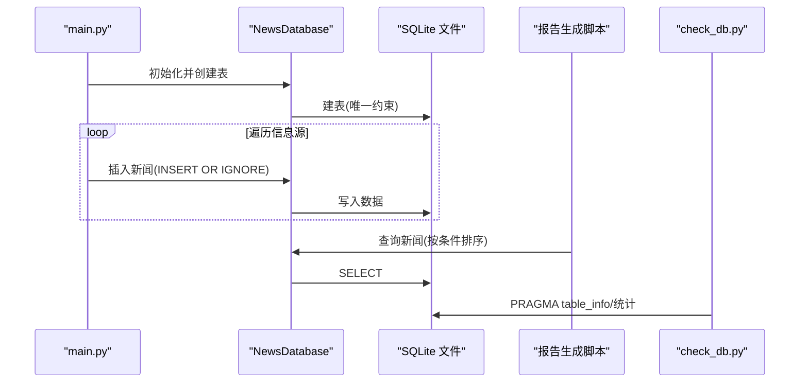
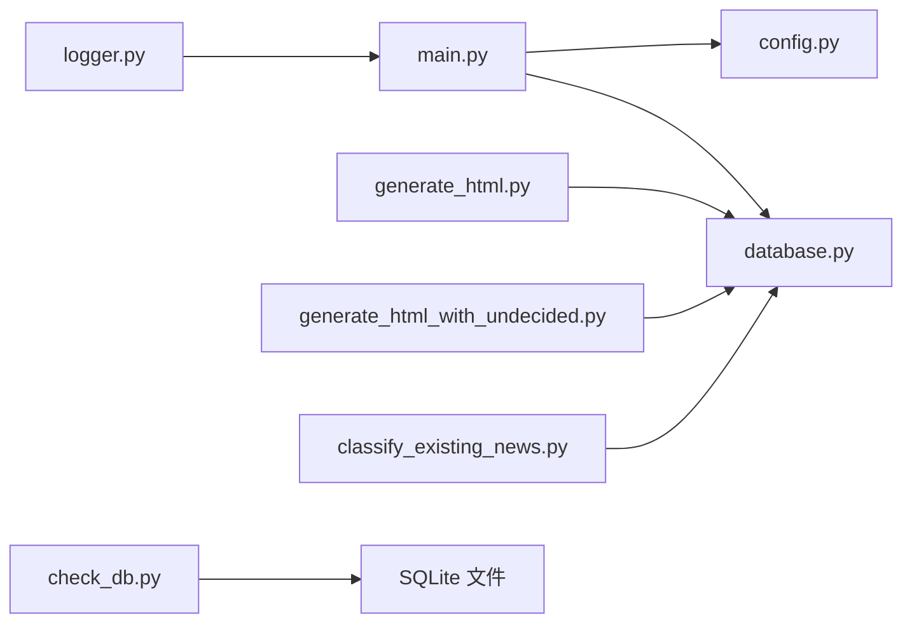

# 数据库维护

<cite>
**本文引用的文件**
- [database.py](file://database.py)
- [check_db.py](file://check_db.py)
- [config.py](file://config.py)
- [main.py](file://main.py)
- [logger.py](file://logger.py)
- [generate_html.py](file://generate_html.py)
- [generate_html_with_undecided.py](file://generate_html_with_undecided.py)
- [classify_existing_news.py](file://classify_existing_news.py)
- [summary_with_ark.py](file://summary_with_ark.py)
- [requirements.txt](file://requirements.txt)
- [readme.MD](file://readme.MD)
</cite>

## 目录
1. [简介](#简介)
2. [项目结构](#项目结构)
3. [核心组件](#核心组件)
4. [架构总览](#架构总览)
5. [详细组件分析](#详细组件分析)
6. [依赖分析](#依赖分析)
7. [性能考虑](#性能考虑)
8. [故障诊断与排错指南](#故障诊断与排错指南)
9. [结论](#结论)
10. [附录](#附录)

## 简介
本文件面向news-exacter项目的数据库维护与运维场景，系统化梳理数据库初始化流程、表结构与索引策略、备份与恢复方案、性能监控与维护任务、故障诊断与问题排查，以及版本升级、数据迁移与兼容性测试流程。文档以仓库现有实现为基础，结合SQLite特性给出可操作的建议与最佳实践。

## 项目结构
项目采用“功能分层 + 层内职责清晰”的组织方式：
- 配置层：集中管理数据库路径、爬虫与提取参数等
- 数据访问层：封装SQLite连接、建表、CRUD与查询
- 应用层：主流程调度、内容提取、分类与摘要生成、报告生成
- 工具层：数据库检查脚本、日志模块
- 文档与依赖：README与依赖清单

图表来源
- [config.py:68](file://config.py#L68)
- [database.py:5-11](file://database.py#L5-L11)
- [main.py:1-206](file://main.py#L1-L206)
- [generate_html.py:1-40](file://generate_html.py#L1-L40)
- [generate_html_with_undecided.py:1-44](file://generate_html_with_undecided.py#L1-L44)
- [classify_existing_news.py:14-41](file://classify_existing_news.py#L14-L41)
- [check_db.py:1-32](file://check_db.py#L1-L32)
- [logger.py:1-104](file://logger.py#L1-L104)

章节来源
- [config.py:1-78](file://config.py#L1-L78)
- [database.py:1-92](file://database.py#L1-L92)
- [main.py:1-206](file://main.py#L1-L206)
- [generate_html.py:1-40](file://generate_html.py#L1-L40)
- [generate_html_with_undecided.py:1-44](file://generate_html_with_undecided.py#L1-L44)
- [classify_existing_news.py:1-41](file://classify_existing_news.py#L1-L41)
- [check_db.py:1-32](file://check_db.py#L1-L32)
- [logger.py:1-104](file://logger.py#L1-L104)

## 核心组件
- 数据库连接与表结构
  - NewsDatabase类负责连接SQLite、创建news表、执行插入、查询、更新与关闭
  - 表结构包含标题唯一约束、URL唯一约束、时间字段、分类字段等
- 主流程调度
  - main.py负责初始化数据库、提取器、链接缓存，遍历信息源，提取内容并写入数据库
- 报告生成
  - generate_html.py与generate_html_with_undecided.py分别按不同条件查询并生成报告
- 分类与摘要
  - classify_existing_news.py用于对已有数据进行分类补全
  - summary_with_ark.py通过第三方API生成摘要
- 工具与检查
  - check_db.py用于快速检查表结构、数量与示例数据
  - logger.py提供统一日志输出

章节来源
- [database.py:5-92](file://database.py#L5-L92)
- [main.py:11-198](file://main.py#L11-L198)
- [generate_html.py:1-40](file://generate_html.py#L1-L40)
- [generate_html_with_undecided.py:1-44](file://generate_html_with_undecided.py#L1-L44)
- [classify_existing_news.py:14-41](file://classify_existing_news.py#L14-L41)
- [summary_with_ark.py:1-46](file://summary_with_ark.py#L1-L46)
- [check_db.py:1-32](file://check_db.py#L1-L32)
- [logger.py:1-104](file://logger.py#L1-L104)

## 架构总览
下图展示了数据库初始化、数据写入、查询与维护的关键交互：

图表来源
- [main.py:11-198](file://main.py#L11-L198)
- [database.py:20-52](file://database.py#L20-L52)
- [generate_html.py:12-40](file://generate_html.py#L12-L40)
- [check_db.py:3-32](file://check_db.py#L3-L32)

## 详细组件分析

### 数据库初始化与表结构
- 初始化流程
  - NewsDatabase.__init__会建立连接并自动创建news表
  - 连接时设置text_factory确保UTF-8编码
- 表结构要点
  - 主键自增id
  - 标题与URL均设为UNIQUE，避免重复
  - 包含作者、发布时间、来源、正文、摘要、分类、子分类、最终分类、创建时间等字段
- 索引优化策略
  - 当前未显式创建索引
  - 建议针对高频查询字段创建索引：
    - 发布时间publish_time（排序/范围查询）
    - 最终分类final_category（过滤）
    - 标题title（去重/查找）
    - URL（去重/关联）
  - 注意：UNIQUE约束会隐式创建索引，但复合查询仍需显式索引提升性能

章节来源
- [database.py:5-38](file://database.py#L5-L38)
- [config.py:68](file://config.py#L68)

### 数据写入与读取
- 写入流程
  - 插入前先检查标题是否存在，避免重复
  - 使用INSERT OR IGNORE减少异常
  - 成功后返回True，失败记录错误日志
- 读取流程
  - 正常展示：排除final_category='待审'，按发布时间倒序
  - 审核展示：包含待审项，按发布时间倒序
  - 分类补全：查询category为NULL或final_category为NULL的数据

章节来源
- [database.py:40-87](file://database.py#L40-L87)
- [main.py:111-173](file://main.py#L111-L173)
- [generate_html.py:15-40](file://generate_html.py#L15-L40)
- [generate_html_with_undecided.py:10-44](file://generate_html_with_undecided.py#L10-L44)
- [classify_existing_news.py:28-41](file://classify_existing_news.py#L28-L41)

### 备份与恢复
- 全量备份
  - 直接复制SQLite数据文件即可完成全量备份
  - 建议在应用空闲时段执行，或使用事务一致性保证
- 增量备份
  - SQLite不支持原生命增备，可通过以下方式实现：
    - 基于时间戳的差异导出（导出特定时间段数据）
    - 使用SQLite的备份API进行在线备份（需扩展实现）
- 恢复
  - 将备份文件替换为当前数据库文件，重启应用
  - 恢复后运行check_db.py验证结构与数据
- 灾难恢复
  - 多地多副本存放备份
  - 定期验证备份可用性与完整性

章节来源
- [check_db.py:1-32](file://check_db.py#L1-L32)
- [readme.MD:8](file://readme.MD#L8)

### 性能监控与维护任务
- VACUUM清理
  - SQLite在大量DELETE/UPDATE后会产生碎片，建议定期执行VACUUM回收空间
  - 可在维护窗口执行，避免影响在线业务
- ANALYZE统计信息更新
  - SQLite内部统计信息用于查询优化器，建议在数据量变化较大后执行ANALYZE
  - 或通过PRAGMA optimize触发优化（SQLite 3.8.0+）
- 连接与事务
  - 当前实现每操作一次提交一次，适合小规模应用
  - 对高并发写入场景，建议引入连接池与批量事务提交

章节来源
- [database.py:37](file://database.py#L37)
- [database.py:47](file://database.py#L47)
- [database.py:82](file://database.py#L82)

### 故障诊断与排错指南
- 常见问题
  - 插入失败：检查标题/URL唯一性冲突、数据库文件权限、磁盘空间
  - 查询异常：确认final_category字段是否正确填充、时间格式是否符合预期
  - 编码问题：确认连接时text_factory设置为str
- 排查步骤
  - 使用check_db.py快速检查表结构与数据量
  - 查看日志文件（logs目录），定位错误堆栈
  - 在独立脚本中最小化复现问题，逐步缩小范围
- 日志与告警
  - logger模块提供info/debug/error/warning四类日志，建议在生产环境开启文件轮转

章节来源
- [check_db.py:1-32](file://check_db.py#L1-L32)
- [logger.py:1-104](file://logger.py#L1-L104)
- [database.py:50-52](file://database.py#L50-L52)
- [database.py:75-77](file://database.py#L75-L77)

### 版本升级、数据迁移与兼容性测试
- 版本升级
  - SQLite版本升级通常向后兼容，建议先在测试环境验证
  - 升级后运行check_db.py与查询脚本，确保功能正常
- 数据迁移
  - 若更换数据库类型（如从SQLite迁移到PostgreSQL/MySQL），需：
    - 设计目标表结构，保持字段语义一致
    - 导出SQLite数据，清洗并转换格式
    - 批量导入目标数据库，校验完整性
- 兼容性测试
  - 测试不同SQLite版本的行为差异
  - 验证索引、事务隔离级别、时间格式处理等

章节来源
- [readme.MD:8](file://readme.MD#L8)
- [requirements.txt:1-10](file://requirements.txt#L1-L10)

## 依赖分析
- 组件耦合
  - main.py依赖database.py与config.py，形成“配置-数据访问-业务”链路
  - 报告生成脚本依赖database.py进行查询
  - classify_existing_news.py与database.py共享SQLite连接模式
- 外部依赖
  - SQLite为内置驱动，无需额外安装
  - 日志轮转依赖logging.handlers.RotatingFileHandler

图表来源
- [main.py:1-206](file://main.py#L1-L206)
- [database.py:1-92](file://database.py#L1-L92)
- [generate_html.py:1-40](file://generate_html.py#L1-L40)
- [generate_html_with_undecided.py:1-44](file://generate_html_with_undecided.py#L1-L44)
- [classify_existing_news.py:1-41](file://classify_existing_news.py#L1-L41)
- [check_db.py:1-32](file://check_db.py#L1-L32)
- [logger.py:1-104](file://logger.py#L1-L104)

章节来源
- [main.py:1-206](file://main.py#L1-L206)
- [database.py:1-92](file://database.py#L1-L92)
- [generate_html.py:1-40](file://generate_html.py#L1-L40)
- [generate_html_with_undecided.py:1-44](file://generate_html_with_undecided.py#L1-L44)
- [classify_existing_news.py:1-41](file://classify_existing_news.py#L1-L41)
- [check_db.py:1-32](file://check_db.py#L1-L32)
- [logger.py:1-104](file://logger.py#L1-L104)

## 性能考虑
- 查询路径优化
  - 为publish_time、final_category、title、url创建索引
  - 合理使用LIMIT限制结果集
- 写入路径优化
  - 批量写入时合并事务，减少commit次数
  - 使用INSERT OR IGNORE降低重复写入成本
- 存储与IO
  - SQLite文件放置在SSD上可显著提升随机读写性能
  - 控制日志文件大小与轮转数量，避免IO抖动
- 统计与清理
  - 定期执行VACUUM与ANALYZE，保持查询计划最优

章节来源
- [database.py:20-38](file://database.py#L20-L38)
- [database.py:40-52](file://database.py#L40-L52)
- [logger.py:38-54](file://logger.py#L38-L54)

## 故障诊断与排错指南
- 快速检查
  - 使用check_db.py查看表结构、统计数量、预览数据
- 日志定位
  - 关注database.py中的错误日志输出，定位异常SQL或约束冲突
- 常见根因
  - 唯一约束冲突导致插入失败
  - 时间格式不匹配导致过滤失效
  - 文件权限不足导致无法写入
- 处理建议
  - 修正输入数据格式，确保时间字符串与查询逻辑一致
  - 清理重复数据或调整唯一约束策略
  - 检查磁盘空间与文件权限

章节来源
- [check_db.py:1-32](file://check_db.py#L1-L32)
- [database.py:50-52](file://database.py#L50-L52)
- [database.py:75-77](file://database.py#L75-L77)
- [logger.py:74-104](file://logger.py#L74-L104)

## 结论
本项目以SQLite为核心存储，通过简洁的NewsDatabase抽象实现了初始化、建表、CRUD与查询。当前未启用显式索引与定期维护任务，建议在生产环境中补充索引、VACUUM与ANALYZE，并完善备份与恢复流程。通过check_db.py与logger模块可有效支撑日常运维与故障排查。

## 附录
- 数据库表结构（字段说明）
  - id：主键自增
  - title：标题，UNIQUE
  - author：作者
  - publish_time：发布时间
  - source：来源
  - content：正文
  - summary：摘要
  - url：URL，UNIQUE
  - category：初步分类
  - subcategory：子分类
  - final_category：最终分类
  - created_at：创建时间

章节来源
- [database.py:20-38](file://database.py#L20-L38)