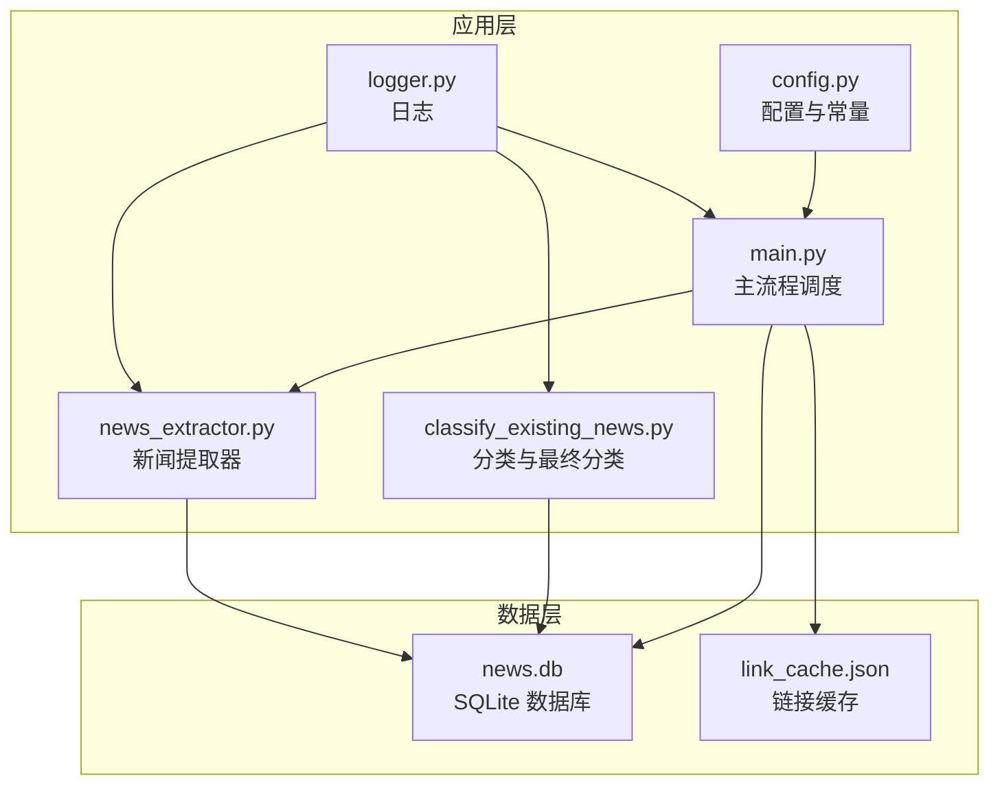
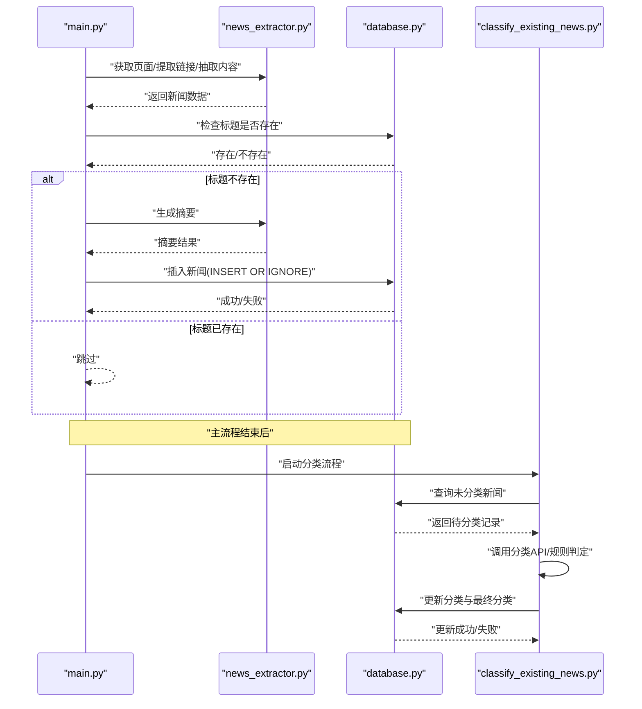
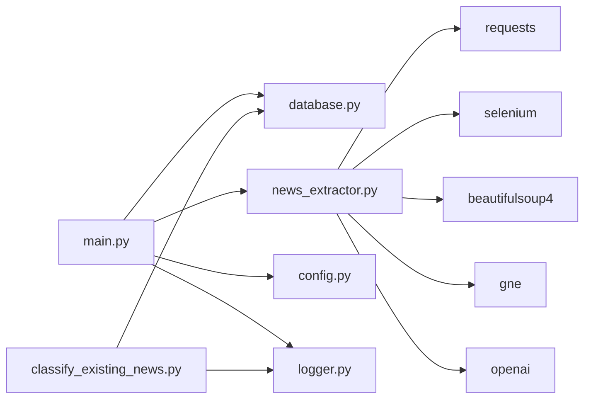

# 数据库设计

<cite>
**本文档引用的文件**
- [database.py](file://database.py)
- [check_db.py](file://check_db.py)
- [config.py](file://config.py)
- [main.py](file://main.py)
- [classify_existing_news.py](file://classify_existing_news.py)
- [news_extractor.py](file://news_extractor.py)
- [logger.py](file://logger.py)
- [link_cache.json](file://link_cache.json)
</cite>

## 目录
1. [简介](#简介)
2. [项目结构](#项目结构)
3. [核心组件](#核心组件)
4. [架构总览](#架构总览)
5. [详细组件分析](#详细组件分析)
6. [依赖分析](#依赖分析)
7. [性能考虑](#性能考虑)
8. [故障排查指南](#故障排查指南)
9. [结论](#结论)
10. [附录](#附录)

## 简介
本文件系统性梳理 news-exacter 项目的数据库设计与实现，重点围绕 SQLite 数据库存储结构、字段定义、关系映射、初始化与维护策略展开，并结合项目中新闻抓取、分类与摘要生成的业务流程，给出查询示例、迁移与备份恢复建议、一致性与并发控制说明以及性能优化实践。项目采用单一 SQLite 文件数据库 news.db，通过 Python 的 sqlite3 模块进行访问；同时配合一个链接缓存文件 link_cache.json 实现去重与增量处理。

## 项目结构
项目采用“功能模块化 + 单文件数据库”的组织方式：
- 数据访问层：database.py 定义了 NewsDatabase 类，封装数据库连接、表创建、增删改查等操作。
- 业务主流程：main.py 负责抓取新闻源、提取链接、渲染页面、抽取内容、关键词过滤、时间窗口过滤、摘要生成与分类写入。
- 分类与最终归类：classify_existing_news.py 对已有新闻进行分类标注与最终分类标记。
- 新闻提取器：news_extractor.py 负责网页渲染、链接提取、正文抽取、摘要生成与分类 API 调用。
- 配置与常量：config.py 维护新闻源列表、数据库路径、超时参数、筛选关键词等。
- 工具与诊断：check_db.py 用于查看表结构、统计数量与预览数据；logger.py 提供统一日志输出。
- 缓存：link_cache.json 以 JSON 数组形式持久化已处理过的链接，避免重复抓取。

图表来源
- [main.py:1-206](file://main.py#L1-L206)
- [classify_existing_news.py:1-302](file://classify_existing_news.py#L1-L302)
- [news_extractor.py:1-887](file://news_extractor.py#L1-L887)
- [config.py:1-78](file://config.py#L1-L78)
- [database.py:1-92](file://database.py#L1-L92)
- [check_db.py:1-32](file://check_db.py#L1-L32)
- [logger.py:1-104](file://logger.py#L1-L104)
- [link_cache.json:1-563](file://link_cache.json#L1-L563)

章节来源
- [main.py:1-206](file://main.py#L1-L206)
- [config.py:1-78](file://config.py#L1-L78)
- [database.py:1-92](file://database.py#L1-L92)
- [check_db.py:1-32](file://check_db.py#L1-L32)
- [logger.py:1-104](file://logger.py#L1-L104)
- [link_cache.json:1-563](file://link_cache.json#L1-L563)

## 核心组件
- 数据库连接与表创建
  - 连接时设置 UTF-8 文本工厂，确保中文字符正确存储与读取。
  - 创建 news 表，包含标题、作者、发布时间、来源、正文、摘要、URL、分类系列字段及创建时间等。
- 新闻插入与查询
  - 插入时使用“忽略重复”策略，基于标题与 URL 的唯一性约束，避免重复入库。
  - 查询支持分页与按发布时间倒序排序；提供包含“待审”在内的全量查询与排除“待审”的推荐展示。
- 标题存在性检查
  - 通过 COUNT(*) 判断标题是否已存在，用于前置去重。
- 摘要更新
  - 支持按 id 更新摘要字段，用于后续 AI 生成摘要后的回填。
- 分类与最终分类
  - classify_existing_news.py 提供两类更新：分类标注（category/subcategory）与最终分类（final_category），并提供批量查询未分类新闻的能力。

章节来源
- [database.py:1-92](file://database.py#L1-L92)
- [classify_existing_news.py:1-302](file://classify_existing_news.py#L1-L302)

## 架构总览
news-exacter 的数据库访问采用“单实例连接 + 线程内使用”的模式，所有数据库操作均在主线程中顺序执行，未显式使用事务管理器，但通过 INSERT OR IGNORE 与 UPDATE 语句保证基本一致性。分类阶段独立于主抓取流程，单独连接数据库进行批量更新。

图表来源
- [main.py:111-173](file://main.py#L111-L173)
- [news_extractor.py:704-744](file://news_extractor.py#L704-L744)
- [database.py:40-52](file://database.py#L40-L52)
- [classify_existing_news.py:28-58](file://classify_existing_news.py#L28-L58)

## 详细组件分析

### 数据库表结构设计（news）
- 表名：news
- 字段与约束
  - id：INTEGER 主键，自增
  - title：TEXT 非空，唯一
  - author：TEXT
  - publish_time：TEXT
  - source：TEXT
  - content：TEXT
  - summary：TEXT
  - url：TEXT 非空，唯一
  - category：TEXT
  - subcategory：TEXT
  - final_category：TEXT
  - created_at：TEXT 非空
- 设计要点
  - 唯一性约束：title 与 url 同时唯一，避免重复入库。
  - 分类字段：category/subcategory 用于中间分类标注；final_category 用于最终人工/规则审核状态。
  - 时间字段：created_at 记录入库时间；publish_time 用于时间窗口过滤。
- 查询与索引建议
  - 常用查询：按发布时间倒序、按 final_category 过滤、按标题/URL 精确匹配。
  - 建议索引：对 publish_time、final_category、title、url 建立索引可显著提升查询性能。

章节来源
- [database.py:20-38](file://database.py#L20-L38)
- [main.py:111-144](file://main.py#L111-L144)
- [classify_existing_news.py:28-37](file://classify_existing_news.py#L28-L37)

### 数据库初始化与表创建
- 初始化流程
  - 连接数据库并设置 UTF-8 文本工厂。
  - 执行 CREATE TABLE IF NOT EXISTS 语句，确保表存在。
- 建议
  - 若需扩展字段或新增索引，应在现有表上进行 ALTER TABLE 操作，并在迁移脚本中记录版本号。

章节来源
- [database.py:13-38](file://database.py#L13-L38)

### 新闻插入与去重
- 插入策略
  - 使用 INSERT OR IGNORE，基于 title 与 url 的唯一性约束，避免重复。
  - 入库时间 created_at 自动记录。
- 前置检查
  - 在生成摘要前先检查标题是否存在，减少不必要的外部 API 调用。

章节来源
- [database.py:40-52](file://database.py#L40-L52)
- [main.py:111-114](file://main.py#L111-L114)

### 查询接口与示例
- 全量查询（排除“待审”）
  - SQL：SELECT * FROM news WHERE final_category != '待审' ORDER BY publish_time DESC
  - 用途：生成推荐内容列表
- 全量查询（包含“待审”）
  - SQL：SELECT * FROM news ORDER BY publish_time DESC
  - 用途：后台管理与审核
- 按标题存在性检查
  - SQL：SELECT COUNT(*) FROM news WHERE title = ?
  - 用途：去重判断
- 摘要更新
  - SQL：UPDATE news SET summary = ? WHERE id = ?
  - 用途：AI 生成摘要后的回填

章节来源
- [database.py:54-87](file://database.py#L54-L87)
- [main.py:111-114](file://main.py#L111-L114)

### 分类与最终分类
- 中间分类（category/subcategory）
  - 通过百度智能云 NLP API 获取主分类与子分类，写入数据库。
- 最终分类（final_category）
  - 基于来源、作者、内容关键词与分类结果进行规则判定，支持“待审”状态。
- 批量处理
  - 查询 category IS NULL 或 final_category IS NULL 的记录，逐条处理并更新。

章节来源
- [classify_existing_news.py:28-58](file://classify_existing_news.py#L28-L58)
- [classify_existing_news.py:169-235](file://classify_existing_news.py#L169-L235)

### 链接缓存与去重
- 缓存结构
  - link_cache.json 以 JSON 数组形式存储已处理链接，最大容量 2000。
- 使用场景
  - 抓取流程中，若链接已在缓存中，则跳过处理并移动至末尾（最近使用）。
  - 程序结束时将缓存持久化到文件，便于下次运行增量处理。

章节来源
- [main.py:19-47](file://main.py#L19-L47)
- [main.py:86-98](file://main.py#L86-L98)
- [main.py:184-192](file://main.py#L184-L192)
- [link_cache.json:1-563](file://link_cache.json#L1-L563)

## 依赖分析
- 模块耦合
  - main.py 依赖 database.py、news_extractor.py、config.py、logger.py。
  - classify_existing_news.py 依赖 database.py、requests、json、logger.py。
  - news_extractor.py 依赖 selenium、BeautifulSoup、gne、openai、requests 等。
  - database.py 仅依赖 sqlite3 与 logger。
- 外部依赖
  - SQLite：内置模块，无需额外安装。
  - 第三方库：requests、selenium、webdriver-manager、beautifulsoup4、gne、openai 等，详见 requirements.txt。

图表来源
- [main.py:1-206](file://main.py#L1-L206)
- [classify_existing_news.py:1-302](file://classify_existing_news.py#L1-L302)
- [news_extractor.py:1-887](file://news_extractor.py#L1-L887)
- [database.py:1-92](file://database.py#L1-L92)
- [config.py:1-78](file://config.py#L1-L78)
- [logger.py:1-104](file://logger.py#L1-L104)

章节来源
- [main.py:1-206](file://main.py#L1-L206)
- [classify_existing_news.py:1-302](file://classify_existing_news.py#L1-L302)
- [news_extractor.py:1-887](file://news_extractor.py#L1-L887)
- [database.py:1-92](file://database.py#L1-L92)
- [config.py:1-78](file://config.py#L1-L78)
- [logger.py:1-104](file://logger.py#L1-L104)

## 性能考虑
- 查询性能
  - 建议为 publish_time、final_category、title、url 建立索引，以加速排序与过滤。
  - 对高频查询（如按时间倒序、按 final_category 过滤）使用 LIMIT 控制返回量。
- 写入性能
  - INSERT OR IGNORE 已避免重复写入，建议批量插入时合并事务提交（见“事务与并发控制”）。
- 分类与摘要
  - 摘要与分类 API 调用成本较高，建议在插入后再触发，或在分类阶段使用分批处理与限流。
- 缓存与去重
  - link_cache.json 采用有序字典，LRU 驱逐策略有效降低重复抓取成本。

章节来源
- [database.py:54-87](file://database.py#L54-L87)
- [main.py:111-173](file://main.py#L111-L173)
- [classify_existing_news.py:261-294](file://classify_existing_news.py#L261-L294)
- [link_cache.json:1-563](file://link_cache.json#L1-L563)

## 故障排查指南
- 数据库连接问题
  - 症状：无法连接或中文乱码。
  - 处理：确认数据库文件存在、权限正常；检查 text_factory 设置。
- 重复插入失败
  - 症状：插入返回失败或无新增记录。
  - 处理：检查 title 与 url 是否已存在；确认 INSERT OR IGNORE 是否生效。
- 查询异常
  - 症状：查询结果为空或异常。
  - 处理：使用 check_db.py 验证表结构与数据量；核对 WHERE 条件与字段类型。
- 分类/摘要失败
  - 症状：分类 API 返回错误或摘要为空。
  - 处理：检查 API 密钥配置；查看日志输出；必要时降级为默认值。
- 缓存失效
  - 症状：重复抓取相同链接。
  - 处理：确认 link_cache.json 是否存在且未被意外清空；检查最大容量阈值。

章节来源
- [check_db.py:1-32](file://check_db.py#L1-L32)
- [logger.py:1-104](file://logger.py#L1-L104)
- [news_extractor.py:704-744](file://news_extractor.py#L704-L744)
- [classify_existing_news.py:69-90](file://classify_existing_news.py#L69-L90)

## 结论
news-exacter 的数据库设计以 SQLite 为核心，采用单一 news 表承载新闻实体与分类标注，配合链接缓存实现高效去重与增量处理。通过唯一性约束与前置去重检查，有效避免重复入库；通过分类与最终分类双阶段标注，满足不同层级的新闻治理需求。建议在生产环境中补充索引、事务与并发控制策略，并完善备份与迁移方案，以进一步提升稳定性与可维护性。

## 附录

### 数据库初始化脚本与表创建语句
- 初始化脚本
  - 连接数据库并执行 CREATE TABLE IF NOT EXISTS 语句，确保表存在。
- 表创建语句
  - 请参考 database.py 中的 CREATE TABLE 语句，包含字段定义与唯一性约束。

章节来源
- [database.py:20-38](file://database.py#L20-L38)

### 索引优化策略
- 建议索引
  - 对 publish_time 建立索引，支持按时间排序与范围查询。
  - 对 final_category 建立索引，支持推荐与审核过滤。
  - 对 title 与 url 建立索引，提升去重与精确查询效率。
- 索引维护
  - 随着数据增长定期重建索引，保持查询性能。

章节来源
- [database.py:54-87](file://database.py#L54-L87)

### 数据查询示例
- 推荐列表（排除“待审”）
  - SELECT * FROM news WHERE final_category != '待审' ORDER BY publish_time DESC
- 审核列表（包含“待审”）
  - SELECT * FROM news ORDER BY publish_time DESC
- 按标题存在性检查
  - SELECT COUNT(*) FROM news WHERE title = ?
- 按 id 更新摘要
  - UPDATE news SET summary = ? WHERE id = ?

章节来源
- [database.py:54-87](file://database.py#L54-L87)

### 数据迁移方案
- 版本化迁移
  - 为每个数据库变更（新增字段、索引、表结构调整）编写迁移脚本，并记录版本号。
- 迁移步骤
  - 备份当前数据库文件。
  - 执行迁移脚本，按顺序更新表结构与索引。
  - 验证数据完整性与查询性能。
- 回滚策略
  - 保留备份文件，必要时回滚至上一版本。

[本节为通用实践建议，不直接分析具体文件]

### 备份与恢复流程
- 备份
  - 复制 news.db 文件到安全位置；定期导出重要数据（如分类标注）。
- 恢复
  - 停止应用写入，替换数据库文件或导入备份数据。
- 链接缓存
  - 同步 link_cache.json 文件，确保增量抓取继续生效。

章节来源
- [check_db.py:1-32](file://check_db.py#L1-L32)

### 数据一致性保证机制、事务处理与并发控制
- 一致性
  - 唯一性约束（title、url）与 INSERT OR IGNORE 保障基本一致性。
  - 分类阶段采用“查询-更新”原子性操作，失败时记录日志。
- 事务
  - 当前实现未显式使用事务管理器；建议在批量写入场景中使用事务包裹，减少锁竞争与写放大。
- 并发控制
  - 单线程顺序执行，避免并发写入冲突；若扩展多线程，需引入锁或队列机制。

章节来源
- [database.py:40-52](file://database.py#L40-L52)
- [classify_existing_news.py:39-58](file://classify_existing_news.py#L39-L58)

### 性能优化建议与查询优化技巧
- 查询优化
  - 使用 LIMIT 控制返回量；对常用过滤字段建立索引。
  - 避免 SELECT *，仅选择必要字段。
- 写入优化
  - 批量插入时合并事务提交；减少磁盘 IO。
- 缓存优化
  - 合理设置缓存容量与驱逐策略；定期清理无效链接。
- 外部 API
  - 限流与重试；失败降级；记录日志便于追踪。

[本节为通用实践建议，不直接分析具体文件]