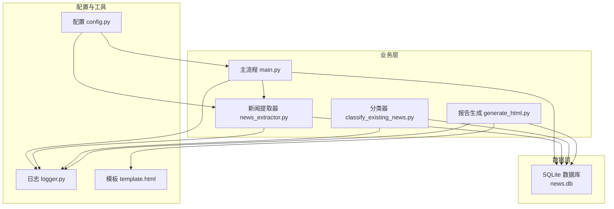
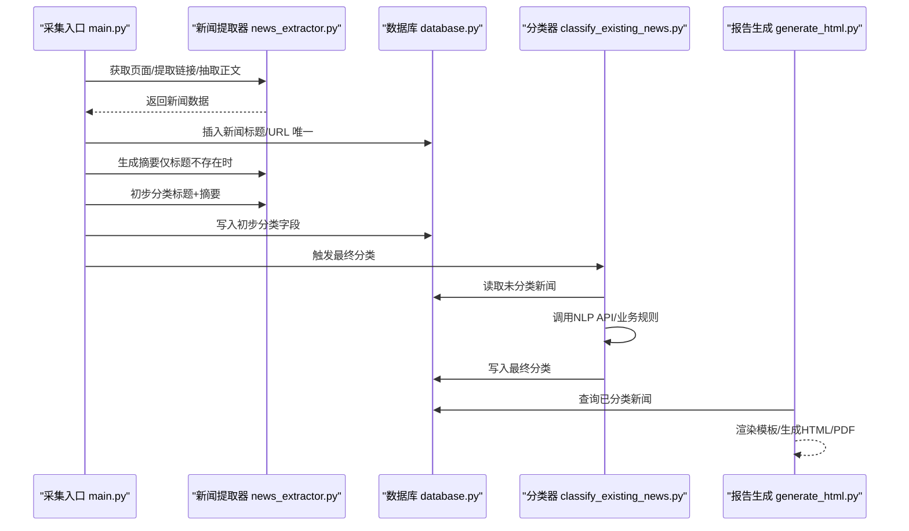
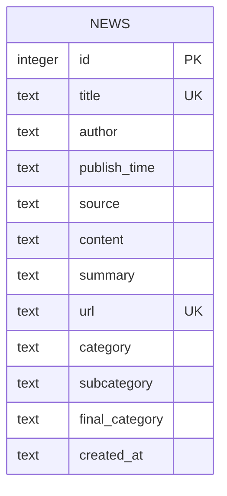
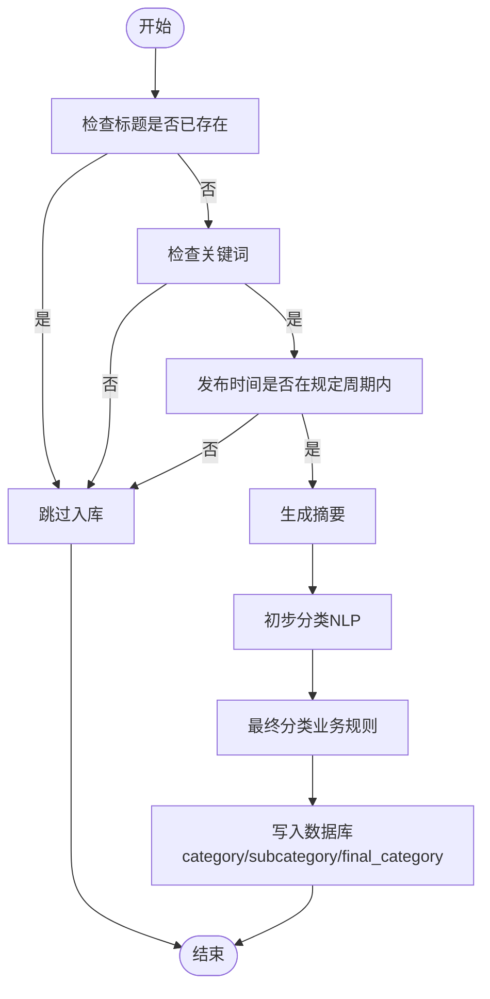
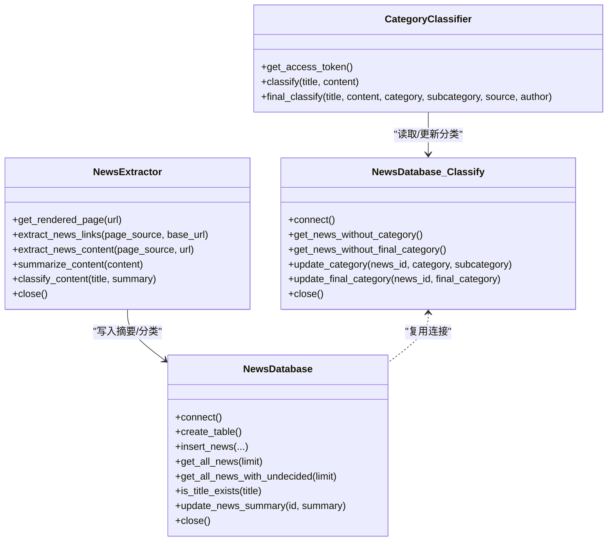
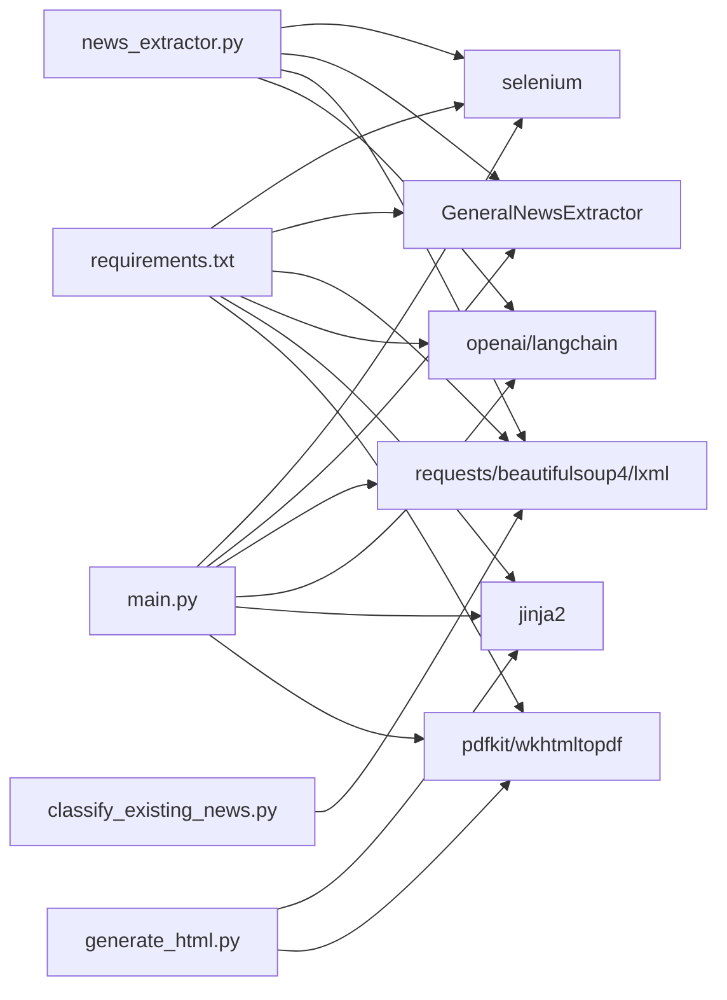

# 数据模型

<cite>
**本文引用的文件**
- [database.py](file://database.py)
- [config.py](file://config.py)
- [main.py](file://main.py)
- [news_extractor.py](file://news_extractor.py)
- [classify_existing_news.py](file://classify_existing_news.py)
- [generate_html.py](file://generate_html.py)
- [check_db.py](file://check_db.py)
- [logger.py](file://logger.py)
- [template.html](file://template.html)
- [requirements.txt](file://requirements.txt)
- [readme.MD](file://readme.MD)
</cite>

## 目录
1. [简介](#简介)
2. [项目结构](#项目结构)
3. [核心组件](#核心组件)
4. [架构总览](#架构总览)
5. [详细组件分析](#详细组件分析)
6. [依赖关系分析](#依赖关系分析)
7. [性能考量](#性能考量)
8. [故障排查指南](#故障排查指南)
9. [结论](#结论)
10. [附录](#附录)

## 简介
本文件系统化梳理 news-exacter 的数据模型与分类体系，围绕“新闻实体”的属性结构、分类层级（初步分类、子分类、最终分类）、业务规则与约束、ER 图与关系图、以及演进与版本管理策略展开，帮助读者快速理解并扩展该数据模型。

## 项目结构
项目采用“功能域”组织方式，核心围绕数据库访问、新闻抓取与分类、HTML/PDF 报告生成三大模块，辅以配置与日志工具。

图表来源
- [main.py:11-206](file://main.py#L11-L206)
- [news_extractor.py:21-800](file://news_extractor.py#L21-L800)
- [classify_existing_news.py:14-302](file://classify_existing_news.py#L14-L302)
- [generate_html.py:1-81](file://generate_html.py#L1-L81)
- [database.py:5-92](file://database.py#L5-L92)
- [config.py:1-78](file://config.py#L1-L78)
- [logger.py:1-104](file://logger.py#L1-L104)
- [template.html:1-108](file://template.html#L1-L108)

章节来源
- [main.py:11-206](file://main.py#L11-L206)
- [database.py:5-92](file://database.py#L5-L92)
- [config.py:1-78](file://config.py#L1-L78)

## 核心组件
- 新闻实体表：news，承载新闻对象的全部属性与分类字段。
- 新闻数据库访问封装：NewsDatabase，提供连接、建表、增删改查等操作。
- 新闻提取器：NewsExtractor，负责页面渲染、链接提取、正文抽取、摘要生成、初步分类。
- 分类器：CategoryClassifier，负责调用外部 NLP API 进行初步分类，再结合来源与内容生成最终分类。
- 报告生成：generate_html.py，按最终分类输出 HTML/PDF。
- 配置与日志：config.py、logger.py，分别提供数据源、关键词、数据库路径等配置与统一日志。

章节来源
- [database.py:20-92](file://database.py#L20-L92)
- [news_extractor.py:21-800](file://news_extractor.py#L21-L800)
- [classify_existing_news.py:14-302](file://classify_existing_news.py#L14-L302)
- [generate_html.py:1-81](file://generate_html.py#L1-L81)
- [config.py:1-78](file://config.py#L1-L78)
- [logger.py:1-104](file://logger.py#L1-L104)

## 架构总览
新闻数据流从“采集 -> 初步分类 -> 最终分类 -> 存储 -> 报告生成”闭环运行。数据库承担持久化与查询职责；分类器通过外部 NLP 能力实现自动化；报告生成器按最终分类进行展示。

图表来源
- [main.py:11-206](file://main.py#L11-L206)
- [news_extractor.py:21-800](file://news_extractor.py#L21-L800)
- [database.py:20-92](file://database.py#L20-L92)
- [classify_existing_news.py:237-302](file://classify_existing_news.py#L237-L302)
- [generate_html.py:1-81](file://generate_html.py#L1-L81)

## 详细组件分析

### 新闻实体数据模型（news 表）
- 字段清单与语义
  - id：自增主键
  - title：标题，非空且唯一
  - author：作者
  - publish_time：发布时间（字符串）
  - source：来源站点名称
  - content：正文
  - summary：摘要
  - url：URL，非空且唯一
  - category：初步分类
  - subcategory：子分类
  - final_category：最终分类（用于展示与归档）
  - created_at：入库时间

- 唯一性与完整性约束
  - 唯一性：title、url 唯一
  - 非空性：title、url、created_at 非空
  - 完整性：category/subcategory/final_category 允许为空，表示尚未完成对应阶段的分类

- 业务规则
  - 插入时使用“INSERT OR IGNORE”，避免重复
  - 查询默认排除 final_category='待审' 的记录
  - 生成摘要仅在标题不存在时触发，减少外部 API 调用

- ER 图（概念层面）

图表来源
- [database.py:20-38](file://database.py#L20-L38)

章节来源
- [database.py:20-92](file://database.py#L20-L92)
- [main.py:111-173](file://main.py#L111-L173)
- [generate_html.py:15-45](file://generate_html.py#L15-L45)

### 分类模型设计
- 层次关系
  - 初步分类：category
  - 子分类：subcategory
  - 最终分类：final_category（用于展示）

- 初步分类（自动）
  - 来源：百度智能云 NLP 文本分类 API
  - 输入：title + summary（截断）
  - 输出：主分类与多级子分类集合
  - 写入：数据库 category/subcategory 字段

- 最终分类（人工+规则）
  - 来源：业务规则 + NLP 结果 + 来源站点 + 作者
  - 规则示例（节选）
    - 来源为“Ai机器人-每日AI新闻”：若初步分类为“科技”，则最终分类为“4.科技前沿”，否则“待审”
    - 来源为“中国教育和科研计算机网滚动新闻”：若包含特定关键词，则“2.专家视点”，否则“1.行业新闻”
    - 来源为“教育部官网-政策解读”：固定为“2.专家视点”
    - 来源为“中国高等教育协会”：若包含特定关键词则“2.专家视点”，否则依据初步分类与子分类决定
  - 写入：数据库 final_category 字段

- 分类流程图（概念）

图表来源
- [main.py:111-173](file://main.py#L111-L173)
- [news_extractor.py:759-800](file://news_extractor.py#L759-L800)
- [classify_existing_news.py:64-235](file://classify_existing_news.py#L64-L235)

章节来源
- [news_extractor.py:759-800](file://news_extractor.py#L759-L800)
- [classify_existing_news.py:64-235](file://classify_existing_news.py#L64-L235)
- [main.py:149-164](file://main.py#L149-L164)

### 数据模型与业务规则
- 唯一性约束
  - title 唯一：避免重复入库
  - url 唯一：保证链接唯一性
- 完整性约束
  - created_at 必填：用于排序与审计
  - category/subcategory/final_category 可空：支持分阶段填充
- 业务逻辑约束
  - 关键词过滤：仅包含指定关键词的新闻进入后续流程
  - 时间窗口：默认仅保留近一周内的新闻
  - “待审”状态：final_category='待审' 的记录不参与默认展示
  - 缓存机制：链接缓存避免重复处理

章节来源
- [database.py:20-38](file://database.py#L20-L38)
- [main.py:116-144](file://main.py#L116-L144)
- [generate_html.py:15-45](file://generate_html.py#L15-L45)

### 关系图（代码级）

图表来源
- [database.py:5-92](file://database.py#L5-L92)
- [news_extractor.py:21-800](file://news_extractor.py#L21-L800)
- [classify_existing_news.py:14-302](file://classify_existing_news.py#L14-L302)

## 依赖关系分析
- 外部依赖
  - selenium：驱动浏览器渲染动态页面
  - GeneralNewsExtractor：正文抽取
  - requests/beautifulsoup4/lxml：HTTP 请求与解析
  - openai/langchain：摘要生成（方舟大模型）
  - jinja2：模板渲染
  - pdfkit/wkhtmltopdf：PDF 输出
- 内部依赖
  - main.py 依赖 config.py、news_extractor.py、database.py
  - news_extractor.py 依赖 database.py（摘要写回时）
  - classify_existing_news.py 依赖 database.py、requests
  - generate_html.py 依赖 database.py、template.html

图表来源
- [requirements.txt:1-10](file://requirements.txt#L1-L10)
- [main.py:1-206](file://main.py#L1-L206)
- [news_extractor.py:1-800](file://news_extractor.py#L1-L800)
- [classify_existing_news.py:1-302](file://classify_existing_news.py#L1-L302)
- [generate_html.py:1-81](file://generate_html.py#L1-L81)

章节来源
- [requirements.txt:1-10](file://requirements.txt#L1-L10)
- [main.py:1-206](file://main.py#L1-L206)
- [news_extractor.py:1-800](file://news_extractor.py#L1-L800)
- [classify_existing_news.py:1-302](file://classify_existing_news.py#L1-L302)
- [generate_html.py:1-81](file://generate_html.py#L1-L81)

## 性能考量
- I/O 与网络
  - 浏览器渲染与网络请求耗时较长，建议合理设置超时与并发策略
  - 摘要生成与 NLP 分类接口调用需限流与重试
- 数据库
  - 唯一性约束可避免重复写入，但需注意索引与事务提交成本
  - 查询默认排除“待审”记录，减少展示层过滤开销
- 缓存
  - 链接缓存避免重复抓取，提升吞吐
- 摘要与分类
  - 仅在标题不存在时生成摘要，降低外部 API 调用频率

[本节为通用性能建议，无需特定文件来源]

## 故障排查指南
- 数据库连接/建表失败
  - 检查数据库路径与权限
  - 使用 check_db.py 验证表结构与数据量
- 分类失败
  - 确认百度智能云 API Key/Secret 配置
  - 检查网络连通性与超时设置
- 摘要生成失败
  - 确认方舟 API Key 配置
  - 检查文章正文长度与 HTML 解析
- 报告生成异常
  - 确认 wkhtmltopdf 路径与模板文件存在
  - 检查最终分类字段是否已填充

章节来源
- [check_db.py:1-32](file://check_db.py#L1-L32)
- [classify_existing_news.py:237-302](file://classify_existing_news.py#L237-L302)
- [news_extractor.py:710-750](file://news_extractor.py#L710-L750)
- [generate_html.py:1-81](file://generate_html.py#L1-L81)
- [logger.py:1-104](file://logger.py#L1-L104)

## 结论
news-exacter 的数据模型以 SQLite 为核心，围绕“新闻实体”构建了清晰的属性结构与三阶段分类体系。通过关键词与时间窗口过滤、摘要与初步分类自动化、最终分类的人工+规则策略，实现了从采集到展示的闭环。建议在生产环境中进一步完善唯一性索引、错误重试与可观测性，以提升稳定性与可维护性。

[本节为总结性内容，无需特定文件来源]

## 附录

### 数据模型演进与版本管理策略
- 版本标识
  - 采用数据库表结构变更记录与日志追踪
- 迁移策略
  - 新增字段时保持向后兼容（允许为空），逐步填充
  - 对唯一性约束的变更需配合数据清洗与迁移脚本
- 变更控制
  - 通过 PR/Commit 记录字段与逻辑变更
  - 在 README 中同步说明数据模型变化与影响范围

章节来源
- [database.py:20-38](file://database.py#L20-L38)
- [readme.MD:1-11](file://readme.MD#L1-L11)