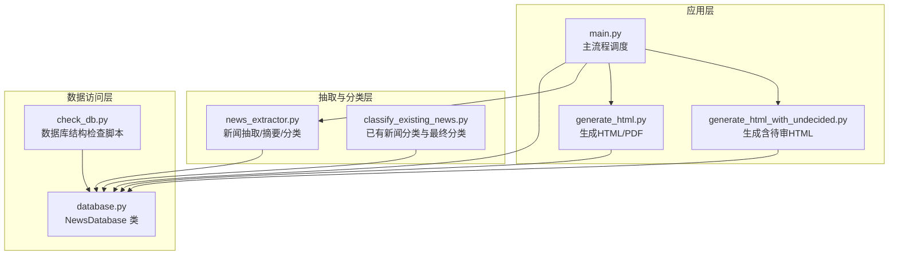
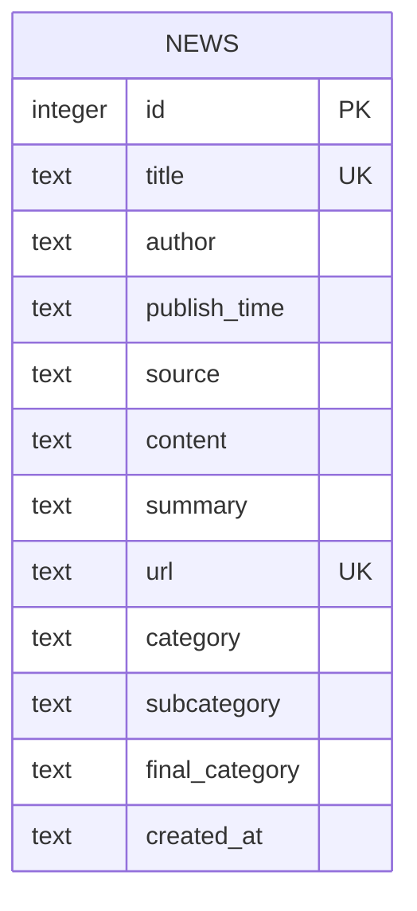
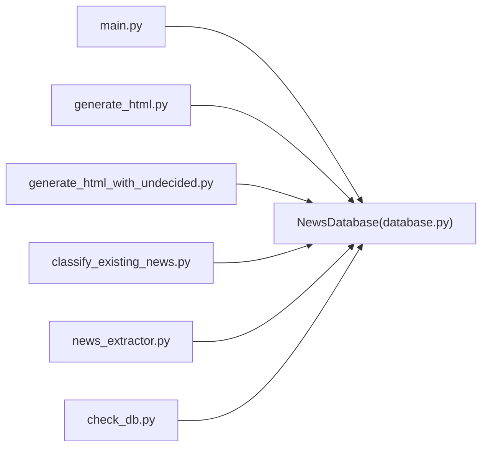

# 表结构设计

<cite>
**本文档引用的文件**
- [database.py](file://database.py)
- [check_db.py](file://check_db.py)
- [classify_existing_news.py](file://classify_existing_news.py)
- [generate_html.py](file://generate_html.py)
- [generate_html_with_undecided.py](file://generate_html_with_undecided.py)
- [main.py](file://main.py)
- [news_extractor.py](file://news_extractor.py)
</cite>

## 目录
1. [简介](#简介)
2. [项目结构](#项目结构)
3. [核心组件](#核心组件)
4. [架构总览](#架构总览)
5. [详细组件分析](#详细组件分析)
6. [依赖关系分析](#依赖关系分析)
7. [性能考量](#性能考量)
8. [故障排查指南](#故障排查指南)
9. [结论](#结论)
10. [附录](#附录)

## 简介
本文件围绕 news-exacter 项目的 news 表结构设计进行系统化梳理与说明，重点覆盖：
- 完整字段定义、数据类型选择与约束设计
- 主键、唯一约束、外键关系的设计原理
- 各字段的业务含义与设计考量
- 表创建 SQL 的解析、字段长度限制与默认值设置
- 字段变更指南与向后兼容性考虑

## 项目结构
该项目采用“功能模块化 + 层次清晰”的组织方式，核心围绕数据库操作、新闻采集与分类、以及报表输出展开。news 表位于数据库层，被多个上层模块共享使用。

图表来源
- [main.py:11-206](file://main.py#L11-L206)
- [database.py:5-92](file://database.py#L5-L92)
- [news_extractor.py:21-800](file://news_extractor.py#L21-L800)
- [classify_existing_news.py:14-302](file://classify_existing_news.py#L14-L302)
- [generate_html.py:1-81](file://generate_html.py#L1-L81)
- [generate_html_with_undecided.py:1-44](file://generate_html_with_undecided.py#L1-L44)
- [check_db.py:1-32](file://check_db.py#L1-L32)

章节来源
- [main.py:11-206](file://main.py#L11-L206)
- [database.py:5-92](file://database.py#L5-L92)

## 核心组件
- NewsDatabase：封装 SQLite 连接、news 表创建、插入、查询、更新等操作。
- news_extractor：负责网页渲染、链接提取、内容抽取、摘要生成、分类调用。
- classify_existing_news：对已有新闻进行分类与最终分类更新。
- 报表生成模块：基于 news 表数据生成 HTML/PDF。

章节来源
- [database.py:5-92](file://database.py#L5-L92)
- [news_extractor.py:21-800](file://news_extractor.py#L21-L800)
- [classify_existing_news.py:14-302](file://classify_existing_news.py#L14-L302)
- [generate_html.py:1-81](file://generate_html.py#L1-L81)

## 架构总览
news 表是整个系统的数据核心，承载新闻元数据、分类信息与时间维度。其设计兼顾唯一性约束、可检索性与可扩展性，并通过多处查询接口实现不同场景的数据展示。

图表来源
- [database.py:20-38](file://database.py#L20-L38)

## 详细组件分析

### news 表字段定义与设计说明
- id
  - 类型：INTEGER
  - 约束：PRIMARY KEY, AUTOINCREMENT
  - 设计说明：自增主键，保证每条记录唯一标识；适合顺序增长的场景，查询主键索引高效。
- title
  - 类型：TEXT
  - 约束：NOT NULL, UNIQUE
  - 设计说明：用于唯一识别一条新闻；INSERT OR IGNORE 会基于此唯一约束去重，避免重复入库。
- author
  - 类型：TEXT
  - 约束：无
  - 设计说明：记录作者信息，允许为空，便于兼容部分来源缺失作者的情况。
- publish_time
  - 类型：TEXT
  - 约束：无
  - 设计说明：存储发布时间字符串，用于排序与筛选；前端/报表模块按该字段进行时间过滤。
- source
  - 类型：TEXT
  - 约束：无
  - 设计说明：记录新闻来源站点名称，用于分类策略与报表分组。
- content
  - 类型：TEXT
  - 约束：无
  - 设计说明：原始内容，用于后续摘要生成与全文检索（若启用）。
- summary
  - 类型：TEXT
  - 约束：无
  - 设计说明：AI 生成的摘要，用于快速浏览与分类输入。
- url
  - 类型：TEXT
  - 约束：NOT NULL, UNIQUE
  - 设计说明：新闻链接唯一标识，避免重复抓取；与 title 的唯一性共同保障数据去重。
- category
  - 类型：TEXT
  - 约束：无
  - 设计说明：初次分类结果（来自百度 NLP API），支持 NULL 以便后续批量补全。
- subcategory
  - 类型：TEXT
  - 约束：无
  - 设计说明：二级分类，支持逗号分隔的多值，便于灵活表达。
- final_category
  - 类型：TEXT
  - 约束：无
  - 设计说明：人工/规则二次确认后的最终分类，用于报表展示过滤（如排除“待审”）。
- created_at
  - 类型：TEXT
  - 约束：NOT NULL
  - 设计说明：记录入库时间，用于审计与排序。

章节来源
- [database.py:20-38](file://database.py#L20-L38)
- [database.py:40-52](file://database.py#L40-L52)
- [generate_html.py:16-42](file://generate_html.py#L16-L42)
- [generate_html_with_undecided.py:11-37](file://generate_html_with_undecided.py#L11-L37)
- [classify_existing_news.py:33-37](file://classify_existing_news.py#L33-L37)

### 约束与索引设计原理
- 主键：id（自增主键），保证每条记录唯一且具备高效主键索引。
- 唯一约束：
  - title：NOT NULL + UNIQUE，结合 INSERT OR IGNORE 实现“标题去重”。
  - url：NOT NULL + UNIQUE，结合 INSERT OR IGNORE 实现“链接去重”。
- 外键：news 表未定义外键，遵循轻量级设计；若未来引入关联表（如分类词典、来源表），可考虑外键约束与级联策略。
- 空值策略：除 id、title、url、created_at 明确约束外，其余字段允许 NULL，提升兼容性与可扩展性。

章节来源
- [database.py:20-38](file://database.py#L20-L38)
- [database.py:40-52](file://database.py#L40-L52)

### 字段长度限制与默认值
- 字符串字段（TEXT）在 SQLite 中无固定长度限制，但实际受存储与内存影响。
- 默认值：news 表未设置 DEFAULT 值，空值字段在插入时保持 NULL；created_at 通过程序注入当前时间字符串。
- 建议：若需统一格式，可在迁移时将 created_at 改为 DATETIME 并设置 DEFAULT CURRENT_TIMESTAMP（见“字段变更指南”）。

章节来源
- [database.py:40-52](file://database.py#L40-L52)

### 业务字段作用与设计考量
- title、author、publish_time、content、summary、url、source：构成新闻元数据与内容载体，支撑抓取、去重、展示与导出。
- category、subcategory：初次分类结果，便于批量处理与人工复核。
- final_category：最终分类，用于报表过滤与人工审核（如“待审”状态）。
- created_at：审计与排序依据，便于生成周期性报告。

章节来源
- [main.py:111-173](file://main.py#L111-L173)
- [generate_html.py:48-70](file://generate_html.py#L48-L70)
- [classify_existing_news.py:169-235](file://classify_existing_news.py#L169-L235)

### 表创建 SQL 解析
- 创建表：news
  - 字段与类型：id、title、author、publish_time、source、content、summary、url、category、subcategory、final_category、created_at
  - 约束：PRIMARY KEY(id)、UNIQUE(title)、UNIQUE(url)、NOT NULL(created_at)
  - 插入：INSERT OR IGNORE，避免重复
  - 查询：按 publish_time 降序，final_category != '待审' 过滤
- 结构校验：check_db.py 使用 PRAGMA table_info(news) 输出列定义，验证字段存在性与类型。

章节来源
- [database.py:20-38](file://database.py#L20-L38)
- [database.py:54-67](file://database.py#L54-L67)
- [check_db.py:7-12](file://check_db.py#L7-L12)

### 字段变更指南与向后兼容性
- 变更原则
  - 保持现有字段语义不变，新增字段优先允许 NULL，避免破坏既有数据。
  - 对于唯一性字段（title、url），变更需评估历史数据与迁移策略。
- 典型变更场景
  - 新增字段：如“image_url”、“tags”等，建议先迁移表结构，再批量回填默认值或空值。
  - 修改字段类型：如将 publish_time 从 TEXT 改为 DATETIME，需先转换数据格式，再重建索引。
  - 删除字段：谨慎操作，建议先迁移至新表，再切换引用。
- 向后兼容性
  - 读取侧：对新增字段使用条件判断或默认值兜底，避免因字段缺失导致异常。
  - 写入侧：INSERT/UPDATE 语句显式包含现有字段，避免因新增字段导致列数不匹配。
  - 查询侧：对外暴露的查询接口（如报表模块）应兼容旧字段索引，避免破坏既有排序与过滤逻辑。

章节来源
- [database.py:20-38](file://database.py#L20-L38)
- [generate_html.py:48-70](file://generate_html.py#L48-L70)
- [generate_html_with_undecided.py:42-70](file://generate_html_with_undecided.py#L42-L70)

## 依赖关系分析
- 数据访问层依赖
  - main.py 依赖 NewsDatabase 进行插入与查询。
  - generate_html.py/generate_html_with_undecided.py 依赖 NewsDatabase 进行数据读取与排序。
  - classify_existing_news.py 依赖 NewsDatabase 进行分类与最终分类更新。
- 抽取与分类层
  - news_extractor.py 产出 title、author、publish_time、content、summary、url 等字段，交由数据库层持久化。
  - classify_existing_news.py 依赖百度 NLP API 生成分类，并更新 category、subcategory、final_category。
- 结构校验
  - check_db.py 通过 PRAGMA table_info(news) 校验表结构，辅助开发与部署阶段的回归验证。

图表来源
- [main.py:11-206](file://main.py#L11-L206)
- [database.py:5-92](file://database.py#L5-L92)
- [news_extractor.py:21-800](file://news_extractor.py#L21-L800)
- [classify_existing_news.py:14-302](file://classify_existing_news.py#L14-L302)
- [generate_html.py:1-81](file://generate_html.py#L1-L81)
- [generate_html_with_undecided.py:1-44](file://generate_html_with_undecided.py#L1-L44)
- [check_db.py:1-32](file://check_db.py#L1-L32)

## 性能考量
- 主键与唯一索引
  - id（主键）、title（UNIQUE）、url（UNIQUE）均建立索引，INSERT OR IGNORE 去重效率高。
- 查询优化
  - 按 publish_time 降序排序，建议在该字段上建立索引以提升排序性能（可选）。
  - 报表模块对 final_category != '待审' 过滤，建议在 final_category 上建立索引以加速过滤。
- I/O 与并发
  - 单文件 SQLite 在写入密集场景下可能成为瓶颈，建议在生产环境迁移到关系型数据库（如 PostgreSQL/MySQL）并启用连接池与事务批处理。

章节来源
- [database.py:20-38](file://database.py#L20-L38)
- [database.py:54-67](file://database.py#L54-L67)
- [generate_html.py:16-42](file://generate_html.py#L16-L42)

## 故障排查指南
- 插入失败或重复
  - 现象：INSERT OR IGNORE 后仍出现重复。
  - 排查：确认 title 与 url 是否满足唯一性；检查数据库连接编码与事务提交。
- 查询异常
  - 现象：排序或过滤不符合预期。
  - 排查：确认 publish_time 格式一致性；检查 final_category 字段是否为空或包含空白字符。
- 分类未生效
  - 现象：分类字段为空或未更新。
  - 排查：确认 classify_existing_news.py 的 API 密钥配置与网络连通性；检查数据库连接与事务提交。
- 结构不一致
  - 现象：字段缺失或类型不符。
  - 排查：使用 check_db.py 的 PRAGMA table_info(news) 校验结构；必要时执行迁移脚本。

章节来源
- [database.py:40-52](file://database.py#L40-L52)
- [database.py:54-67](file://database.py#L54-L67)
- [classify_existing_news.py:237-302](file://classify_existing_news.py#L237-L302)
- [check_db.py:7-12](file://check_db.py#L7-L12)

## 结论
news 表在设计上兼顾了唯一性约束、可扩展性与查询效率，能够满足新闻采集、分类与报表生成的核心需求。建议在未来演进中：
- 引入外键与索引策略，提升查询与一致性保障；
- 考虑将 SQLite 迁移至关系型数据库，以应对更高并发与复杂查询；
- 在字段变更时严格遵循向后兼容原则，确保现有模块不受影响。

## 附录

### 字段变更示例（概念性）
- 新增字段：image_url（TEXT, NULL）
- 修改字段：publish_time（TEXT -> DATETIME）
- 删除字段：暂不建议删除，优先迁移至新表

章节来源
- [database.py:20-38](file://database.py#L20-L38)