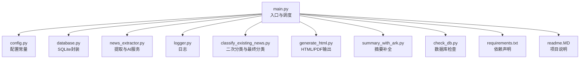
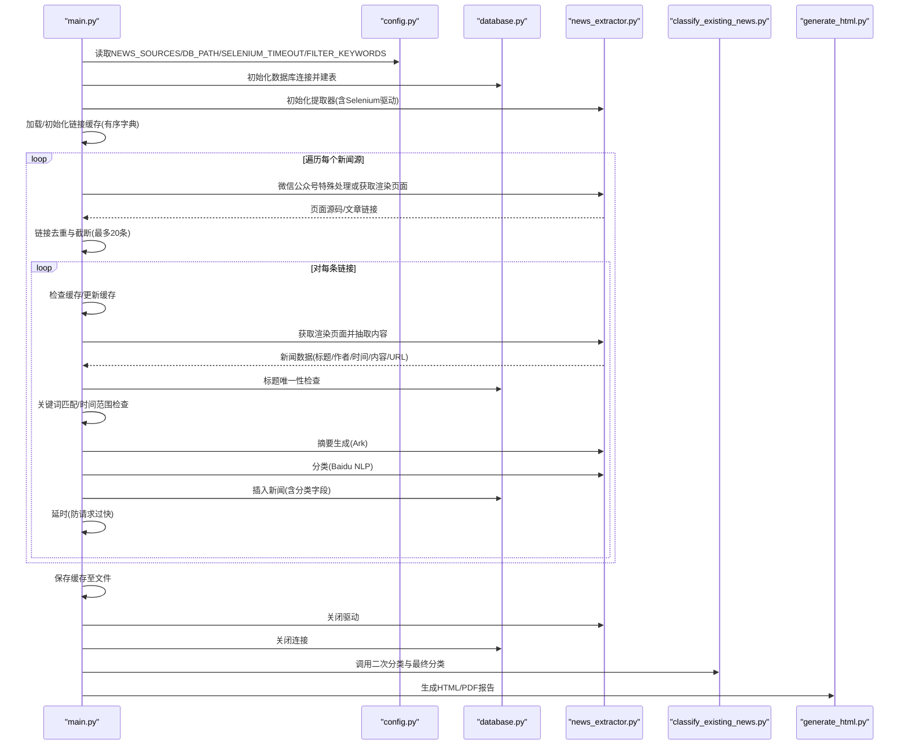
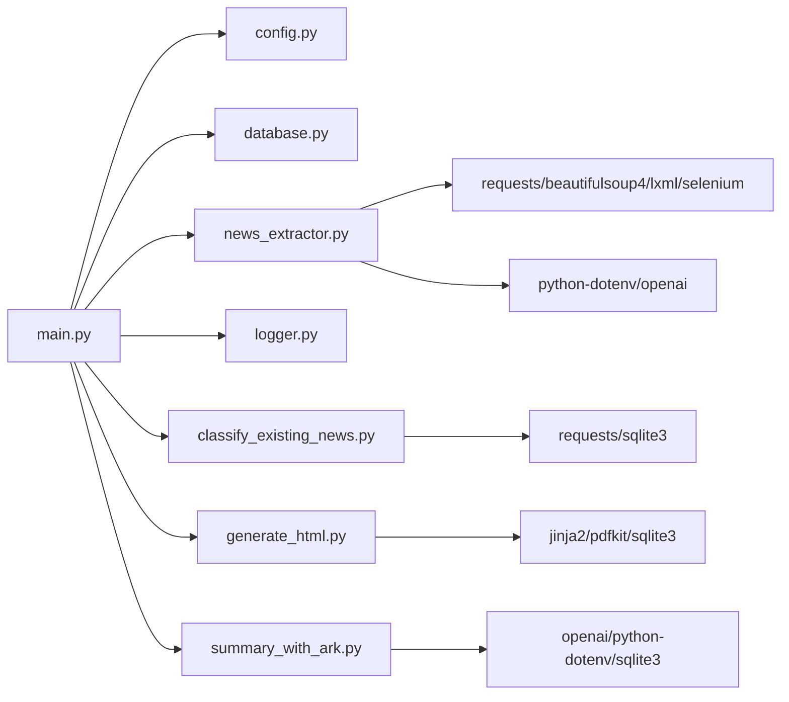

# 主程序模块 (main.py)

<cite>
**本文引用的文件**
- [main.py](file://main.py)
- [config.py](file://config.py)
- [database.py](file://database.py)
- [news_extractor.py](file://news_extractor.py)
- [logger.py](file://logger.py)
- [classify_existing_news.py](file://classify_existing_news.py)
- [generate_html.py](file://generate_html.py)
- [summary_with_ark.py](file://summary_with_ark.py)
- [check_db.py](file://check_db.py)
- [requirements.txt](file://requirements.txt)
- [readme.MD](file://readme.MD)
</cite>

## 目录
1. [简介](#简介)
2. [项目结构](#项目结构)
3. [核心组件](#核心组件)
4. [架构总览](#架构总览)
5. [详细组件分析](#详细组件分析)
6. [依赖分析](#依赖分析)
7. [性能考虑](#性能考虑)
8. [故障排查指南](#故障排查指南)
9. [结论](#结论)
10. [附录](#附录)

## 简介
本文件面向news-exacter系统的主程序模块（main.py），系统性阐述其作为程序入口点的流程控制与调度机制，覆盖数据库初始化、新闻提取器初始化、链接缓存管理、新闻源遍历与处理、微信公众号特殊处理逻辑、新闻链接提取、内容过滤规则（关键词匹配、时间范围检查）、AI摘要生成与分类调用的完整流程。同时提供错误处理策略、性能优化技巧与最佳实践建议，帮助读者快速理解并高效维护该模块。

## 项目结构
项目采用“入口模块 + 工具模块 + 业务模块”的分层组织方式：
- 入口模块：main.py
- 配置模块：config.py
- 数据库模块：database.py
- 新闻提取模块：news_extractor.py
- 日志模块：logger.py
- 分类与最终分类模块：classify_existing_news.py
- HTML/PDF生成模块：generate_html.py
- 摘要补全模块：summary_with_ark.py
- 数据库检查工具：check_db.py
- 依赖声明：requirements.txt
- 项目说明：readme.MD

图表来源
- [main.py:11-206](file://main.py#L11-L206)
- [config.py:1-78](file://config.py#L1-L78)
- [database.py:1-92](file://database.py#L1-L92)
- [news_extractor.py:1-893](file://news_extractor.py#L1-L893)
- [logger.py:1-104](file://logger.py#L1-L104)
- [classify_existing_news.py:1-302](file://classify_existing_news.py#L1-L302)
- [generate_html.py:1-81](file://generate_html.py#L1-L81)
- [summary_with_ark.py:1-60](file://summary_with_ark.py#L1-L60)
- [check_db.py:1-32](file://check_db.py#L1-L32)
- [requirements.txt:1-10](file://requirements.txt#L1-L10)
- [readme.MD:1-11](file://readme.MD#L1-L11)

章节来源
- [main.py:11-206](file://main.py#L11-L206)
- [config.py:1-78](file://config.py#L1-L78)
- [requirements.txt:1-10](file://requirements.txt#L1-L10)

## 核心组件
- 入口与调度：main()负责初始化数据库、提取器、链接缓存，遍历新闻源，执行链接提取、内容过滤、摘要生成与分类、入库、缓存持久化与资源释放。
- 配置：NEWS_SOURCES、DB_PATH、SELENIUM_TIMEOUT、FILTER_KEYWORDS等集中管理。
- 数据库：NewsDatabase封装SQLite连接、建表、插入、查询、唯一性检查与关闭。
- 新闻提取器：NewsExtractor封装Selenium驱动初始化、微信公众号文章列表抓取、通用/特定站点链接提取、内容抽取、AI摘要与分类调用。
- 日志：logger模块提供按类别分发的日志记录器，支持文件轮转与控制台输出。
- 分类与最终分类：classify_existing_news.py负责对未分类新闻进行百度智能云NLP分类，并结合来源与作者等规则生成最终分类。
- HTML/PDF生成：generate_html.py基于模板渲染生成HTML与PDF报告。
- 摘要补全：summary_with_ark.py对近两周新闻进行摘要补全。
- 数据库检查：check_db.py用于查看表结构、数量与示例数据。

章节来源
- [main.py:11-206](file://main.py#L11-L206)
- [config.py:1-78](file://config.py#L1-L78)
- [database.py:5-92](file://database.py#L5-L92)
- [news_extractor.py:21-893](file://news_extractor.py#L21-L893)
- [logger.py:25-104](file://logger.py#L25-L104)
- [classify_existing_news.py:14-302](file://classify_existing_news.py#L14-L302)
- [generate_html.py:1-81](file://generate_html.py#L1-L81)
- [summary_with_ark.py:1-60](file://summary_with_ark.py#L1-L60)
- [check_db.py:1-32](file://check_db.py#L1-L32)

## 架构总览
main.py作为主控模块，串联以下关键流程：
- 初始化阶段：加载配置、建立数据库连接、构建新闻提取器、加载/初始化链接缓存。
- 新闻源遍历：逐个访问配置中的新闻源，针对不同站点执行差异化处理。
- 链接提取：通用正则与BeautifulSoup解析，或针对特定站点的结构化提取。
- 内容过滤：关键词匹配、发布时间窗口检查、标题唯一性检查。
- AI处理：摘要生成（方舟大模型）、分类（百度智能云NLP）。
- 数据入库：写入SQLite，包含标题唯一约束与分类字段。
- 缓存管理：内存级有序字典缓存，落地持久化。
- 资源清理：关闭浏览器驱动与数据库连接。
- 后处理：调用二次分类与最终分类脚本，生成HTML/PDF报告。

图表来源
- [main.py:11-206](file://main.py#L11-L206)
- [news_extractor.py:21-893](file://news_extractor.py#L21-L893)
- [database.py:5-92](file://database.py#L5-L92)
- [classify_existing_news.py:237-302](file://classify_existing_news.py#L237-L302)
- [generate_html.py:1-81](file://generate_html.py#L1-L81)

## 详细组件分析

### 入口与调度（main.py）
- 数据库初始化：通过NewsDatabase(DB_PATH)建立连接并创建news表（含唯一约束与分类字段）。
- 提取器初始化：NewsExtractor(timeout=SELENIUM_TIMEOUT)初始化Selenium驱动与通用新闻抽取器。
- 链接缓存管理：使用有序字典维护最近使用链接，支持从文件加载、超限淘汰、落地持久化。
- 新闻源遍历：遍历NEWS_SOURCES，区分微信公众号与普通站点。
  - 微信公众号：从URL解析fakeid，调用get_article_links获取文章链接。
  - 普通站点：先获取渲染页面，再调用extract_news_links提取链接。
- 链接处理：对每条链接执行缓存检查、渲染页面、抽取内容、唯一性检查、关键词匹配、时间范围检查、摘要生成、分类、入库与延时。
- 错误处理：捕获异常并记录日志，finally中保存缓存、关闭资源。
- 后处理：调用classify_existing_news.main()进行二次分类与最终分类，随后生成HTML/PDF报告。

章节来源
- [main.py:11-206](file://main.py#L11-L206)
- [config.py:1-78](file://config.py#L1-L78)
- [database.py:20-52](file://database.py#L20-L52)
- [news_extractor.py:78-178](file://news_extractor.py#L78-L178)
- [news_extractor.py:208-684](file://news_extractor.py#L208-L684)
- [news_extractor.py:685-708](file://news_extractor.py#L685-L708)
- [news_extractor.py:710-750](file://news_extractor.py#L710-L750)
- [news_extractor.py:759-893](file://news_extractor.py#L759-L893)

### 配置模块（config.py）
- NEWS_SOURCES：定义多个新闻源的URL与来源名称，支持微信公众号与多类政府/教育网站。
- DB_PATH：SQLite数据库路径。
- SELENIUM_TIMEOUT：Selenium页面加载超时。
- FILTER_KEYWORDS：内容/标题关键词过滤集合。

章节来源
- [config.py:1-78](file://config.py#L1-L78)

### 数据库模块（database.py）
- 连接与建表：连接SQLite，创建news表，设置标题与URL唯一约束，新增分类字段。
- 插入：INSERT OR IGNORE策略，避免重复；记录创建时间。
- 查询：支持按最终分类过滤排序、获取未审条目。
- 唯一性检查：is_title_exists用于入库前去重。
- 关闭：释放数据库连接。

章节来源
- [database.py:5-92](file://database.py#L5-L92)

### 新闻提取器（news_extractor.py）
- 驱动初始化：无头Chrome、反检测参数、超时设置、服务路径固定。
- 微信公众号：解析fakeid，构造参数，注入cookies，获取文章列表并解析链接。
- 页面渲染：针对特定站点（如今日头条）增加滚动与等待。
- 链接提取：
  - 特定站点处理：教育部、今日头条、edu.cn、ai-bot.cn、beijing.gov.cn、北外网站等，限定容器并提取a标签href，处理相对路径。
  - 通用提取：正则提取href，去重，按关键词、日期模式、长度等规则过滤。
- 内容抽取：修复GNE误删body问题，剥离广告与评论节点，保证必要字段齐全。
- 摘要生成：调用方舟大模型API，去除HTML标签后生成摘要。
- 分类：调用百度智能云NLP分类API，解析多级标签，回退默认分类。

章节来源
- [news_extractor.py:21-893](file://news_extractor.py#L21-L893)

### 日志模块（logger.py）
- 提供按类别分发的日志记录器，支持文件轮转（10MB，5份备份）与控制台输出。
- 统一日志格式与时间格式，便于问题追踪。

章节来源
- [logger.py:25-104](file://logger.py#L25-L104)

### 分类与最终分类（classify_existing_news.py）
- 二次分类：对category为NULL的新闻调用百度智能云NLP进行主题与子类识别。
- 最终分类：结合来源、作者、分类与子分类等规则，生成final_category。
- 数据库操作：更新分类字段与最终分类字段。

章节来源
- [classify_existing_news.py:14-302](file://classify_existing_news.py#L14-L302)

### HTML/PDF生成（generate_html.py）
- 从数据库读取新闻，按最终分类过滤并排序。
- 使用Jinja2模板渲染HTML，生成PDF报告。

章节来源
- [generate_html.py:1-81](file://generate_html.py#L1-L81)

### 摘要补全（summary_with_ark.py）
- 对近两周新闻进行摘要补全，调用方舟大模型API，更新数据库摘要字段。

章节来源
- [summary_with_ark.py:1-60](file://summary_with_ark.py#L1-L60)

### 数据库检查（check_db.py）
- 查看表结构、统计数量、展示示例数据，辅助开发与运维验证。

章节来源
- [check_db.py:1-32](file://check_db.py#L1-L32)

## 依赖分析
- 外部依赖：selenium、GeneralNewsExtractor、requests、beautifulsoup4、lxml、webdriver-manager、python-dotenv、langchain、openai、jinja2。
- 模块间耦合：
  - main.py依赖config.py、database.py、news_extractor.py、logger.py。
  - news_extractor.py依赖Selenium、GNX、BeautifulSoup、requests、dotenv。
  - classify_existing_news.py依赖requests、sqlite3。
  - generate_html.py依赖jinja2、pdfkit、sqlite3。
  - summary_with_ark.py依赖openai、dotenv、sqlite3。
- 潜在循环依赖：无直接循环，但main.py在最后调用classify_existing_news.main()，属于流程上的后续步骤而非代码层面的循环。

图表来源
- [main.py:11-206](file://main.py#L11-L206)
- [news_extractor.py:1-893](file://news_extractor.py#L1-L893)
- [classify_existing_news.py:1-302](file://classify_existing_news.py#L1-L302)
- [generate_html.py:1-81](file://generate_html.py#L1-L81)
- [summary_with_ark.py:1-60](file://summary_with_ark.py#L1-L60)
- [requirements.txt:1-10](file://requirements.txt#L1-L10)

章节来源
- [requirements.txt:1-10](file://requirements.txt#L1-L10)

## 性能考虑
- 浏览器驱动与页面渲染：
  - 使用无头模式减少资源消耗；针对特定站点增加等待与滚动，平衡稳定性与性能。
  - 固定chromedriver路径，避免网络下载带来的额外开销。
- 链接提取与内容抽取：
  - 优先使用站点特定容器提取，降低DOM解析成本；通用提取后进行去重与规则过滤，减少无效请求。
- 缓存策略：
  - 内存级有序字典缓存，超限时淘汰最旧项；落地持久化避免重复抓取。
- 请求节流：
  - 每条新闻处理后sleep(1)，避免触发目标站点限流。
- 数据库写入：
  - 使用INSERT OR IGNORE与唯一约束，减少重复写入；批量操作建议在上游合并。
- AI服务：
  - 摘要与分类均调用外部API，注意并发与配额控制；可考虑本地缓存或异步队列。

[本节为通用性能建议，无需特定文件引用]

## 故障排查指南
- 页面加载失败：
  - 检查Selenium超时设置与目标站点反爬策略；适当增加等待时间或调整UA。
  - 参考：[news_extractor.py:180-206](file://news_extractor.py#L180-L206)
- 微信公众号无法获取文章列表：
  - 确认fakeid解析正确、cookies与参数完整；检查站点接口变化。
  - 参考：[news_extractor.py:78-178](file://news_extractor.py#L78-L178)
- 链接提取异常：
  - 特定站点容器变更导致解析失败，需更新选择器；通用提取后仍需严格过滤。
  - 参考：[news_extractor.py:208-684](file://news_extractor.py#L208-L684)
- 内容抽取为空：
  - GNE误删body问题已修复，确认页面源码与广告/评论节点移除策略。
  - 参考：[news_extractor.py:685-708](file://news_extractor.py#L685-L708)
- 摘要/分类失败：
  - 检查API密钥与网络连通性；关注百度智能云与方舟API状态。
  - 参考：[news_extractor.py:710-750](file://news_extractor.py#L710-L750)、[news_extractor.py:759-893](file://news_extractor.py#L759-L893)
- 数据库异常：
  - 使用check_db.py检查表结构与数据；确认唯一约束生效。
  - 参考：[check_db.py:1-32](file://check_db.py#L1-L32)、[database.py:20-52](file://database.py#L20-L52)
- 日志定位：
  - 使用logger模块的分类日志，结合日志轮转文件定位问题。
  - 参考：[logger.py:25-104](file://logger.py#L25-L104)

章节来源
- [news_extractor.py:180-206](file://news_extractor.py#L180-L206)
- [news_extractor.py:78-178](file://news_extractor.py#L78-L178)
- [news_extractor.py:208-684](file://news_extractor.py#L208-L684)
- [news_extractor.py:685-708](file://news_extractor.py#L685-L708)
- [news_extractor.py:710-750](file://news_extractor.py#L710-L750)
- [news_extractor.py:759-893](file://news_extractor.py#L759-L893)
- [check_db.py:1-32](file://check_db.py#L1-L32)
- [database.py:20-52](file://database.py#L20-L52)
- [logger.py:25-104](file://logger.py#L25-L104)

## 结论
main.py作为系统入口，承担了从配置加载、资源初始化、新闻源遍历、内容过滤、AI处理到入库与后处理的全流程调度职责。通过合理的缓存策略、严格的过滤规则与稳健的错误处理，实现了对多类型新闻源的稳定抓取与高质量产出。建议在生产环境中进一步完善并发控制、API配额监控与日志归档策略，以提升整体可靠性与可观测性。

[本节为总结性内容，无需特定文件引用]

## 附录

### 代码片段路径参考（不含具体代码内容）
- 入口与调度：[main.py:11-206](file://main.py#L11-L206)
- 配置常量：[config.py:1-78](file://config.py#L1-L78)
- 数据库建表与插入：[database.py:20-52](file://database.py#L20-L52)
- 微信公众号链接提取：[news_extractor.py:78-178](file://news_extractor.py#L78-L178)
- 通用/特定站点链接提取：[news_extractor.py:208-684](file://news_extractor.py#L208-L684)
- 内容抽取与清洗：[news_extractor.py:685-708](file://news_extractor.py#L685-L708)
- 摘要生成（方舟）：[news_extractor.py:710-750](file://news_extractor.py#L710-L750)
- 分类（百度NLP）：[news_extractor.py:759-893](file://news_extractor.py#L759-L893)
- 二次分类与最终分类：[classify_existing_news.py:237-302](file://classify_existing_news.py#L237-L302)
- HTML/PDF生成：[generate_html.py:1-81](file://generate_html.py#L1-L81)
- 摘要补全：[summary_with_ark.py:1-60](file://summary_with_ark.py#L1-L60)
- 数据库检查：[check_db.py:1-32](file://check_db.py#L1-L32)
- 依赖声明：[requirements.txt:1-10](file://requirements.txt#L1-L10)
- 项目说明：[readme.MD:1-11](file://readme.MD#L1-L11)