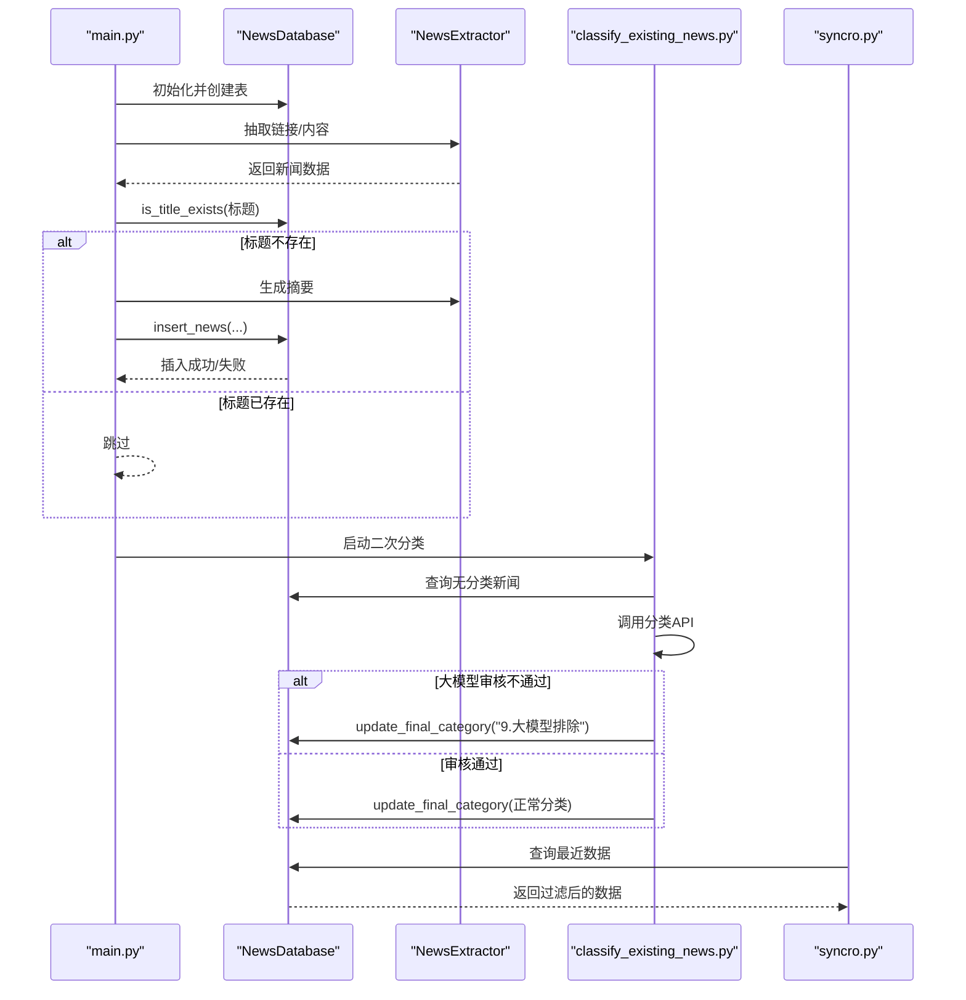
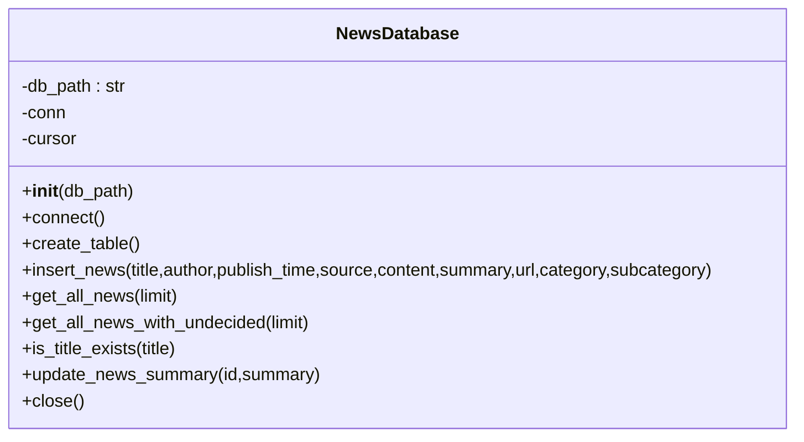
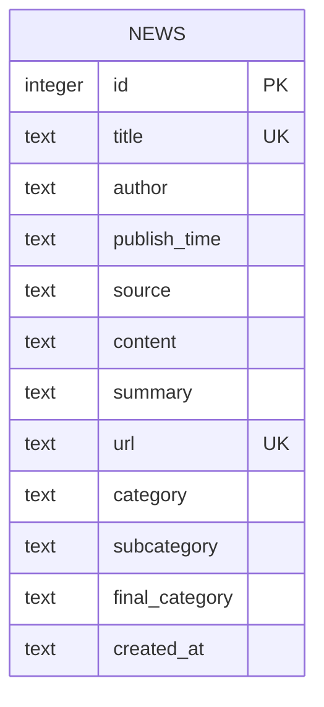
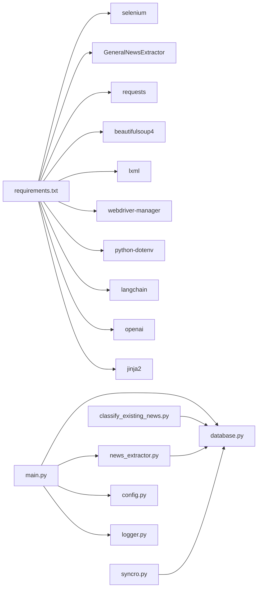

# 数据库管理模块 (database.py)

<cite>
**本文引用的文件**
- [database.py](file://database.py)
- [check_db.py](file://check_db.py)
- [main.py](file://main.py)
- [config.py](file://config.py)
- [classify_existing_news.py](file://classify_existing_news.py)
- [news_extractor.py](file://news_extractor.py)
- [logger.py](file://logger.py)
- [requirements.txt](file://requirements.txt)
- [syncro.py](file://syncro.py)
</cite>

## 目录
1. [简介](#简介)
2. [项目结构](#项目结构)
3. [核心组件](#核心组件)
4. [架构总览](#架构总览)
5. [详细组件分析](#详细组件分析)
6. [依赖分析](#依赖分析)
7. [性能考虑](#性能考虑)
8. [故障排查指南](#故障排查指南)
9. [结论](#结论)
10. [附录](#附录)

## 简介
本文件面向news-exacter系统的数据库管理模块，围绕NewsDatabase类展开，系统性阐述其设计与实现，包括：
- SQLite数据库连接管理
- 新闻数据表结构设计与字段约束
- CRUD操作实现（插入、查询、更新）
- 查询优化与事务处理
- 数据一致性保障机制
- 批量插入与更新策略
- SQL语句示例、数据库Schema图、性能优化技巧与数据迁移方案

**更新** 本版本反映了数据库过滤逻辑的重要变更：新增对"大模型排除"记录的过滤，以改进数据质量控制。

## 项目结构
数据库管理模块位于独立文件database.py中，配合主流程入口main.py、配置文件config.py、日志模块logger.py以及分类脚本classify_existing_news.py共同构成完整的数据采集与存储链路。

```mermaid
graph TB
subgraph "应用层"
MAIN["main.py<br/>主流程调度"]
CFG["config.py<br/>配置常量"]
LOG["logger.py<br/>日志模块"]
SYNC["syncro.py<br/>数据同步"]
END
subgraph "数据库层"
DB["database.py<br/>NewsDatabase类"]
SCHEMA["news表Schema<br/>唯一约束/索引建议"]
END
subgraph "分类与抽取"
CLF["classify_existing_news.py<br/>二次分类与最终分类"]
EXT["news_extractor.py<br/>内容抽取与摘要生成"]
END
MAIN --> DB
MAIN --> EXT
MAIN --> CFG
MAIN --> LOG
CLF --> DB
EXT --> DB
SYNC --> DB
DB --> SCHEMA
```

**图表来源**
- [main.py:11-198](file://main.py#L11-L198)
- [database.py:5-92](file://database.py#L5-L92)
- [config.py:67-78](file://config.py#L67-L78)
- [classify_existing_news.py:14-62](file://classify_existing_news.py#L14-L62)
- [news_extractor.py:21-78](file://news_extractor.py#L21-L78)
- [syncro.py:50-151](file://syncro.py#L50-L151)

**章节来源**
- [main.py:11-198](file://main.py#L11-L198)
- [database.py:5-92](file://database.py#L5-L92)
- [config.py:67-78](file://config.py#L67-L78)
- [classify_existing_news.py:14-62](file://classify_existing_news.py#L14-L62)
- [news_extractor.py:21-78](file://news_extractor.py#L21-L78)
- [syncro.py:50-151](file://syncro.py#L50-L151)

## 核心组件
- NewsDatabase类：封装SQLite连接、表创建、CRUD操作、查询与关闭连接。
- 表news：存储新闻元数据、摘要、分类信息及创建时间。
- 主流程main.py：负责调度抽取、过滤、摘要生成与入库。
- 分类脚本classify_existing_news.py：负责二次分类与最终分类更新，包含"大模型排除"机制。
- 数据同步脚本syncro.py：负责SQLite到PostgreSQL的数据同步，同样应用"大模型排除"过滤。

**更新** 新增数据质量控制机制，通过"大模型排除"标记过滤低质量内容。

**章节来源**
- [database.py:5-92](file://database.py#L5-L92)
- [main.py:11-198](file://main.py#L11-L198)
- [classify_existing_news.py:14-62](file://classify_existing_news.py#L14-L62)
- [syncro.py:50-151](file://syncro.py#L50-L151)

## 架构总览
数据库管理模块采用"单连接单游标"的轻量级设计，初始化即建立连接并创建表；提供插入、查询、更新与关闭方法。主流程在插入前通过标题存在性检查避免重复，分类脚本在后续阶段补充分类信息，其中包含"大模型排除"的质量控制机制。



**图表来源**
- [main.py:112-173](file://main.py#L112-L173)
- [database.py:40-52](file://database.py#L40-L52)
- [database.py:68-77](file://database.py#L68-L77)
- [classify_existing_news.py:28-58](file://classify_existing_news.py#L28-L58)
- [syncro.py:55-65](file://syncro.py#L55-L65)

## 详细组件分析

### NewsDatabase类设计与实现
- 连接管理
  - 初始化时建立SQLite连接，并设置text_factory为str以确保UTF-8编码。
  - 提供close方法确保连接释放。
- 表结构设计
  - 主键自增id
  - 唯一约束：title、url
  - 字段：标题、作者、发布时间、来源、正文、摘要、分类、子分类、最终分类、创建时间
- CRUD操作
  - 插入：INSERT OR IGNORE，避免重复；同时写入created_at。
  - 查询：按发布时间倒序列出，支持limit；提供"包含待审"与"排除待审"的两种视图。
  - 更新：支持摘要更新；分类脚本中提供分类与最终分类更新。
- 错误处理
  - 所有数据库操作均包裹异常捕获并通过日志记录器输出错误信息。



**图表来源**
- [database.py:5-92](file://database.py#L5-L92)

**章节来源**
- [database.py:5-92](file://database.py#L5-L92)

### 数据库Schema与字段约束
- 表名：news
- 主键：id（INTEGER PRIMARY KEY AUTOINCREMENT）
- 唯一约束：title（UNIQUE）、url（UNIQUE）
- 非空约束：title（NOT NULL）、url（NOT NULL）、created_at（NOT NULL）
- 其他字段：author、publish_time、source、content、summary、category、subcategory、final_category
- 查询视图：
  - 正常视图：排除final_category为"待审"且final_category包含"大模型排除"的记录，按publish_time降序
  - 完整视图：包含所有记录，按publish_time降序

**更新** 正常视图现在包含"大模型排除"过滤逻辑，确保数据质量。



**图表来源**
- [database.py:20-38](file://database.py#L20-L38)

**章节来源**
- [database.py:20-38](file://database.py#L20-L38)

### CRUD操作实现与SQL语句示例
- 插入（避免重复）：INSERT OR IGNORE INTO news (...) VALUES (...)
- 查询（正常视图）：SELECT * FROM news WHERE final_category != '待审' AND final_category NOT LIKE '%大模型排除%' ORDER BY publish_time DESC [LIMIT ...]
- 查询（完整视图）：SELECT * FROM news ORDER BY publish_time DESC [LIMIT ...]
- 标题存在性检查：SELECT COUNT(*) FROM news WHERE title = ?
- 摘要更新：UPDATE news SET summary = ? WHERE id = ?

**更新** 正常视图查询现在包含"大模型排除"过滤条件，确保只显示高质量内容。

**章节来源**
- [database.py:40-52](file://database.py#L40-L52)
- [database.py:54-67](file://database.py#L54-L67)
- [database.py:68-77](file://database.py#L68-L77)
- [database.py:79-87](file://database.py#L79-L87)

### 查询优化与事务处理
- 事务处理
  - 所有写操作（INSERT、UPDATE）后执行commit，确保原子性。
  - 读操作使用fetchall一次性获取结果集，减少多次往返。
- 查询优化建议
  - 为publish_time建立索引以加速排序与范围查询。
  - 为title、url建立索引以提升去重与存在性检查效率。
  - 对final_category建立索引以优化"排除待审"与"大模型排除"的过滤。
- 批量策略
  - 当前实现逐条插入与更新，适合小规模数据。
  - 大规模场景可采用executemany或BEGIN/COMMIT批处理，减少磁盘IO与锁竞争。

**更新** 建议为final_category建立复合索引，以优化包含"大模型排除"的复杂过滤条件。

**章节来源**
- [database.py:37-38](file://database.py#L37-L38)
- [database.py:47-48](file://database.py#L47-L48)
- [database.py:82-83](file://database.py#L82-L83)

### 数据一致性保障机制
- 唯一约束：title与url唯一，天然防止重复插入。
- 存在性检查：插入前is_title_exists避免重复。
- 时间戳：created_at记录入库时间，便于审计与排序。
- 分类分步：先入库，再二次分类与最终分类，保证数据完整性。
- 质量控制：通过"大模型排除"机制自动过滤低质量内容。

**更新** 新增"大模型排除"质量控制机制，通过AI审核确保内容质量。

**章节来源**
- [database.py:24](file://database.py#L24)
- [database.py:30](file://database.py#L30)
- [database.py:42](file://database.py#L42)
- [database.py:68-77](file://database.py#L68-L77)
- [classify_existing_news.py:277-282](file://classify_existing_news.py#L277-L282)

### 批量插入与更新策略
- 批量插入
  - 使用executemany传入多个参数元组，减少SQL解析与提交次数。
  - 注意SQLite的参数上限（通常为999），需分批提交。
- 批量更新
  - 使用UPDATE语句配合WHERE IN或临时表合并，减少往返。
- 事务边界
  - 将多条写操作包裹在单个事务中，失败回滚，成功提交。

**章节来源**
- [database.py:40-52](file://database.py#L40-L52)
- [database.py:79-87](file://database.py#L79-L87)

### 数据迁移方案
- 结构变更
  - 新增列：ALTER TABLE news ADD COLUMN new_column TEXT
  - 修改列：ALTER TABLE news RENAME COLUMN old TO new
  - 删除列：ALTER TABLE news DROP COLUMN column_name
- 数据迁移
  - 导出：使用PRAGMA table_info与SELECT导出历史数据
  - 清洗：在Python中读取并清洗，修正编码、格式与缺失值
  - 导入：INSERT OR IGNORE或BEGIN/COMMIT批处理导入
- 版本控制
  - 在应用启动时检查schema版本，必要时执行迁移脚本

**章节来源**
- [check_db.py:7-18](file://check_db.py#L7-L18)

## 依赖分析
- 外部依赖
  - sqlite3：标准库，无需额外安装
  - requests、bs4、lxml、selenium等用于内容抽取与网页渲染
- 模块间耦合
  - main.py依赖database.py进行数据持久化
  - classify_existing_news.py依赖database.py进行分类更新，包含"大模型排除"逻辑
  - news_extractor.py依赖database.py进行摘要生成与分类调用
  - syncro.py依赖database.py进行数据同步，应用相同的过滤规则



**图表来源**
- [requirements.txt:1-10](file://requirements.txt#L1-L10)
- [main.py:1-7](file://main.py#L1-L7)
- [database.py:1-3](file://database.py#L1-L3)
- [classify_existing_news.py:7-11](file://classify_existing_news.py#L7-L11)
- [news_extractor.py:1-19](file://news_extractor.py#L1-L19)
- [syncro.py:1-20](file://syncro.py#L1-L20)

**章节来源**
- [requirements.txt:1-10](file://requirements.txt#L1-L10)
- [main.py:1-7](file://main.py#L1-L7)
- [database.py:1-3](file://database.py#L1-L3)
- [classify_existing_news.py:7-11](file://classify_existing_news.py#L7-L11)
- [news_extractor.py:1-19](file://news_extractor.py#L1-L19)
- [syncro.py:1-20](file://syncro.py#L1-L20)

## 性能考虑
- 连接与编码
  - 使用text_factory=str确保UTF-8编码，避免乱码与转换开销
- 索引建议
  - 为publish_time、title、url、final_category建立索引，显著提升查询与过滤性能
  - 建议为final_category建立复合索引，优化"大模型排除"过滤
- 批处理
  - 大量插入/更新时使用executemany与事务批处理
- I/O优化
  - 控制日志级别与文件轮转，避免频繁刷盘
- 并发与锁
  - 单连接单游标设计简单可靠；高并发场景建议连接池或异步I/O

**更新** 建议为final_category字段建立专门的复合索引，以优化包含"大模型排除"的复杂查询条件。

**章节来源**
- [database.py:15-18](file://database.py#L15-L18)
- [logger.py:38-54](file://logger.py#L38-L54)

## 故障排查指南
- 插入失败
  - 检查title或url是否违反唯一约束
  - 查看日志记录器输出的错误信息
- 查询异常
  - 确认表结构是否正确（PRAGMA table_info）
  - 检查索引是否存在，必要时重建
- 编码问题
  - 确保text_factory设置为str
  - 检查content与title是否包含不可见字符
- 分类更新失败
  - 确认分类脚本依赖的API密钥已正确配置
  - 检查网络与超时设置
- 数据质量异常
  - 检查"大模型排除"标记是否正确应用
  - 验证过滤逻辑是否按预期工作

**更新** 新增"大模型排除"相关的故障排查指导。

**章节来源**
- [database.py:50-52](file://database.py#L50-L52)
- [check_db.py:7-18](file://check_db.py#L7-L18)
- [logger.py:74-104](file://logger.py#L74-L104)
- [classify_existing_news.py:250-252](file://classify_existing_news.py#L250-L252)

## 结论
NewsDatabase类以简洁可靠的单连接设计满足了新闻数据的存储需求，结合唯一约束与存在性检查有效避免重复，配合主流程与分类脚本形成完整的数据生命周期管理。**更新** 新增的"大模型排除"质量控制机制进一步提升了数据质量，通过AI审核自动过滤低质量内容。建议在生产环境中引入索引、批处理与连接池，进一步提升性能与稳定性。

## 附录

### SQL语句示例
- 创建表
  - [database.py:20-38](file://database.py#L20-L38)
- 插入（避免重复）
  - [database.py:40-52](file://database.py#L40-L52)
- 查询（正常视图）
  - [database.py:54-60](file://database.py#L54-L60)
- 查询（完整视图）
  - [database.py:61-67](file://database.py#L61-L67)
- 标题存在性检查
  - [database.py:68-77](file://database.py#L68-L77)
- 摘要更新
  - [database.py:79-87](file://database.py#L79-L87)

### Schema与索引建议
- 已有约束
  - 主键：id
  - 唯一：title、url
  - 非空：title、url、created_at
- 建议索引
  - publish_time：ORDER BY与范围查询
  - title、url：去重与存在性检查
  - final_category：过滤"待审"与"大模型排除"

**更新** 建议为final_category建立复合索引，以优化包含"大模型排除"的复杂过滤条件。

### 数据质量控制机制
- "大模型排除"标记
  - 通过AI审核判断内容是否属于教育信息化范畴
  - 不符合要求的内容标记为"9.大模型排除"
  - 在查询时自动过滤此类内容
- 过滤应用场景
  - 主查询：排除final_category为"待审"且包含"大模型排除"的记录
  - 同步查询：在数据同步时同样应用此过滤规则
  - 分类更新：在最终分类阶段应用此质量控制

**更新** 新增完整的数据质量控制机制说明。

**章节来源**
- [database.py:20-38](file://database.py#L20-L38)
- [classify_existing_news.py:277-282](file://classify_existing_news.py#L277-L282)
- [syncro.py:58-59](file://syncro.py#L58-L59)