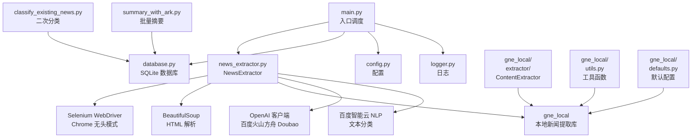
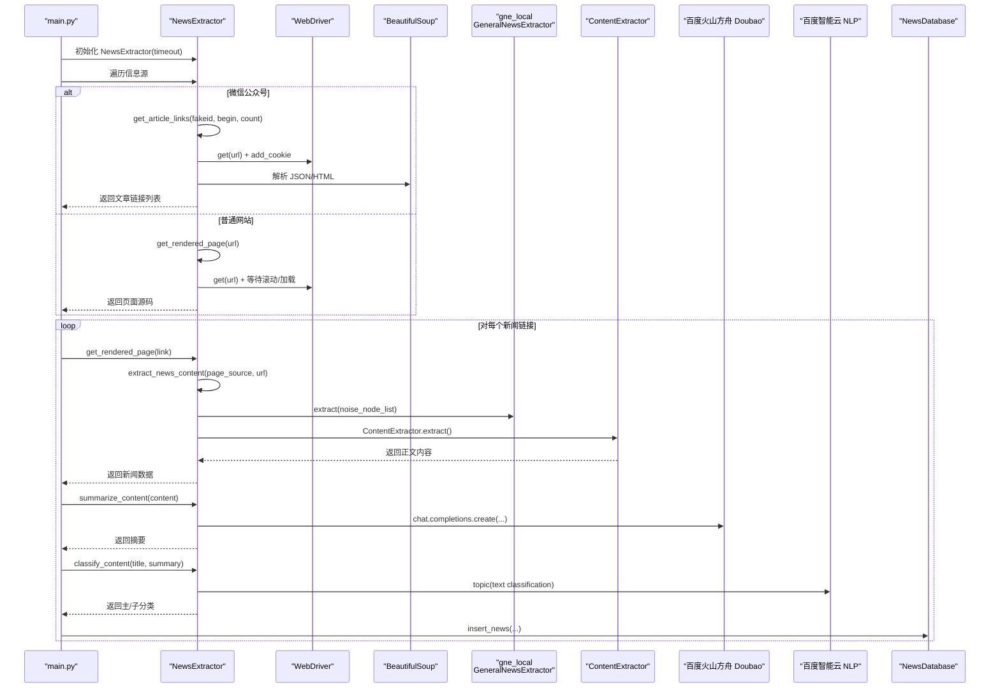
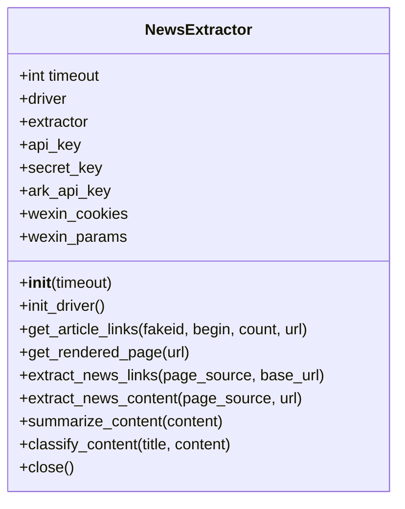
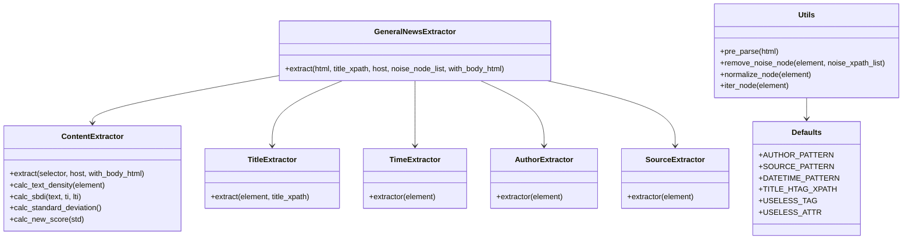

# 新闻提取器模块 (news_extractor.py)

<cite>
**本文引用的文件**
- [news_extractor.py](file://news_extractor.py)
- [config.py](file://config.py)
- [main.py](file://main.py)
- [database.py](file://database.py)
- [logger.py](file://logger.py)
- [requirements.txt](file://requirements.txt)
- [readme.MD](file://readme.MD)
- [classify_existing_news.py](file://classify_existing_news.py)
- [summary_with_ark.py](file://summary_with_ark.py)
- [gne_local/__init__.py](file://gne_local/__init__.py)
- [gne_local/defaults.py](file://gne_local/defaults.py)
- [gne_local/utils.py](file://gne_local/utils.py)
- [gne_local/extractor/__init__.py](file://gne_local/extractor/__init__.py)
- [gne_local/extractor/ContentExtractor.py](file://gne_local/extractor/ContentExtractor.py)
</cite>

## 目录
1. [简介](#简介)
2. [项目结构](#项目结构)
3. [核心组件](#核心组件)
4. [架构总览](#架构总览)
5. [详细组件分析](#详细组件分析)
6. [本地新闻提取库 gne_local](#本地新闻提取库-gne_local)
7. [依赖分析](#依赖分析)
8. [性能考虑](#性能考虑)
9. [故障排除指南](#故障排除指南)
10. [结论](#结论)
11. [附录](#附录)

## 简介
本文件为 news-exacter 系统的新闻提取器模块（news_extractor.py）提供全面技术文档。重点涵盖 NewsExtractor 类的设计与实现，包括：
- Selenium WebDriver 的初始化与反检测配置
- 多网站适配策略（含微信公众号、教育部、今日头条、北京政府、高校网站等）
- BeautifulSoup HTML 解析与链接提取算法
- **本地新闻提取库 gne_local 的完整内容提取框架**，替代外部依赖
- AI 摘要生成接口（百度火山方舟 Doubao）调用
- 百度智能云 NLP 分类 API 集成
- 微信公众号文章获取、页面渲染处理、链接提取、内容清洗与标准化
- 具体的代码示例路径、配置参数说明、API 调用示例与故障排除指南

**更新** 新增本地新闻提取库 gne_local，提供更准确的内容抽取和更好的自定义选项

## 项目结构
news-exacter 采用"入口脚本 + 提取器 + 数据库 + 日志 + 配置"的分层组织方式，核心流程如下：
- main.py 作为入口，负责遍历配置中的信息源，调度 NewsExtractor 完成抓取、链接提取、内容提取、摘要与分类、入库
- news_extractor.py 实现新闻抓取与处理的核心逻辑，使用本地 gne_local 库进行内容提取
- database.py 提供 SQLite 数据访问与表结构管理
- logger.py 提供统一的日志输出与分类日志器
- config.py 统一管理信息源、数据库路径、Selenium/提取超时、关键词过滤等配置
- classify_existing_news.py 用于对已有数据进行二次分类与最终分类
- summary_with_ark.py 用于批量生成摘要
- **gne_local/** 本地新闻提取库，包含完整的提取器框架



**图表来源**
- [main.py:11-196](file://main.py#L11-L196)
- [news_extractor.py:21-78](file://news_extractor.py#L21-L78)
- [database.py:5-38](file://database.py#L5-L38)
- [config.py:1-78](file://config.py#L1-L78)
- [logger.py:25-56](file://logger.py#L25-L56)
- [classify_existing_news.py:237-300](file://classify_existing_news.py#L237-L300)
- [summary_with_ark.py:21-59](file://summary_with_ark.py#L21-L59)
- [gne_local/__init__.py:1-27](file://gne_local/__init__.py#L1-L27)
- [gne_local/extractor/ContentExtractor.py:1-137](file://gne_local/extractor/ContentExtractor.py#L1-L137)

**章节来源**
- [main.py:11-196](file://main.py#L11-L196)
- [config.py:1-78](file://config.py#L1-L78)

## 核心组件
- NewsExtractor 类：封装 Selenium 初始化、页面渲染、链接提取、内容抽取、摘要生成、分类调用等能力
- **gne_local 本地新闻提取库**：提供完整的新闻内容提取框架，包含多个专门的提取器组件
- NewsDatabase 类：SQLite 数据库访问与表结构管理
- Logger 模块：统一日志输出，支持按类别输出到文件与控制台
- 配置模块：集中管理信息源、数据库路径、超时、关键词过滤等

**更新** 新增 gne_local 本地新闻提取库，替代外部依赖，提供更灵活的内容抽取能力

**章节来源**
- [news_extractor.py:21-893](file://news_extractor.py#L21-L893)
- [database.py:5-92](file://database.py#L5-L92)
- [logger.py:25-104](file://logger.py#L25-L104)
- [config.py:1-78](file://config.py#L1-L78)

## 架构总览
NewsExtractor 的整体工作流如下：
- 初始化：加载环境变量、构建 Selenium 无头浏览器、初始化 **本地 gne_local** 提取器
- 信息源遍历：微信公众号走专用接口，普通网站通过 get_rendered_page 渲染页面
- 链接提取：针对不同网站采用特定选择器与通用正则策略，构建绝对 URL 并过滤非新闻链接
- 内容抽取：使用 **本地 gne_local** 结合 BeautifulSoup 清洗噪声节点，提取标题、作者、发布时间、正文、来源与 URL
- 摘要生成：调用百度火山方舟 Doubao API 生成摘要
- 分类调用：调用百度智能云 NLP 文本分类 API，解析主/子分类
- 入库：写入 SQLite，同时支持二次分类与最终分类



**图表来源**
- [main.py:50-173](file://main.py#L50-L173)
- [news_extractor.py:78-178](file://news_extractor.py#L78-L178)
- [news_extractor.py:180-206](file://news_extractor.py#L180-L206)
- [news_extractor.py:208-683](file://news_extractor.py#L208-L683)
- [news_extractor.py:685-750](file://news_extractor.py#L685-L750)
- [news_extractor.py:759-893](file://news_extractor.py#L759-L893)
- [database.py:40-52](file://database.py#L40-L52)

## 详细组件分析

### NewsExtractor 类设计与实现
- 初始化与 WebDriver 配置
  - 无头模式、禁用沙箱、GPU 禁用、用户代理伪装、移除自动化标记
  - 使用固定 chromedriver.exe 路径，避免在线下载
  - 页面加载超时与隐式等待设置
  - 反检测：CDP 注入脚本隐藏 navigator.webdriver
- 微信公众号文章获取
  - 从配置 URL 中解析 fakeid
  - 构造查询参数，设置 cookies，访问 appmsgpublish 接口
  - 解析返回的 JSON，提取 publish_list 中的 publish_info，再提取每篇文章的标题、链接与更新时间
- 页面渲染与链接提取
  - get_rendered_page 支持针对特定站点（如 toutiao.com）的延时与滚动
  - extract_news_links 针对多个网站采用特定容器选择器（如 moe-list、main-l、section2ContentRightTitle 等）
  - 通用策略：使用正则提取 href 属性，构建绝对 URL，过滤无效/媒体/样式链接，基于关键词、日期模式、链接长度进行新闻链接筛选
- 内容提取与清洗
  - **extract_news_content 使用本地 gne_local 的 GeneralNewsExtractor 进行内容提取**
  - **修复 GNE 对 comment_feature 的误判导致的异常**
  - **噪声节点过滤：评论区、广告等**
  - **规范化输出字段：title、author、publish_time、source、content、url**
- 摘要生成
  - summarize_content 使用 OpenAI 兼容客户端调用百度火山方舟 Doubao API
  - 输入为去除 HTML 标签后的纯文本，长度不足阈值直接返回原文
  - 控制温度与最大 token 数量，保证摘要稳定性与长度
- 分类调用
  - classify_content 调用百度智能云 NLP 文本分类接口
  - 自动获取 access_token，构造请求参数，解析主/子分类
  - 异常回退至默认分类



**图表来源**
- [news_extractor.py:21-893](file://news_extractor.py#L21-L893)

**章节来源**
- [news_extractor.py:21-893](file://news_extractor.py#L21-L893)

### Selenium WebDriver 配置与使用
- 无头模式与反检测
  - 禁用沙箱、GPU，设置用户代理，移除自动化开关
  - CDP 注入脚本隐藏 webdriver 标识
- 驱动管理
  - 固定 chromedriver.exe 路径，避免网络下载
  - 兼容 Selenium 3.x/4.x 初始化方式
- 页面加载与等待
  - 显式设置页面加载超时与隐式等待
  - 针对特定站点增加延时与滚动，提升渲染质量

**章节来源**
- [news_extractor.py:43-77](file://news_extractor.py#L43-L77)

### 多网站适配策略
- 教育部（moe.gov.cn）：仅提取 class="moe-list" 下的链接，处理相对路径
- 今日头条（toutiao.com）：仅提取 class="main-l" 下的链接，处理相对路径
- 中国教育和科研计算机网（www.edu.cn）：仅提取 class="section2ContentRightTitle" 下的链接，处理相对路径
- ai-bot.cn：仅提取 class="news-list" 下的链接，最多前 10 条
- 北京市政府（beijing.gov.cn）：仅提取 ul.list 下的链接，处理相对路径
- 北京外国语大学系列：分别处理 div.page-list 与 ul.m-listb2，限制提取数量
- 通用策略：正则提取 href，构建绝对 URL，过滤无效扩展名与媒体文件，基于关键词、日期模式、链接长度筛选

**章节来源**
- [news_extractor.py:208-683](file://news_extractor.py#L208-L683)

### BeautifulSoup HTML 解析与链接提取算法
- 特定容器解析：先尝试定位特定容器，再在容器内提取 a 标签 href
- 通用正则提取：使用正则表达式匹配 href 属性，统一处理相对路径
- 绝对 URL 构建：根据 base_url 的末尾类型（index.html、index.shtml 等）进行规范化拼接
- 去重与过滤：去重后进一步过滤非新闻链接，保留包含关键词、日期模式或较长链接的候选

**章节来源**
- [news_extractor.py:208-683](file://news_extractor.py#L208-L683)

### 本地新闻提取库 gne_local

**更新** 新增本地新闻提取库 gne_local，提供完整的新闻内容提取框架

#### gne_local 概述
gne_local 是一个完全本地化的新闻内容提取库，替代了外部依赖的 GeneralNewsExtractor。它提供了以下核心特性：
- **模块化设计**：包含独立的提取器组件，支持灵活的内容抽取
- **自定义配置**：支持通过配置文件进行个性化定制
- **增强的噪声过滤**：提供更精确的噪声节点识别和过滤
- **更好的兼容性**：针对不同网站结构提供专门的提取策略

#### 核心组件架构
- **GeneralNewsExtractor**：主提取器类，协调各个专门提取器工作
- **ContentExtractor**：正文内容提取器，使用文本密度算法识别主要内容
- **TitleExtractor**：标题提取器，支持多种标题格式识别
- **TimeExtractor**：发布时间提取器，支持多种日期格式解析
- **AuthorExtractor**：作者信息提取器
- **SourceExtractor**：来源信息提取器

#### 内容提取算法
ContentExtractor 使用先进的文本密度分析算法：
- **文本密度计算**：基于公式 (Ti - LTi) / (TGi - LTGi)
- **符号密度分析**：计算标点符号密度，避免误判
- **标准差计算**：使用统计学方法确定最佳内容区域
- **评分机制**：综合多个因素计算内容得分

#### 工具函数与配置
- **utils.py**：提供 HTML 预处理、噪声节点移除、节点遍历等工具函数
- **defaults.py**：定义默认的提取规则和配置参数
- **config 系统**：支持通过 .gne 配置文件进行个性化定制



**图表来源**
- [gne_local/__init__.py:1-27](file://gne_local/__init__.py#L1-L27)
- [gne_local/extractor/ContentExtractor.py:1-137](file://gne_local/extractor/ContentExtractor.py#L1-L137)
- [gne_local/utils.py:1-117](file://gne_local/utils.py#L1-L117)
- [gne_local/defaults.py:1-72](file://gne_local/defaults.py#L1-L72)

**章节来源**
- [gne_local/__init__.py:1-27](file://gne_local/__init__.py#L1-L27)
- [gne_local/extractor/ContentExtractor.py:1-137](file://gne_local/extractor/ContentExtractor.py#L1-L137)
- [gne_local/utils.py:1-117](file://gne_local/utils.py#L1-L117)
- [gne_local/defaults.py:1-72](file://gne_local/defaults.py#L1-L72)

### 新闻内容提取逻辑
- **本地 gne_local 提取**：使用本地 GeneralNewsExtractor 进行内容提取，传入页面源码与噪声节点列表
- **增强的噪声过滤**：通过 gne_local 的 remove_noise_node 函数精确过滤评论区与广告
- **字段规范化**：缺失字段以空字符串填充，保证输出结构一致
- **异常处理**：捕获异常并记录日志，避免中断流程

**更新** 使用本地 gne_local 替代外部依赖，提供更准确的内容抽取和更好的自定义选项

**章节来源**
- [news_extractor.py:685-708](file://news_extractor.py#L685-L708)
- [gne_local/__init__.py:6-27](file://gne_local/__init__.py#L6-L27)

### AI 摘要生成接口调用（百度火山方舟 Doubao）
- 客户端初始化：使用 OpenAI 兼容客户端，base_url 指向方舟 API
- 输入预处理：使用 BeautifulSoup 去除 HTML 标签，得到纯文本
- 调用参数：系统提示词、用户输入、温度与最大 token
- 输出处理：取第一条回复内容作为摘要，长度不足阈值直接返回原文

**章节来源**
- [news_extractor.py:710-750](file://news_extractor.py#L710-L750)

### 百度智能云 NLP 分类 API 集成
- 认证流程：通过 OAuth 获取 access_token
- 请求参数：设置 Content-Type、Accept、User-Agent，携带 access_token 与 charset
- 请求负载：限制标题与内容长度，提交给 topic 接口
- 结果解析：提取 lv1/lv2/lv3 标签，组合为主分类与子分类字符串
- 异常处理：状态码非 200 或返回 error_code 时抛出异常并回退默认分类

**章节来源**
- [news_extractor.py:759-893](file://news_extractor.py#L759-L893)

### 微信公众号文章获取、页面渲染与链接提取
- 参数与 Cookie：从环境变量解析查询参数与 cookies，注入到 WebDriver
- 页面访问：访问 appmsgpublish 接口，等待页面加载
- 数据解析：解析返回的 JSON，提取 publish_list 与 publish_info，组装链接列表
- 页面渲染：对 toutiao.com 增加延时与滚动，保存调试页面源码

**章节来源**
- [news_extractor.py:78-178](file://news_extractor.py#L78-L178)
- [news_extractor.py:180-206](file://news_extractor.py#L180-L206)

### 内容清洗与标准化过程
- **本地 gne_local 修复**：通过 gne_local 的 remove_noise_node 函数替换 comment_feature 以避免 normalize_node 误删 body
- **增强噪声过滤**：使用 gne_local 的噪声节点过滤机制，通过 XPath 列表排除评论区与广告
- **字段标准化**：统一输出 title、author、publish_time、source、content、url
- **编码处理**：手动解析 JSON，确保 UTF-8 编码，避免乱码

**更新** 使用本地 gne_local 的增强噪声过滤和修复机制

**章节来源**
- [news_extractor.py:685-708](file://news_extractor.py#L685-L708)
- [gne_local/utils.py:51-59](file://gne_local/utils.py#L51-L59)

## 本地新闻提取库 gne_local

**新增** 详细介绍本地新闻提取库 gne_local 的架构和实现

### 设计理念
gne_local 是专门为新闻内容提取而设计的本地库，具有以下特点：
- **完全本地化**：无需网络依赖，所有提取逻辑在本地执行
- **模块化架构**：每个提取器职责单一，便于维护和扩展
- **可配置性**：支持通过配置文件进行个性化定制
- **增强的算法**：使用改进的文本密度分析算法，提高提取准确性

### 核心提取器组件

#### ContentExtractor（正文提取器）
使用基于文本密度的智能算法：
- **文本密度分析**：计算每个节点的文本密度，识别主要内容区域
- **符号密度计算**：避免标点符号影响，提高准确性
- **统计学评分**：使用标准差和对数函数计算综合得分
- **多标签支持**：支持 p、div 等多种正文标签

#### TitleExtractor（标题提取器）
支持多种标题格式：
- **H标签识别**：自动识别 h1-h4 标签中的标题
- **模式匹配**：使用正则表达式匹配常见标题格式
- **分割字符处理**：支持 -、_ 等分割字符

#### TimeExtractor（时间提取器）
支持多种日期格式：
- **多格式支持**：支持 YYYY-MM-DD、YYYY/MM/DD、YYYY年MM月DD日 等格式
- **时间戳转换**：自动处理 Unix 时间戳
- **中文格式解析**：支持中文日期格式

#### AuthorExtractor 和 SourceExtractor（作者和来源提取器）
使用正则表达式模式匹配：
- **作者模式**：支持"作者："、"撰文："、"文："等格式
- **来源模式**：支持"来源："、"来自："等格式
- **中文字符支持**：支持中文和英文字母

### 工具函数系统

#### 预处理函数
- **HTML 清理**：移除 br 标签等干扰元素
- **节点标准化**：统一 HTML 结构，便于后续处理

#### 噪声过滤系统
- **XPath 过滤**：支持通过 XPath 精确过滤噪声节点
- **标签移除**：自动移除 script、style、video 等无用标签
- **空节点清理**：移除没有内容的空节点

#### 配置管理系统
- **配置文件支持**：通过 .gne 文件进行个性化配置
- **默认参数**：提供合理的默认提取参数
- **动态调整**：运行时可根据需要调整配置

### 使用示例

#### 基本使用
```python
from gne_local import GeneralNewsExtractor

extractor = GeneralNewsExtractor()
result = extractor.extract(html_content, noise_node_list=[
    "//div[@class='comment']",
    "//div[@class='advertisement']"
])
```

#### 高级配置
```python
# 通过配置文件自定义
config = {
    'noise_node_list': ["//div[@class='sidebar']"],
    'host': 'https://example.com'
}
```

**章节来源**
- [gne_local/__init__.py:1-27](file://gne_local/__init__.py#L1-L27)
- [gne_local/extractor/ContentExtractor.py:1-137](file://gne_local/extractor/ContentExtractor.py#L1-L137)
- [gne_local/utils.py:1-117](file://gne_local/utils.py#L1-L117)
- [gne_local/defaults.py:1-72](file://gne_local/defaults.py#L1-L72)

## 依赖分析
- 外部库依赖
  - selenium：驱动浏览器渲染页面
  - **requests**：HTTP 请求（百度 API、分类接口）
  - beautifulsoup4：HTML 解析与链接提取
  - lxml：加速 BeautifulSoup 解析
  - webdriver-manager：驱动管理（注：代码中使用固定驱动路径）
  - python-dotenv：环境变量加载
  - openai：兼容客户端，调用方舟 API
  - langchain、jinja2：项目其他模块使用
- **本地库依赖**
  - **gne_local**：本地新闻提取库，替代外部依赖
  - **gne_local.extractor**：包含 ContentExtractor、TitleExtractor、TimeExtractor、AuthorExtractor、SourceExtractor
  - **gne_local.utils**：提供工具函数和配置管理
  - **gne_local.defaults**：定义默认提取规则和配置
- 模块间耦合
  - main.py 依赖 news_extractor.py、database.py、config.py、logger.py
  - news_extractor.py 依赖 selenium、bs4、**gne_local**、requests、openai、dotenv
  - database.py 依赖 sqlite3、logger
  - classify_existing_news.py 依赖 requests、sqlite3、logger
  - summary_with_ark.py 依赖 openai、database

**更新** 新增 gne_local 本地依赖，替代外部 GeneralNewsExtractor 依赖

```mermaid
graph TB
subgraph "应用层"
MAIN["main.py"]
CLF["classify_existing_news.py"]
SUM["summary_with_ark.py"]
end
subgraph "核心模块"
EX["news_extractor.py"]
DB["database.py"]
CFG["config.py"]
LOG["logger.py"]
END
subgraph "本地库"
GNE["gne_local/"]
UTILS["utils.py"]
DEFAULTS["defaults.py"]
EXTRACTORS["extractor/"]
END
REQ["requirements.txt"]
MAIN --> EX
MAIN --> DB
MAIN --> CFG
MAIN --> LOG
EX --> REQ
EX --> GNE
DB --> REQ
CLF --> DB
CLF --> REQ
SUM --> DB
SUM --> REQ
GNE --> UTILS
GNE --> DEFAULTS
GNE --> EXTRACTORS
```

**图表来源**
- [requirements.txt:1-9](file://requirements.txt#L1-L9)
- [main.py:1-206](file://main.py#L1-L206)
- [news_extractor.py:1-18](file://news_extractor.py#L1-L18)
- [database.py:1-4](file://database.py#L1-L4)
- [classify_existing_news.py:1-12](file://classify_existing_news.py#L1-L12)
- [summary_with_ark.py:1-19](file://summary_with_ark.py#L1-L19)
- [gne_local/__init__.py:1-27](file://gne_local/__init__.py#L1-L27)

**章节来源**
- [requirements.txt:1-9](file://requirements.txt#L1-L9)
- [main.py:1-206](file://main.py#L1-L206)

## 性能考虑
- 浏览器渲染优化
  - 无头模式减少资源消耗
  - 针对特定站点增加延时与滚动，提高渲染稳定性
- 链接提取优化
  - 优先使用特定容器选择器，减少 DOM 遍历范围
  - 正则提取与去重结合，降低后续处理成本
- **本地提取器优化**
  - **gne_local 使用高效的 lxml 解析，比 bs4 更快**
  - **模块化设计减少不必要的处理步骤**
  - **配置缓存机制，避免重复解析**
- 内容抽取优化
  - **本地 gne_local 噪声节点过滤减少无关内容**
  - **纯文本摘要输入，缩短 API 调用耗时**
- I/O 与缓存
  - 链接缓存使用有序字典，限制最大容量，避免内存膨胀
  - 摘要与分类调用频率控制，避免触发限流

**更新** 新增本地 gne_local 的性能优势分析

## 故障排除指南
- WebDriver 启动失败
  - 检查 chromedriver.exe 路径是否正确（固定路径）
  - 确认 Selenium 版本兼容性（Selenium 3.x/4.x 兼容分支）
  - 确认无头模式参数与禁用项是否生效
- 页面加载超时
  - 调整 SELENIUM_TIMEOUT 与页面等待时间
  - 针对特定站点增加延时与滚动
- 链接提取为空
  - 检查目标网站是否仍使用相同容器类名
  - 使用通用正则策略作为回退
- **本地提取器异常**
  - **确认 gne_local 库文件完整性**
  - **检查噪声节点 XPath 是否正确**
  - **验证 HTML 结构是否符合预期**
- **内容抽取异常**
  - **确认 gne_local 的 remove_noise_node 函数正常工作**
  - **检查页面源码是否包含预期结构**
  - **验证噪声节点列表是否覆盖所有评论区与广告**
- 摘要生成失败
  - 检查 ARK_API_KEY 是否正确配置
  - 确认网络可达与 API 地址可用
- 分类 API 失败
  - 检查 WENXIN_API_KEY/WENXIN_SECRET_KEY 是否正确
  - 确认 access_token 获取成功，请求参数编码正确
- 数据库写入失败
  - 检查表结构是否创建成功
  - 确认唯一约束冲突（标题/URL 唯一）

**更新** 新增本地 gne_local 相关的故障排除指南

**章节来源**
- [news_extractor.py:43-77](file://news_extractor.py#L43-L77)
- [news_extractor.py:180-206](file://news_extractor.py#L180-L206)
- [news_extractor.py:208-683](file://news_extractor.py#L208-L683)
- [news_extractor.py:685-750](file://news_extractor.py#L685-L750)
- [news_extractor.py:759-893](file://news_extractor.py#L759-L893)
- [database.py:20-52](file://database.py#L20-L52)

## 结论
news_extractor.py 通过 Selenium 与 BeautifulSoup 的组合，实现了对多类网站的稳定抓取与链接提取；借助 **本地 gne_local 的增强内容抽取能力** 与百度火山方舟、百度智能云的 AI 能力，完成了摘要与分类的自动化处理。**本地 gne_local 库的引入提供了更准确的内容抽取和更好的自定义选项，替代了外部依赖，提高了系统的稳定性和可控性**。模块化设计与完善的日志体系使得系统具备良好的可维护性与可扩展性。建议持续关注目标网站结构变化，及时更新容器选择器与链接提取策略，以保持抓取稳定性。

**更新** 强调本地 gne_local 库的优势和对系统改进的重要作用

## 附录

### 配置参数说明
- 信息源配置（config.py）
  - NEWS_SOURCES：包含多个信息源的 URL 与来源名称
  - DB_PATH：SQLite 数据库文件路径
  - SELENIUM_TIMEOUT：Selenium 页面加载超时（秒）
  - EXTRACT_TIMEOUT：提取超时（秒）
  - FILTER_KEYWORDS：关键词过滤列表
- 环境变量（.env）
  - WENXIN_API_KEY、WENXIN_SECRET_KEY：百度智能云 API 密钥
  - ARK_API_KEY：百度火山方舟 API 密钥
  - wechat_cookie、wechat_querystring：微信公众号接口所需 Cookie 与查询参数
- **本地 gne_local 配置**
  - .gne 配置文件：支持自定义噪声节点列表、提取规则等
  - 默认配置：通过 defaults.py 定义的标准提取参数

**更新** 新增本地 gne_local 配置说明

**章节来源**
- [config.py:1-78](file://config.py#L1-L78)
- [news_extractor.py:27-39](file://news_extractor.py#L27-L39)

### API 调用示例（路径）
- 百度火山方舟摘要生成
  - [news_extractor.py:733-741](file://news_extractor.py#L733-L741)
- 百度智能云 NLP 分类
  - [news_extractor.py:799-821](file://news_extractor.py#L799-L821)
  - [news_extractor.py:821-840](file://news_extractor.py#L821-L840)

### 代码示例路径
- Selenium 初始化与反检测
  - [news_extractor.py:43-77](file://news_extractor.py#L43-L77)
- 微信公众号文章获取
  - [news_extractor.py:78-178](file://news_extractor.py#L78-L178)
- 页面渲染与链接提取
  - [news_extractor.py:180-206](file://news_extractor.py#L180-L206)
  - [news_extractor.py:208-683](file://news_extractor.py#L208-L683)
- **本地新闻提取库使用**
  - [news_extractor.py:685-708](file://news_extractor.py#L685-L708)
  - [gne_local/__init__.py:6-27](file://gne_local/__init__.py#L6-L27)
- 摘要生成
  - [news_extractor.py:710-750](file://news_extractor.py#L710-L750)
- 分类调用
  - [news_extractor.py:759-893](file://news_extractor.py#L759-L893)

**更新** 新增本地 gne_local 相关的代码示例路径