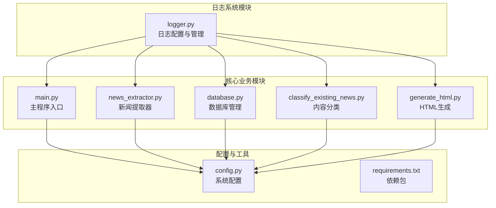
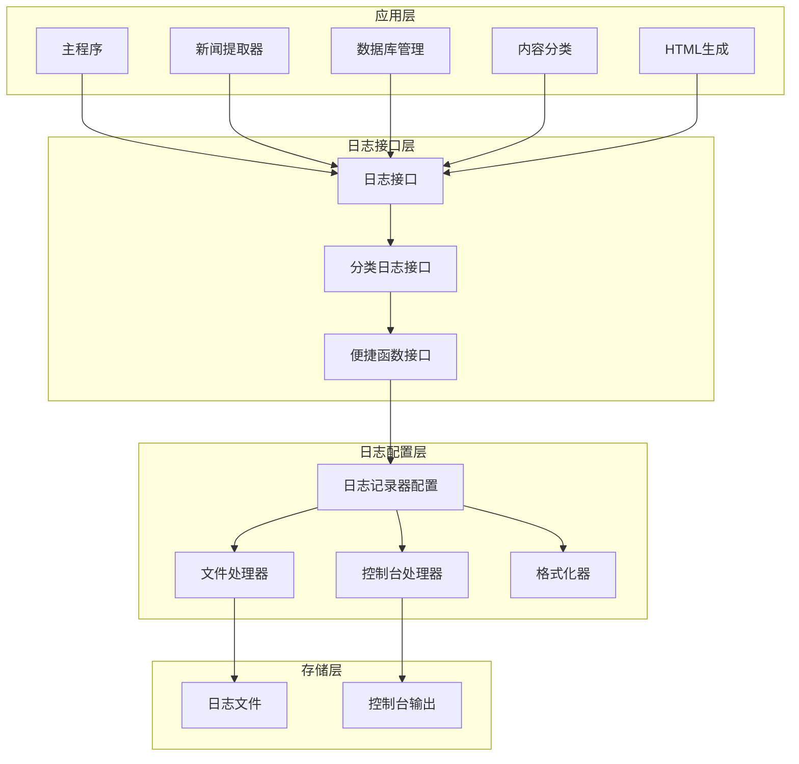
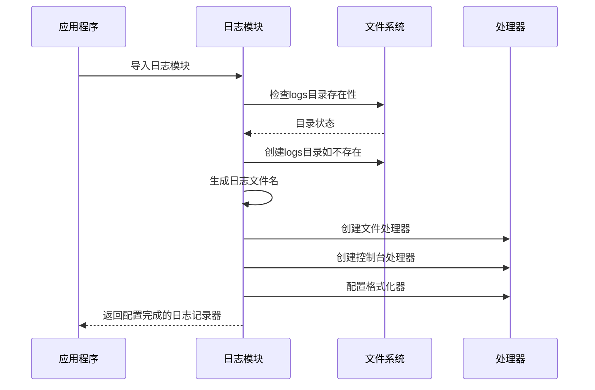
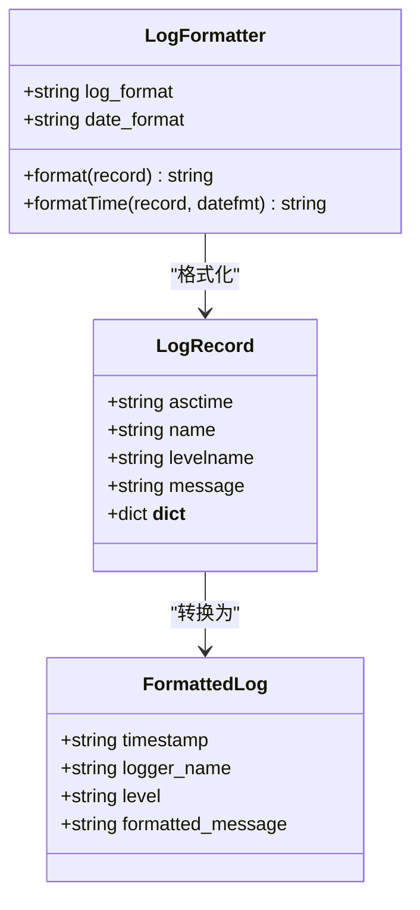
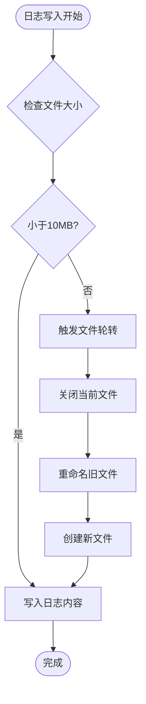
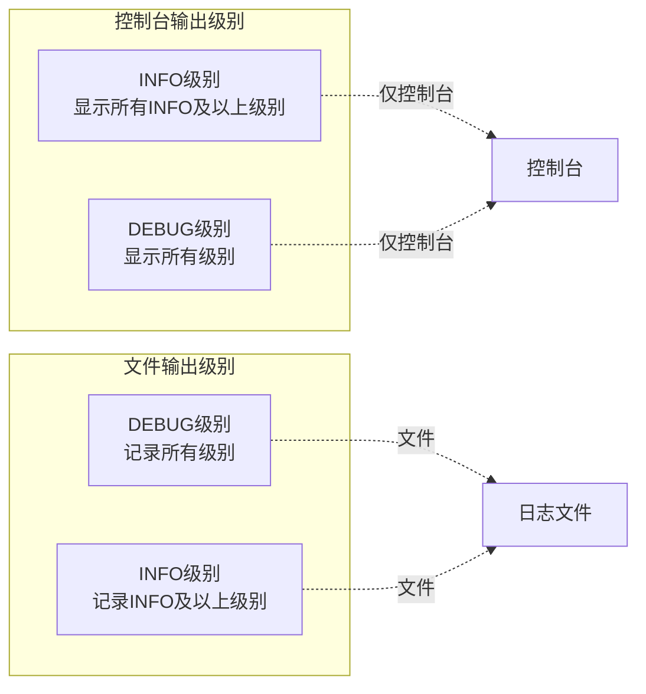
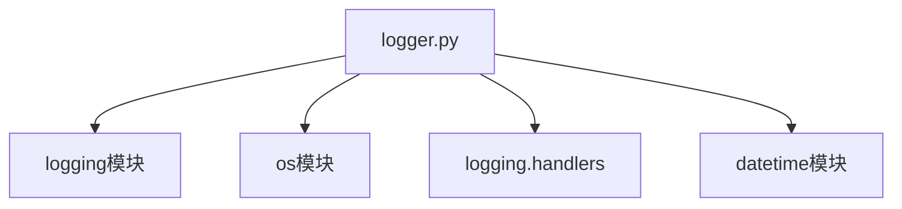
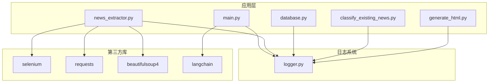

# 日志系统模块 (logger.py)

<cite>
**本文档引用的文件**
- [logger.py](file://logger.py)
- [main.py](file://main.py)
- [news_extractor.py](file://news_extractor.py)
- [database.py](file://database.py)
- [classify_existing_news.py](file://classify_existing_news.py)
- [generate_html.py](file://generate_html.py)
- [config.py](file://config.py)
- [requirements.txt](file://requirements.txt)
- [readme.MD](file://readme.MD)
</cite>

## 目录
1. [简介](#简介)
2. [项目结构](#项目结构)
3. [核心组件](#核心组件)
4. [架构概览](#架构概览)
5. [详细组件分析](#详细组件分析)
6. [依赖关系分析](#依赖关系分析)
7. [性能考虑](#性能考虑)
8. [故障排除指南](#故障排除指南)
9. [结论](#结论)

## 简介

news-exacter系统的日志系统模块是一个轻量级但功能完整的日志管理解决方案。该模块基于Python标准库的logging模块构建，提供了多级别的日志记录功能，包括信息日志、调试日志、错误日志和警告日志。系统采用文件轮转机制来管理日志文件，支持控制台输出和文件输出双重渠道，为整个新闻提取系统提供全面的日志记录能力。

该日志系统特别针对新闻提取场景进行了优化，能够有效跟踪新闻爬取、数据处理、数据库操作、分类处理等各个环节的状态和异常情况，为系统的维护和故障诊断提供了重要支撑。

## 项目结构

news-exacter项目采用模块化的架构设计，日志系统作为独立的模块被多个核心组件共享使用：

**图表来源**
- [logger.py:1-104](file://logger.py#L1-L104)
- [main.py:1-206](file://main.py#L1-L206)
- [news_extractor.py:1-200](file://news_extractor.py#L1-L200)
- [database.py:1-92](file://database.py#L1-L92)
- [classify_existing_news.py:1-200](file://classify_existing_news.py#L1-L200)
- [generate_html.py:1-81](file://generate_html.py#L1-L81)

**章节来源**
- [logger.py:1-104](file://logger.py#L1-L104)
- [main.py:1-206](file://main.py#L1-L206)
- [config.py:1-78](file://config.py#L1-L78)

## 核心组件

### 日志记录器工厂

日志系统的核心是`get_logger`函数，它负责创建和配置日志记录器实例。该函数确保每个日志记录器只被配置一次，避免重复添加处理器的问题。

### 分类日志记录器

系统提供了专门的分类日志记录器，包括：
- `info_logger`: 用于一般性信息记录
- `debug_logger`: 用于调试信息输出
- `error_logger`: 用于错误信息记录
- `warning_logger`: 用于警告信息记录

### 便捷函数接口

为了简化使用，系统提供了四个便捷函数：
- `info()`: 记录信息级别日志
- `debug()`: 记录调试级别日志  
- `error()`: 记录错误级别日志
- `warning()`: 记录警告级别日志

这些函数支持自定义分类参数，允许开发者根据不同的业务场景创建特定的日志分类。

**章节来源**
- [logger.py:24-104](file://logger.py#L24-L104)

## 架构概览

日志系统采用分层架构设计，通过统一的接口为整个应用提供日志服务：

**图表来源**
- [logger.py:24-104](file://logger.py#L24-L104)
- [main.py:7](file://main.py#L7)
- [news_extractor.py:18](file://news_extractor.py#L18)
- [database.py:3](file://database.py#L3)
- [classify_existing_news.py:11](file://classify_existing_news.py#L11)
- [generate_html.py:6](file://generate_html.py#L6)

## 详细组件分析

### 日志配置与初始化

日志系统在启动时自动创建必要的目录结构和配置文件：

**图表来源**
- [logger.py:12-56](file://logger.py#L12-L56)

### 多级别日志记录机制

系统支持四种标准的日志级别，每种级别都有其特定的用途和输出策略：

#### 信息级别日志 (INFO)
- 用途：记录系统正常运行状态、关键操作完成情况
- 输出：同时输出到文件和控制台
- 典型场景：新闻提取完成、数据库操作成功、HTML生成完成

#### 调试级别日志 (DEBUG)  
- 用途：记录详细的调试信息，帮助问题诊断
- 输出：仅输出到文件，不显示在控制台上
- 典型场景：页面获取过程、API调用详情、内部数据流

#### 错误级别日志 (ERROR)
- 用途：记录系统错误、异常情况
- 输出：同时输出到文件和控制台
- 典型场景：数据库连接失败、API调用异常、文件操作错误

#### 警告级别日志 (WARNING)
- 用途：记录潜在问题但不影响系统运行的情况
- 输出：同时输出到文件和控制台
- 典型场景：重复数据、数据格式异常、性能警告

**章节来源**
- [logger.py:74-104](file://logger.py#L74-L104)

### 日志格式化器

日志格式化器负责统一日志输出格式，确保所有日志信息具有一致的结构：

**图表来源**
- [logger.py:20-22](file://logger.py#L20-L22)

### 文件轮转机制

系统采用轮转文件处理器来管理日志文件，防止单个文件过大影响性能：

**图表来源**
- [logger.py:38-43](file://logger.py#L38-L43)

文件轮转配置特点：
- 单个日志文件最大大小：10MB
- 保留备份文件数量：5个
- 编码格式：UTF-8
- 按日期命名：news_exacter_YYYYMMDD.log

**章节来源**
- [logger.py:38-56](file://logger.py#L38-L56)

### 控制台输出策略

系统采用分层次的控制台输出策略，平衡信息可见性和干扰最小化：

**图表来源**
- [logger.py:48-54](file://logger.py#L48-L54)

**章节来源**
- [logger.py:48-54](file://logger.py#L48-L54)

## 依赖关系分析

### 内部依赖关系

日志系统模块具有最小的内部依赖，主要依赖于Python标准库：

**图表来源**
- [logger.py:7-10](file://logger.py#L7-L10)

### 外部依赖关系

日志系统通过应用层间接使用其他模块的功能：

**图表来源**
- [logger.py:1-104](file://logger.py#L1-L104)
- [main.py:1-206](file://main.py#L1-L206)
- [news_extractor.py:1-200](file://news_extractor.py#L1-L200)
- [database.py:1-92](file://database.py#L1-L92)
- [classify_existing_news.py:1-200](file://classify_existing_news.py#L1-L200)
- [generate_html.py:1-81](file://generate_html.py#L1-L81)
- [requirements.txt:1-10](file://requirements.txt#L1-L10)

**章节来源**
- [requirements.txt:1-10](file://requirements.txt#L1-L10)

## 性能考虑

### 内存使用优化

日志系统采用惰性初始化策略，只有在首次使用时才创建日志记录器实例，避免不必要的内存占用。

### I/O性能优化

- 文件轮转机制避免了单个文件过大导致的I/O性能问题
- 控制台输出仅显示INFO级别以上日志，减少控制台输出压力
- UTF-8编码确保多语言字符的正确处理

### 并发安全性

日志系统使用Python标准库的线程安全特性，能够安全地在多线程环境中使用。

## 故障排除指南

### 常见问题及解决方案

#### 日志文件无法创建
**症状**：程序启动时报错，提示无法创建日志文件
**原因**：logs目录权限不足或磁盘空间不足
**解决方案**：
1. 检查logs目录的写入权限
2. 确认磁盘空间充足
3. 手动创建logs目录

#### 日志文件过大
**症状**：磁盘空间被大量占用
**原因**：日志文件轮转配置不当
**解决方案**：
1. 调整单个文件大小限制
2. 增加备份文件数量
3. 定期清理旧日志文件

#### 控制台输出过多
**症状**：控制台输出过于冗杂，影响程序运行
**原因**：DEBUG级别日志在控制台显示
**解决方案**：
1. 调整控制台处理器的级别设置
2. 在生产环境中使用INFO级别

#### 日志编码问题
**症状**：中文日志显示乱码
**原因**：文件编码设置不正确
**解决方案**：
1. 确认日志文件使用UTF-8编码
2. 检查终端编码设置

### 调试技巧

#### 使用不同日志级别进行调试
- 使用DEBUG级别记录详细的执行流程
- 使用INFO级别记录关键操作状态
- 使用WARNING级别记录潜在问题
- 使用ERROR级别记录异常情况

#### 日志分类使用建议
- 为不同的业务模块创建专用的日志分类
- 使用有意义的分类名称便于日志检索
- 避免过度使用日志分类造成混乱

#### 日志监控最佳实践
- 定期检查日志文件大小和数量
- 建立日志轮转和清理策略
- 设置适当的日志保留期限
- 监控错误日志的增长趋势

**章节来源**
- [logger.py:12-15](file://logger.py#L12-L15)
- [logger.py:38-43](file://logger.py#L38-L43)

## 结论

news-exacter系统的日志系统模块是一个设计精良、功能完备的日志管理解决方案。它通过合理的架构设计和配置策略，为整个新闻提取系统提供了可靠的日志记录能力。

该模块的主要优势包括：

1. **简洁高效**：基于Python标准库构建，无需额外依赖
2. **灵活配置**：支持多种日志级别和输出渠道
3. **自动管理**：内置文件轮转机制，自动管理日志文件
4. **易于使用**：提供简单易用的API接口
5. **性能友好**：采用惰性初始化和线程安全设计

通过在整个应用中统一使用这套日志系统，开发者可以更好地监控系统运行状态、快速定位问题并进行有效的故障诊断。对于类似的数据采集和处理系统，这套日志方案提供了很好的参考价值。