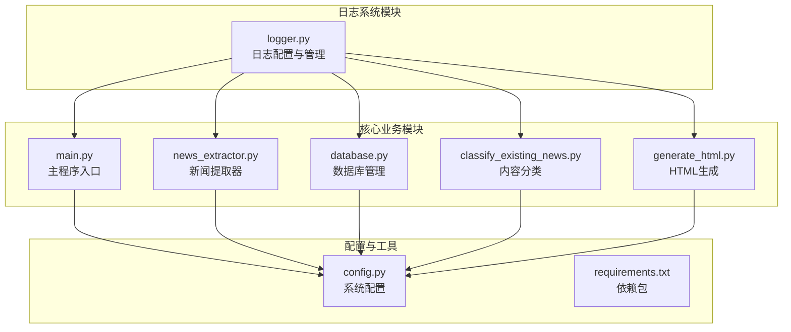
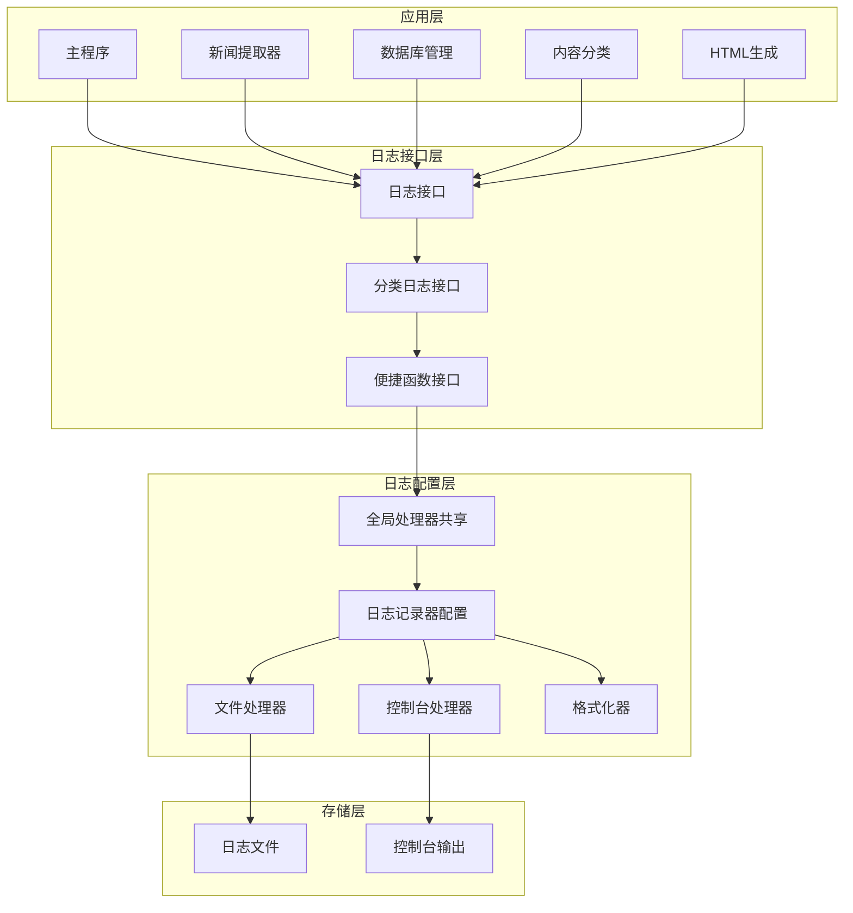
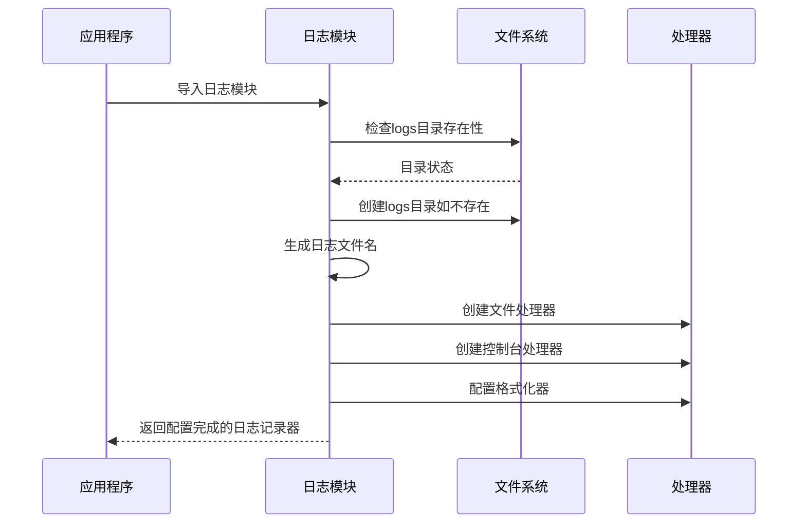
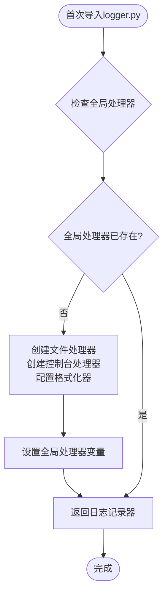
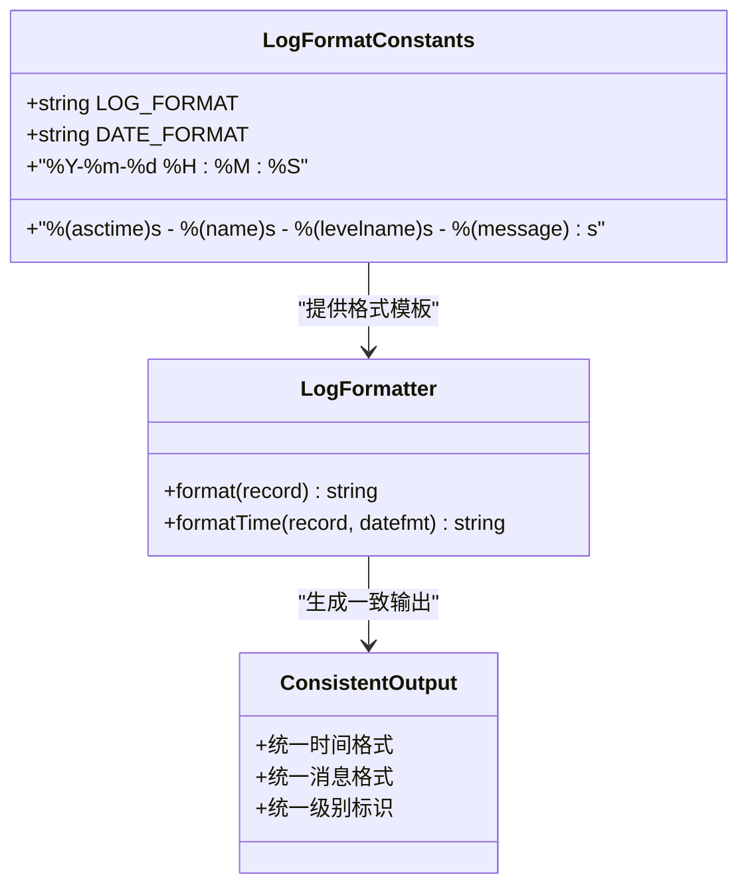
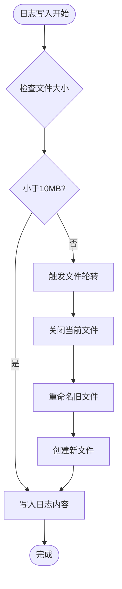
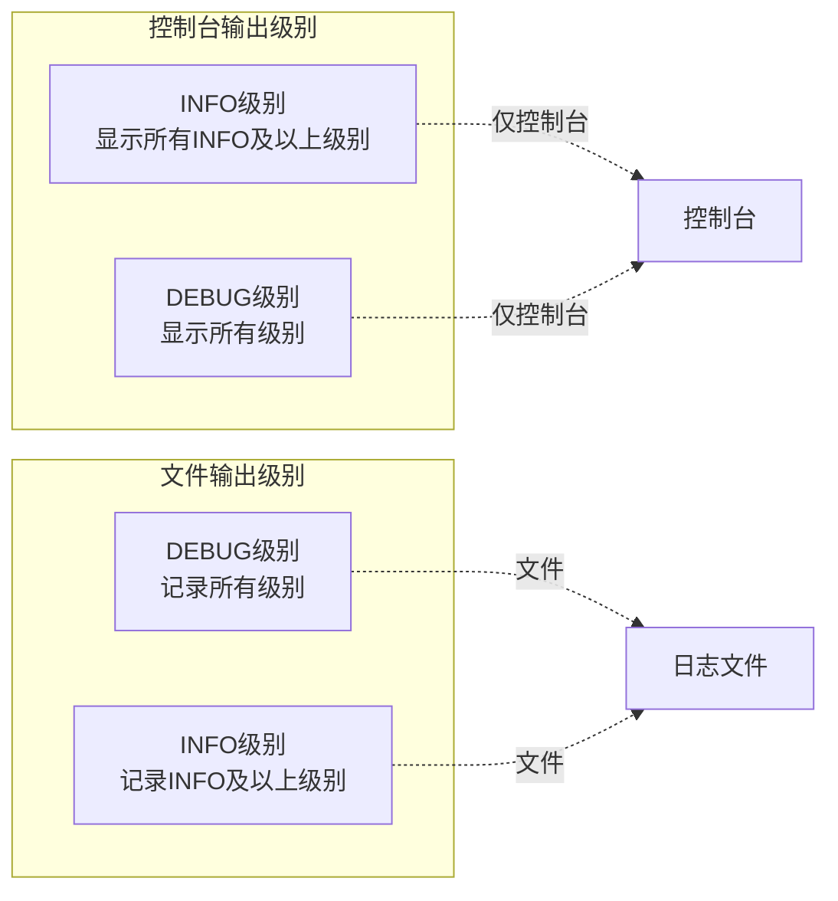
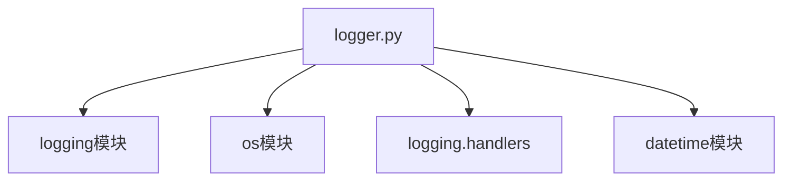
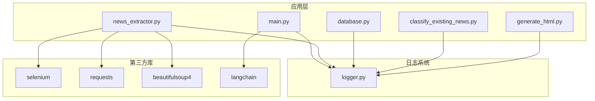

# 日志系统模块 (logger.py)

<cite>
**本文档引用的文件**
- [logger.py](file://logger.py)
- [main.py](file://main.py)
- [news_extractor.py](file://news_extractor.py)
- [database.py](file://database.py)
- [classify_existing_news.py](file://classify_existing_news.py)
- [generate_html.py](file://generate_html.py)
- [config.py](file://config.py)
- [requirements.txt](file://requirements.txt)
- [readme.MD](file://readme.MD)
</cite>

## 更新摘要
**所做更改**
- 更新了日志格式化和输出一致性优化部分
- 新增了全局处理器共享机制的详细说明
- 补充了日志格式常量定义的分析
- 增强了日志配置稳定性的说明

## 目录
1. [简介](#简介)
2. [项目结构](#项目结构)
3. [核心组件](#核心组件)
4. [架构概览](#架构概览)
5. [详细组件分析](#详细组件分析)
6. [依赖关系分析](#依赖关系分析)
7. [性能考虑](#性能考虑)
8. [故障排除指南](#故障排除指南)
9. [结论](#结论)

## 简介

news-exacter系统的日志系统模块是一个轻量级但功能完整的日志管理解决方案。该模块基于Python标准库的logging模块构建，提供了多级别的日志记录功能，包括信息日志、调试日志、错误日志和警告日志。系统采用文件轮转机制来管理日志文件，支持控制台输出和文件输出双重渠道，为整个新闻提取系统提供全面的日志记录能力。

该日志系统特别针对新闻提取场景进行了优化，能够有效跟踪新闻爬取、数据处理、数据库操作、分类处理等各个环节的状态和异常情况，为系统的维护和故障诊断提供了重要支撑。

**更新** 日志系统在配置上实现了格式化和输出的一致性优化，通过全局处理器共享机制确保所有日志输出格式统一且稳定可靠。

## 项目结构

news-exacter项目采用模块化的架构设计，日志系统作为独立的模块被多个核心组件共享使用：

```mermaid
graph TB
subgraph "日志系统模块"
Logger[logger.py<br/>日志配置与管理]
end
subgraph "核心业务模块"
Main[main.py<br/>主程序入口]
Extractor[news_extractor.py<br/>新闻提取器]
Database[database.py<br/>数据库管理]
Classifier[classify_existing_news.py<br/>内容分类]
HTMLGen[generate_html.py<br/>HTML生成]
end
subgraph "配置与工具"
Config[config.py<br/>系统配置]
Requirements[requirements.txt<br/>依赖包]
end
Logger --> Main
Logger --> Extractor
Logger --> Database
Logger --> Classifier
Logger --> HTMLGen
Main --> Config
Extractor --> Config
Database --> Config
Classifier --> Config
HTMLGen --> Config
```

**图表来源**
- [logger.py:1-121](file://logger.py#L1-L121)
- [main.py:1-210](file://main.py#L1-L210)
- [news_extractor.py:1-991](file://news_extractor.py#L1-L991)
- [database.py:1-92](file://database.py#L1-L92)
- [classify_existing_news.py:1-351](file://classify_existing_news.py#L1-L351)
- [generate_html.py:1-81](file://generate_html.py#L1-L81)

**章节来源**
- [logger.py:1-121](file://logger.py#L1-L121)
- [main.py:1-210](file://main.py#L1-L210)
- [config.py:1-78](file://config.py#L1-L78)

## 核心组件

### 日志记录器工厂

日志系统的核心是`get_logger`函数，它负责创建和配置日志记录器实例。该函数确保每个日志记录器只被配置一次，避免重复添加处理器的问题。

**更新** 通过全局处理器共享机制，系统实现了更稳定的日志配置管理。

### 分类日志记录器

系统提供了专门的分类日志记录器，包括：
- `info_logger`: 用于一般性信息记录
- `debug_logger`: 用于调试信息输出
- `error_logger`: 用于错误信息记录
- `warning_logger`: 用于警告信息记录

### 便捷函数接口

为了简化使用，系统提供了四个便捷函数：
- `info()`: 记录信息级别日志
- `debug()`: 记录调试级别日志  
- `error()`: 记录错误级别日志
- `warning()`: 记录警告级别日志

这些函数支持自定义分类参数，允许开发者根据不同的业务场景创建特定的日志分类。

**章节来源**
- [logger.py:75-121](file://logger.py#L75-L121)

## 架构概览

日志系统采用分层架构设计，通过统一的接口为整个应用提供日志服务：

```mermaid
graph TB
subgraph "应用层"
MainApp[主程序]
ExtractorApp[新闻提取器]
DBApp[数据库管理]
ClassifyApp[内容分类]
HTMLApp[HTML生成]
end
subgraph "日志接口层"
LoggerInterface[日志接口]
CategoryLogger[分类日志接口]
HelperFunctions[便捷函数接口]
end
subgraph "日志配置层"
LoggerConfig[日志记录器配置]
GlobalHandlers[全局处理器共享]
FileHandler[文件处理器]
ConsoleHandler[控制台处理器]
Formatter[格式化器]
end
subgraph "存储层"
LogFiles[日志文件]
ConsoleOutput[控制台输出]
end
MainApp --> LoggerInterface
ExtractorApp --> LoggerInterface
DBApp --> LoggerInterface
ClassifyApp --> LoggerInterface
HTMLApp --> LoggerInterface
LoggerInterface --> CategoryLogger
CategoryLogger --> HelperFunctions
HelperFunctions --> GlobalHandlers
GlobalHandlers --> LoggerConfig
LoggerConfig --> FileHandler
LoggerConfig --> ConsoleHandler
LoggerConfig --> Formatter
FileHandler --> LogFiles
ConsoleHandler --> ConsoleOutput
```

**图表来源**
- [logger.py:28-51](file://logger.py#L28-L51)
- [main.py:7](file://main.py#L7)
- [news_extractor.py:18](file://news_extractor.py#L18)
- [database.py:3](file://database.py#L3)
- [classify_existing_news.py:12](file://classify_existing_news.py#L12)
- [generate_html.py:6](file://generate_html.py#L6)

## 详细组件分析

### 日志配置与初始化

日志系统在启动时自动创建必要的目录结构和配置文件：

```mermaid
sequenceDiagram
participant App as 应用程序
participant Logger as 日志模块
participant FS as 文件系统
participant Handler as 处理器
App->>Logger : 导入日志模块
Logger->>FS : 检查logs目录存在性
FS-->>Logger : 目录状态
Logger->>FS : 创建logs目录如不存在
Logger->>Logger : 生成日志文件名
Logger->>Handler : 创建文件处理器
Logger->>Handler : 创建控制台处理器
Logger->>Handler : 配置格式化器
Logger-->>App : 返回配置完成的日志记录器
```

**图表来源**
- [logger.py:12-51](file://logger.py#L12-L51)

### 全局处理器共享机制

**新增** 系统采用了创新的全局处理器共享机制，通过`global_file_handler`和`global_console_handler`变量实现处理器的全局复用：

```mermaid
flowchart TD
Start([首次导入logger.py]) --> CheckGlobal{"检查全局处理器"}
CheckGlobal --> GlobalExists{"全局处理器已存在?"}
GlobalExists --> |否| CreateHandlers["创建文件处理器<br/>创建控制台处理器<br/>配置格式化器"]
CreateHandlers --> SetGlobal["设置全局处理器变量"]
SetGlobal --> ReturnLogger["返回日志记录器"]
GlobalExists --> |是| ReturnLogger
ReturnLogger --> End([完成])
```

**图表来源**
- [logger.py:24-51](file://logger.py#L24-L51)

这种设计确保：
- 避免多个处理器同时打开同一个文件
- 减少内存占用和资源竞争
- 提高日志系统的稳定性

### 日志格式化一致性优化

**更新** 系统实现了严格的日志格式化一致性，通过预定义的格式常量确保所有日志输出格式统一：

```mermaid
classDiagram
class LogFormatConstants {
+string LOG_FORMAT
+string DATE_FORMAT
+"%(asctime)s - %(name)s - %(levelname)s - %(message)s"
+"%Y-%m-%d %H : %M : %S"
}
class LogFormatter {
+format(record) string
+formatTime(record, datefmt) string
}
class ConsistentOutput {
+统一时间格式
+统一消息格式
+统一级别标识
}
LogFormatConstants --> LogFormatter : "提供格式模板"
LogFormatter --> ConsistentOutput : "生成一致输出"
```

**图表来源**
- [logger.py:20-22](file://logger.py#L20-L22)

格式化特点：
- 时间戳格式：`YYYY-MM-DD HH:MM:SS`
- 日志格式：`时间 - 记录器名称 - 级别 - 消息`
- 编码格式：UTF-8
- 统一的消息结构

### 多级别日志记录机制

系统支持四种标准的日志级别，每种级别都有其特定的用途和输出策略：

#### 信息级别日志 (INFO)
- 用途：记录系统正常运行状态、关键操作完成情况
- 输出：同时输出到文件和控制台
- 典型场景：新闻提取完成、数据库操作成功、HTML生成完成

#### 调试级别日志 (DEBUG)  
- 用途：记录详细的调试信息，帮助问题诊断
- 输出：仅输出到文件，不显示在控制台上
- 典型场景：页面获取过程、API调用详情、内部数据流

#### 错误级别日志 (ERROR)
- 用途：记录系统错误、异常情况
- 输出：同时输出到文件和控制台
- 典型场景：数据库连接失败、API调用异常、文件操作错误

#### 警告级别日志 (WARNING)
- 用途：记录潜在问题但不影响系统运行的情况
- 输出：同时输出到文件和控制台
- 典型场景：重复数据、数据格式异常、性能警告

**章节来源**
- [logger.py:91-121](file://logger.py#L91-L121)

### 文件轮转机制

系统采用轮转文件处理器来管理日志文件，防止单个文件过大影响性能：

```mermaid
flowchart TD
Start([日志写入开始]) --> CheckSize{"检查文件大小"}
CheckSize --> SizeOK{"小于10MB?"}
SizeOK --> |是| WriteLog["写入日志内容"]
SizeOK --> |否| RotateFile["触发文件轮转"]
RotateFile --> CloseCurrent["关闭当前文件"]
CloseCurrent --> RenameOld["重命名旧文件"]
RenameOld --> CreateNew["创建新文件"]
CreateNew --> WriteLog
WriteLog --> End([完成])
```

**图表来源**
- [logger.py:36-42](file://logger.py#L36-L42)

文件轮转配置特点：
- 单个日志文件最大大小：10MB
- 保留备份文件数量：5个
- 编码格式：UTF-8
- 按日期命名：news_exacter_YYYYMMDD.log

**章节来源**
- [logger.py:36-51](file://logger.py#L36-L51)

### 控制台输出策略

系统采用分层次的控制台输出策略，平衡信息可见性和干扰最小化：

```mermaid
graph LR
subgraph "控制台输出级别"
InfoLevel[INFO级别<br/>显示所有INFO及以上级别]
DebugLevel[DEBUG级别<br/>显示所有级别]
end
subgraph "文件输出级别"
FileDebug[DEBUG级别<br/>记录所有级别]
FileInfo[INFO级别<br/>记录INFO及以上级别]
end
InfoLevel -.->|仅控制台| ConsoleOnly[控制台]
DebugLevel -.->|仅控制台| ConsoleOnly
FileDebug -.->|文件| FileOutput[日志文件]
FileInfo -.->|文件| FileOutput
```

**图表来源**
- [logger.py:46-49](file://logger.py#L46-L49)

**章节来源**
- [logger.py:46-49](file://logger.py#L46-L49)

## 依赖关系分析

### 内部依赖关系

日志系统模块具有最小的内部依赖，主要依赖于Python标准库：

```mermaid
graph TB
Logger[logger.py]
Logging[logging模块]
OS[os模块]
Handlers[logging.handlers]
Datetime[datetime模块]
Logger --> Logging
Logger --> OS
Logger --> Handlers
Logger --> Datetime
```

**图表来源**
- [logger.py:7-10](file://logger.py#L7-L10)

### 外部依赖关系

日志系统通过应用层间接使用其他模块的功能：

```mermaid
graph TB
subgraph "日志系统"
Logger[logger.py]
end
subgraph "应用层"
Main[main.py]
Extractor[news_extractor.py]
Database[database.py]
Classifier[classify_existing_news.py]
HTMLGen[generate_html.py]
end
subgraph "第三方库"
Selenium[selenium]
Requests[requests]
BeautifulSoup[beautifulsoup4]
LangChain[langchain]
end
Main --> Logger
Extractor --> Logger
Database --> Logger
Classifier --> Logger
HTMLGen --> Logger
Extractor --> Selenium
Extractor --> Requests
Extractor --> BeautifulSoup
Main --> LangChain
```

**图表来源**
- [logger.py:1-121](file://logger.py#L1-L121)
- [main.py:1-210](file://main.py#L1-L210)
- [news_extractor.py:1-991](file://news_extractor.py#L1-L991)
- [database.py:1-92](file://database.py#L1-L92)
- [classify_existing_news.py:1-351](file://classify_existing_news.py#L1-L351)
- [generate_html.py:1-81](file://generate_html.py#L1-L81)
- [requirements.txt:1-10](file://requirements.txt#L1-L10)

**章节来源**
- [requirements.txt:1-10](file://requirements.txt#L1-L10)

## 性能考虑

### 内存使用优化

日志系统采用惰性初始化策略，只有在首次使用时才创建日志记录器实例，避免不必要的内存占用。

**更新** 通过全局处理器共享机制，进一步减少了内存占用和处理器创建开销。

### I/O性能优化

- 文件轮转机制避免了单个文件过大导致的I/O性能问题
- 控制台输出仅显示INFO级别以上日志，减少控制台输出压力
- UTF-8编码确保多语言字符的正确处理
- 全局处理器共享避免了重复的文件句柄创建

### 并发安全性

日志系统使用Python标准库的线程安全特性，能够安全地在多线程环境中使用。

**更新** 全局处理器共享机制确保了多线程环境下的处理器一致性，避免了竞态条件。

## 故障排除指南

### 常见问题及解决方案

#### 日志文件无法创建
**症状**：程序启动时报错，提示无法创建日志文件
**原因**：logs目录权限不足或磁盘空间不足
**解决方案**：
1. 检查logs目录的写入权限
2. 确认磁盘空间充足
3. 手动创建logs目录

#### 日志文件过大
**症状**：磁盘空间被大量占用
**原因**：日志文件轮转配置不当
**解决方案**：
1. 调整单个文件大小限制
2. 增加备份文件数量
3. 定期清理旧日志文件

#### 控制台输出过多
**症状**：控制台输出过于冗杂，影响程序运行
**原因**：DEBUG级别日志在控制台显示
**解决方案**：
1. 调整控制台处理器的级别设置
2. 在生产环境中使用INFO级别

#### 日志编码问题
**症状**：中文日志显示乱码
**原因**：文件编码设置不正确
**解决方案**：
1. 确认日志文件使用UTF-8编码
2. 检查终端编码设置

#### 日志格式不一致
**症状**：不同模块的日志格式不统一
**原因**：格式化器配置不一致
**解决方案**：
1. 检查全局格式常量定义
2. 确保所有处理器使用相同的格式化器
3. 验证日志输出格式

**更新** 新增了日志格式不一致问题的排查指南。

### 调试技巧

#### 使用不同日志级别进行调试
- 使用DEBUG级别记录详细的执行流程
- 使用INFO级别记录关键操作状态
- 使用WARNING级别记录潜在问题
- 使用ERROR级别记录异常情况

#### 日志分类使用建议
- 为不同的业务模块创建专用的日志分类
- 使用有意义的分类名称便于日志检索
- 避免过度使用日志分类造成混乱

#### 日志监控最佳实践
- 定期检查日志文件大小和数量
- 建立日志轮转和清理策略
- 设置适当的日志保留期限
- 监控错误日志的增长趋势

#### 全局处理器共享调试
- 检查全局处理器变量的状态
- 验证处理器是否正确共享
- 确保没有重复创建处理器实例

**更新** 新增了全局处理器共享机制的调试技巧。

**章节来源**
- [logger.py:12-15](file://logger.py#L12-L15)
- [logger.py:36-42](file://logger.py#L36-L42)

## 结论

news-exacter系统的日志系统模块是一个设计精良、功能完备的日志管理解决方案。它通过合理的架构设计和配置策略，为整个新闻提取系统提供了可靠的日志记录能力。

**更新** 最新的配置改进使得日志系统在格式化和输出一致性方面达到了更高的标准，通过全局处理器共享机制确保了日志输出的稳定性和可靠性。

该模块的主要优势包括：

1. **简洁高效**：基于Python标准库构建，无需额外依赖
2. **灵活配置**：支持多种日志级别和输出渠道
3. **自动管理**：内置文件轮转机制，自动管理日志文件
4. **易于使用**：提供简单易用的API接口
5. **性能友好**：采用惰性初始化和线程安全设计
6. **格式统一**：通过全局处理器共享确保输出格式一致性
7. **稳定可靠**：避免重复处理器创建，提高系统稳定性

通过在整个应用中统一使用这套日志系统，开发者可以更好地监控系统运行状态、快速定位问题并进行有效的故障诊断。对于类似的数据采集和处理系统，这套日志方案提供了很好的参考价值。

**更新** 配置改进后的日志系统在保持原有优点的基础上，进一步提升了格式化一致性和系统稳定性，为新闻提取系统的长期稳定运行提供了更好的保障。