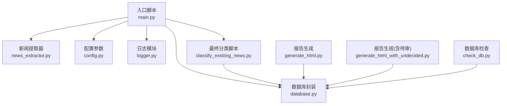
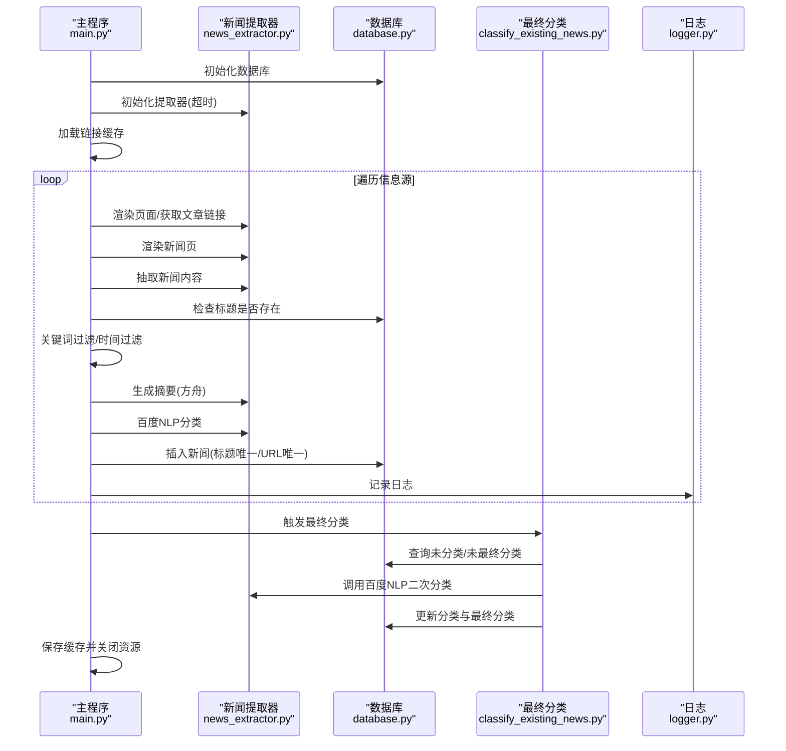
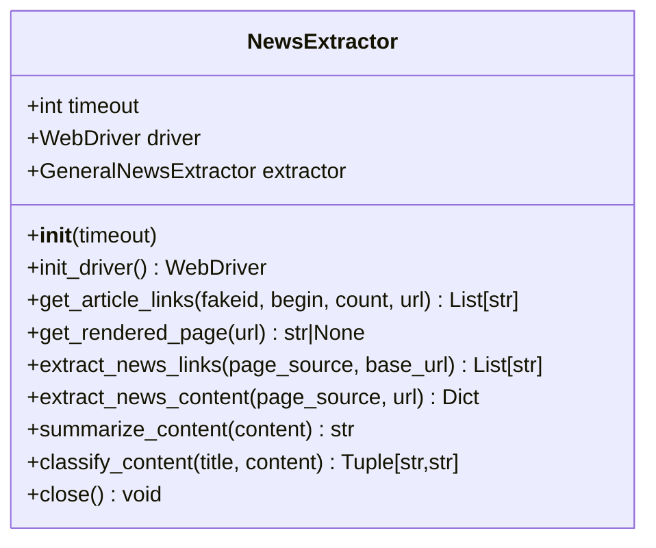
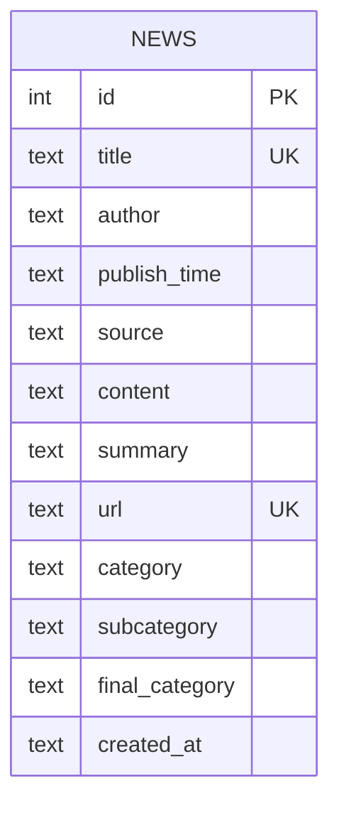
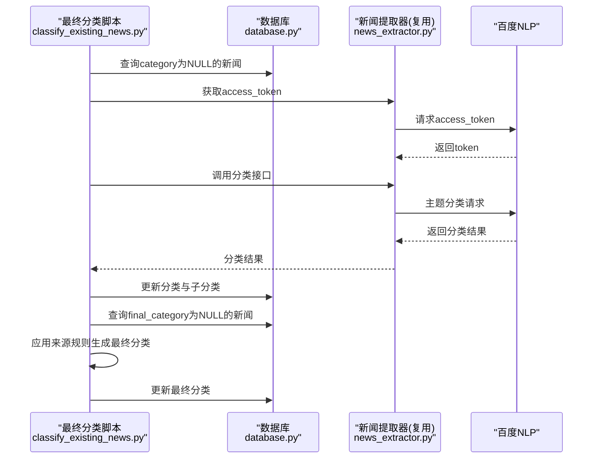
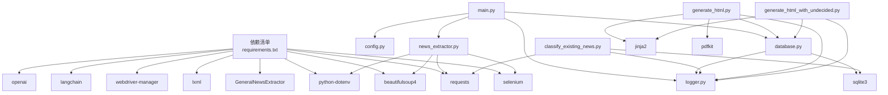

# 核心模块详解

<cite>
**本文引用的文件**
- [main.py](file://main.py)
- [news_extractor.py](file://news_extractor.py)
- [database.py](file://database.py)
- [config.py](file://config.py)
- [logger.py](file://logger.py)
- [classify_existing_news.py](file://classify_existing_news.py)
- [generate_html.py](file://generate_html.py)
- [generate_html_with_undecided.py](file://generate_html_with_undecided.py)
- [check_db.py](file://check_db.py)
- [requirements.txt](file://requirements.txt)
- [readme.MD](file://readme.MD)
</cite>

## 目录
1. [简介](#简介)
2. [项目结构](#项目结构)
3. [核心组件](#核心组件)
4. [架构总览](#架构总览)
5. [详细组件分析](#详细组件分析)
6. [依赖关系分析](#依赖关系分析)
7. [性能与稳定性考量](#性能与稳定性考量)
8. [故障排查指南](#故障排查指南)
9. [结论](#结论)
10. [附录](#附录)

## 简介
本项目旨在自动化采集多来源新闻，通过Selenium渲染动态页面、BeautifulSoup解析与链接提取、通用新闻正文抽取器提取正文、百度智能云NLP进行初步分类、火山方舟大模型生成摘要，并将结果持久化至SQLite数据库。随后，系统会基于已有分类与来源规则生成“最终分类”，并使用Jinja2模板生成静态HTML与PDF报告。本文档围绕主程序模块、新闻提取器模块、数据库模块、配置模块与日志模块展开，详述其流程控制、调度机制、数据传递与错误处理策略，并提供最佳实践建议与可视化图示。

## 项目结构
项目采用按功能分层的组织方式：
- 入口与调度：main.py
- 新闻采集与处理：news_extractor.py
- 数据持久化：database.py
- 参数与配置：config.py
- 日志与错误追踪：logger.py
- 分类与最终归类：classify_existing_news.py
- 报告生成：generate_html.py、generate_html_with_undecided.py
- 数据库检查：check_db.py
- 依赖声明：requirements.txt
- 项目说明：readme.MD

图表来源
- [main.py:11-206](file://main.py#L11-L206)
- [news_extractor.py:21-887](file://news_extractor.py#L21-L887)
- [database.py:5-92](file://database.py#L5-L92)
- [config.py:1-78](file://config.py#L1-L78)
- [logger.py:1-104](file://logger.py#L1-L104)
- [classify_existing_news.py:1-302](file://classify_existing_news.py#L1-L302)
- [generate_html.py:1-81](file://generate_html.py#L1-L81)
- [generate_html_with_undecided.py:1-72](file://generate_html_with_undecided.py#L1-L72)
- [check_db.py:1-32](file://check_db.py#L1-L32)

章节来源
- [main.py:11-206](file://main.py#L11-L206)
- [readme.MD:1-11](file://readme.MD#L1-L11)

## 核心组件
- 主程序模块（main.py）：负责初始化数据库与提取器、加载链接缓存、遍历信息源、提取链接、渲染页面、抽取内容、关键词与时间过滤、生成摘要与分类、写入数据库、保存缓存与关闭资源，并在结束后触发最终分类。
- 新闻提取器模块（news_extractor.py）：封装Selenium驱动初始化、页面渲染、链接提取（含多站点适配）、正文抽取、摘要生成（方舟大模型）、分类（百度NLP）。
- 数据库模块（database.py）：封装SQLite连接、建表、插入、查询、去重检查、更新摘要、关闭连接。
- 配置模块（config.py）：集中管理信息源列表、数据库路径、Selenium超时、提取超时、关键词过滤列表。
- 日志模块（logger.py）：统一日志格式、文件轮转、分类日志记录器、便捷函数。
- 最终分类脚本（classify_existing_news.py）：对数据库中未分类或未最终分类的新闻进行二次分类与最终归类。
- 报告生成（generate_html.py、generate_html_with_undecided.py）：基于模板渲染HTML与PDF。
- 数据库检查（check_db.py）：快速查看表结构、数量与示例数据。

章节来源
- [main.py:11-206](file://main.py#L11-L206)
- [news_extractor.py:21-887](file://news_extractor.py#L21-L887)
- [database.py:5-92](file://database.py#L5-L92)
- [config.py:1-78](file://config.py#L1-L78)
- [logger.py:1-104](file://logger.py#L1-L104)
- [classify_existing_news.py:1-302](file://classify_existing_news.py#L1-L302)
- [generate_html.py:1-81](file://generate_html.py#L1-L81)
- [generate_html_with_undecided.py:1-72](file://generate_html_with_undecided.py#L1-L72)
- [check_db.py:1-32](file://check_db.py#L1-L32)

## 架构总览
系统采用“入口调度—采集与处理—存储—分类—报告”的流水线式架构。入口模块负责控制流与数据过滤，提取器负责页面渲染与内容抽取，数据库负责持久化，分类器负责语义分类，报告生成负责输出。

图表来源
- [main.py:11-206](file://main.py#L11-L206)
- [news_extractor.py:21-887](file://news_extractor.py#L21-L887)
- [database.py:5-92](file://database.py#L5-L92)
- [classify_existing_news.py:1-302](file://classify_existing_news.py#L1-L302)
- [logger.py:1-104](file://logger.py#L1-L104)

## 详细组件分析

### 主程序模块（main.py）
- 流程控制与调度
  - 初始化数据库与提取器，加载链接缓存（有序字典维护LRU）。
  - 遍历配置中的信息源，针对不同来源采取不同策略：微信公众号使用专用接口获取文章列表；其他网站先渲染页面再提取链接。
  - 对提取的新闻链接进行缓存去重与数量限制，逐条渲染新闻页并抽取内容。
  - 在入库前执行标题去重、关键词过滤、发布时间窗口过滤。
  - 调用摘要与分类接口，最后写入数据库并记录日志。
  - 异常捕获与资源清理：finally中保存缓存、关闭提取器与数据库连接。
  - 结束后触发最终分类脚本，继续完善分类体系。
- 数据传递
  - 从配置模块导入信息源、数据库路径、Selenium超时、关键词列表。
  - 向提取器传递超时参数；向数据库传递新闻字段；向分类器传递标题与摘要。
- 错误处理
  - 缓存加载/保存异常记录日志；页面渲染与链接提取异常记录日志并跳过；数据库插入异常记录日志并返回False；最终分类异常回退默认分类。
- 性能与稳定性
  - 使用有序字典实现LRU缓存，限制最大容量；对特定站点增加等待时间；对链接提取进行去重与过滤；插入数据库使用“INSERT OR IGNORE”避免重复。
- 最佳实践
  - 控制并发与请求频率，避免被目标站点限流；合理设置Selenium超时；对异常站点保留降级策略（返回通用链接集合）。

章节来源
- [main.py:11-206](file://main.py#L11-L206)
- [config.py:1-78](file://config.py#L1-L78)
- [logger.py:1-104](file://logger.py#L1-L104)
- [database.py:5-92](file://database.py#L5-L92)
- [news_extractor.py:21-887](file://news_extractor.py#L21-L887)

### 新闻提取器模块（news_extractor.py）
- Selenium集成与反检测
  - 无头模式、禁用沙箱、GPU禁用、用户代理伪装、移除自动化标识、设置页面加载超时与隐式等待。
  - 支持Selenium 3.x/4.x兼容初始化。
- 页面渲染与链接提取
  - 渲染页面后，针对多个站点（教育部、今日头条、edu.cn、ai-bot.cn、beijing.gov.cn、北外官网等）进行特殊处理，提取限定区域内的链接。
  - 通用链接提取：正则匹配href属性，处理相对路径拼接，过滤非新闻链接，基于关键词与日期模式与长度进行筛选。
- 正文抽取与摘要生成
  - 使用通用新闻抽取器提取正文，保证标题、作者、发布时间、来源、内容、URL等字段齐全。
  - 摘要生成：使用方舟大模型（OpenAI兼容接口）进行摘要，支持短文本直接返回。
- 分类（百度NLP）
  - 获取access_token后调用百度NLP主题分类接口，解析多级分类结果，异常时回退默认分类。
- 资源管理
  - 提供close方法释放Selenium驱动。

图表来源
- [news_extractor.py:21-887](file://news_extractor.py#L21-L887)

章节来源
- [news_extractor.py:21-887](file://news_extractor.py#L21-L887)

### 数据库模块（database.py）
- 表结构设计
  - 主键自增，标题唯一、URL唯一，包含作者、发布时间、来源、内容、摘要、分类、子分类、最终分类、创建时间等字段。
- CRUD操作
  - 连接与建表：连接时设置text_factory为str确保UTF-8。
  - 插入：INSERT OR IGNORE，避免重复；同时记录创建时间。
  - 查询：支持按最终分类过滤的查询与不限制过滤的查询。
  - 去重检查：is_title_exists用于入库前检查。
  - 更新：update_news_summary用于后续补充摘要。
- 资源管理
  - close方法关闭连接。

图表来源
- [database.py:20-38](file://database.py#L20-L38)

章节来源
- [database.py:5-92](file://database.py#L5-L92)

### 配置模块（config.py）
- 信息源列表：包含多个微信公众号与网站，每个条目包含URL与来源名称。
- 数据库路径：默认为news.db。
- Selenium超时：控制页面加载与等待。
- 提取超时：用于抽取阶段的超时控制。
- 关键词过滤列表：用于筛选新闻内容。

章节来源
- [config.py:1-78](file://config.py#L1-L78)

### 日志模块（logger.py）
- 统一日志格式与轮转：按天创建日志文件，最大10MB，保留5份备份。
- 分类日志记录器：按类别（info/debug/error/warning）分别记录。
- 便捷函数：info/debug/error/warning，支持category参数。
- 控制台与文件双通道输出，便于开发与生产环境监控。

章节来源
- [logger.py:1-104](file://logger.py#L1-L104)

### 最终分类脚本（classify_existing_news.py）
- 功能概述
  - 对数据库中category为NULL的新闻进行二次分类，再根据来源、作者、分类与子分类生成“最终分类”。
- 类与方法
  - NewsDatabase：连接数据库、查询未分类新闻、更新分类、更新最终分类。
  - CategoryClassifier：获取access_token、调用百度NLP分类、最终分类逻辑。
- 流程
  - 从.env加载API密钥；查询未分类新闻；调用分类接口；更新数据库；再次查询未最终分类新闻；应用来源规则生成最终分类；更新数据库。

图表来源
- [classify_existing_news.py:14-302](file://classify_existing_news.py#L14-L302)
- [news_extractor.py:753-887](file://news_extractor.py#L753-L887)
- [database.py:5-92](file://database.py#L5-L92)

章节来源
- [classify_existing_news.py:1-302](file://classify_existing_news.py#L1-L302)
- [news_extractor.py:753-887](file://news_extractor.py#L753-L887)
- [database.py:5-92](file://database.py#L5-L92)

### 报告生成（generate_html.py、generate_html_with_undecided.py）
- 数据获取：从数据库读取新闻，按最终分类排序，过滤近两周内新闻。
- 模板渲染：使用Jinja2模板渲染HTML。
- PDF导出：使用pdfkit将HTML转为PDF。
- 差异：后者包含“待审”分类的新闻，便于人工审核。

章节来源
- [generate_html.py:1-81](file://generate_html.py#L1-L81)
- [generate_html_with_undecided.py:1-72](file://generate_html_with_undecided.py#L1-L72)

## 依赖关系分析
- 外部依赖：selenium、GeneralNewsExtractor、requests、beautifulsoup4、lxml、webdriver-manager、python-dotenv、langchain、openai。
- 内部模块耦合：
  - main.py依赖config、news_extractor、database、logger。
  - news_extractor依赖selenium、gne、bs4、requests、dotenv、logger。
  - database依赖sqlite3、logger。
  - classify_existing_news.py依赖requests、sqlite3、logger。
  - generate_html与generate_html_with_undecided依赖database、jinja2、pdfkit、logger。

图表来源
- [requirements.txt:1-9](file://requirements.txt#L1-L9)
- [main.py:1-206](file://main.py#L1-L206)
- [news_extractor.py:1-887](file://news_extractor.py#L1-L887)
- [database.py:1-92](file://database.py#L1-L92)
- [logger.py:1-104](file://logger.py#L1-L104)
- [classify_existing_news.py:1-302](file://classify_existing_news.py#L1-L302)
- [generate_html.py:1-81](file://generate_html.py#L1-L81)
- [generate_html_with_undecided.py:1-72](file://generate_html_with_undecided.py#L1-L72)

章节来源
- [requirements.txt:1-9](file://requirements.txt#L1-L9)
- [main.py:1-206](file://main.py#L1-L206)
- [news_extractor.py:1-887](file://news_extractor.py#L1-L887)
- [database.py:1-92](file://database.py#L1-L92)
- [logger.py:1-104](file://logger.py#L1-L104)
- [classify_existing_news.py:1-302](file://classify_existing_news.py#L1-L302)
- [generate_html.py:1-81](file://generate_html.py#L1-L81)
- [generate_html_with_undecided.py:1-72](file://generate_html_with_undecided.py#L1-L72)

## 性能与稳定性考量
- 页面渲染与等待
  - 对特定站点（如今日头条）增加等待时间，提升内容加载稳定性。
- 链接提取优化
  - 针对多站点的限定区域提取，减少无关链接；通用提取后进行去重与过滤。
- 缓存策略
  - 使用有序字典实现LRU缓存，限制最大容量，避免重复抓取。
- 数据库约束
  - 标题与URL唯一约束，INSERT OR IGNORE避免重复写入。
- API调用与回退
  - 百度NLP与方舟摘要均设置超时与异常回退，保障系统可用性。
- 日志与监控
  - 分类日志记录器便于问题定位与审计。

[本节为通用指导，无需列出章节来源]

## 故障排查指南
- 页面渲染失败
  - 现象：get_rendered_page返回None。
  - 排查：检查Selenium驱动版本与路径、Chrome选项、页面加载超时；查看日志中的traceback。
  - 参考路径：[news_extractor.py:180-206](file://news_extractor.py#L180-L206)
- 链接提取为空
  - 现象：extract_news_links返回空或少量链接。
  - 排查：确认目标站点是否在特殊处理分支中；检查通用正则与相对路径拼接逻辑；查看日志中的调试信息。
  - 参考路径：[news_extractor.py:208-683](file://news_extractor.py#L208-L683)
- 数据库插入失败
  - 现象：insert_news返回False。
  - 排查：检查标题或URL是否重复；查看日志中的错误信息；确认数据库连接与建表是否成功。
  - 参考路径：[database.py:40-52](file://database.py#L40-L52)
- 分类API异常
  - 现象：分类结果为默认值。
  - 排查：确认API密钥是否正确加载；检查access_token获取与请求参数；查看日志中的错误信息。
  - 参考路径：[news_extractor.py:753-887](file://news_extractor.py#L753-L887)
- 报告生成失败
  - 现象：HTML/PDF未生成。
  - 排查：确认模板文件存在、wkhtmltopdf路径正确、数据库连接正常。
  - 参考路径：[generate_html.py:1-81](file://generate_html.py#L1-L81)、[generate_html_with_undecided.py:1-72](file://generate_html_with_undecided.py#L1-L72)
- 缓存加载/保存失败
  - 现象：缓存文件读写异常。
  - 排查：检查文件权限、路径与编码；查看日志中的错误信息。
  - 参考路径：[main.py:28-47](file://main.py#L28-L47)、[main.py:184-192](file://main.py#L184-L192)

章节来源
- [news_extractor.py:180-206](file://news_extractor.py#L180-L206)
- [news_extractor.py:208-683](file://news_extractor.py#L208-L683)
- [database.py:40-52](file://database.py#L40-L52)
- [news_extractor.py:753-887](file://news_extractor.py#L753-L887)
- [generate_html.py:1-81](file://generate_html.py#L1-L81)
- [generate_html_with_undecided.py:1-72](file://generate_html_with_undecided.py#L1-L72)
- [main.py:28-47](file://main.py#L28-L47)
- [main.py:184-192](file://main.py#L184-L192)

## 结论
本系统通过清晰的模块划分与稳健的错误处理策略，实现了从多源采集、内容抽取、语义分类到报告生成的完整链路。主程序模块承担调度与过滤职责，提取器模块负责复杂站点适配与AI服务集成，数据库模块提供可靠持久化，日志模块贯穿全链路监控。建议在生产环境中进一步增强并发控制、重试机制与缓存一致性，并持续维护站点适配规则以应对前端结构变化。

[本节为总结性内容，无需列出章节来源]

## 附录

### 配置参数说明
- 信息源列表（NEWS_SOURCES）
  - 字段：url、source
  - 用途：定义抓取目标与来源名称
  - 参考路径：[config.py:2-55](file://config.py#L2-L55)
- 数据库路径（DB_PATH）
  - 默认值：news.db
  - 参考路径：[config.py:68](file://config.py#L68)
- Selenium超时（SELENIUM_TIMEOUT）
  - 单位：秒
  - 参考路径：[config.py:71](file://config.py#L71)
- 提取超时（EXTRACT_TIMEOUT）
  - 单位：秒
  - 参考路径：[config.py:74](file://config.py#L74)
- 关键词过滤列表（FILTER_KEYWORDS）
  - 用途：过滤新闻内容
  - 参考路径：[config.py:77](file://config.py#L77)

### 代码示例路径索引
- 主程序入口与调度
  - [main.py:11-206](file://main.py#L11-L206)
- 新闻提取器初始化与Selenium配置
  - [news_extractor.py:21-76](file://news_extractor.py#L21-L76)
- 特定站点链接提取
  - [news_extractor.py:208-558](file://news_extractor.py#L208-L558)
- 通用链接提取与过滤
  - [news_extractor.py:615-683](file://news_extractor.py#L615-L683)
- 正文抽取与摘要生成
  - [news_extractor.py:685-743](file://news_extractor.py#L685-L743)
- 百度NLP分类
  - [news_extractor.py:753-887](file://news_extractor.py#L753-L887)
- 数据库建表与插入
  - [database.py:20-52](file://database.py#L20-L52)
- 日志记录与分类
  - [logger.py:74-104](file://logger.py#L74-L104)
- 最终分类脚本
  - [classify_existing_news.py:237-302](file://classify_existing_news.py#L237-L302)
- 报告生成
  - [generate_html.py:1-81](file://generate_html.py#L1-L81)
  - [generate_html_with_undecided.py:1-72](file://generate_html_with_undecided.py#L1-L72)