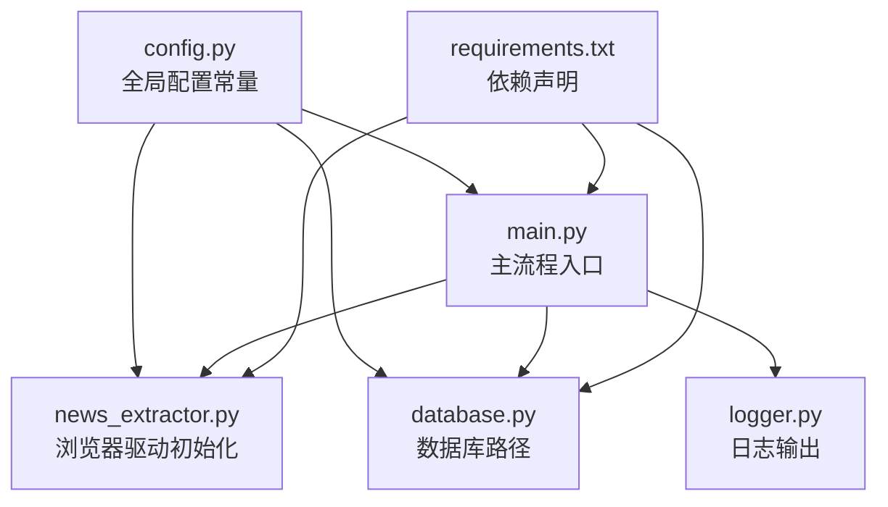
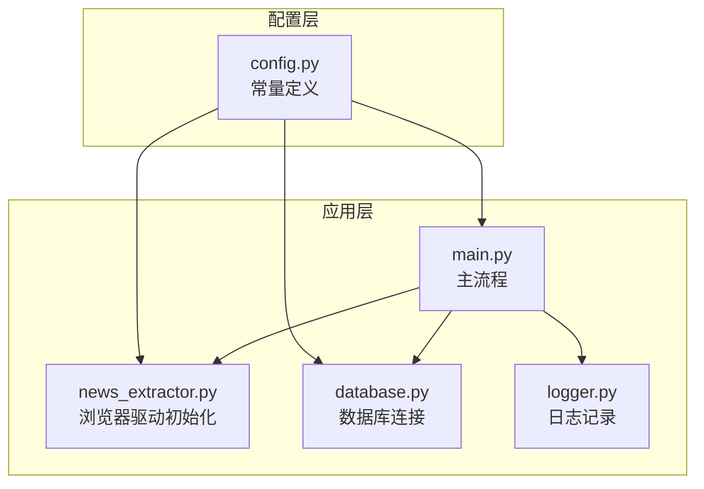
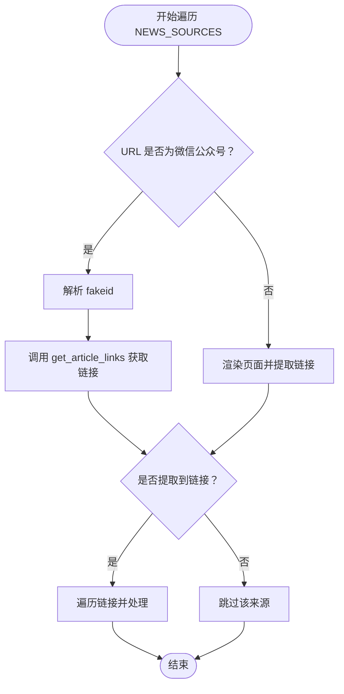
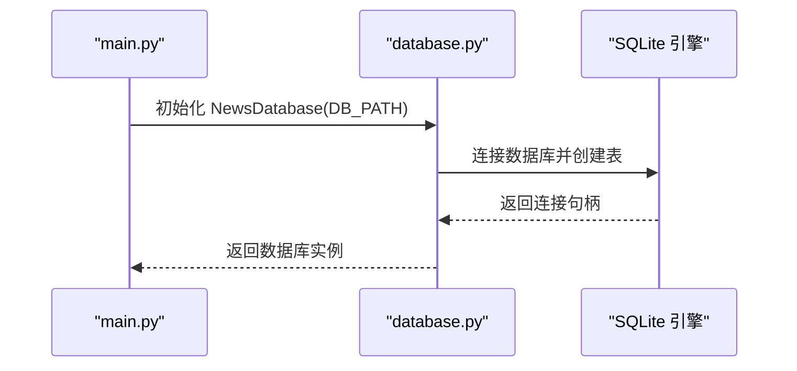
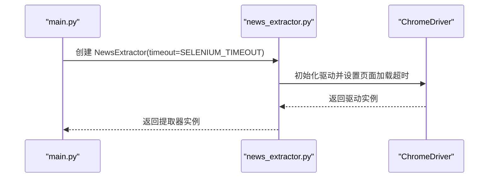
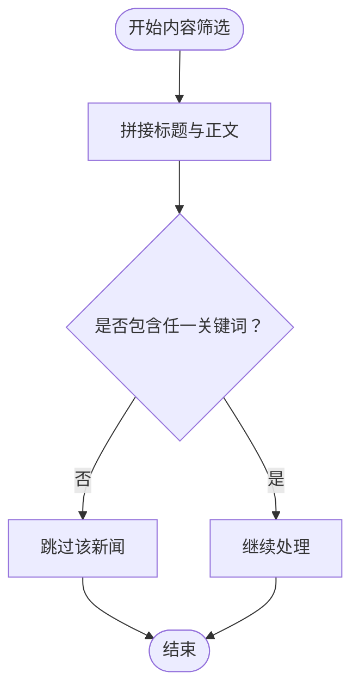
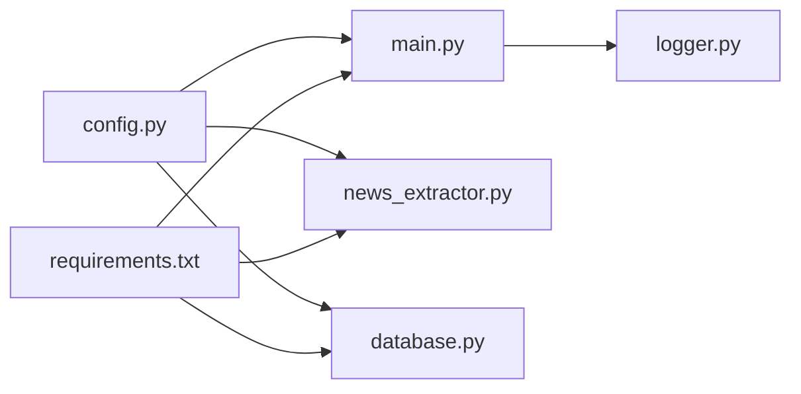

# 配置管理模块 (config.py)

<cite>
**本文引用的文件**
- [config.py](file://config.py)
- [main.py](file://main.py)
- [news_extractor.py](file://news_extractor.py)
- [database.py](file://database.py)
- [logger.py](file://logger.py)
- [requirements.txt](file://requirements.txt)
- [readme.MD](file://readme.MD)
</cite>

## 目录
1. [简介](#简介)
2. [项目结构](#项目结构)
3. [核心组件](#核心组件)
4. [架构总览](#架构总览)
5. [详细组件分析](#详细组件分析)
6. [依赖关系分析](#依赖关系分析)
7. [性能考量](#性能考量)
8. [故障排查指南](#故障排查指南)
9. [结论](#结论)
10. [附录](#附录)

## 简介
本文件面向news-exacter系统的配置管理模块，聚焦于config.py中的配置参数设计与使用方式，包括：
- 新闻源配置：NEWS_SOURCES与NEWS_SOURCES1
- 数据库路径：DB_PATH
- 浏览器自动化超时：SELENIUM_TIMEOUT与EXTRACT_TIMEOUT
- 内容筛选关键词：FILTER_KEYWORDS

文档将解释这些配置项的用途、默认值、参数验证机制、配置项之间的依赖关系，并提供配置示例、参数调整指南与最佳实践建议，帮助读者在不同运行环境下稳定地部署与优化系统。

## 项目结构
本项目采用“配置集中化、功能模块化”的组织方式：
- config.py：集中存放全局配置常量
- main.py：主流程入口，导入并使用config.py中的配置
- news_extractor.py：浏览器自动化与内容提取，读取SELENIUM_TIMEOUT初始化驱动
- database.py：数据库操作，读取DB_PATH建立SQLite连接
- logger.py：日志系统，用于记录配置使用过程中的关键事件
- requirements.txt：运行依赖，明确项目所需的第三方库
- readme.MD：项目说明，概述系统能力与数据存储方式

图表来源
- [config.py:1-78](file://config.py#L1-L78)
- [main.py:1-206](file://main.py#L1-L206)
- [news_extractor.py:21-77](file://news_extractor.py#L21-L77)
- [database.py:5-11](file://database.py#L5-L11)
- [logger.py:25-56](file://logger.py#L25-L56)
- [requirements.txt:1-10](file://requirements.txt#L1-L10)

章节来源
- [config.py:1-78](file://config.py#L1-L78)
- [main.py:1-206](file://main.py#L1-L206)
- [requirements.txt:1-10](file://requirements.txt#L1-L10)

## 核心组件
本节对config.py中的关键配置项进行逐项说明，涵盖用途、默认值、使用场景与注意事项。

- NEWS_SOURCES（新闻源配置）
  - 类型：列表，元素为字典，包含键“url”和“source”
  - 默认值：内置多个新闻源，覆盖微信公众号、教育部官网、地方政府官网、高校信息中心等渠道
  - 作用：主流程遍历该列表，按来源类型选择不同的提取策略（如微信公众号通过fakeid批量获取文章链接，其他站点直接抓取页面链接）
  - 依赖关系：被main.py在循环中使用；与news_extractor.py中的微信公众号提取逻辑耦合
  - 注意事项：新增或修改URL时需确保格式正确且可访问；source字段用于数据库记录来源名称

- NEWS_SOURCES1（备用/测试新闻源）
  - 类型：列表，元素为字典，包含键“url”和“source”
  - 默认值：仅包含一个示例来源
  - 作用：便于快速测试或小规模验证，减少主流程开销
  - 使用建议：在开发或调试阶段可临时替换NEWS_SOURCES以缩短运行时间

- DB_PATH（数据库路径）
  - 类型：字符串
  - 默认值：“news.db”
  - 作用：指定SQLite数据库文件路径，供database.py连接与建表
  - 依赖关系：被database.py在构造函数中使用；main.py在初始化NewsDatabase时传入
  - 注意事项：确保运行用户对该路径具有读写权限；生产环境建议使用绝对路径

- SELENIUM_TIMEOUT（Selenium页面加载超时）
  - 类型：整数（秒）
  - 默认值：30
  - 作用：初始化浏览器驱动时设置页面加载超时；同时影响新闻页面渲染等待
  - 依赖关系：被news_extractor.py在驱动初始化时使用；main.py在创建NewsExtractor时传入
  - 影响范围：页面加载慢、网络波动或目标站点性能不佳时，可能需要增大该值

- EXTRACT_TIMEOUT（内容提取超时）
  - 类型：整数（秒）
  - 默认值：60
  - 作用：用于内容提取阶段的超时控制（例如AI摘要生成、分类接口调用等）
  - 使用场景：在main.py中用于控制摘要生成与分类服务的等待时间
  - 注意事项：若外部服务响应较慢，应适当提高该值以避免误判失败

- FILTER_KEYWORDS（关键词过滤规则）
  - 类型：列表，元素为字符串
  - 默认值：包含“信息化”“AI”“教育数字化”“网络安全”“智慧课堂”“智慧教室”“人工智能”“智能体”“信息技术”“教育技术”“赋能”等
  - 作用：在main.py中对新闻标题与正文进行关键词匹配，仅保留命中关键词的内容
  - 依赖关系：被main.py在内容筛选阶段使用
  - 调整建议：根据业务领域变化定期更新关键词集合；注意避免过于宽泛导致误判，或过于严格导致漏判

章节来源
- [config.py:1-78](file://config.py#L1-L78)
- [main.py:11-173](file://main.py#L11-L173)
- [news_extractor.py:21-77](file://news_extractor.py#L21-L77)
- [database.py:5-11](file://database.py#L5-L11)

## 架构总览
配置管理在系统中的位置与交互如下图所示：

图表来源
- [config.py:1-78](file://config.py#L1-L78)
- [main.py:1-206](file://main.py#L1-L206)
- [news_extractor.py:21-77](file://news_extractor.py#L21-L77)
- [database.py:5-11](file://database.py#L5-L11)
- [logger.py:25-56](file://logger.py#L25-L56)

## 详细组件分析

### 新闻源配置（NEWS_SOURCES）
- 设计要点
  - 统一的数据结构：每个条目包含“url”和“source”，便于后续统一处理
  - 多来源适配：针对微信公众号与普通网站分别提供提取策略
  - 可扩展性：支持在列表中追加新的来源，无需修改核心逻辑
- 使用流程
  - 主流程遍历NEWS_SOURCES，根据URL前缀判断来源类型
  - 对微信公众号来源：从URL中解析fakeid，调用专用方法批量获取文章链接
  - 对普通网站来源：先渲染页面，再提取新闻链接
- 参数验证与边界
  - URL格式必须有效且可访问
  - 微信公众号来源需确保fakeid解析成功
  - 若解析失败，流程会跳过该来源并记录日志

图表来源
- [main.py:49-77](file://main.py#L49-L77)
- [news_extractor.py:78-178](file://news_extractor.py#L78-L178)

章节来源
- [config.py:1-55](file://config.py#L1-L55)
- [main.py:49-77](file://main.py#L49-L77)
- [news_extractor.py:78-178](file://news_extractor.py#L78-L178)

### 数据库路径（DB_PATH）
- 设计要点
  - SQLite本地数据库，适合轻量级部署
  - 表结构包含标题唯一约束与URL唯一约束，避免重复入库
- 使用流程
  - database.py在构造函数中连接数据库并创建表
  - main.py在初始化NewsDatabase时传入DB_PATH
- 参数验证与边界
  - 文件路径需存在且可写
  - 生产环境建议使用绝对路径，避免相对路径带来的不确定性

图表来源
- [database.py:5-38](file://database.py#L5-L38)
- [main.py:12-13](file://main.py#L12-L13)

章节来源
- [config.py:67-68](file://config.py#L67-L68)
- [database.py:5-38](file://database.py#L5-L38)
- [main.py:12-13](file://main.py#L12-L13)

### 浏览器自动化超时（SELENIUM_TIMEOUT）
- 设计要点
  - 控制浏览器驱动的页面加载超时
  - 同时影响页面渲染等待时间
- 使用流程
  - news_extractor.py在初始化驱动时设置超时
  - main.py在创建NewsExtractor时传入timeout参数
- 参数验证与边界
  - 建议根据网络状况与目标站点性能调整
  - 过小可能导致页面未完全加载即超时，过大则延长整体耗时

图表来源
- [news_extractor.py:21-77](file://news_extractor.py#L21-L77)
- [main.py:16-17](file://main.py#L16-L17)

章节来源
- [config.py:70-71](file://config.py#L70-L71)
- [news_extractor.py:21-77](file://news_extractor.py#L21-L77)
- [main.py:16-17](file://main.py#L16-L17)

### 内容提取超时（EXTRACT_TIMEOUT）
- 设计要点
  - 用于内容提取阶段的超时控制（如AI摘要生成、分类接口调用）
- 使用流程
  - main.py在生成摘要与分类时使用该超时参数
- 参数验证与边界
  - 外部服务响应较慢时应适当提高该值
  - 过小可能导致误判失败，过大则影响吞吐量

章节来源
- [config.py:73-74](file://config.py#L73-L74)
- [main.py:146-151](file://main.py#L146-L151)

### 关键词过滤规则（FILTER_KEYWORDS）
- 设计要点
  - 基于关键词匹配的初步筛选，降低后续处理成本
  - 支持中文关键词，覆盖教育信息化、AI、网络安全、智慧课堂等领域
- 使用流程
  - main.py在保存新闻前，将标题与正文拼接后进行关键词匹配
  - 未命中的内容会被跳过
- 参数验证与边界
  - 关键词集合应随业务发展定期更新
  - 建议保持关键词粒度适中，避免过度宽泛或过于狭隘

图表来源
- [main.py:116-122](file://main.py#L116-L122)
- [config.py:76-77](file://config.py#L76-L77)

章节来源
- [config.py:76-77](file://config.py#L76-L77)
- [main.py:116-122](file://main.py#L116-L122)

## 依赖关系分析
- 模块耦合
  - main.py直接依赖config.py中的常量，形成“配置-执行”耦合
  - news_extractor.py与database.py分别依赖config.py中的SELENIUM_TIMEOUT与DB_PATH
  - FILTER_KEYWORDS在main.py中被直接使用
- 外部依赖
  - requirements.txt声明了selenium、GeneralNewsExtractor、requests、beautifulsoup4、lxml、webdriver-manager、python-dotenv、langchain、openai、jinja2等依赖
  - 项目说明指出抽取信息存放在SQLite本地库中，可根据需要更换其他数据库

图表来源
- [config.py:1-78](file://config.py#L1-L78)
- [main.py:1-206](file://main.py#L1-L206)
- [news_extractor.py:1-20](file://news_extractor.py#L1-L20)
- [database.py:1-3](file://database.py#L1-L3)
- [logger.py:1-10](file://logger.py#L1-L10)
- [requirements.txt:1-10](file://requirements.txt#L1-L10)

章节来源
- [requirements.txt:1-10](file://requirements.txt#L1-L10)
- [readme.MD:1-11](file://readme.MD#L1-L11)

## 性能考量
- 超时参数调优
  - SELENIUM_TIMEOUT：根据目标站点加载速度与网络状况调整，建议在30-60秒范围内评估
  - EXTRACT_TIMEOUT：根据外部服务（如AI摘要、分类）响应时间调整，建议在60-120秒范围内评估
- 新闻源数量与并发
  - NEWS_SOURCES中的来源越多，整体耗时越长；可通过NEWS_SOURCES1进行小规模测试
- 关键词过滤效率
  - FILTER_KEYWORDS建议保持适度数量，避免过多导致匹配开销增大
- 数据库存储
  - DB_PATH指向SQLite文件，适合轻量部署；若数据量较大，建议迁移到高性能数据库并优化索引

## 故障排查指南
- 页面加载超时
  - 现象：浏览器驱动初始化或页面渲染过程中出现超时
  - 排查：检查SELENIUM_TIMEOUT是否过小；确认网络连通性与目标站点可用性
  - 参考实现：驱动初始化处设置页面加载超时
- 新闻链接提取失败
  - 现象：某些来源未提取到链接
  - 排查：检查NEWS_SOURCES中URL格式与可访问性；微信公众号来源需确认fakeid解析成功
- 关键词过滤误判
  - 现象：命中关键词但内容不相关，或未命中关键词但内容相关
  - 排查：调整FILTER_KEYWORDS集合，结合业务需求迭代优化
- 数据库写入异常
  - 现象：标题或URL重复导致插入失败
  - 排查：确认DB_PATH路径可写；检查数据库表结构与唯一约束
- 日志辅助
  - 使用logger模块记录关键事件，便于定位问题

章节来源
- [news_extractor.py:43-77](file://news_extractor.py#L43-L77)
- [main.py:49-77](file://main.py#L49-L77)
- [main.py:116-122](file://main.py#L116-L122)
- [database.py:40-52](file://database.py#L40-L52)
- [logger.py:25-56](file://logger.py#L25-L56)

## 结论
config.py作为news-exacter系统的核心配置中心，提供了清晰、可维护的参数定义与默认值。通过合理设置NEWS_SOURCES、DB_PATH、SELENIUM_TIMEOUT、EXTRACT_TIMEOUT与FILTER_KEYWORDS，可以在保证稳定性的同时提升系统性能与准确性。建议在生产环境中：
- 明确各参数的默认值与可接受范围
- 定期评估并调整超时参数与关键词集合
- 规范化数据库路径与权限
- 结合日志系统持续监控与优化

## 附录

### 配置示例与最佳实践
- 新增新闻源
  - 在NEWS_SOURCES中追加新的字典项，确保“url”和“source”键存在
  - 若为微信公众号，请确保URL包含有效的fakeid参数
- 调整超时参数
  - SELENIUM_TIMEOUT：根据网络与站点性能在30-60秒之间调整
  - EXTRACT_TIMEOUT：根据外部服务响应时间在60-120秒之间调整
- 关键词优化
  - 定期评估FILTER_KEYWORDS，结合业务热点与趋势更新
  - 避免过于宽泛或过于狭隘的关键词组合
- 数据库路径
  - 生产环境建议使用绝对路径，确保权限与可写性
- 日志与监控
  - 利用logger模块记录关键事件，便于问题定位与性能分析

### 参数对照表
- NEWS_SOURCES：新闻源列表，元素为包含“url”和“source”的字典
- NEWS_SOURCES1：备用/测试新闻源列表
- DB_PATH：SQLite数据库文件路径
- SELENIUM_TIMEOUT：浏览器驱动页面加载超时（秒）
- EXTRACT_TIMEOUT：内容提取阶段超时（秒）
- FILTER_KEYWORDS：关键词过滤列表（中文）

章节来源
- [config.py:1-78](file://config.py#L1-L78)
- [main.py:11-173](file://main.py#L11-L173)
- [news_extractor.py:21-77](file://news_extractor.py#L21-L77)
- [database.py:5-38](file://database.py#L5-L38)
- [logger.py:25-56](file://logger.py#L25-L56)