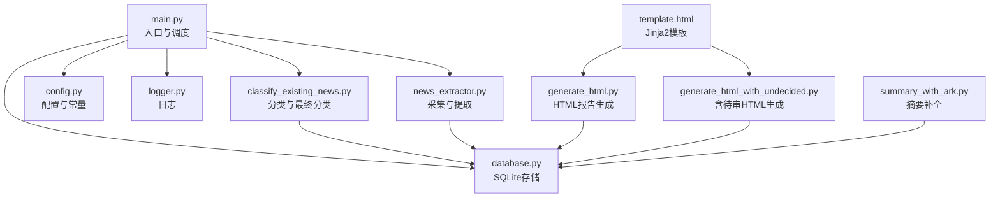
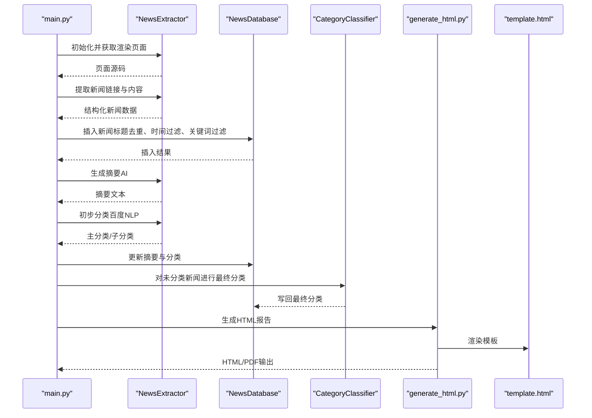
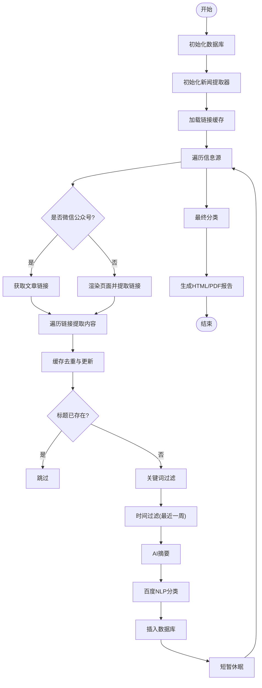
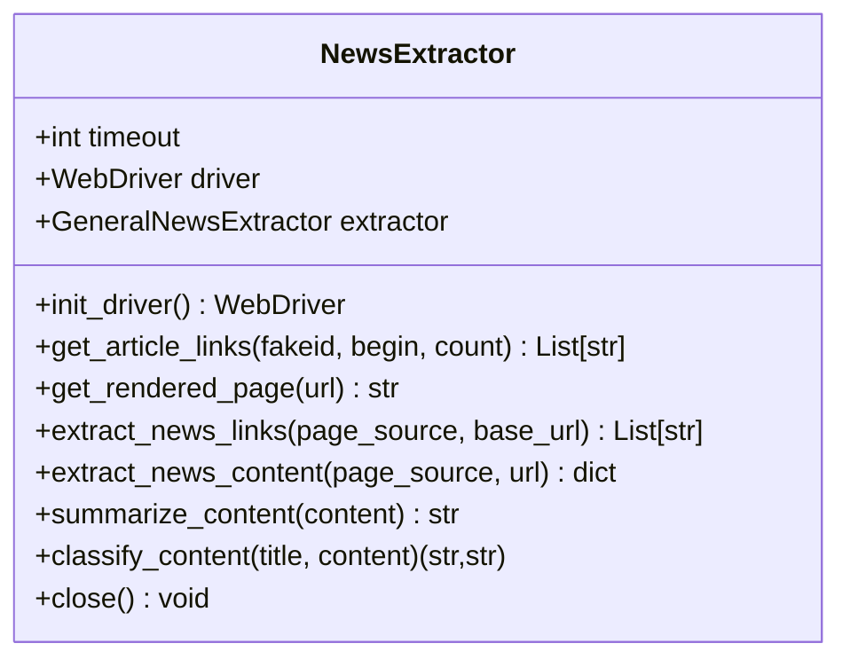
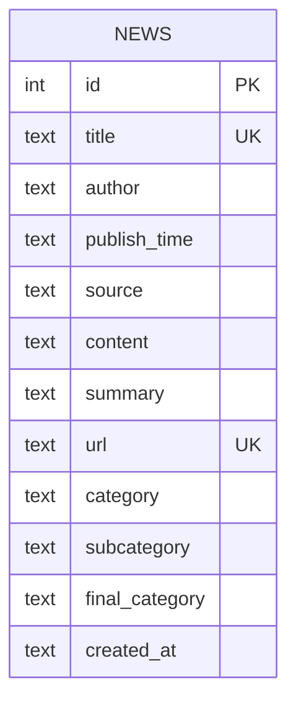
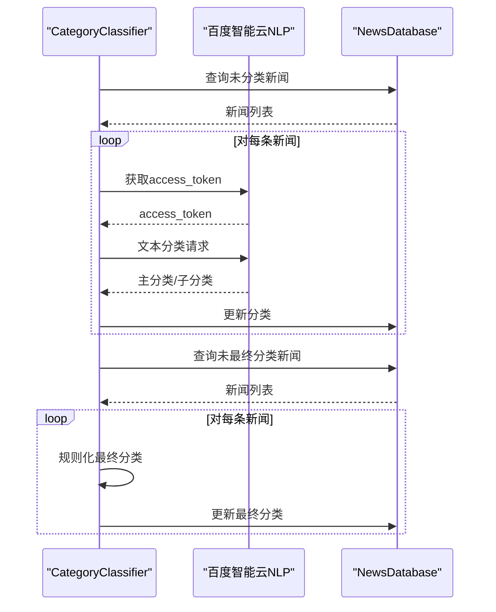
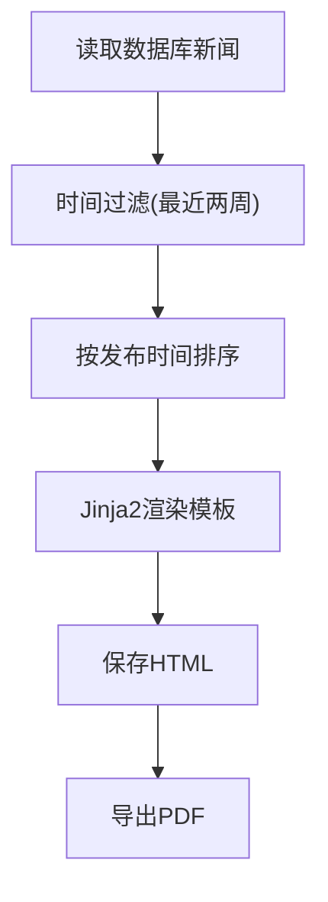
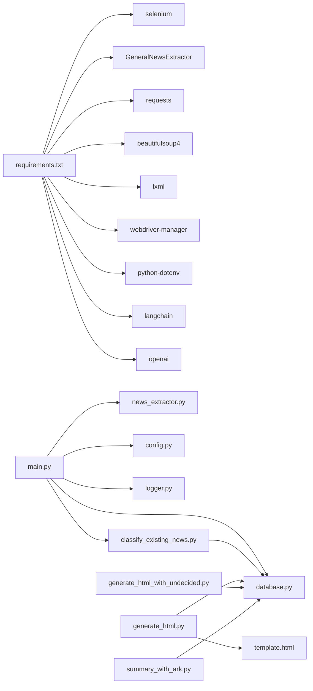

# 项目概述

<cite>
**本文引用的文件**
- [main.py](file://main.py)
- [news_extractor.py](file://news_extractor.py)
- [database.py](file://database.py)
- [generate_html.py](file://generate_html.py)
- [generate_html_with_undecided.py](file://generate_html_with_undecided.py)
- [classify_existing_news.py](file://classify_existing_news.py)
- [config.py](file://config.py)
- [logger.py](file://logger.py)
- [template.html](file://template.html)
- [check_db.py](file://check_db.py)
- [summary_with_ark.py](file://summary_with_ark.py)
- [requirements.txt](file://requirements.txt)
- [readme.MD](file://readme.MD)
</cite>

## 目录
1. [简介](#简介)
2. [项目结构](#项目结构)
3. [核心组件](#核心组件)
4. [架构总览](#架构总览)
5. [详细组件分析](#详细组件分析)
6. [依赖关系分析](#依赖关系分析)
7. [性能考虑](#性能考虑)
8. [故障排查指南](#故障排查指南)
9. [结论](#结论)
10. [附录](#附录)

## 简介
news-exacter 是一个面向教育信息化领域的多源新闻采集与内容处理系统，具备以下核心能力：
- 多源新闻采集：支持微信公众号、教育部官网、北京市政府官网、高校官网、行业媒体等多渠道。
- 智能内容提取：通过通用新闻抽取器与Selenium渲染，精准提取正文、标题、作者、发布时间等结构化信息。
- AI辅助摘要与分类：集成火山方舟大模型生成摘要，结合百度智能云NLP进行初步分类，并通过规则化策略生成最终分类。
- HTML/PDF报告生成：基于Jinja2模板生成“一周资讯”静态报告，支持导出PDF，便于发布与归档。

该系统在教育信息化领域具有重要应用价值：帮助院校与研究机构高效汇聚政策动态、行业新闻、专家视点与高校动态，形成可检索、可分享的知识资产。

## 项目结构
项目采用“入口脚本 + 功能模块 + 配置 + 模板”的分层组织方式，核心文件如下：
- 入口与调度：main.py
- 新闻采集与提取：news_extractor.py
- 数据存储：database.py
- 报告生成：generate_html.py、generate_html_with_undecided.py、template.html
- 分类与最终分类：classify_existing_news.py
- 配置与常量：config.py
- 日志：logger.py
- 工具脚本：check_db.py、summary_with_ark.py
- 依赖声明：requirements.txt
- 说明文档：readme.MD

图表来源
- [main.py:11-198](file://main.py#L11-L198)
- [news_extractor.py:21-752](file://news_extractor.py#L21-L752)
- [database.py:5-92](file://database.py#L5-L92)
- [generate_html.py:1-81](file://generate_html.py#L1-L81)
- [generate_html_with_undecided.py:1-72](file://generate_html_with_undecided.py#L1-L72)
- [classify_existing_news.py:14-302](file://classify_existing_news.py#L14-L302)
- [config.py:1-78](file://config.py#L1-L78)
- [logger.py:1-104](file://logger.py#L1-L104)
- [template.html:1-108](file://template.html#L1-L108)
- [summary_with_ark.py:1-60](file://summary_with_ark.py#L1-L60)

章节来源
- [main.py:11-198](file://main.py#L11-L198)
- [config.py:1-78](file://config.py#L1-L78)

## 核心组件
- 新闻采集与提取器（NewsExtractor）
  - 使用Selenium驱动渲染JavaScript页面，针对特定站点（如教育部、今日头条、北京外国语大学等）进行定制化链接提取与URL补全。
  - 使用通用新闻抽取器提取正文、标题、作者、发布时间等字段。
  - 支持微信公众号文章列表抓取与链接提取。
- 数据库（NewsDatabase）
  - 基于SQLite，提供新闻表的创建、插入、查询、更新等操作，支持唯一约束与时间过滤。
- 分类与最终分类（CategoryClassifier）
  - 初步分类：调用百度智能云NLP接口，返回主分类与子分类。
  - 最终分类：基于来源、标题关键词、内容特征等规则生成最终分类，支持“待审”状态。
- 报告生成（HTML/PDF）
  - 基于Jinja2模板渲染，按最终分类分组输出HTML；可选导出PDF。
- 配置与日志
  - 配置项包括信息源列表、数据库路径、Selenium超时、筛选关键词等。
  - 日志模块提供按类别分发的日志记录器，支持文件轮转与控制台输出。

章节来源
- [news_extractor.py:21-752](file://news_extractor.py#L21-L752)
- [database.py:5-92](file://database.py#L5-L92)
- [classify_existing_news.py:64-302](file://classify_existing_news.py#L64-L302)
- [generate_html.py:1-81](file://generate_html.py#L1-L81)
- [generate_html_with_undecided.py:1-72](file://generate_html_with_undecided.py#L1-L72)
- [config.py:1-78](file://config.py#L1-L78)
- [logger.py:1-104](file://logger.py#L1-L104)

## 架构总览
系统采用“采集-清洗-摘要-分类-存储-报告”的流水线式架构，入口脚本负责调度与流程编排，各模块职责清晰、耦合度低。

图表来源
- [main.py:11-198](file://main.py#L11-L198)
- [news_extractor.py:21-752](file://news_extractor.py#L21-L752)
- [database.py:5-92](file://database.py#L5-L92)
- [classify_existing_news.py:237-302](file://classify_existing_news.py#L237-L302)
- [generate_html.py:1-81](file://generate_html.py#L1-L81)
- [template.html:1-108](file://template.html#L1-L108)

## 详细组件分析

### 组件A：入口与调度（main.py）
- 负责初始化数据库、新闻提取器与链接缓存，遍历配置中的信息源，分别处理微信公众号与普通网站两类场景。
- 对每个新闻链接执行：去重缓存、渲染页面、提取内容、标题去重、关键词过滤、时间过滤、AI摘要、百度NLP分类、入库。
- 完成后触发最终分类流程与报告生成。

图表来源
- [main.py:11-198](file://main.py#L11-L198)

章节来源
- [main.py:11-198](file://main.py#L11-L198)

### 组件B：新闻采集与提取（news_extractor.py）
- Selenium驱动初始化：隐藏自动化痕迹、设置超时、无头运行。
- 特定站点适配：针对教育部、今日头条、edu.cn、ai-bot.cn、beijing.gov.cn、北京外国语大学等站点的链接提取逻辑。
- 通用链接提取：正则匹配与关键词/日期模式过滤，保证提取到新闻详情页链接。
- 内容提取：使用通用新闻抽取器，去除评论与广告节点，返回标题、作者、发布时间、内容、URL等。
- 摘要生成：调用火山方舟大模型API生成摘要。
- 分类：调用百度智能云NLP接口进行主题分类。

图表来源
- [news_extractor.py:21-752](file://news_extractor.py#L21-L752)

章节来源
- [news_extractor.py:21-752](file://news_extractor.py#L21-L752)

### 组件C：数据库（database.py）
- 表结构：包含标题唯一、URL唯一、分类字段、最终分类字段、创建时间等。
- 操作：插入新闻（OR IGNORE）、查询全部（按发布时间降序）、按标题存在性检查、更新摘要、关闭连接。

图表来源
- [database.py:20-38](file://database.py#L20-L38)

章节来源
- [database.py:5-92](file://database.py#L5-L92)

### 组件D：分类与最终分类（classify_existing_news.py）
- 初步分类：获取百度智能云access_token，调用NLP分类接口，返回主分类与子分类。
- 最终分类：基于来源、标题关键词、内容特征等规则生成最终分类，支持“待审”状态。
- 数据库交互：查询未分类新闻、更新分类信息、更新最终分类。

图表来源
- [classify_existing_news.py:64-302](file://classify_existing_news.py#L64-L302)

章节来源
- [classify_existing_news.py:64-302](file://classify_existing_news.py#L64-L302)

### 组件E：报告生成（generate_html.py / generate_html_with_undecided.py）
- 从数据库读取新闻，按发布时间排序，过滤近两周内新闻。
- 使用Jinja2模板渲染，按最终分类分组输出HTML；可选导出PDF。

图表来源
- [generate_html.py:15-81](file://generate_html.py#L15-L81)
- [generate_html_with_undecided.py:10-72](file://generate_html_with_undecided.py#L10-L72)
- [template.html:87-105](file://template.html#L87-L105)

章节来源
- [generate_html.py:1-81](file://generate_html.py#L1-L81)
- [generate_html_with_undecided.py:1-72](file://generate_html_with_undecided.py#L1-L72)
- [template.html:1-108](file://template.html#L1-L108)

### 组件F：配置与日志（config.py / logger.py）
- 配置：信息源列表、数据库路径、Selenium超时、提取超时、筛选关键词。
- 日志：按类别分发（info/debug/error/warning），文件轮转与控制台输出。

章节来源
- [config.py:1-78](file://config.py#L1-L78)
- [logger.py:1-104](file://logger.py#L1-L104)

## 依赖关系分析
- 外部依赖：selenium、GeneralNewsExtractor、requests、beautifulsoup4、lxml、webdriver-manager、python-dotenv、langchain、openai。
- 内部模块：main.py依赖news_extractor.py、database.py、config.py、logger.py；report生成依赖database.py与template.html；分类模块独立于入口脚本。

图表来源
- [requirements.txt:1-9](file://requirements.txt#L1-L9)
- [main.py:1-7](file://main.py#L1-L7)
- [classify_existing_news.py:1-11](file://classify_existing_news.py#L1-L11)
- [generate_html.py:1-6](file://generate_html.py#L1-L6)
- [generate_html_with_undecided.py:1-6](file://generate_html_with_undecided.py#L1-L6)
- [summary_with_ark.py:1-9](file://summary_with_ark.py#L1-L9)

章节来源
- [requirements.txt:1-9](file://requirements.txt#L1-L9)
- [main.py:1-7](file://main.py#L1-L7)

## 性能考虑
- 浏览器渲染与Selenium超时：通过配置项控制，避免长时间阻塞。
- 链接缓存：使用有序字典维护最近访问链接，限制最大容量，减少重复抓取。
- 时间与关键词过滤：在入库前过滤非目标内容，降低后续处理压力。
- AI与NLP调用：合理设置温度与最大token，避免过度消耗与超时。
- 数据库写入：使用唯一约束避免重复，批量更新时注意事务与索引。

## 故障排查指南
- Selenium驱动问题：确认本地ChromeDriver路径与版本匹配，或使用webdriver-manager自动管理。
- 百度智能云API鉴权：检查.env中API Key与Secret Key是否正确配置。
- 网站结构变更：若信息源页面改版，需调整news_extractor.py中的站点适配逻辑。
- 数据库异常：使用check_db.py检查表结构与数据量，确认唯一约束是否生效。
- 报告生成失败：确认wkhtmltopdf路径与安装状态，模板文件是否存在。

章节来源
- [news_extractor.py:43-76](file://news_extractor.py#L43-L76)
- [classify_existing_news.py:246-252](file://classify_existing_news.py#L246-L252)
- [check_db.py:1-32](file://check_db.py#L1-L32)
- [generate_html.py:9-10](file://generate_html.py#L9-L10)

## 结论
news-exacter通过模块化设计实现了从多源采集、智能提取、AI摘要与分类到报告生成的完整闭环，能够有效支撑教育信息化领域的知识汇聚与传播。其可扩展性强，便于接入更多信息源与优化算法策略。

## 附录

### 快速开始指南
- 安装依赖：使用提供的依赖清单安装所需Python包。
- 配置环境变量：在项目根目录创建.env文件，配置百度智能云与火山方舟相关API Key。
- 运行采集：执行入口脚本，系统将自动遍历配置中的信息源并抓取新闻。
- 生成报告：执行报告生成脚本，系统将输出HTML与PDF报告。
- 常见工作流
  - 新增信息源：在配置文件中添加新的URL与来源名称。
  - 调整过滤规则：修改筛选关键词或时间窗口。
  - 自定义分类：在最终分类规则中增加或调整来源与关键词映射。
  - 生成含待审报告：使用含待审HTML生成脚本，便于人工复核。

章节来源
- [requirements.txt:1-9](file://requirements.txt#L1-L9)
- [config.py:1-78](file://config.py#L1-L78)
- [main.py:11-198](file://main.py#L11-L198)
- [generate_html.py:1-81](file://generate_html.py#L1-L81)
- [generate_html_with_undecided.py:1-72](file://generate_html_with_undecided.py#L1-L72)
- [readme.MD:1-11](file://readme.MD#L1-L11)